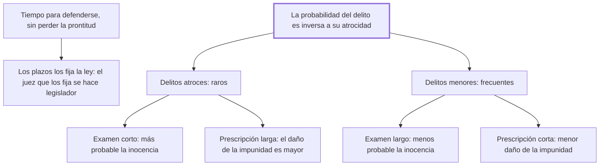

# 30. Procesos y prescripciones

## 1. Idea principal

Los plazos deben invertirse según la clase de delito: en los atroces, examen corto y prescripción larga; en los leves, examen largo y prescripción corta, porque la probabilidad de un delito es inversa a su atrocidad.

Contesta cuánto tiempo puede durar un proceso y cuándo caduca la persecución. Es el capítulo más técnico del libro y el que aplica con más finura la lógica de probabilidades del cap. 14.

## 2. Lo esencial del capítulo

Hay que conceder al reo tiempo y medios para justificarse, pero un tiempo tan breve que no perjudique la prontitud de la pena, que es uno de los principales frenos (cap. 30). Contra la objeción humanitaria responde que "los peligros de la inocencia crecen con los defectos de la legislación": el inocente no está más seguro cuanto más dure el proceso, sino cuanto mejor sea la ley. Por eso el plazo, tanto el de la defensa como el de las pruebas, tiene que fijarlo la ley y no el juez, porque **el juez que determina cuánto tiempo necesita para probar un delito se convierte en legislador**. La regla sobre prescripción es doble: los delitos atroces y probados no merecen prescripción alguna en favor del reo que se sustrajo con la fuga; los leves y mal probados sí deben prescribir, porque la oscuridad en que quedaron confundidos quita el ejemplo de impunidad y deja al reo disposición para enmendarse.

El núcleo es la inversión de plazos, y su fundamento está en el cap. 13: la probabilidad de un delito es en razón inversa de su atrocidad. Separa los más atroces —desde el homicidio en adelante— de los menores, y apoya la diferencia en que **la seguridad de la vida es un derecho de naturaleza y la de los bienes, un derecho de sociedad**: son menos los motivos que llevan a atropellar los sentimientos naturales de piedad que los que, por el ansia de ser felices, mueven a violar una convención (cap. 30). De ahí dos reglas opuestas: en los atroces, por raros, aumenta la probabilidad de que el acusado sea inocente, así que el examen se acorta, y como el daño de la impunidad es mayor, la prescripción se alarga; en los menores, al revés. El cierre agrega una regla incómoda: al absuelto por falta de pruebas se lo devuelve a la prisión y a nuevos exámenes si aparecen indicios señalados por la ley, hasta que corra la prescripción, como medio de defender a la vez la seguridad y la libertad, "el patrimonio igual e inseparable de todo ciudadano".

## 3. Mapa

## 4. Vocabulario clave

- **Prescripción** — la caducidad de la persecución penal por el paso del tiempo.
- **Tiempo del examen** — el plazo legal para producir las pruebas y la defensa.
- **Derecho de naturaleza** — el que se tiene por ser hombre, como la seguridad de la vida.
- **Derecho de sociedad** — el que nace de las convenciones, como la seguridad de los bienes.

## 5. Distinciones que se confunden

- **Derecho de naturaleza vs. de sociedad** — la vida está protegida por un sentimiento de piedad; la propiedad, solo por convención.
  - Se confunden porque: las dos son garantías legales y las dos se violan con delitos.
  - Criterio para decidir: ¿el freno está en el corazón o en el pacto? Contra el homicidio actúan los dos; contra el hurto, solo el segundo.
  - Dónde se cae: se supone que los delitos graves son los más frecuentes porque son los más temidos, cuando son justamente los más raros.

- **Examen vs. prescripción** — el primero es el plazo para probar; la segunda, el plazo tras el cual ya no se persigue.
  - Se confunden porque: los dos son tiempos que juegan a favor del acusado y crecen o se acortan juntos en la intuición.
  - Criterio para decidir: ¿qué riesgo se está manejando, condenar a un inocente o dejar impune a un culpable? El examen atiende al primero; la prescripción, al segundo.
  - Dónde se cae: se alargan los dos plazos para los delitos graves, cuando el capítulo pide acortar uno y alargar el otro.

## 6. Autoevaluación

1. ¿Qué se entiende por tiempo del examen y por prescripción? Explique por qué el cap. 30 los invierte según la clase de delito y cuáles son las implicaciones de esa regla.
2. Beccaria permite volver a encarcelar al absuelto por falta de pruebas si aparecen nuevos indicios. ¿Cómo se concilia eso con el resto del libro?

--- No mires esto hasta responder ---

1. El tiempo del examen es el plazo legal para producir las pruebas y la defensa; la prescripción, el plazo tras el cual ya no se persigue el delito. Los dos debe fijarlos la ley y no el juez, porque el juez que determina cuánto tiempo necesita para probar un delito se convierte en legislador (cap. 30). Se invierten según la clase de delito porque la probabilidad de un delito es en razón inversa de su atrocidad (cap. 13): en los atroces, que son raros, es más probable que el acusado sea inocente, así que el examen debe ser corto, y como el daño de la impunidad es mayor, la prescripción debe ser larga; en los menores, frecuentes y de menor daño, vale lo contrario. La implicación es que el plazo no mide la benignidad del sistema sino el riesgo que se está manejando, condenar a un inocente o dejar impune a un culpable. Y que el inocente no se protege alargando el proceso: "los peligros de la inocencia crecen con los defectos de la legislación".
2. Mal, y es la mayor tensión del capítulo. En el cap. 16 sostiene que quien no tiene delito probado es inocente según las leyes, y acá la absolución por falta de pruebas queda provisoria hasta que corra la prescripción. Lo acota con dos condiciones —que no conste la inocencia y que los nuevos indicios estén señalados por la ley—, pero el resultado es un ciudadano bajo sospecha legal por años (cap. 30).

## Flashcards

Qué relación hay entre la probabilidad de un delito y su atrocidad | Es inversa: cuanto más atroz, más raro
Cómo deben ser los plazos en los delitos atroces y en los menores | Atroces: examen corto y prescripción larga; menores: examen largo y prescripción corta
Quién debe fijar el tiempo del examen y el de la defensa | La ley: el juez que lo determina se convierte en legislador
Qué diferencia hay entre la seguridad de la vida y la de los bienes | La primera es un derecho de naturaleza; la segunda, un derecho de sociedad
