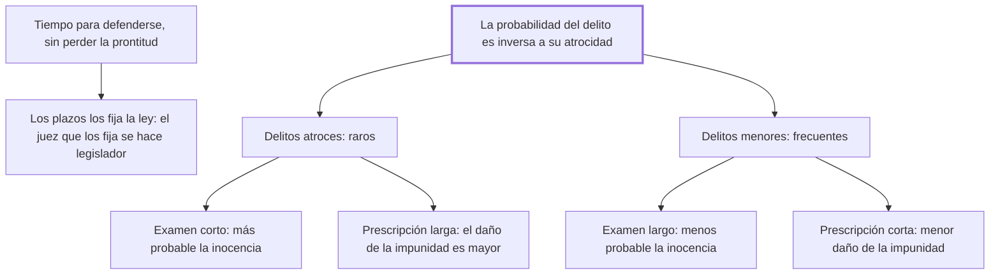

# 30. Procesos y prescripciones

## 1. Idea principal

Los plazos deben invertirse según la clase de delito: en los atroces, examen corto y prescripción larga; en los leves, examen largo y prescripción corta, porque la probabilidad de un delito es inversa a su atrocidad.

Contesta cuánto tiempo puede durar un proceso y cuándo caduca la persecución. Es el capítulo más técnico del libro y el que aplica con más finura la lógica de probabilidades del cap. 14.

## 2. Lo esencial del capítulo

El punto de partida es un equilibrio. Hay que conceder al reo tiempo y medios para justificarse, pero un tiempo tan breve que no perjudique la prontitud de la pena, que es uno de los principales frenos (cap. 30). Beccaria sale al cruce de la objeción humanitaria con una frase que conviene retener: "los peligros de la inocencia crecen con los defectos de la legislación". No es que el inocente esté más seguro cuanto más dure el proceso; está más seguro cuanto mejor sea la ley. Y el plazo tiene que fijarlo la ley y no el juez, tanto para la defensa como para las pruebas, porque **el juez que determina cuánto tiempo necesita para probar un delito se convierte en legislador**.

La regla general sobre prescripción es doble. Los delitos atroces, que dejan larga memoria, si están probados no merecen prescripción alguna en favor del reo que se sustrajo con la fuga. Los leves y no bien probados sí deben prescribir, porque la oscuridad en que quedaron confundidos quita el ejemplo de impunidad y deja al reo disposición para enmendarse.

El núcleo del capítulo es la inversión de plazos, y su fundamento está en el cap. 13: la probabilidad de un delito es en razón inversa de su atrocidad. Distingue dos clases, los más atroces —desde el homicidio en adelante— y los menores, y funda la distinción en una diferencia que importa: **la seguridad de la vida es un derecho de naturaleza; la de los bienes, un derecho de sociedad**. Son muchos menos los motivos que llevan a atropellar los sentimientos naturales de piedad que los que, por el ansia de ser felices, mueven a violar un derecho que no está en el corazón sino en las convenciones.

De esa asimetría salen las dos reglas opuestas. En los delitos atroces, como son más raros, aumenta la probabilidad de que el acusado sea inocente, así que hay que **acortar el examen**; y como el daño de la impunidad crece con la atrocidad, hay que **alargar la prescripción**, para que la sentencia definitiva extirpe las esperanzas de impunidad. En los menores pasa lo contrario: disminuye la probabilidad de inocencia, así que el examen puede alargarse, y como el daño de la impunidad es menor, la prescripción se acorta.

El cierre agrega una regla incómoda: al acusado del que no consta ni la inocencia ni la culpa, absuelto por falta de pruebas, se lo debe volver a la prisión y a nuevos exámenes si aparecen indicios señalados por la ley, hasta que corra el plazo de prescripción. Es el medio que le parece oportuno para defender a la vez la seguridad y la libertad, "el patrimonio igual e inseparable de todo ciudadano".

## 3. Mapa

## 4. Qué releer del original

1. (cap. 30) El párrafo que funda la división en dos clases — contiene la distinción entre derecho de naturaleza y de sociedad, que es la premisa de todo el capítulo.
2. (cap. 30) "los peligros de la inocencia crecen con los defectos de la legislación" — es la respuesta a quien pide procesos más largos en nombre de la humanidad.
3. (cap. 30) La regla sobre el absuelto por falta de pruebas — son cuatro líneas con consecuencias grandes, y conviene leerlas literales antes de juzgarlas.

## 5. Vocabulario clave

- **Prescripción** — la caducidad de la persecución penal por el paso del tiempo.
- **Tiempo del examen** — el plazo legal para producir las pruebas y la defensa.
- **Derecho de naturaleza** — el que se tiene por ser hombre, como la seguridad de la vida.
- **Derecho de sociedad** — el que nace de las convenciones, como la seguridad de los bienes.

## 6. Distinciones que se confunden

- **Derecho de naturaleza vs. de sociedad** — la vida está protegida por un sentimiento de piedad; la propiedad, solo por convención.
  - Se confunden porque: las dos son garantías legales y las dos se violan con delitos.
  - Criterio para decidir: ¿el freno está en el corazón o en el pacto? Contra el homicidio actúan los dos; contra el hurto, solo el segundo.
  - Dónde se cae: se supone que los delitos graves son los más frecuentes porque son los más temidos, cuando son justamente los más raros.

- **Examen vs. prescripción** — el primero es el plazo para probar; la segunda, el plazo tras el cual ya no se persigue.
  - Se confunden porque: los dos son tiempos que juegan a favor del acusado y crecen o se acortan juntos en la intuición.
  - Criterio para decidir: ¿qué riesgo se está manejando, condenar a un inocente o dejar impune a un culpable? El examen atiende al primero; la prescripción, al segundo.
  - Dónde se cae: se alargan los dos plazos para los delitos graves, cuando el capítulo pide acortar uno y alargar el otro.

## 7. Autoevaluación

1. ¿Por qué un examen más corto protege al acusado de un delito atroz, en vez de perjudicarlo?
2. Beccaria dice que la seguridad de la vida es un derecho de naturaleza y la de los bienes, de sociedad. ¿Para qué le sirve esa distinción acá?
3. Permite volver a encarcelar al absuelto por falta de pruebas si aparecen nuevos indicios. ¿Cómo se concilia eso con el resto del libro?
4. Sostiene que los peligros de la inocencia crecen con los defectos de la legislación. ¿Qué está descartando con esa frase?

--- No mires esto hasta responder ---

1. Porque en esos delitos, por raros, la probabilidad de que el acusado sea inocente es mayor. Un examen largo prolonga la prisión y la incertidumbre de alguien que probablemente no hizo nada; acortarlo limita el daño. El riesgo de dejar impune a un culpable se maneja por el otro lado, con una prescripción larga (cap. 30).
2. Para explicar por qué los delitos atroces son más raros: contra el homicidio actúan a la vez la ley y el sentimiento natural de piedad, mientras que contra el hurto solo actúa una convención que el ansia de ser feliz empuja a violar. De esa diferencia de frecuencia salen los dos regímenes de plazos.
3. Mal, y es la mayor tensión del capítulo. En el cap. 16 sostiene que quien no tiene delito probado es inocente según las leyes, y acá la absolución por falta de pruebas queda provisoria hasta que corra la prescripción. Lo acota con dos condiciones —que no conste la inocencia y que los nuevos indicios estén señalados por la ley—, pero el resultado es un ciudadano bajo sospecha legal por años.
4. Que alargar el proceso sea un modo de proteger al inocente. Su tesis es que el inocente no se protege con tiempo sino con buenas leyes: plazos fijados por ley, indicios tasados, jueces sin arbitrio. Un proceso largo bajo una mala ley solo prolonga la exposición.

## Flashcards

Quién debe fijar el tiempo del examen y el de la defensa | La ley: el juez que lo determina se convierte en legislador
Qué delitos no merecen prescripción alguna según el cap. 30 | Los atroces y probados, cuando el reo se sustrajo con la fuga
Por qué deben prescribir los delitos leves y mal probados | Porque la oscuridad de tanto tiempo quita el ejemplo de impunidad y deja al reo enmendarse
Qué relación hay entre probabilidad de un delito y su atrocidad | Es inversa: cuanto más atroz, más raro
Cómo deben ser los plazos en los delitos atroces | Examen corto y prescripción larga
Cómo deben ser en los delitos menores | Examen largo y prescripción corta
Qué diferencia hay entre la seguridad de la vida y la de los bienes | La primera es un derecho de naturaleza; la segunda, de sociedad
Qué pasa con el absuelto por falta de pruebas si aparecen nuevos indicios | Vuelve a prisión y a nuevo examen hasta que corra el plazo de prescripción
