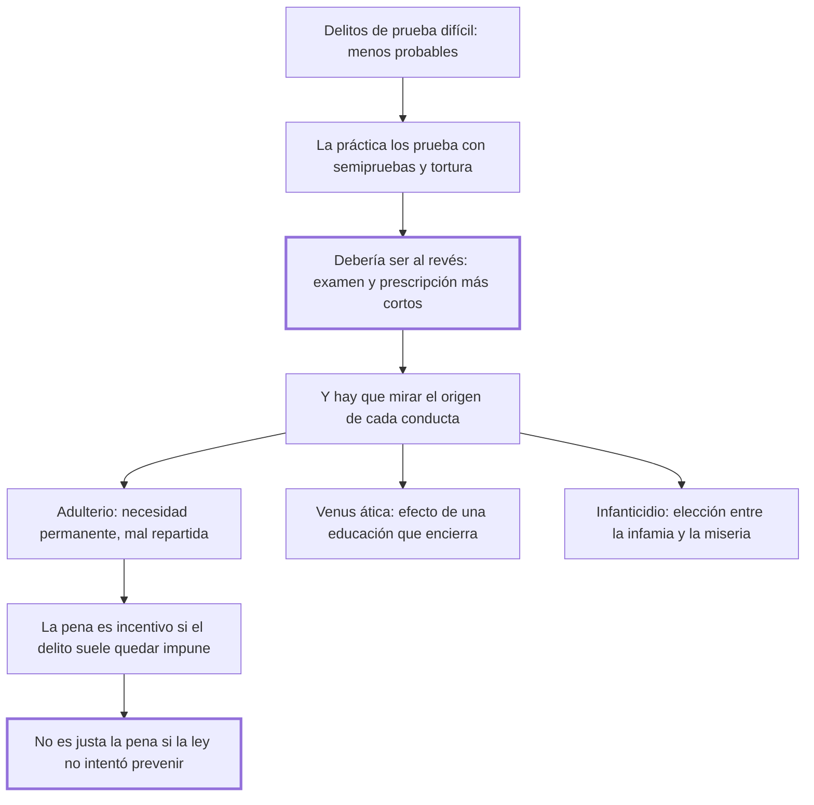

# 31. Delitos de prueba difícil

## 1. Idea principal

En los delitos difíciles de probar la práctica admite semipruebas y tortura, cuando debería hacer lo contrario; y una pena no es justa si la ley no intentó antes el mejor medio de evitar el delito.

Contesta qué hacer con las conductas que casi nunca se pueden acreditar. Es el capítulo donde Beccaria examina delitos que su época castigaba con la máxima severidad y la mínima prueba.

## 2. Lo esencial del capítulo

La paradoja de apertura es que los delitos más atroces, oscuros y quiméricos —los de menor probabilidad— sean los que se prueban por conjeturas y medios flacos, "como si las leyes y el juez tuviesen interés, no en averiguar la verdad, sino en probar el delito" (cap. 31). Y agrega el cálculo del cap. 13: condenar a un inocente es un peligro tanto mayor cuanto la probabilidad de la inocencia supera a la del delito.

Después define el caso propio del capítulo: delitos a la vez **frecuentes y de prueba difícil**. Ahí la dificultad de la prueba ocupa el lugar de la probabilidad de la inocencia, y el daño de la impunidad es menor: hay que disminuir tanto el examen como la prescripción. Lo que denuncia es que la práctica hace lo contrario, admitiendo presunciones tiránicas y semipruebas —"como si un hombre pudiese ser semidigno de castigo y semidigno de absolución"— y extendiendo la tortura al acusado, a los testigos y a la familia entera.

Los tres casos que examina son los de su tiempo, y conviene leerlos como ejemplos de un método más que como doctrina. Sobre el **adulterio** dice que nace del abuso de una necesidad constante y universal, anterior y aun fundadora de la sociedad; si es una cantidad permanente en cada clima, las leyes que buscan disminuir la suma total son inútiles y aun perniciosas, y son sabias las que la reparten en porciones pequeñas y uniformes. De ahí que la fidelidad conyugal sea siempre proporcionada al número y la libertad de los matrimonios, y que donde los combina la potestad doméstica la moral se limite a "declamar contra los efectos, manteniendo las causas".

Sobre la **"Venus ática"** —el nombre con que designa las relaciones entre hombres— sostiene que su fundamento está en una educación que encierra a la juventud en casas donde toda otra relación tiene una valla insuperable. Sobre el **infanticidio** dice que es efecto de una contradicción inevitable: quien queda entre la infamia y la muerte de un ser incapaz de sentir prefiere lo segundo a la miseria infalible; el mejor modo de evitarlo sería proteger con leyes eficaces a la flaqueza contra la tiranía.

Los dos principios generales son lo que hay que retener. Primero: **en todo delito que por su naturaleza debe casi siempre quedar sin castigo, la pena es un incentivo**, porque las dificultades que no son insuperables excitan la imaginación. Segundo, y más ambicioso: no se puede llamar justa —lo que equivale a necesaria— la pena de un delito cuando la ley no procuró antes el mejor medio de evitarlo. Beccaria aclara que no pretende disminuir el horror que merecen esas acciones: traslada parte de la responsabilidad al legislador.

## 3. Mapa

## 4. Qué releer del original

1. (cap. 31) El párrafo final, sobre la pena que no es justa si la ley no procuró evitar el delito — es la conclusión más importante del capítulo y vale tenerla textual.
2. (cap. 31) "como si un hombre pudiese ser semi-digno de castigo y semi-digno de absolución" — desmonta la categoría de semiprueba en una sola frase.
3. (cap. 31) El pasaje sobre por qué las dificultades excitan la imaginación — es el fundamento psicológico de la regla sobre la pena como incentivo, y lo resumí en dos líneas.

## 5. Vocabulario clave

- **Delito de prueba difícil** — aquel cuya acreditación es casi imposible por su naturaleza instantánea o privada.
- **Semiprueba** — la prueba parcial admitida por la práctica para condenar a medias; Beccaria la considera un absurdo.
- **Presunción tiránica** — la que da por acreditado lo que no se probó, usada sobre todo en estos delitos.
- **Pena como incentivo** — el efecto por el cual castigar lo que casi nunca se descubre aumenta el atractivo de hacerlo.

## 6. Distinciones que se confunden

- **Dificultad de la prueba vs. gravedad del delito** — la primera es una razón para exigir más, no para conformarse con menos.
  - Se confunden porque: la gravedad crea urgencia por condenar y la dificultad se vive como un obstáculo a vencer.
  - Criterio para decidir: ¿qué es más probable con este material, la culpa o el error? La dificultad de la prueba ocupa el lugar de la probabilidad de la inocencia.
  - Dónde se cae: se rebajan los estándares justamente donde el error es más probable, que es la paradoja que abre el capítulo.

- **Prevenir vs. castigar** — el capítulo condiciona la justicia de la pena a que antes se haya intentado prevenir.
  - Se confunden porque: las dos son respuestas del Estado al delito y las dos se justifican por la seguridad.
  - Criterio para decidir: ¿hizo la ley lo posible por remover la causa? Si no, la pena no es necesaria y por eso no es justa.
  - Dónde se cae: se responde a un delito frecuente endureciendo la pena, sin tocar las condiciones que lo producen.

## 7. Autoevaluación

1. ¿Por qué "en todo delito que por su naturaleza debe las más veces quedar sin castigo, la pena es un incentivo"?
2. Beccaria condiciona la justicia de la pena a que la ley haya intentado prevenir el delito. ¿Qué consecuencia tiene ese principio?
3. Al explicar estos delitos por sus causas sociales, ¿los está justificando?
4. ¿Por qué la práctica de su tiempo admitía semipruebas justamente en los delitos menos probables?

--- No mires esto hasta responder ---

1. Porque las dificultades que no son insuperables excitan la imaginación en vez de detenerla: la obligan a recorrer todas las combinaciones y la fijan en la parte agradable del objeto, de la que el ánimo no huye. Si además el castigo casi nunca llega, la amenaza agrega atractivo sin agregar riesgo real (cap. 31).
2. Que traslada parte de la responsabilidad del delito al legislador. Una pena solo es justa si es necesaria, y no es necesaria mientras existan medios de prevención no intentados. Es el mismo principio del cap. 25 —la injusticia útil no se tolera— aplicado ahora contra la comodidad de castigar en lugar de reformar.
3. No, y lo dice expresamente: no pretende minorar el horror justo que merecen esas acciones. Lo que hace es separar dos preguntas —por qué ocurren y qué debe hacer la ley— y mostrar que un origen estructural exige una respuesta estructural. Vale advertir que los tres casos que elige, y el modo de nombrarlos, son los de 1764; lo que sobrevive del capítulo es el método, no su catálogo.
4. Porque el sistema estaba organizado para probar el delito y no para averiguar la verdad, y en esos casos ninguna prueba ordinaria alcanzaba. Ante la imposibilidad, la práctica bajó el estándar en vez de aceptar la absolución: de ahí las presunciones tiránicas y la tortura extendida a testigos y familia.

## Flashcards

Cuál es la paradoja que abre el cap. 31 | Que los delitos menos probables se prueban con conjeturas y medios flacos
Qué ocupa el lugar de la probabilidad de la inocencia en estos delitos | La dificultad de la prueba
Cómo deben ser los plazos en los delitos frecuentes y de prueba difícil | Deben disminuirse tanto el examen como la prescripción
Qué objeta Beccaria a la categoría de semiprueba | Que nadie puede ser semidigno de castigo y semidigno de absolución
De qué es proporcional la fidelidad conyugal según el cap. 31 | Del número y la libertad de los matrimonios
Cuál es la regla sobre los delitos que casi siempre quedan impunes | Que en ellos la pena funciona como incentivo
Por qué las dificultades excitan la imaginación | Porque la obligan a recorrer todas las combinaciones y la fijan en la parte agradable
Cuándo no puede llamarse justa la pena de un delito | Cuando la ley no procuró antes el mejor medio posible de evitarlo
