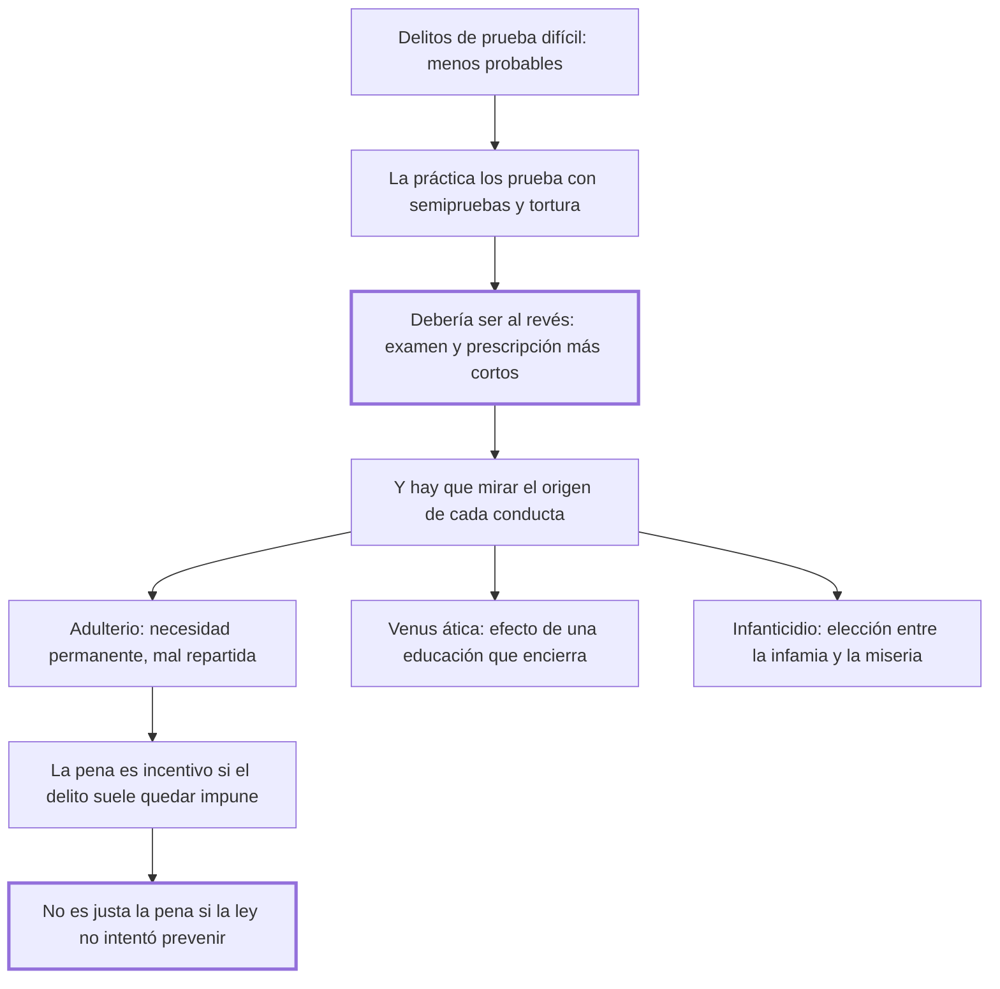

# 31. Delitos de prueba difícil

## 1. Idea principal

En los delitos difíciles de probar la práctica admite semipruebas y tortura, cuando debería hacer lo contrario; y una pena no es justa si la ley no intentó antes el mejor medio de evitar el delito.

Contesta qué hacer con las conductas que casi nunca se pueden acreditar. Es el capítulo donde Beccaria examina delitos que su época castigaba con la máxima severidad y la mínima prueba.

## 2. Lo esencial del capítulo

La paradoja de apertura es que los delitos más atroces, oscuros y quiméricos —los de menor probabilidad— sean los que se prueban por conjeturas y medios flacos, "como si las leyes y el juez tuviesen interés, no en averiguar la verdad, sino en probar el delito" (cap. 31), cuando condenar a un inocente es un peligro tanto mayor cuanto la probabilidad de la inocencia supera a la del delito (cap. 13). El caso propio del capítulo son los delitos a la vez **frecuentes y de prueba difícil**: ahí la dificultad de la prueba ocupa el lugar de la probabilidad de la inocencia y el daño de la impunidad es menor, así que hay que disminuir tanto el examen como la prescripción. La práctica hace lo contrario, admitiendo presunciones tiránicas y semipruebas —"como si un hombre pudiese ser semidigno de castigo y semidigno de absolución"— y extendiendo la tortura al acusado, a los testigos y a la familia entera.

Los tres casos que examina —el adulterio, la "Venus ática" y el infanticidio— son los de 1764 y conviene leerlos en el original como ejemplos de un método antes que como doctrina: en los tres explica la conducta por su causa, sea una necesidad universal mal repartida, una educación que encierra a la juventud o la elección forzada entre la infamia y la miseria (cap. 31). Lo que hay que retener son los dos principios generales. Primero: **en todo delito que por su naturaleza debe casi siempre quedar sin castigo, la pena es un incentivo**, porque las dificultades que no son insuperables excitan la imaginación. Segundo, y más ambicioso: no se puede llamar justa —lo que equivale a necesaria— la pena de un delito cuando la ley no procuró antes el mejor medio de evitarlo. Beccaria aclara que no pretende disminuir el horror que merecen esas acciones: traslada parte de la responsabilidad al legislador.

## 3. Mapa

## 4. Vocabulario clave

- **Delito de prueba difícil** — aquel cuya acreditación es casi imposible por su naturaleza instantánea o privada.
- **Semiprueba** — la prueba parcial admitida por la práctica para condenar a medias; Beccaria la considera un absurdo.
- **Presunción tiránica** — la que da por acreditado lo que no se probó, usada sobre todo en estos delitos.
- **Pena como incentivo** — el efecto por el cual castigar lo que casi nunca se descubre aumenta el atractivo de hacerlo.

## 5. Distinciones que se confunden

- **Dificultad de la prueba vs. gravedad del delito** — la primera es una razón para exigir más, no para conformarse con menos.
  - Se confunden porque: la gravedad crea urgencia por condenar y la dificultad se vive como un obstáculo a vencer.
  - Criterio para decidir: ¿qué es más probable con este material, la culpa o el error? La dificultad de la prueba ocupa el lugar de la probabilidad de la inocencia.
  - Dónde se cae: se rebajan los estándares justamente donde el error es más probable, que es la paradoja que abre el capítulo.

- **Prevenir vs. castigar** — el capítulo condiciona la justicia de la pena a que antes se haya intentado prevenir.
  - Se confunden porque: las dos son respuestas del Estado al delito y las dos se justifican por la seguridad.
  - Criterio para decidir: ¿hizo la ley lo posible por remover la causa? Si no, la pena no es necesaria y por eso no es justa.
  - Dónde se cae: se responde a un delito frecuente endureciendo la pena, sin tocar las condiciones que lo producen.

## 6. Autoevaluación

1. ¿Qué se entiende por delito de prueba difícil? Explique cómo deben tratarse y cuáles son las implicaciones del principio de que en ellos la pena es un incentivo.
2. Al explicar estos delitos por sus causas sociales, ¿los está justificando?

--- No mires esto hasta responder ---

1. Un delito de prueba difícil es aquel cuya acreditación resulta casi imposible por su naturaleza instantánea o privada. En ellos la dificultad de la prueba ocupa el lugar de la probabilidad de la inocencia, de modo que cuando además son frecuentes hay que disminuir tanto el tiempo del examen como el de la prescripción, y no —como hacía la práctica— rebajar el estándar con semipruebas, presunciones tiránicas y tortura (cap. 31). La primera implicación es que en todo delito que por su naturaleza debe las más veces quedar sin castigo la pena funciona como incentivo: las dificultades que no son insuperables excitan la imaginación y la fijan en la parte agradable del objeto, así que la amenaza agrega atractivo sin agregar riesgo real. La segunda es que la respuesta correcta no es penal sino preventiva: no puede llamarse justa —esto es, necesaria— la pena de un delito cuando la ley no procuró antes el mejor medio de evitarlo. Eso traslada parte de la responsabilidad al legislador y desarma la comodidad de castigar en lugar de reformar.
2. No, y lo dice expresamente: no pretende minorar el horror justo que merecen esas acciones. Lo que hace es separar dos preguntas —por qué ocurren y qué debe hacer la ley— y mostrar que un origen estructural exige una respuesta estructural. Vale advertir que los tres casos que elige, y el modo de nombrarlos, son los de 1764: lo que sobrevive del capítulo es el método, no su catálogo (cap. 31).

## Flashcards

Qué ocupa el lugar de la probabilidad de la inocencia en estos delitos | La dificultad de la prueba
Cómo deben ser los plazos en los delitos frecuentes y de prueba difícil | Deben disminuirse tanto el examen como la prescripción
Cuál es la regla sobre los delitos que casi siempre quedan impunes | Que en ellos la pena funciona como incentivo, porque las dificultades no insuperables excitan la imaginación
Cuándo no puede llamarse justa la pena de un delito | Cuando la ley no procuró antes el mejor medio posible de evitarlo
