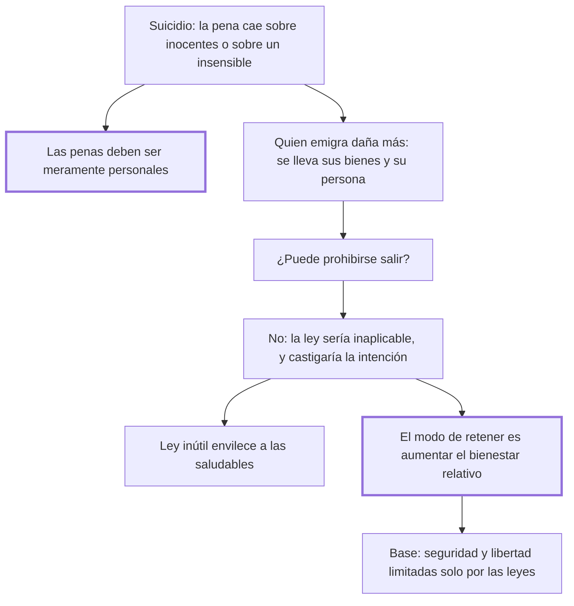

# 32. Suicidio

## 1. Idea principal

El suicidio no admite pena: recae sobre inocentes o sobre un cuerpo insensible; y la emigración, que daña más a la nación, tampoco puede castigarse, porque hacer del Estado una prisión es inútil e injusto.

Contesta si se puede castigar a quien se va, sea por la muerte o por la frontera. El capítulo trata los dos casos como uno solo y termina en una teoría sobre qué retiene de verdad a los ciudadanos.

## 2. Lo esencial del capítulo

Cualquier castigo del suicidio caerá sobre los inocentes o sobre un cuerpo frío e insensible: lo segundo no impresiona a los vivos, "como no la haría azotar una estatua", y lo primero es tiránico, porque la libertad política supone que las penas sean **meramente personales** (cap. 32). La impunidad tampoco es peligrosa: los hombres aman la vida, y la esperanza —"dulcísimo engaño de los mortales"— les hace tragar el mal mezclado con unas gotas de contento. De ahí el giro que estructura el capítulo: quien se mata hace **menos** mal a la sociedad que quien se va para siempre, porque el primero deja todos sus bienes y el segundo se lleva los suyos y además resta un ciudadano. Así la cuestión se reduce a si conviene dejar la libertad perpetua de salir.

Beccaria responde que la ley que aprisiona a los súbditos es inútil e injusta, y da cuatro razones que conviene ver en el original: la frontera es incustodiable, castigar antes de la partida es mandar en la intención —"parte tan libre del hombre que a ella no alcanza el imperio de las leyes humanas"—, castigar en los bienes que deja estancaría el comercio y castigarlo al volver haría perpetuas todas las ausencias (cap. 32). Detrás hay un principio que vale para todo el libro: la ley que las circunstancias vuelven insubsistente no debe promulgarse, porque **las leyes inútiles comunican su envilecimiento a las más saludables** y enseñan a mirar la ley como una dificultad a vencer. El modo seguro de fijar a los hombres es aumentar el bienestar relativo frente a las naciones vecinas; el largo tramo sobre el lujo matiza eso según crezca más el territorio o la población, pero la base de la felicidad son la seguridad y la libertad limitadas solo por las leyes. Caída la ley que aprisiona a los súbditos, cae la pena del suicidio: culpa que Dios castiga, no delito ante los hombres.

## 3. Mapa

## 4. Vocabulario clave

- **Pena personal** — la que recae solo sobre el autor; requisito que el castigo del suicidio no puede cumplir.
- **Ley no armada** — la que las circunstancias vuelven inaplicable y que por eso no debe promulgarse.
- **Bienestar relativo** — la felicidad de una nación comparada con la de sus vecinas; el verdadero freno a la emigración.
- **Lujo de ostentación** — el que crece en Estados vastos y despoblados y favorece al despotismo, frente al lujo de comodidad.

## 5. Distinciones que se confunden

- **Castigar la acción vs. castigar la intención** — impedir la salida antes de que ocurra es mandar en la voluntad.
  - Se confunden porque: la emigración se prepara, y los preparativos parecen actos punibles.
  - Criterio para decidir: ¿ya se produjo el hecho que la ley define? Si no, se está penando un propósito, adonde no alcanza el imperio de las leyes humanas.
  - Dónde se cae: se justifica retener a alguien por su intención declarada de irse, que es exactamente lo que el capítulo excluye.

- **Lujo de ostentación vs. de comodidad** — el primero acompaña al despotismo; el segundo, a la industria.
  - Se confunden porque: los dos son gasto en placeres y se critican juntos como corrupción.
  - Criterio para decidir: ¿la población crece más o menos que el territorio? De esa relación depende cuál de los dos predomina.
  - Dónde se cae: se condena el lujo en bloque, cuando para Beccaria es un remedio necesario a la desigualdad si hay seguridad y libertad.

## 6. Autoevaluación

1. ¿Qué se entiende por el principio de personalidad de las penas? Explique, a partir de él, por qué el cap. 32 sostiene que ni el suicidio ni la emigración pueden castigarse.
2. Un gobierno prohíbe emigrar y endurece la pena del que lo intenta, alegando que pierde población. ¿Qué le respondería el capítulo?

--- No mires esto hasta responder ---

1. Es la exigencia de que la pena recaiga solo sobre el autor del delito: para Beccaria la libertad política supone que las penas sean meramente personales (cap. 32). El suicidio no puede castigarse porque no queda nadie sobre quien la pena recaiga: si cae sobre el cuerpo del muerto no impresiona a los vivos, como azotar una estatua, y si cae sobre los bienes o la familia, castiga a inocentes. La emigración tampoco, aunque dañe más —el que se va se lleva sus bienes y resta un ciudadano—, porque la ley que aprisiona a los súbditos es inútil e injusta: la frontera no se puede custodiar, impedir la salida es mandar en la intención, confiscar los bienes que quedan estancaría el comercio y castigar el regreso haría perpetuas las ausencias. La implicación es que el daño de un hecho no basta para habilitar una pena: hace falta además que sea aplicable, personal y necesaria. Y cuando la pena no cabe, el remedio es de otro orden: aumentar el bienestar relativo frente a las naciones vecinas.
2. Que la ley será inútil e injusta a la vez, y encima contraproducente: no se pueden cerrar todos los puntos de la circunferencia de un país, y penar el intento es castigar una intención adonde no alcanza el imperio de las leyes humanas. Esa ley inútil, además, enseña a mirar la ley como una dificultad a vencer y comunica su envilecimiento a las saludables. Si la gente se va porque vive peor que en la nación vecina, la frontera cerrada no toca el motivo: solo agrega el deseo de cruzarla (cap. 32).

## Flashcards

Por qué no admite pena el suicidio | Porque el castigo caería sobre inocentes o sobre un cuerpo frío e insensible
Qué supone la libertad política respecto de las penas | Que sean meramente personales
Por qué no puede prohibirse emigrar | Porque la frontera es incustodiable, penar la partida es mandar en la intención, confiscar estanca el comercio y castigar el regreso perpetúa las ausencias
Cuál es el modo seguro de fijar a los ciudadanos en su país | Aumentar el bienestar relativo de cada uno frente a las naciones vecinas
