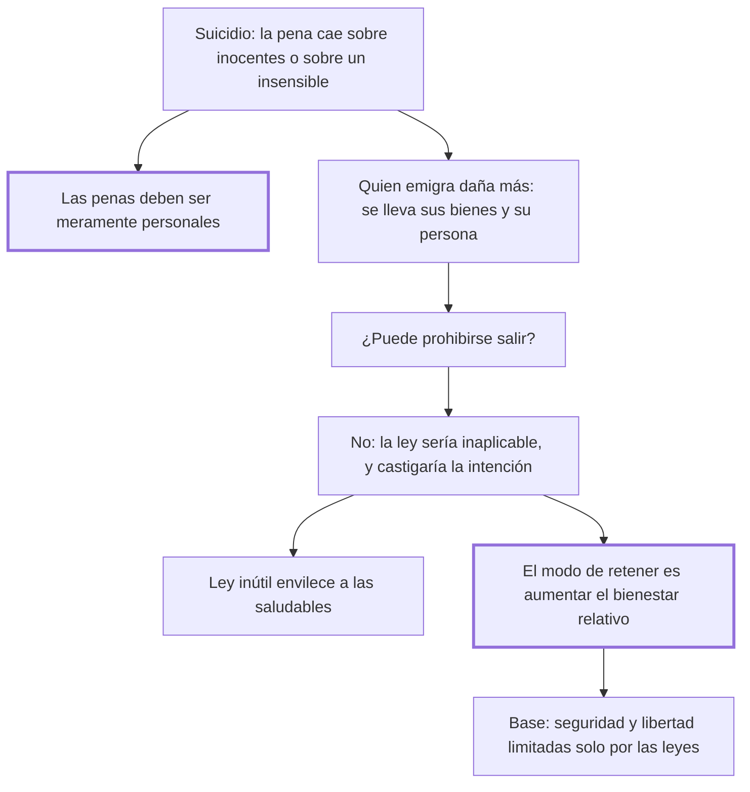

# 32. Suicidio

## 1. Idea principal

El suicidio no admite pena: recae sobre inocentes o sobre un cuerpo insensible; y la emigración, que daña más a la nación, tampoco puede castigarse, porque hacer del Estado una prisión es inútil e injusto.

Contesta si se puede castigar a quien se va, sea por la muerte o por la frontera. El capítulo trata los dos casos como uno solo y termina en una teoría sobre qué retiene de verdad a los ciudadanos.

## 2. Lo esencial del capítulo

El argumento contra la pena del suicidio tiene dos ramas. Cualquier castigo caerá sobre los inocentes o sobre un cuerpo frío e insensible: lo segundo no impresiona a los vivos, "como no la haría azotar una estatua", y lo primero es tiránico, porque la libertad política supone que las penas sean **meramente personales** (cap. 32). Además la impunidad no es peligrosa: los hombres aman la vida, y la esperanza —"dulcísimo engaño de los mortales"— les hace tragar el mal mezclado con unas gotas de contento.

De ahí el giro que estructura el capítulo. Quien se mata hace **menos** mal a la sociedad que quien se va para siempre, porque el primero deja todos sus bienes y el segundo se lleva los suyos y además resta un ciudadano. Así la cuestión se reduce a si conviene dejar la libertad perpetua de salir. Beccaria responde que la ley que aprisiona a los súbditos es inútil e injusta, y da cuatro razones. No se pueden cerrar todos los puntos de la circunferencia de un país, "¿y cómo se podrá guardar a los mismos guardas?". Al que se lleva cuanto tiene no se lo puede castigar después, y hacerlo antes es mandar en la intención, "parte tan libre del hombre que a ella no alcanza el imperio de las leyes humanas". Castigarlo en los bienes que deja estancaría el comercio entre naciones. Y castigarlo al volver haría perpetuas todas las ausencias.

Antes había enunciado un principio que vale para todo el libro: cualquier ley que no esté armada, o que las circunstancias vuelvan insubsistente, no debe promulgarse, porque **las leyes inútiles, despreciadas, comunican su envilecimiento a las más saludables**, y enseñan a mirar la ley como una dificultad a vencer y no como depósito del bien público.

El cierre propone la alternativa: qué pensar de un gobierno que no tiene más medio de retener a los hombres que el temor. El modo seguro de fijarlos es aumentar el bienestar relativo, de manera que la felicidad comparada con la de las naciones vecinas sea mayor. Dedica después un largo tramo al lujo, con una tesis que depende de la relación entre población y territorio: donde el territorio crece más que la población el lujo favorece al despotismo, porque hay menos industria y la sumisión se obtiene más fácil de pocos; donde la población crece más, se le opone. Pero aclara que la base de la felicidad son la seguridad y la libertad limitadas solo por las leyes, sin las cuales el lujo es instrumento de la tiranía. Y concluye: caída la ley que aprisiona a los súbditos, cae la pena del suicidio, que será culpa que Dios castiga pero no delito ante los hombres.

## 3. Mapa

## 4. Qué releer del original

1. (cap. 32) El párrafo sobre las leyes inútiles que envilecen a las saludables — es un principio general del libro y aparece acá casi de paso.
2. (cap. 32) Las cuatro razones por las que no se puede castigar al que emigra — están encadenadas y conviene ver cómo cada una cierra una salida distinta.
3. (cap. 32) El tramo sobre el lujo y la relación entre población y territorio — es la parte más ajena al derecho penal y la que más resumí.

## 5. Vocabulario clave

- **Pena personal** — la que recae solo sobre el autor; requisito que el castigo del suicidio no puede cumplir.
- **Ley no armada** — la que las circunstancias vuelven inaplicable y que por eso no debe promulgarse.
- **Bienestar relativo** — la felicidad de una nación comparada con la de sus vecinas; el verdadero freno a la emigración.
- **Lujo de ostentación** — el que crece en Estados vastos y despoblados y favorece al despotismo, frente al lujo de comodidad.

## 6. Distinciones que se confunden

- **Castigar la acción vs. castigar la intención** — impedir la salida antes de que ocurra es mandar en la voluntad.
  - Se confunden porque: la emigración se prepara, y los preparativos parecen actos punibles.
  - Criterio para decidir: ¿ya se produjo el hecho que la ley define? Si no, se está penando un propósito, adonde no alcanza el imperio de las leyes humanas.
  - Dónde se cae: se justifica retener a alguien por su intención declarada de irse, que es exactamente lo que el capítulo excluye.

- **Lujo de ostentación vs. de comodidad** — el primero acompaña al despotismo; el segundo, a la industria.
  - Se confunden porque: los dos son gasto en placeres y se critican juntos como corrupción.
  - Criterio para decidir: ¿la población crece más o menos que el territorio? De esa relación depende cuál de los dos predomina.
  - Dónde se cae: se condena el lujo en bloque, cuando para Beccaria es un remedio necesario a la desigualdad si hay seguridad y libertad.

## 7. Autoevaluación

1. ¿Por qué el castigo del suicidio viola el principio de personalidad de las penas?
2. Beccaria sostiene que quien emigra daña más a la nación que quien se mata, y aun así no propone castigarlo. ¿Es coherente?
3. ¿Por qué una ley inútil daña también a las buenas leyes?
4. Dice que la mayor felicidad relativa retiene mejor que el temor. ¿Es un argumento penal o económico?

--- No mires esto hasta responder ---

1. Porque no hay nadie sobre quien pueda recaer. Si cae sobre el cuerpo del muerto no impresiona a los vivos, como azotar una estatua; si cae sobre los bienes o la familia, castiga a inocentes, y la libertad política exige que las penas sean meramente personales (cap. 32).
2. Sí, y la coherencia está en separar el daño de la posibilidad de castigarlo. Que un hecho perjudique no habilita a penarlo: hace falta además que la pena sea aplicable, personal y necesaria. Acá ninguna de las tres se cumple, y el remedio disponible —el bienestar relativo— es de otro orden.
3. Porque enseña a los hombres a mirar la ley como una dificultad a vencer y no como depósito del bien público. Ese desprecio no se queda en la norma inaplicable: se comunica a las saludables, y la autoridad de todo el código baja al nivel de su pieza más ridícula.
4. Es penal en su forma —resuelve si cabe una pena— y económico en su respuesta. Es la aplicación más clara de la idea de que el legislador previene removiendo causas: si la gente se va porque vive peor que en la nación vecina, la frontera cerrada no cambia el motivo, solo agrega el deseo de cruzarla y ahuyenta a los extranjeros.

## Flashcards

Por qué no admite pena el suicidio | Porque el castigo caería sobre inocentes o sobre un cuerpo frío e insensible
Qué supone la libertad política respecto de las penas | Que sean meramente personales
Quién hace más daño a la sociedad, el que se mata o el que emigra | El que emigra: se lleva parte de sus bienes y resta un ciudadano
Por qué no puede castigarse la intención de emigrar | Porque la intención es parte tan libre del hombre que no alcanza a ella el imperio de las leyes humanas
Qué efecto tienen las leyes inútiles según el cap. 32 | Comunican su envilecimiento aun a las más saludables
Cuál es el modo seguro de fijar a los ciudadanos en su país | Aumentar el bienestar relativo de cada uno frente a las naciones vecinas
Cuándo favorece el lujo al despotismo | Cuando los confines del país crecen más que su población
Qué forma la base principal de la felicidad de una nación | La seguridad y la libertad limitadas solo por las leyes
