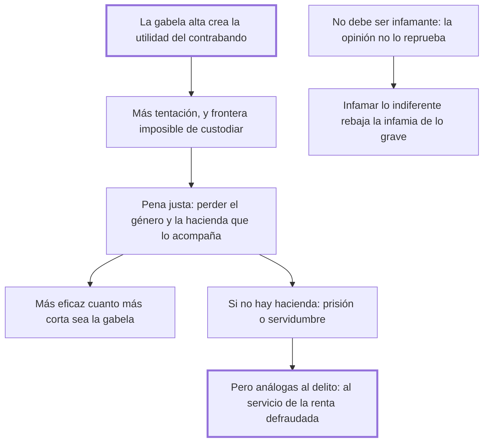

# 33. Contrabandos

## 1. Idea principal

El contrabando nace de la ley misma —crece con la gabela— y por eso su pena no debe ser infamante: declarar infame lo que la opinión no reprueba rebaja la infamia de lo que sí lo es.

Contesta cómo castigar un delito que casi nadie siente como tal. Es el mejor ejemplo del libro de una pena calibrada por la naturaleza del delito y no por su monto.

## 2. Lo esencial del capítulo

El contrabando es un verdadero delito, que ofende al soberano y a la nación, pero su pena no debe ser infamante porque cometerlo no produce infamia en la opinión pública (cap. 33). El principio general es el mismo del cap. 23: quien decreta penas infamantes contra delitos que los hombres no reputan tales disminuye el sentimiento de infamia para los que sí lo son. El ejemplo que da es contundente: quien vea la misma pena de muerte para el que mata un faisán, para el que asesina a un hombre y para el que falsifica un escrito importante dejará de distinguir entre esos delitos. Y lo que se destruye así son "las máximas morales, obra de muchos siglos y de mucha sangre", lentísimas y difíciles de insinuarse en los ánimos.

Sobre el origen, la tesis es directa: **este delito nace de la ley misma**. Al crecer la gabela crece la utilidad de burlarla y con ella la tentación, y la facilidad aumenta con la extensión de la frontera que hay que custodiar y con el poco tamaño de la mercadería. De ahí que la pena de perder el género prohibido y la hacienda que lo acompaña sea justísima, pero será tanto más eficaz cuanto más corta sea la gabela, "porque los hombres no se arriesgan sino a proporción de la utilidad" que puedan obtener. Notar que la palanca principal que propone no es penal sino tributaria.

Después responde la pregunta que él mismo plantea: por qué este delito no infama, siendo un hurto hecho al príncipe y por consiguiente a la nación. La explicación es psicológica y encaja con todo el libro: las ofensas que los hombres creen que no pueden hacérseles a ellos no despiertan indignación pública. Como las consecuencias remotas hacen impresiones cortísimas, no ven el daño que puede alcanzarlos y en cambio gozan de las utilidades presentes del contrabando; solo ven el daño hecho al príncipe. De ahí el principio que enuncia: **todo ente sensible no se mueve sino por los males que conoce**.

El cierre resuelve el caso práctico. ¿Queda impune el contrabandista sin hacienda que perder? De ningún modo: hay contrabandos que tocan tan de cerca la naturaleza del tributo —"parte tan esencial y tan difícil en una buena legislación"— que merecen prisión y hasta servidumbre. Pero prisión y servidumbre **conformes a la naturaleza del mismo delito**: la prisión por contrabando de tabaco no debe ser la misma que la del asesino o el ladrón, y las ocupaciones del condenado deben limitarse al trabajo y servicio de la misma renta que quiso defraudar. Es la aplicación más concreta del principio de analogía enunciado en el cap. 19.

## 3. Mapa

## 4. Qué releer del original

1. (cap. 33) "este delito nace de la ley misma" y lo que sigue — es la explicación causal completa y conviene ver cómo encadena gabela, utilidad y facilidad.
2. (cap. 33) El ejemplo del faisán y el asesinato — muestra en una línea el daño de igualar penas para delitos incomparables.
3. (cap. 33) El final sobre las ocupaciones del condenado — es la aplicación más concreta del principio de analogía de la pena en todo el libro.

## 5. Vocabulario clave

- **Contrabando** — el fraude a los derechos de aduana; delito real pero que no produce infamia en la opinión.
- **Gabela** — el impuesto sobre la mercadería, cuya cuantía determina la tentación de defraudarlo.
- **Pena infamante** — la que suma al castigo el descrédito público; impropia cuando la opinión no reprueba el hecho.
- **Servidumbre análoga** — la que emplea al condenado en el servicio de la misma renta que defraudó.

## 6. Distinciones que se confunden

- **Delito real vs. delito infamante** — el contrabando es lo primero sin ser lo segundo.
  - Se confunden porque: se supone que si una conducta merece pena también merece descrédito.
  - Criterio para decidir: ¿la opinión pública reprueba el hecho? La infamia no la crea la ley; la registra.
  - Dónde se cae: se agrega infamia para reforzar la pena, y el efecto es rebajar la infamia de los delitos que sí la producen.

- **Daño al príncipe vs. daño percibido por cada uno** — el contrabando perjudica a todos, pero nadie se siente ofendido.
  - Se confunden porque: jurídicamente el fraude al fisco es un daño a la nación, y parece que debería sentirse así.
  - Criterio para decidir: ¿puede el ciudadano imaginar que le pase a él? Las consecuencias remotas hacen impresiones cortísimas.
  - Dónde se cae: se espera que la gente colabore en perseguir un delito del que percibe solo las ventajas presentes.

## 7. Autoevaluación

1. ¿Por qué la mejor medida contra el contrabando no es penal?
2. Beccaria dice que el contrabando no infama aunque sea un hurto a la nación. ¿Qué principio general saca de ahí?
3. Propone que el contrabandista de tabaco trabaje en el servicio de la renta que defraudó. ¿Qué gana con esa analogía?
4. ¿Qué se destruye cuando se castiga con la misma pena matar un faisán y matar a un hombre?

--- No mires esto hasta responder ---

1. Porque el delito nace de la ley misma: al crecer la gabela crece la utilidad de burlarla, y los hombres no se arriesgan sino a proporción de lo que pueden ganar. Bajar el impuesto reduce el incentivo en el origen, mientras que endurecer la pena deja intacta la causa (cap. 33).
2. Que todo ente sensible solo se mueve por los males que conoce. Como el daño del contrabando es remoto y difuso, nadie lo siente como propio y la indignación pública no aparece; en cambio el hurto privado o la falsificación sí podrían alcanzarlo, y por eso los reprueba.
3. Gana la conexión entre delito y pena que pedía el cap. 19: la analogía facilita el choque entre el estímulo que llevó al delito y la repercusión del castigo. Y evita el otro daño, el de confundir en una misma prisión al defraudador con el asesino, que es lo que iguala en la opinión conductas incomparables.
4. Las máximas morales, que Beccaria describe como obra de muchos siglos y de mucha sangre, lentísimas y difíciles de insinuarse en los ánimos. La escala de penas es también un instrumento pedagógico: si iguala lo desigual, borra distinciones morales que costó siglos establecer.

## Flashcards

Por qué la pena del contrabando no debe ser infamante | Porque cometerlo no produce infamia en la opinión pública
Qué efecto tiene infamar delitos que los hombres no reputan tales | Disminuye el sentimiento de infamia para los que verdaderamente lo son
De dónde nace el delito de contrabando según el cap. 33 | De la ley misma: al crecer la gabela crece la utilidad de burlarla
Cuál es la pena justísima para el contrabando | Perder el género prohibido y la hacienda que lo acompaña
Cuándo será más eficaz esa pena | Cuanto más corta sea la gabela
Por qué no indigna al público un hurto hecho al príncipe | Porque las consecuencias remotas hacen impresiones cortísimas y nadie lo siente como propio
Qué principio enuncia sobre los móviles humanos | Que todo ente sensible no se mueve sino por los males que conoce
Cómo debe ser la servidumbre del contrabandista | Limitada al trabajo y servicio de la misma renta que quiso defraudar
