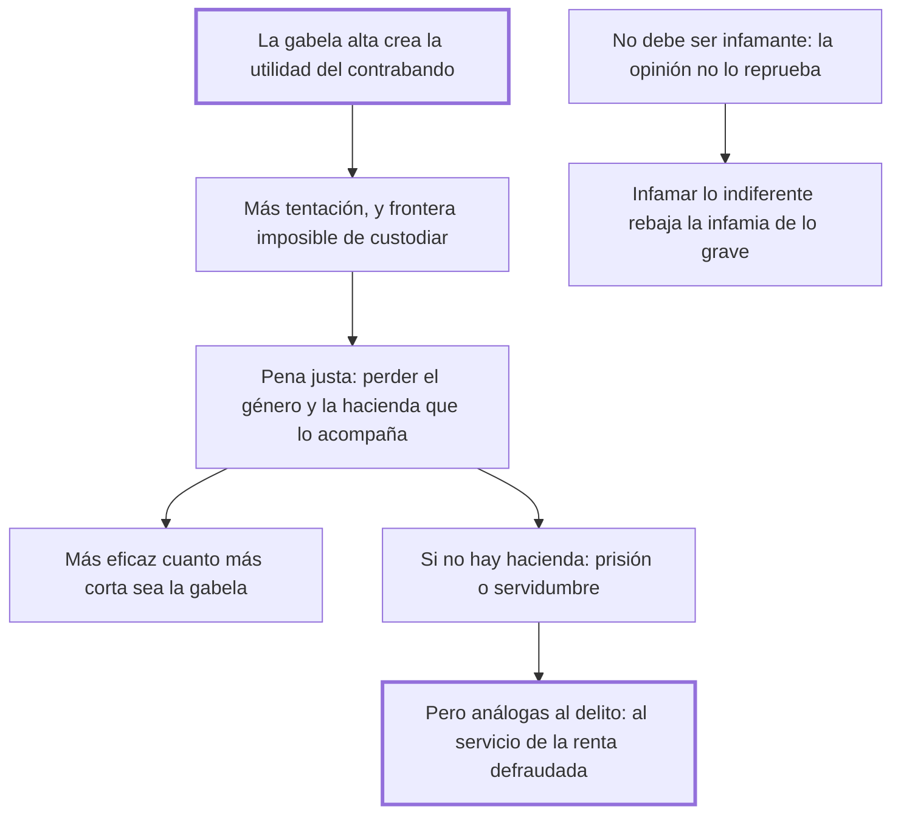

# 33. Contrabandos

## 1. Idea principal

El contrabando nace de la ley misma —crece con la gabela— y por eso su pena no debe ser infamante: declarar infame lo que la opinión no reprueba rebaja la infamia de lo que sí lo es.

Contesta cómo castigar un delito que casi nadie siente como tal. Es el mejor ejemplo del libro de una pena calibrada por la naturaleza del delito y no por su monto.

## 2. Lo esencial del capítulo

El contrabando es un verdadero delito, que ofende al soberano y a la nación, pero su pena no debe ser infamante porque cometerlo no produce infamia en la opinión pública (cap. 33). Rige el principio del cap. 23: quien decreta penas infamantes contra delitos que los hombres no reputan tales disminuye el sentimiento de infamia para los que sí lo son, y quien vea la misma pena de muerte para el que mata un faisán, para el que asesina a un hombre y para el que falsifica un escrito importante dejará de distinguir entre ellos; lo que se destruye así son "las máximas morales, obra de muchos siglos y de mucha sangre". Por qué no infama, siendo un hurto hecho al príncipe, lo explica por la psicología: como las consecuencias remotas hacen impresiones cortísimas, nadie ve el daño que puede alcanzarlo y en cambio goza de las utilidades presentes, de donde el principio de que **todo ente sensible no se mueve sino por los males que conoce**.

Sobre el origen la tesis es directa: **este delito nace de la ley misma**, porque al crecer la gabela crece la utilidad de burlarla, y la facilidad aumenta con la extensión de la frontera y el poco tamaño de la mercadería (cap. 33). De ahí que la pena de perder el género prohibido y la hacienda que lo acompaña sea justísima, pero tanto más eficaz cuanto más corta sea la gabela, "porque los hombres no se arriesgan sino a proporción de la utilidad": la palanca principal que propone no es penal sino tributaria. El cierre resuelve el caso del contrabandista sin hacienda que perder, que no queda impune: merece prisión y hasta servidumbre, pero **conformes a la naturaleza del mismo delito**, con las ocupaciones del condenado limitadas al trabajo y servicio de la misma renta que quiso defraudar. Es la aplicación más concreta del principio de analogía del cap. 19.

## 3. Mapa

## 4. Vocabulario clave

- **Contrabando** — el fraude a los derechos de aduana; delito real pero que no produce infamia en la opinión.
- **Gabela** — el impuesto sobre la mercadería, cuya cuantía determina la tentación de defraudarlo.
- **Pena infamante** — la que suma al castigo el descrédito público; impropia cuando la opinión no reprueba el hecho.
- **Servidumbre análoga** — la que emplea al condenado en el servicio de la misma renta que defraudó.

## 5. Distinciones que se confunden

- **Delito real vs. delito infamante** — el contrabando es lo primero sin ser lo segundo.
  - Se confunden porque: se supone que si una conducta merece pena también merece descrédito.
  - Criterio para decidir: ¿la opinión pública reprueba el hecho? La infamia no la crea la ley; la registra.
  - Dónde se cae: se agrega infamia para reforzar la pena, y el efecto es rebajar la infamia de los delitos que sí la producen.

- **Daño al príncipe vs. daño percibido por cada uno** — el contrabando perjudica a todos, pero nadie se siente ofendido.
  - Se confunden porque: jurídicamente el fraude al fisco es un daño a la nación, y parece que debería sentirse así.
  - Criterio para decidir: ¿puede el ciudadano imaginar que le pase a él? Las consecuencias remotas hacen impresiones cortísimas.
  - Dónde se cae: se espera que la gente colabore en perseguir un delito del que percibe solo las ventajas presentes.

## 6. Autoevaluación

1. ¿Qué se entiende por pena infamante y por qué el cap. 33 la excluye para el contrabando? Explique las implicaciones de ese criterio sobre la escala de penas.
2. Un gobierno sube fuertemente el impuesto al tabaco y a la vez endurece la pena del contrabandista. ¿Qué le diría el capítulo?

--- No mires esto hasta responder ---

1. La pena infamante es la que suma al castigo el descrédito público. Beccaria la excluye para el contrabando porque, aunque sea un verdadero delito que ofende al soberano y a la nación, cometerlo no produce infamia en la opinión: como las consecuencias remotas hacen impresiones cortísimas, el ciudadano solo ve las utilidades presentes y el daño hecho al príncipe (cap. 33). La implicación es que la infamia no la crea la ley sino que la registra, y quien decreta penas infamantes contra delitos que los hombres no reputan tales disminuye el sentimiento de infamia para los que sí lo son. De ahí el ejemplo de la misma pena de muerte para quien mata un faisán, quien asesina y quien falsifica un escrito importante: igualar lo desigual destruye "las máximas morales, obra de muchos siglos y de mucha sangre". La escala de penas es también un instrumento pedagógico, y su desorden se paga en la moral pública.
2. Que está agravando la causa mientras castiga el efecto. El delito nace de la ley misma: al crecer la gabela crece la utilidad de burlarla, y los hombres no se arriesgan sino a proporción de lo que pueden ganar, así que subir el impuesto multiplica la tentación que la pena tendría que contener. Y si al que no tiene hacienda que perder se lo manda a la misma prisión que al asesino, se pierde además la analogía del cap. 19: la servidumbre debería limitarse al servicio de la renta defraudada.

## Flashcards

Por qué la pena del contrabando no debe ser infamante | Porque cometerlo no produce infamia en la opinión pública
Qué efecto tiene infamar delitos que los hombres no reputan tales | Disminuye el sentimiento de infamia para los que verdaderamente lo son
De dónde nace el delito de contrabando según el cap. 33 | De la ley misma: al crecer la gabela crece la utilidad de burlarla
Cómo debe ser la servidumbre del contrabandista | Limitada al trabajo y servicio de la misma renta que quiso defraudar
