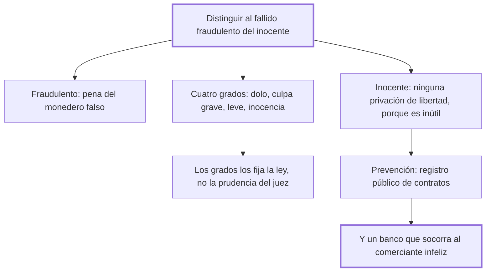

# 34. De los deudores

## 1. Idea principal

Hay que distinguir al fallido fraudulento del inocente: al primero le corresponde la pena del falsificador de moneda; al segundo, ninguna privación de libertad, porque es inútil para los acreedores.

Contesta si se puede encarcelar por deudas. Es el capítulo donde Beccaria propone medidas positivas —un registro público de contratos y un banco— en vez de limitarse a corregir penas.

## 2. Lo esencial del capítulo

La buena fe de los contratos y la seguridad del comercio exigen asegurar a los acreedores, pero la distinción decisiva es entre **fallido fraudulento** y **fallido inocente** (cap. 34). Al primero le corresponde la pena del monedero falso, por simetría: falsificar un pedazo de metal acuñado, que es prenda de las obligaciones de los ciudadanos, no es mayor delito que falsificar las obligaciones mismas. El segundo es quien probó ante sus jueces que la malicia ajena, la desgracia o contratiempos inevitables lo despojaron de sus bienes; encerrarlo lo priva de la libertad, "único y triste bien que solo le queda", y lo hace arrepentirse de la inocencia con que vivía bajo unas leyes que no estuvo en su mano ofender.

Ahí aparece una observación política que conviene retener aparte. Esas leyes fueron dictadas por los poderosos por codicia y las sufren los flacos por esa esperanza que hace creer "que los acontecimientos adversos son para los demás y para nosotros los favorables". De ahí la frase más aguda del capítulo: los hombres **aman las leyes crueles aunque estén sujetos a ellas**, cuando sería interés de todos moderarlas, porque es mayor el temor de ser ofendido que el deseo de ofender.

Para el fallido inocente propone medidas que no tocan su libertad: deudas inextinguibles hasta la paga total; imposibilidad de liberarse sin consentimiento de los interesados; prohibición de retirarse a otro país; y apremio a emplear su trabajo y sus talentos para volver a satisfacer a los acreedores. Lo que ni la seguridad del comercio ni la propiedad justifican es una privación de libertad "que les es inútil".

Después refina la escala en cuatro grados: al dolo, las penas de la falsificación; a la culpa grave, penas menores con privación de libertad; a la leve, la pérdida de la facultad de elegir los medios de restablecerse, que pasa a los acreedores; y a la inocencia, la libre elección de esos medios. Pero insiste en el requisito de forma: las distinciones de grave y leve **debe fijarlas la ley ciega e imparcial**, no la prudencia arbitraria de los jueces, porque señalar límites es tan necesario en política como en matemática.

El cierre propone prevención en vez de castigo. Un legislador próvido podría impedir gran parte de las quiebras culpables con un registro público de todos los contratos, y con un banco formado por tributos sobre el comercio próspero y destinado a socorrer al miembro infeliz. Beccaria lamenta que esas leyes "fáciles, simples, grandes", que solo esperan la voluntad del legislador, sean las menos conocidas o las menos queridas, porque ocupan el ánimo de quienes gobiernan un espíritu inquieto en pequeñeces y la aversión a toda novedad.

## 3. Mapa

## 4. Qué releer del original

1. (cap. 34) "aman las leyes crueles aunque estén sujetos a ellas mismas" — es una de las observaciones más agudas del libro sobre por qué el rigor tiene apoyo popular.
2. (cap. 34) La escala de cuatro grados con sus consecuencias — está comprimida en pocas líneas y cada tramo tiene un efecto distinto.
3. (cap. 34) El párrafo final sobre el registro y el banco público — es de las pocas propuestas positivas del libro y conviene verla entera.

## 5. Vocabulario clave

- **Fallido fraudulento** — el deudor que quebró con dolo; equiparado al falsificador de moneda.
- **Fallido inocente** — el que probó que perdió sus bienes por malicia ajena, desgracia o contratiempos inevitables.
- **Registro público de contratos** — el archivo consultable con que Beccaria propone prevenir las quiebras culpables.
- **Banco público** — fondo formado con tributos sobre el comercio próspero, destinado a socorrer al comerciante caído.

## 6. Distinciones que se confunden

- **Fallido fraudulento vs. inocente** — el primero falsificó obligaciones; el segundo fue despojado por causas ajenas.
  - Se confunden porque: los dos dejan acreedores impagos y el resultado externo es idéntico.
  - Criterio para decidir: ¿resiste un examen riguroso la explicación de la pérdida? Solo entonces hay inocencia.
  - Dónde se cae: se encarcela por el mero impago, que es la práctica que el capítulo llama bárbara.

- **Asegurar el crédito vs. privar de libertad** — lo primero se logra con inextinguibilidad de la deuda y apremio al trabajo.
  - Se confunden porque: la prisión parece la garantía última de que el deudor pagará.
  - Criterio para decidir: ¿le sirve de algo al acreedor? Un deudor preso no produce; la privación le es inútil.
  - Dónde se cae: se defiende la prisión por deudas como protección del comercio, cuando destruye la única fuente de pago.

## 7. Autoevaluación

1. ¿Por qué equipara al fallido fraudulento con el falsificador de moneda?
2. Beccaria dice que los hombres aman las leyes crueles aunque estén sujetos a ellas. ¿Cómo lo explica?
3. Exige que los grados de culpa los fije la ley y no el juez. ¿Qué se perdería con la solución contraria?
4. Propone un banco público para socorrer al comerciante caído. ¿Encaja eso en un libro sobre delitos y penas?

--- No mires esto hasta responder ---

1. Por simetría entre lo falsificado. La moneda es una prenda de las obligaciones de los ciudadanos, así que falsificar las obligaciones mismas no es menor delito que falsificar el metal que las representa. El daño en los dos casos es la confianza en los signos del intercambio (cap. 34).
2. Por la esperanza: cada uno cree que los acontecimientos adversos son para los demás y los favorables para sí, así que apoya el rigor pensándose siempre del lado del ofendido. Beccaria replica con un cálculo: es mayor el temor de ser ofendido que el deseo de ofender, de modo que moderarlas conviene a todos.
3. Se perdería la previsibilidad, que es lo que permite al ciudadano saber cuándo es reo. Dejar "grave" y "leve" al criterio del juez reintroduce el arbitrio que el cap. 4 le prohíbe, y en materia comercial además haría imposible calcular el riesgo de contratar. De ahí su comparación entre política y matemática: sin límites señalados no hay medida.
4. Encaja por la tesis del cap. 31: una pena no es justa si la ley no intentó antes el mejor medio de evitar el delito. Si muchas quiebras culpables nacen de la falta de información y del desamparo del comerciante honesto, el registro y el banco son parte del argumento penal, no una digresión económica.

## Flashcards

Cuál es la distinción central del cap. 34 | La del fallido fraudulento y el fallido inocente
Qué pena corresponde al fallido fraudulento | La misma que al monedero falso
Por qué esa equiparación | Porque falsificar las obligaciones no es menor delito que falsificar el metal que las representa
Qué medidas propone para el fallido inocente | Deuda inextinguible, prohibición de irse y apremio a trabajar, sin privación de libertad
Por qué es inútil encarcelar al fallido inocente | Porque no sirve a los acreedores y le quita el único bien que le queda
Qué observa Beccaria sobre el apoyo popular a las leyes crueles | Que los hombres las aman aunque estén sujetos a ellas, creyendo que la desgracia será ajena
Quién debe fijar los grados de culpa grave y leve | La ley ciega e imparcial, no la prudencia arbitraria de los jueces
Qué dos instituciones propone para prevenir las quiebras | Un registro público de contratos y un banco público que socorra al comerciante infeliz
