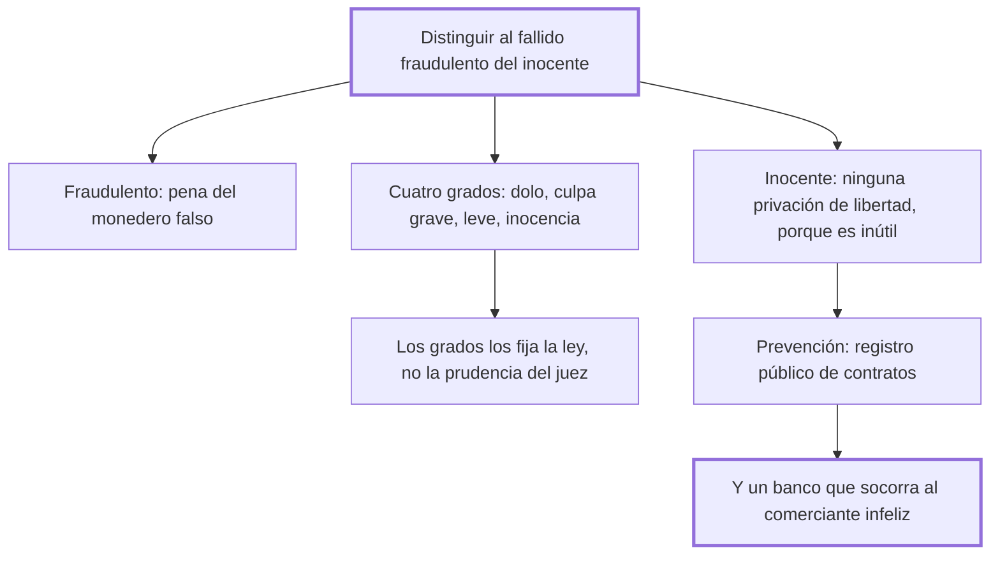

# 34. De los deudores

## 1. Idea principal

Hay que distinguir al fallido fraudulento del inocente: al primero le corresponde la pena del falsificador de moneda; al segundo, ninguna privación de libertad, porque es inútil para los acreedores.

Contesta si se puede encarcelar por deudas. Es el capítulo donde Beccaria propone medidas positivas —un registro público de contratos y un banco— en vez de limitarse a corregir penas.

## 2. Lo esencial del capítulo

La buena fe de los contratos y la seguridad del comercio exigen asegurar a los acreedores, pero la distinción decisiva es entre **fallido fraudulento** y **fallido inocente** (cap. 34). Al primero le corresponde la pena del monedero falso, por simetría: falsificar un pedazo de metal acuñado, que es prenda de las obligaciones de los ciudadanos, no es mayor delito que falsificar las obligaciones mismas. El segundo es quien probó ante sus jueces que la malicia ajena, la desgracia o contratiempos inevitables lo despojaron de sus bienes; encerrarlo lo priva de la libertad, "único y triste bien que solo le queda", con una privación que ni el comercio ni la propiedad justifican porque "les es inútil". Para él propone en cambio deudas inextinguibles hasta la paga total, prohibición de retirarse a otro país y apremio a emplear su trabajo y sus talentos; y refina después una escala de cuatro grados, del dolo a la inocencia, cuyos límites **debe fijar la ley ciega e imparcial** y no la prudencia arbitraria de los jueces, porque señalar límites es tan necesario en política como en matemática.

Intercalada va la observación política más aguda: esas leyes las dictaron los poderosos por codicia y las sufren los flacos por esa esperanza que hace creer "que los acontecimientos adversos son para los demás y para nosotros los favorables", de modo que los hombres **aman las leyes crueles aunque estén sujetos a ellas**, cuando sería interés de todos moderarlas, porque es mayor el temor de ser ofendido que el deseo de ofender (cap. 34). El cierre propone prevención en vez de castigo: un legislador próvido impediría gran parte de las quiebras culpables con un registro público de todos los contratos y con un banco formado por tributos sobre el comercio próspero y destinado a socorrer al miembro infeliz. Beccaria lamenta que esas leyes "fáciles, simples, grandes", que solo esperan la voluntad del legislador, sean las menos conocidas o las menos queridas.

## 3. Mapa

## 4. Vocabulario clave

- **Fallido fraudulento** — el deudor que quebró con dolo; equiparado al falsificador de moneda.
- **Fallido inocente** — el que probó que perdió sus bienes por malicia ajena, desgracia o contratiempos inevitables.
- **Registro público de contratos** — el archivo consultable con que Beccaria propone prevenir las quiebras culpables.
- **Banco público** — fondo formado con tributos sobre el comercio próspero, destinado a socorrer al comerciante caído.

## 5. Distinciones que se confunden

- **Fallido fraudulento vs. inocente** — el primero falsificó obligaciones; el segundo fue despojado por causas ajenas.
  - Se confunden porque: los dos dejan acreedores impagos y el resultado externo es idéntico.
  - Criterio para decidir: ¿resiste un examen riguroso la explicación de la pérdida? Solo entonces hay inocencia.
  - Dónde se cae: se encarcela por el mero impago, que es la práctica que el capítulo llama bárbara.

- **Asegurar el crédito vs. privar de libertad** — lo primero se logra con inextinguibilidad de la deuda y apremio al trabajo.
  - Se confunden porque: la prisión parece la garantía última de que el deudor pagará.
  - Criterio para decidir: ¿le sirve de algo al acreedor? Un deudor preso no produce; la privación le es inútil.
  - Dónde se cae: se defiende la prisión por deudas como protección del comercio, cuando destruye la única fuente de pago.

## 6. Autoevaluación

1. ¿Qué se entiende por fallido fraudulento y por fallido inocente? Explique el tratamiento que corresponde a cada uno y las implicaciones de esa distinción.
2. Beccaria propone un banco público para socorrer al comerciante caído. ¿Encaja eso en un libro sobre delitos y penas?

--- No mires esto hasta responder ---

1. El fallido fraudulento es el deudor que quebró con dolo; el inocente, el que probó ante sus jueces que la malicia ajena, la desgracia o contratiempos inevitables lo despojaron de sus bienes (cap. 34). Al primero le corresponde la pena del monedero falso, por simetría entre lo falsificado: la moneda es prenda de las obligaciones de los ciudadanos, de modo que falsificar las obligaciones mismas no es menor delito que falsificar el metal que las representa. Al segundo no le corresponde ninguna privación de libertad, porque le es inútil al acreedor y le quita el único bien que le queda; se lo asegura con deuda inextinguible hasta la paga total, prohibición de irse del país y apremio a emplear su trabajo y sus talentos. Entre los dos extremos hay cuatro grados —dolo, culpa grave, culpa leve e inocencia—, con penas decrecientes. La implicación de forma es la más exigente: esos límites los fija la ley ciega e imparcial y no la prudencia del juez, porque sin ellos el comerciante no puede calcular el riesgo de contratar ni el ciudadano saber cuándo es reo.
2. Encaja por la tesis del cap. 31: una pena no es justa si la ley no intentó antes el mejor medio de evitar el delito. Si muchas quiebras culpables nacen de la falta de información y del desamparo del comerciante honesto, el registro público de contratos y el banco son parte del argumento penal y no una digresión económica (cap. 34). Es, además, el capítulo donde Beccaria pasa de corregir penas a proponer instituciones.

## Flashcards

Cuál es la distinción central del cap. 34 | La del fallido fraudulento y el fallido inocente
Qué pena corresponde al fallido fraudulento y por qué | La del monedero falso: falsificar las obligaciones no es menor delito que falsificar el metal que las representa
Cuáles son los cuatro grados que distingue el cap. 34 | Dolo, culpa grave, culpa leve e inocencia, con penas decrecientes fijadas por la ley
Qué dos instituciones propone para prevenir las quiebras | Un registro público de contratos y un banco público que socorra al comerciante infeliz
