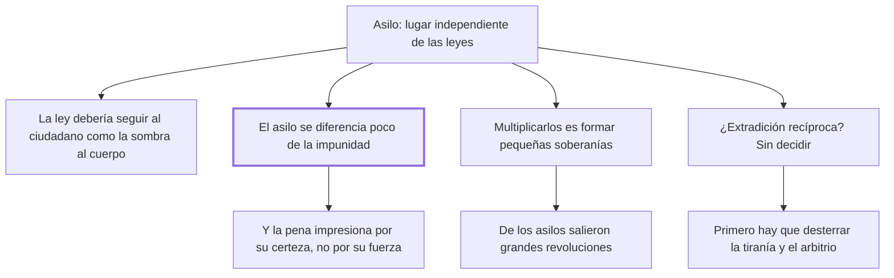

# 35. Asilos

## 1. Idea principal

Dentro de un país no debería haber ningún lugar independiente de las leyes: el asilo se parece demasiado a la impunidad, y multiplicarlos es formar pequeñas soberanías dentro del Estado.

Contesta si puede haber lugares donde la ley no entre. Es un capítulo breve, y en esta edición trae intercalada la retractación más famosa de Beccaria, que en realidad pertenece al capítulo anterior.

## 2. Lo esencial del capítulo

La tesis se enuncia con una imagen: el poder de las leyes debería seguir a todo ciudadano "como la sombra al cuerpo", y dentro de los confines de un país no debería haber lugar independiente de ellas (cap. 35). La razón por la que el asilo es peligroso conecta con el cap. 27: como la impresión de la pena consiste más en la seguridad de recibirla que en su fuerza, los asilos invitan más a los delitos de lo que las penas apartan de ellos. Es decir que el daño no es que unos pocos escapen, sino que la sola existencia del refugio quiebra la infalibilidad de la que depende todo el sistema.

El segundo argumento es político. Multiplicar los asilos es formar otras tantas pequeñas soberanías, porque donde no hay leyes que manden pueden formarse otras nuevas, opuestas a las comunes, y con ellas un espíritu contrario al del cuerpo entero de la sociedad. Beccaria apela a la historia: de los asilos salieron grandes revoluciones en los Estados y en las opiniones de los hombres.

La segunda cuestión —si conviene el pacto entre naciones para entregarse recíprocamente a los reos— la deja expresamente sin resolver, y las condiciones que pone para decidirla son lo interesante. No se atreve a pronunciarse hasta que las leyes más conformes a la humanidad, las penas más suaves y la extinción del arbitrio pongan a salvo "la inocencia oprimida y la virtud detestada", y hasta que la tiranía sea desterrada. La razón es clara aunque no la enuncie: mientras haya Estados que persiguen inocentes, la extradición universal sería un instrumento de esos Estados. Aun así admite que la persuasión de no encontrar un palmo de tierra que perdonase los verdaderos delitos sería un medio eficacísimo de evitarlos.

Conviene advertir un defecto de esta edición: en medio del capítulo, partiendo la palabra "multiplicar", aparece la nota al pie que pertenece al cap. 34. Es un texto importante y no debe leerse como parte del argumento sobre los asilos. Ahí Beccaria dice que el comercio y la propiedad no son el fin del pacto social sino un medio, y se retracta de haber escrito en ediciones anteriores que el fallido inocente debía servir como esclavo en las labores de sus acreedores: "me avergüenzo de haber escrito así". Y cierra con una observación sobre sus críticos, acusado de irreligión y de sedición sin merecerlo, mientras que por ofender los derechos de la humanidad nadie lo reprendió.

## 3. Mapa

## 4. Vocabulario clave

- **Asilo** — lugar dentro de un país donde el reo queda fuera del alcance de las leyes.
- **Pequeña soberanía** — en lo que se convierte cada asilo, al permitir que se formen allí normas opuestas a las comunes.
- **Entrega recíproca de reos** — el pacto de extradición entre naciones, que el capítulo deja sin resolver.

## 5. Distinciones que se confunden

- **Asilo vs. impunidad** — Beccaria dice que se diferencian en poco, porque los dos quiebran la certeza de la pena.
  - Se confunden porque: el asilo tiene forma jurídica y la impunidad parece un fracaso del sistema, no una institución.
  - Criterio para decidir: ¿cambia el cálculo del que va a delinquir? Si existe una salida segura, la amenaza se debilita igual.
  - Dónde se cae: se defiende el asilo como excepción humanitaria sin ver que su efecto no es sobre el refugiado sino sobre todos los demás.

- **Extradición útil vs. extradición peligrosa** — depende de si los Estados que la usan castigan delitos o persiguen inocentes.
  - Se confunden porque: en abstracto suena bien que ningún culpable encuentre refugio.
  - Criterio para decidir: ¿ese Estado tiene penas suaves y jueces sin arbitrio? Sin eso, entregarle a alguien es colaborar con la tiranía.
  - Dónde se cae: se acepta el principio general sin mirar a qué sistema se entrega a la persona, que es la reserva que Beccaria pone.

## 6. Autoevaluación

1. ¿Por qué el daño del asilo no consiste en que unos pocos escapen?
2. Beccaria dice que multiplicar los asilos es formar pequeñas soberanías. ¿Cómo ocurre eso?
3. Deja sin resolver la cuestión de la extradición. ¿Es una evasiva?
4. En la nota del cap. 34 se retracta de lo escrito en ediciones anteriores. ¿Qué muestra ese gesto?

--- No mires esto hasta responder ---

1. Porque la impresión de la pena consiste más en la seguridad de recibirla que en su fuerza. Un refugio disponible cambia el cálculo de todos los que todavía no delinquieron, no solo la suerte de los que ya están adentro: por eso los asilos invitan más a los delitos de lo que las penas apartan (cap. 35).
2. Porque donde no hay leyes que manden pueden formarse otras nuevas, opuestas a las comunes, y con ellas un espíritu contrario al del cuerpo entero de la sociedad. Un espacio sin ley no queda vacío: se llena con otro orden. Y agrega el dato histórico de que de los asilos salieron grandes revoluciones.
3. No: es una reserva razonada. Su condición es que primero existan leyes suaves y jueces sin arbitrio, porque entregar reos a un sistema tiránico convertiría el pacto en una herramienta de persecución. Y reconoce el argumento contrario —que no haber dónde esconderse evitaría delitos—, así que expone las dos caras en vez de esquivarlas.
4. Que corrigió su propia doctrina cuando vio que subordinaba el fin del pacto social a un medio: el comercio y la propiedad no son el fin, y exponer a los miembros a padecer por ellos es el paralogismo que denuncia. También muestra cómo leía a sus críticos: lo acusaron de irreligión y de sedición sin razón, y por el error que sí cometió nadie lo reprendió.

## Flashcards

Cómo debería seguir la ley a cada ciudadano según el cap. 35 | Como la sombra al cuerpo
En qué se diferencian poco el asilo y la impunidad | En que los dos quiebran la seguridad de recibir la pena
Por qué invitan los asilos a los delitos | Porque la impresión de la pena depende más de su certeza que de su fuerza
En qué se convierte cada asilo multiplicado | En una pequeña soberanía con leyes opuestas a las comunes
Qué dato histórico ofrece sobre los asilos | Que de ellos salieron grandes revoluciones en los estados y en las opiniones
Por qué no decide sobre la entrega recíproca de reos | Porque antes hacen falta penas suaves y jueces sin arbitrio que salven a la inocencia oprimida
Qué argumento reconoce a favor de la extradición | Que no encontrar un palmo de tierra que perdone los delitos sería medio eficacísimo de evitarlos
De qué se retracta Beccaria en la nota al cap. 34 | De haber escrito que el fallido inocente sirviera como esclavo de sus acreedores
