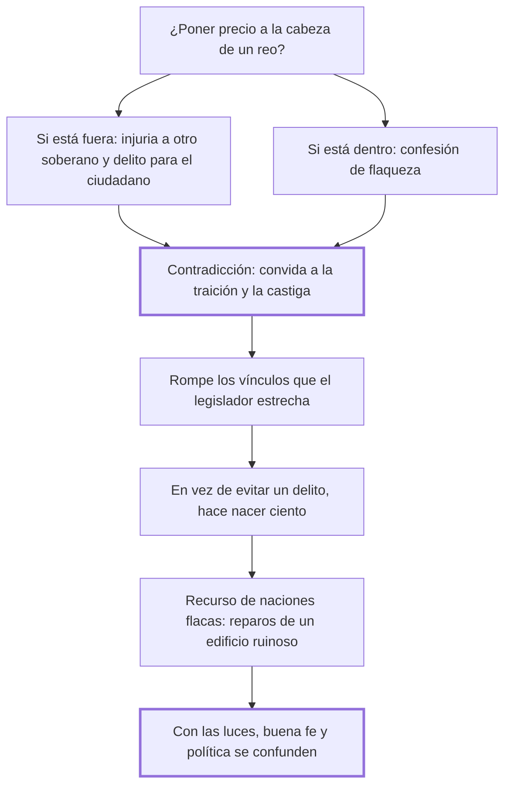

# 36. De la talla

## 1. Idea principal

Poner precio a la cabeza de un reo es delito si está fuera del país y confesión de debilidad si está dentro: las leyes convidan a la traición con una mano mientras la castigan con la otra.

Contesta si el Estado puede comprar la captura o la muerte de alguien. Es un capítulo corto y el más nítido sobre la coherencia que el legislador se debe a sí mismo.

## 2. Lo esencial del capítulo

Beccaria plantea la cuestión como un dilema sin salida: el reo está fuera de los confines o dentro (cap. 36). Si está **fuera**, el soberano estimula a sus ciudadanos a cometer un delito y los expone a un suplicio, hace una injuria y una usurpación de autoridad en dominios ajenos, y autoriza a las otras naciones a hacer lo mismo con él. Si está **dentro**, la talla muestra su propia flaqueza: "quien tiene fuerza para defenderse no la busca". El argumento de fondo, sin embargo, es el de la contradicción moral: el edicto de talla desconcierta todas las ideas de moral y de virtud, "que se disipan en el ánimo de los hombres con cualquiera pequeño viento". Las contradicciones van en pares —las leyes convidan a la traición y la castigan; el legislador estrecha con una mano los vínculos de familia y amistad y con la otra premia a quien los rompe—, y el balance práctico es que en vez de evitar un delito hace nacer ciento.

Estos son los recursos de las naciones flacas, cuyas leyes no son más que "reparos instantáneos de un edificio ruinoso que amenaza por todas partes": la talla es un síntoma, la confesión de que el Estado no puede hacer cumplir sus leyes por los medios ordinarios. El cierre generaliza en una tesis sobre el progreso (cap. 36). A medida que crecen las luces en una nación se hacen más necesarias la buena fe y la confianza recíproca, que van confundiéndose con la verdadera política, porque los artificios y las vías oscuras suelen ser previstos y "la sensibilidad de todos se defiende mejor contra el interés de cada particular". Contra esa convergencia entre moral y política —a la que los hombres deberían su felicidad y las naciones su paz— se oponen justamente las leyes que premian la traición y excitan una guerra clandestina esparciendo la sospecha entre ciudadanos.

## 3. Mapa

## 4. Vocabulario clave

- **Talla** — el precio ofrecido públicamente por la cabeza de un hombre declarado reo.
- **Usurpación de autoridad** — lo que comete el soberano que persigue a alguien en dominios ajenos.
- **Guerra clandestina** — el estado de sospecha recíproca que producen las leyes que premian la traición.

## 5. Distinciones que se confunden

- **Premiar la delación vs. castigar la traición** — la talla hace las dos cosas y así vacía las dos.
  - Se confunden porque: en cada caso concreto parece claro quién traiciona a quién.
  - Criterio para decidir: ¿el mismo acto es premiado en un supuesto y penado en otro? Entonces la ley no está enseñando nada estable.
  - Dónde se cae: se justifica la recompensa por su eficacia puntual, sin contar el efecto sobre la moral común que la ley misma sostiene.

- **Eficacia de una medida vs. lo que revela del Estado** — la talla puede capturar a alguien y a la vez mostrar que el Estado no puede.
  - Se confunden porque: si funciona, parece justificada.
  - Criterio para decidir: ¿por qué hizo falta? Quien tiene fuerza para defenderse no la busca.
  - Dónde se cae: se adoptan recursos extraordinarios como si fueran política, cuando son reparos instantáneos de un edificio ruinoso.

## 6. Autoevaluación

1. ¿Qué se entiende por la talla? Explique sus implicaciones para el soberano que la dicta.
2. El capítulo objeta la talla por sus efectos morales más que por su injusticia. ¿Es una debilidad del argumento?

--- No mires esto hasta responder ---

1. La talla es el precio que el soberano ofrece públicamente a quien entregue, vivo o muerto, a un hombre declarado reo, y Beccaria la rechaza con un dilema que no deja salida: el reo está fuera de los confines o dentro (cap. 36). Si está fuera, el soberano estimula a sus ciudadanos a cometer un delito, los expone a un suplicio y comete una usurpación de autoridad en dominios ajenos, con lo que autoriza a las demás naciones a hacer lo mismo con él; si está dentro, la talla no prueba fuerza sino flaqueza, porque quien tiene fuerza para defenderse no la busca. La implicación más grave es moral: la ley convida a la traición con una mano y la castiga con la otra, estrecha los vínculos de familia y amistad y a la vez premia a quien los rompe, de modo que en vez de evitar un delito hace nacer ciento. Por eso Beccaria la trata como recurso de naciones flacas, cuyas leyes son "reparos instantáneos de un edificio ruinoso".
2. No, porque en este libro el efecto moral es un efecto real: las máximas morales son, según el cap. 33, obra de siglos y de sangre, y una ley que las contradice destruye un capital público. Aun así el capítulo es más débil donde deja implícito el argumento de justicia —que la talla castiga sin juicio— y lo reemplaza por el de eficacia. Es discutible: quien sostenga que la justicia de la pena es previa a sus efectos dirá que Beccaria eligió el argumento más frágil.

## Flashcards

Qué es la talla en el cap. 36 | El precio ofrecido a quien entregue la cabeza de un hombre declarado reo
Qué objeta Beccaria a la talla según el reo esté fuera o dentro del país | Fuera, el soberano usurpa autoridad ajena y expone a sus ciudadanos a un suplicio; dentro, confiesa su propia flaqueza
Qué contradicción señala Beccaria en el edicto de talla | Que las leyes convidan a la traición y a la vez la castigan, y hacen nacer ciento delitos en vez de evitar uno
