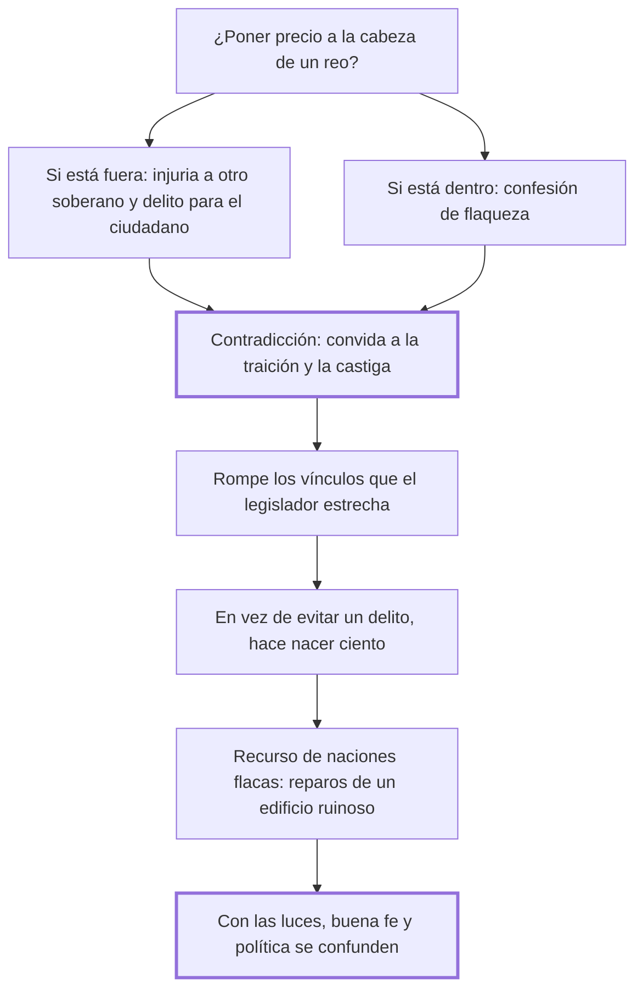

# 36. De la talla

## 1. Idea principal

Poner precio a la cabeza de un reo es delito si está fuera del país y confesión de debilidad si está dentro: las leyes convidan a la traición con una mano mientras la castigan con la otra.

Contesta si el Estado puede comprar la captura o la muerte de alguien. Es un capítulo corto y el más nítido sobre la coherencia que el legislador se debe a sí mismo.

## 2. Lo esencial del capítulo

Beccaria plantea la cuestión como un dilema sin salida: el reo está fuera de los confines o dentro (cap. 36). Si está **fuera**, el soberano estimula a sus ciudadanos a cometer un delito y los expone a un suplicio, hace una injuria y una usurpación de autoridad en dominios ajenos, y autoriza a las otras naciones a hacer lo mismo con él. Si está **dentro**, la talla muestra su propia flaqueza: "quien tiene fuerza para defenderse no la busca". En ninguno de los dos casos el recurso queda en pie.

El argumento de fondo, sin embargo, no es ese sino el de la contradicción moral, y es lo que da su valor al capítulo. El edicto de talla desconcierta todas las ideas de moral y de virtud, "que se disipan en el ánimo de los hombres con cualquiera pequeño viento". Beccaria enumera las contradicciones en pares: ahora las leyes convidan a la traición, ahora la castigan; con una mano el legislador estrecha los vínculos de familia, parentela y amistad, y con la otra premia a quien los rompe y los desprecia; ya convida a la confianza, ya esparce la desconfianza en todos los corazones. La conclusión es el balance práctico: en vez de evitar un delito, hace nacer ciento.

De ahí el diagnóstico político. Estos son los recursos de las naciones flacas, cuyas leyes no son más que "reparos instantáneos de un edificio ruinoso que amenaza por todas partes". Notar que Beccaria trata la talla como un síntoma: no la discute como técnica sino como confesión de que el Estado no puede hacer cumplir sus leyes por los medios ordinarios.

El cierre generaliza en una tesis sobre el progreso. A medida que crecen las luces en una nación se hacen más necesarias la buena fe y la confianza recíproca, que van confundiéndose con la verdadera política; los artificios, las astucias y las vías oscuras suelen ser previstos, y "la sensibilidad de todos se defiende mejor contra el interés de cada particular". Incluso los siglos de ignorancia, en los que la moral pública forzaba a los hombres a obedecer a la privada, sirven de instrucción a los siglos iluminados. Contra esa convergencia entre moral y política —a la que los hombres deberían su felicidad y las naciones su paz— se oponen justamente las leyes que premian la traición y excitan una guerra clandestina esparciendo la sospecha entre ciudadanos.

## 3. Mapa

## 4. Vocabulario clave

- **Talla** — el precio ofrecido públicamente por la cabeza de un hombre declarado reo.
- **Usurpación de autoridad** — lo que comete el soberano que persigue a alguien en dominios ajenos.
- **Guerra clandestina** — el estado de sospecha recíproca que producen las leyes que premian la traición.

## 5. Distinciones que se confunden

- **Premiar la delación vs. castigar la traición** — la talla hace las dos cosas y así vacía las dos.
  - Se confunden porque: en cada caso concreto parece claro quién traiciona a quién.
  - Criterio para decidir: ¿el mismo acto es premiado en un supuesto y penado en otro? Entonces la ley no está enseñando nada estable.
  - Dónde se cae: se justifica la recompensa por su eficacia puntual, sin contar el efecto sobre la moral común que la ley misma sostiene.

- **Eficacia de una medida vs. lo que revela del Estado** — la talla puede capturar a alguien y a la vez mostrar que el Estado no puede.
  - Se confunden porque: si funciona, parece justificada.
  - Criterio para decidir: ¿por qué hizo falta? Quien tiene fuerza para defenderse no la busca.
  - Dónde se cae: se adoptan recursos extraordinarios como si fueran política, cuando son reparos instantáneos de un edificio ruinoso.

## 6. Autoevaluación

1. ¿Por qué la talla contra un reo que está fuera del país es un problema entre naciones y no solo interno?
2. Beccaria dice que la talla "en vez de evitar un delito, hace nacer ciento". ¿Cómo llega a esa cuenta?
3. ¿Qué quiere decir que la buena fe se confunde con la verdadera política a medida que crecen las luces?
4. El capítulo objeta la talla por sus efectos morales más que por su injusticia. ¿Es una debilidad del argumento?

--- No mires esto hasta responder ---

1. Porque el soberano estaría ejerciendo autoridad en dominios de otro, lo que es una usurpación, y además autoriza a las demás naciones a hacer lo mismo con él. La regla que rompe es la del cap. 29: el lugar de la pena es el lugar del delito (cap. 36).
2. Contando los delitos que la medida induce, no los que castiga. Empuja a los ciudadanos a matar o entregar, con lo que los expone a un suplicio; rompe los vínculos de familia y amistad que la ley protege; y siembra desconfianza general. Cada uno de esos efectos genera conductas que la propia ley reprueba.
3. Que en una sociedad ilustrada el engaño deja de rendir: los artificios y las vías oscuras suelen preverse, y la sensibilidad de todos se defiende mejor contra el interés de cada particular. Entonces la buena fe no es solo una virtud privada sino la técnica de gobierno que funciona, y la moral y la política dejan de ir por caminos distintos.
4. No, porque en este libro el efecto moral es un efecto real y medible: las máximas morales son, según el cap. 33, obra de siglos y de sangre, y una ley que las contradice destruye un capital público. Aun así el capítulo es más débil donde deja implícito el argumento de justicia —que la talla castiga sin juicio— y lo reemplaza por el de eficacia.

## Flashcards

Qué es la talla en el cap. 36 | El precio ofrecido a quien entregue la cabeza de un hombre declarado reo
Qué problema tiene la talla si el reo está fuera del país | El soberano usurpa autoridad ajena y expone a sus ciudadanos a un suplicio
Qué muestra la talla si el reo está dentro | La flaqueza propia: quien tiene fuerza para defenderse no la busca
Qué contradicción señala Beccaria en el edicto de talla | Que las leyes convidan a la traición y a la vez la castigan
Qué hace el legislador con una mano y con la otra | Estrecha los vínculos de familia y amistad, y premia a quien los rompe
Cuál es el balance práctico de la talla | Que en vez de evitar un delito hace nacer ciento
De qué naciones es propio este recurso | De las flacas, cuyas leyes son reparos instantáneos de un edificio ruinoso
Qué se vuelve más necesario a medida que crecen las luces en una nación | La buena fe y la confianza recíproca
