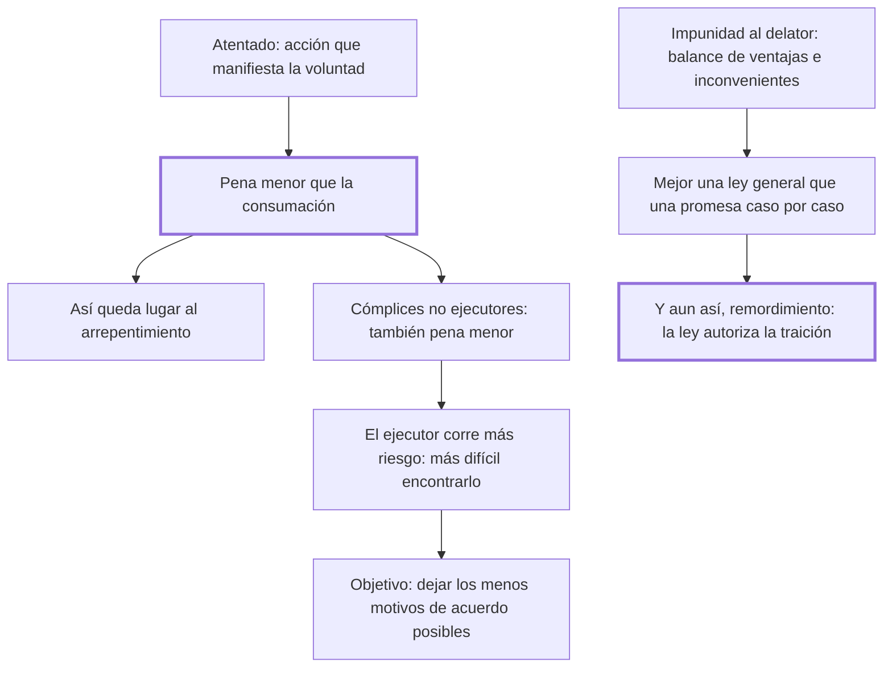

# 37. Atentados, cómplices, impunidad

## 1. Idea principal

El atentado y la complicidad deben castigarse menos que el delito consumado, porque así queda lugar al arrepentimiento y se dificulta el acuerdo entre quienes van a delinquir juntos.

Contesta cómo graduar la pena de quien no llegó a consumar o no ejecutó con sus manos. Y termina en la única página del libro donde Beccaria confiesa que su propia propuesta le produce remordimiento.

## 2. Lo esencial del capítulo

Aunque las leyes no castiguen la intención, el delito que empieza por una acción que manifiesta la voluntad de cometerlo merece castigo, pero **siempre menor que la consumación** (cap. 37): la importancia de estorbar un atentado autoriza la pena, y como entre el atentado y la ejecución puede haber un intervalo, reservar la pena mayor al delito consumado deja lugar al arrepentimiento. Lo mismo vale para los cómplices que no son ejecutores inmediatos, y ahí el argumento es de teoría del acuerdo: quienes se unen para una acción arriesgada procuran repartirse el riesgo por igual, así que si el ejecutor corre más peligro será más difícil encontrar quien acepte ese papel, salvo que se le señale un premio que compense la desigualdad. A la objeción de que esto suena metafísico responde con la utilidad: conviene que las leyes dejen **los menos motivos de acuerdo posibles** entre quienes intentan asociarse para delinquir.

La segunda parte examina en forma de balance la impunidad ofrecida al cómplice que delata (cap. 37). En contra: la nación autoriza la traición, detestable aun entre los malvados —los delitos de valor son menos fatales que los de vileza, porque el valor es raro y bien dirigido puede servir al bien público, mientras que la vileza es común y contagiosa—, y el tribunal muestra la flaqueza de la ley "que implora el socorro de quien la ofende". A favor: evita delitos importantes y tranquiliza al pueblo cuando los efectos son manifiestos y los autores ocultos. Su propuesta es una **ley general** que prometa esa impunidad, preferible a la declaración caso por caso porque evita las asociaciones —cada cómplice temería ser revelado por otro— y no envalentona a los malhechores; la acompañaría con el destierro del delator.

El final es lo más notable: "en vano me atormento para destruir el remordimiento que siento", escribe, por autorizar con las leyes sacrosantas la traición y el disimulo (cap. 37). Reprocha además la práctica contraria, faltar a la impunidad prometida y arrastrar al suplicio, "por medio de doctas cavilaciones", a quien correspondió al convite de las leyes, y cierra describiendo a los gobernantes que ven la nación como una máquina y excitan las pasiones "acordando los ánimos como los músicos los instrumentos".

## 3. Mapa

## 4. Vocabulario clave

- **Atentado** — el delito comenzado por una acción que manifiesta la voluntad, sin llegar a consumarse.
- **Ejecutor inmediato** — el cómplice que realiza materialmente el hecho, y que corre el mayor riesgo.
- **Impunidad al delator** — la exención de pena ofrecida al cómplice que descubre a los demás.
- **Delitos de valor y de vileza** — los primeros, menos fatales por raros; los segundos, comunes y contagiosos.

## 5. Distinciones que se confunden

- **No castigar la intención vs. castigar el atentado** — lo segundo requiere una acción que la manifieste.
  - Se confunden porque: el atentado se castiga por lo que revela del propósito, y parece que se pena la voluntad.
  - Criterio para decidir: ¿hubo un acto exterior que empezó el delito? Sin él no hay nada que la ley alcance.
  - Dónde se cae: se pena el plan o la declaración, cuando la intención es parte del hombre adonde no llega el imperio de las leyes.

- **Ley general de impunidad vs. promesa caso por caso** — la primera desarma las asociaciones; la segunda envalentona a los malhechores.
  - Se confunden porque: en el caso concreto las dos producen el mismo resultado, un cómplice que habla.
  - Criterio para decidir: ¿el incentivo existe antes del delito o se negocia después? Solo el primero previene la asociación.
  - Dónde se cae: se ofrece impunidad puntual para resolver una causa, mostrando así que la ley necesita el socorro de quien la ofende.

## 6. Autoevaluación

1. ¿Qué se entiende por atentado y por complicidad no ejecutora? Explique por qué deben castigarse con pena menor que el delito consumado y cuáles son las implicaciones de esa graduación.
2. Propone la impunidad al delator y a la vez confiesa remordimiento. ¿Debilita eso su propuesta?

--- No mires esto hasta responder ---

1. El atentado es el delito comenzado por una acción exterior que manifiesta la voluntad de cometerlo, y el cómplice no ejecutor es quien concurre al delito sin realizarlo materialmente; los dos merecen pena, pero siempre menor que la consumación (cap. 37). En el atentado la razón es el arrepentimiento: entre el comienzo y la ejecución hay un intervalo, y si la pena mayor queda reservada al delito consumado, quien ya empezó todavía tiene algo que ganar deteniéndose. En la complicidad la razón es el acuerdo: quienes se asocian para una acción arriesgada procuran repartir el riesgo por igual, de modo que cargar más al ejecutor hace difícil encontrar quien acepte ese papel y traba la asociación antes de formarse. La implicación es que la graduación no es indulgencia con el que fracasó sino diseño de incentivos, y su regla general es que las leyes dejen los menos motivos de acuerdo posibles entre quienes van a delinquir juntos.
2. No la debilita como razonamiento, y la vuelve más honesta: expone las ventajas, los inconvenientes y el precio moral, en vez de presentar la solución como limpia. Lo que sí queda sin resolver es la tensión entre autorizar la traición y sostener, como hace en el cap. 36, que la buena fe es la base de la política. Es discutible que la ley general la resuelva: cambia el momento en que opera el incentivo, no la naturaleza de lo que premia.

## Flashcards

Qué es el atentado y cómo debe castigarse | El delito comenzado por una acción que manifiesta la voluntad; con pena siempre menor que la consumación
Qué se gana reservando la pena mayor para la consumación | Que el intervalo entre el atentado y la ejecución deje lugar al arrepentimiento
Qué objetivo persigue Beccaria al graduar las penas de los cómplices | Dejar los menos motivos de acuerdo posibles entre quienes van a delinquir
