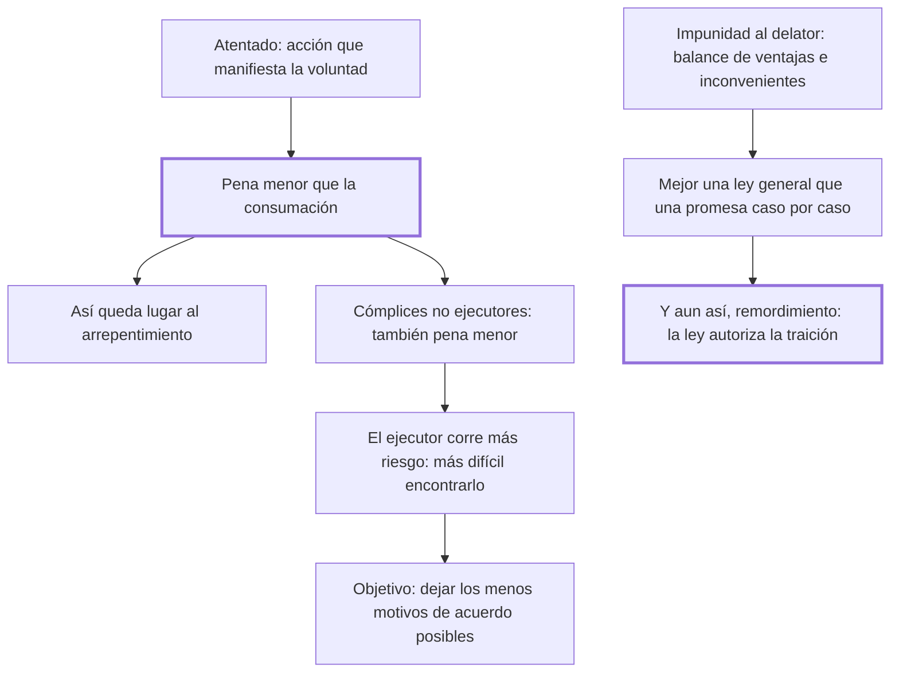

# 37. Atentados, cómplices, impunidad

## 1. Idea principal

El atentado y la complicidad deben castigarse menos que el delito consumado, porque así queda lugar al arrepentimiento y se dificulta el acuerdo entre quienes van a delinquir juntos.

Contesta cómo graduar la pena de quien no llegó a consumar o no ejecutó con sus manos. Y termina en la única página del libro donde Beccaria confiesa que su propia propuesta le produce remordimiento.

## 2. Lo esencial del capítulo

Aunque las leyes no castiguen la intención, el delito que empieza por una acción que manifiesta la voluntad de cometerlo merece castigo, pero **siempre menor que la consumación** (cap. 37). La razón es doble: la importancia de estorbar un atentado autoriza la pena, y como entre el atentado y la ejecución puede haber un intervalo, reservar la pena mayor para el delito consumado deja lugar al arrepentimiento. Notar que la graduación no premia al que fracasó: crea un incentivo activo para detenerse.

Lo mismo vale para los cómplices que no son ejecutores inmediatos, y aquí el argumento es de teoría del acuerdo. Cuando varios hombres se unen para una acción arriesgada procuran repartirse el riesgo por igual, así que si el ejecutor corre más peligro que los demás será más difícil encontrar quien acepte ese papel. La única excepción sería que al ejecutor se le señalara un premio, porque entonces la mayor recompensa compensa el mayor riesgo y la pena debería ajustarse. Beccaria anticipa la objeción de que esto suena metafísico y responde con la utilidad: conviene que las leyes dejen **los menos motivos de acuerdo posibles** entre quienes intentan asociarse para delinquir.

La segunda parte examina la impunidad ofrecida al cómplice que delata, en forma de balance. Los inconvenientes: la nación autoriza la traición, detestable aun entre los malvados —los delitos de valor son menos fatales que los de vileza, porque el valor no es frecuente y bien dirigido puede servir al bien público, mientras que la vileza es común y contagiosa—; y el tribunal muestra la flaqueza de la ley "que implora el socorro de quien la ofende". Las ventajas: evita delitos importantes, tranquiliza al pueblo cuando los efectos son manifiestos y los autores ocultos, y hace ver que quien falta a la fe con el público probablemente falte también con un particular.

Su propuesta es que una **ley general** que prometa impunidad al cómplice delator es preferible a una declaración caso por caso, por dos motivos: evita las asociaciones, ya que cada cómplice temería ser revelado por otro, y el tribunal no envalentona a los malhechores mostrándose necesitado de su socorro. Añade que debería acompañarla con el destierro del delator.

Pero el final es lo más notable: "en vano me atormento para destruir el remordimiento que siento", dice, por autorizar con las leyes sacrosantas la traición y el disimulo. Y reprocha la práctica contraria: qué ejemplo sería faltar a la impunidad prometida y arrastrar al suplicio, "por medio de doctas cavilaciones", a quien correspondió al convite de las leyes. Cierra describiendo a los gobernantes que ven la nación como una máquina y excitan las pasiones "acordando los ánimos como los músicos los instrumentos".

## 3. Mapa

## 4. Qué releer del original

1. (cap. 37) El párrafo sobre el reparto del riesgo entre cómplices — es un razonamiento de incentivos poco habitual en el libro y conviene seguirlo entero.
2. (cap. 37) El balance de ventajas e inconvenientes de la impunidad al delator — están enumerados en orden y cada uno vale por separado.
3. (cap. 37) "en vano me atormento para destruir el remordimiento que siento" — es el único lugar donde Beccaria admite que su propia solución lo incomoda.

## 5. Vocabulario clave

- **Atentado** — el delito comenzado por una acción que manifiesta la voluntad, sin llegar a consumarse.
- **Ejecutor inmediato** — el cómplice que realiza materialmente el hecho, y que corre el mayor riesgo.
- **Impunidad al delator** — la exención de pena ofrecida al cómplice que descubre a los demás.
- **Delitos de valor y de vileza** — los primeros, menos fatales por raros; los segundos, comunes y contagiosos.

## 6. Distinciones que se confunden

- **No castigar la intención vs. castigar el atentado** — lo segundo requiere una acción que la manifieste.
  - Se confunden porque: el atentado se castiga por lo que revela del propósito, y parece que se pena la voluntad.
  - Criterio para decidir: ¿hubo un acto exterior que empezó el delito? Sin él no hay nada que la ley alcance.
  - Dónde se cae: se pena el plan o la declaración, cuando la intención es parte del hombre adonde no llega el imperio de las leyes.

- **Ley general de impunidad vs. promesa caso por caso** — la primera desarma las asociaciones; la segunda envalentona a los malhechores.
  - Se confunden porque: en el caso concreto las dos producen el mismo resultado, un cómplice que habla.
  - Criterio para decidir: ¿el incentivo existe antes del delito o se negocia después? Solo el primero previene la asociación.
  - Dónde se cae: se ofrece impunidad puntual para resolver una causa, mostrando así que la ley necesita el socorro de quien la ofende.

## 7. Autoevaluación

1. ¿Por qué castigar menos el atentado no es indulgencia sino cálculo?
2. Beccaria quiere que el ejecutor arriesgue más que los demás cómplices. ¿Qué busca con esa desigualdad?
3. Sostiene que los delitos de valor son menos fatales que los de vileza. ¿Es una preferencia moral?
4. Propone la impunidad al delator y a la vez confiesa remordimiento. ¿Debilita eso su propuesta?

--- No mires esto hasta responder ---

1. Porque el intervalo entre el atentado y la consumación es una oportunidad: si la pena mayor está reservada al delito consumado, quien ya empezó todavía tiene algo que ganar deteniéndose. Igualar las penas eliminaría ese margen y volvería indiferente seguir adelante (cap. 37).
2. Hacer difícil el acuerdo. Quienes se asocian para una acción arriesgada procuran repartir el riesgo por igual; si la ley carga más al ejecutor, nadie querrá serlo y la asociación se traba antes de formarse. Es prevención por diseño de incentivos, no por amenaza.
3. Es un juicio de utilidad social, no de simpatía. El valor es raro, y bien dirigido puede conspirar al bien público; la vileza es común, contagiosa y se reconcentra en sí misma. Esa asimetría es la que hace peligroso que el Estado premie la traición: multiplica lo que más se propaga.
4. No la debilita como razonamiento, y la vuelve más honesta: expone las ventajas, los inconvenientes y el precio moral, en vez de presentar la solución como limpia. Lo que sí queda sin resolver es la tensión entre autorizar la traición y sostener que la buena fe es la base de la política, que es justo lo que dirá el cap. 36.

## Flashcards

Cómo debe castigarse el atentado respecto del delito consumado | Siempre con pena menor
Qué se gana reservando la pena mayor para la consumación | Que el intervalo deje lugar al arrepentimiento
Por qué conviene que el ejecutor arriesgue más que los otros cómplices | Porque así será más difícil encontrar quien acepte ese papel
Cuándo debería ajustarse esa desigualdad de penas | Cuando al ejecutor se le señala un premio que compensa el mayor riesgo
Qué objetivo persigue Beccaria al graduar las penas de los cómplices | Dejar los menos motivos de acuerdo posibles entre quienes van a delinquir
Cuál es el principal inconveniente de la impunidad al delator | Que la nación autoriza la traición y la ley muestra su flaqueza
Por qué prefiere una ley general de impunidad | Porque evita las asociaciones y no envalentona a los malhechores
Qué siente Beccaria al proponer esa ley | Remordimiento por autorizar con las leyes la traición y el disimulo
