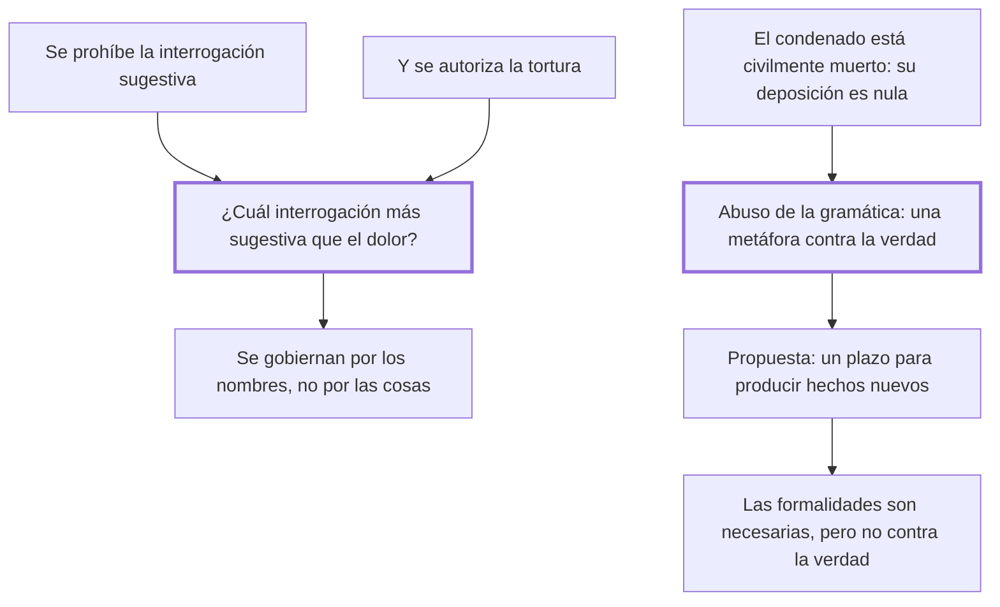

# 38. Interrogaciones sugestivas y deposiciones

## 1. Idea principal

Las leyes prohíben la pregunta sugestiva y a la vez autorizan la tortura, cuando "¿cuál interrogación más sugestiva que el dolor?"; y niegan valor a la declaración del condenado por una metáfora, la muerte civil.

Contesta cómo se interroga y a quién se escucha. Es el capítulo donde Beccaria caza dos contradicciones del procedimiento usando solo la coherencia interna de sus reglas.

## 2. Lo esencial del capítulo

Las leyes reprueban las **interrogaciones sugestivas**, que según los doctores son las que preguntan de la especie debiendo preguntar del género y así sugieren al reo la respuesta; los criminalistas exigen que las preguntas "abracen y rodeen el hecho espiralmente" y nunca vayan a él en línea recta (cap. 38). Los motivos que dan son dos: no sugerir una respuesta que libre al reo de la acusación, o que parece contra la naturaleza que se acuse a sí mismo. Beccaria verifica los dos en el tormento y muestra que la regla es incompatible con él: el dolor sugiere al robusto una obstinada taciturnidad y al flaco la confesión; y si una pregunta especial puede hacer que alguien se acuse contra su naturaleza, mucho más lo consiguen los dolores. Que nadie lo advierta se explica porque "los hombres se gobiernan más por la diferencia de los nombres que por la que resulta de las cosas".

La segunda contradicción es la nulidad de la declaración del reo ya condenado, a quien los jurisconsultos tienen por **civilmente muerto**, y un muerto no es capaz de acción alguna (cap. 38). Beccaria lo trata como "abuso de la gramática": por sostener esa vana metáfora se sacrificaron muchas víctimas y se discutió si la verdad debe ceder a las fórmulas judiciales. Propone que, mientras no retarden el curso de la justicia, se le conceda al condenado —aun después de la sentencia— un espacio para producir hechos nuevos. De ahí sale una posición sobre las formalidades que no es la que suele atribuírsele: son necesarias por tres razones —no dejan nada al arbitrio de quien administra justicia, dan al pueblo la idea de un juicio estable y no tumultuario, y sobre hombres esclavos de la costumbre las sensaciones impresionan más que los raciocinios—, pero nunca pueden fijarse de modo que dañen a la verdad.

El cierre trata al reo que se obstina en no responder: merece una pena determinada por las leyes, y de las más graves, para que no se burle la necesidad de ejemplo que se debe al público (cap. 38). La excepción es amplia y conviene retenerla, porque Beccaria advierte que es el caso más ordinario: esa pena no hace falta cuando consta con certeza que cometió el delito y las preguntas resultan inútiles, igual que es inútil la confesión cuando otras pruebas ya acreditan la criminalidad.

## 3. Mapa

## 4. Vocabulario clave

- **Interrogación sugestiva** — la que por su conexión inmediata con el hecho sugiere al reo la respuesta.
- **Muerte civil** — la ficción por la cual el condenado pierde capacidad jurídica y su declaración se tiene por nula.
- **Formalidad judicial** — la regla de forma que limita el arbitrio y da al pueblo la imagen de un juicio estable.

## 5. Distinciones que se confunden

- **Formalidad útil vs. formalidad que daña la verdad** — la primera limita el arbitrio; la segunda impide corregir un error.
  - Se confunden porque: las dos se defienden con el mismo argumento de solemnidad y seguridad jurídica.
  - Criterio para decidir: ¿la regla impide que un hecho verdadero entre al proceso? Entonces la verdad está cediendo a la fórmula.
  - Dónde se cae: se descarta una declaración por la condición del que la hace, sin examinar si aporta hechos nuevos.

- **Reo que calla vs. reo cuya culpa ya consta** — el primero merece pena por burlar el ejemplo debido al público; el segundo no.
  - Se confunden porque: en los dos casos el acusado niega o se obstina, y la conducta externa es igual.
  - Criterio para decidir: ¿las preguntas todavía sirven para algo? Si otras pruebas ya acreditan el hecho, la respuesta es inútil.
  - Dónde se cae: se castiga el silencio como si siempre entorpeciera, cuando Beccaria señala que negar es lo más ordinario.

## 6. Autoevaluación

1. ¿Qué se entiende por interrogación sugestiva? Explique por qué su prohibición es incompatible con la tortura.
2. Propone escuchar al condenado después de la sentencia. ¿Qué riesgo tiene esa apertura y cómo lo acota?

--- No mires esto hasta responder ---

1. La interrogación sugestiva es, según los doctores que Beccaria cita, la que pregunta de la especie debiendo preguntar del género, es decir la que por su conexión inmediata con el hecho le sugiere al reo la respuesta; por eso los criminalistas exigen que las preguntas rodeen el hecho espiralmente y nunca vayan a él en línea recta (cap. 38). La prohibición se funda en dos motivos: evitar que se sugiera una respuesta que libre al reo de la acusación, y que parece contra la naturaleza que un hombre se acuse a sí mismo. La incompatibilidad con la tortura se demuestra verificando esos dos motivos en el tormento: el dolor sugiere al robusto la taciturnidad y al flaco la confesión, y si una pregunta especial puede arrancar una autoacusación, mucho más lo consiguen los dolores. De ahí la frase que resume el capítulo, "¿cuál interrogación más sugestiva que el dolor?", y el diagnóstico de por qué la contradicción pasa inadvertida: los hombres se gobiernan más por la diferencia de los nombres que por la de las cosas.
2. El que él mismo anticipa: retardar indefinidamente el curso de la justicia, con lo que se perdería la prontitud de la pena del cap. 19. Lo acota con dos condiciones: que las declaraciones no lleguen a ese punto y que produzcan hechos nuevos, no una simple insistencia. Es discutible dónde queda el límite, porque quien decide si un hecho es nuevo es el mismo tribunal que ya condenó.

## Flashcards

Qué es una interrogación sugestiva según los doctores | La que pregunta de la especie debiendo preguntar del género y sugiere la respuesta
Con qué frase muestra Beccaria la contradicción con la tortura | Preguntando cuál interrogación es más sugestiva que el dolor
Con qué argumento se anula la deposición de un reo condenado | Con la metáfora de la muerte civil: un muerto no es capaz de acción alguna
