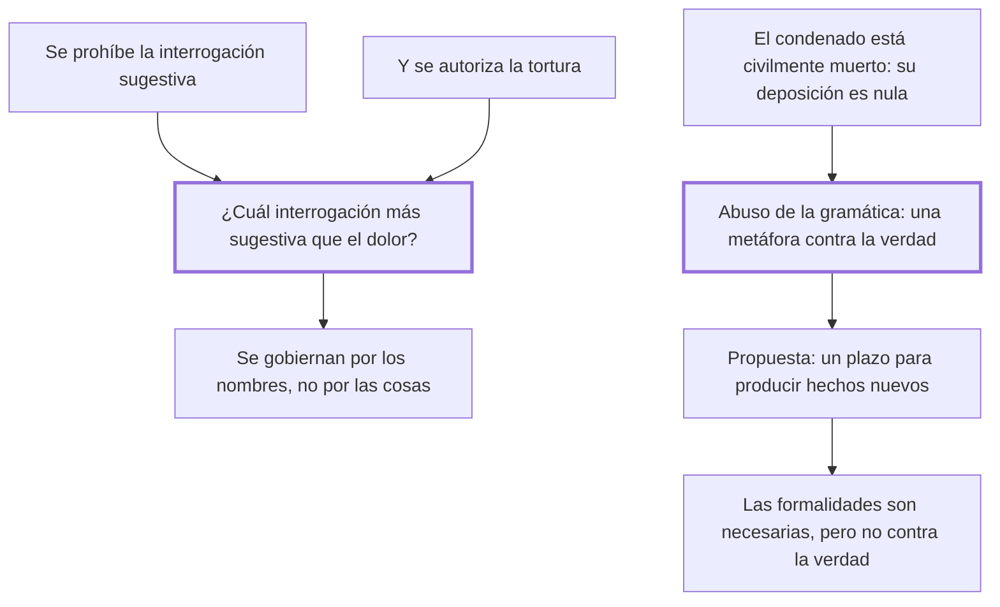

# 38. Interrogaciones sugestivas y deposiciones

## 1. Idea principal

Las leyes prohíben la pregunta sugestiva y a la vez autorizan la tortura, cuando "¿cuál interrogación más sugestiva que el dolor?"; y niegan valor a la declaración del condenado por una metáfora, la muerte civil.

Contesta cómo se interroga y a quién se escucha. Es el capítulo donde Beccaria caza dos contradicciones del procedimiento usando solo la coherencia interna de sus reglas.

## 2. Lo esencial del capítulo

Las leyes reprueban las **interrogaciones sugestivas**, que según los doctores son las que preguntan de la especie debiendo preguntar del género, es decir las que por su conexión con el delito sugieren al reo la respuesta. Los criminalistas exigen que las preguntas "abracen y rodeen el hecho espiralmente" y nunca vayan a él en línea recta (cap. 38). Los motivos son dos: no sugerir una respuesta que libre al reo de la acusación, o que parece contra la naturaleza que se acuse a sí mismo.

Sea cual sea el motivo, Beccaria muestra que la regla es incompatible con la tortura, verificando los dos por separado. El primero se cumple en el tormento: el dolor sugiere al robusto una obstinada taciturnidad, y al flaco la confesión, para librarse de un dolor presente más eficaz que el venidero. El segundo también: si una pregunta especial puede hacer que alguien se acuse contra el derecho de la naturaleza, mucho más lo consiguen los dolores. La conclusión es su diagnóstico sobre por qué nadie lo ve: "los hombres se gobiernan más por la diferencia de los nombres que por la que resulta de las cosas".

La segunda contradicción es la nulidad de la declaración del reo ya condenado. Los jurisconsultos dicen que está **civilmente muerto** y que un muerto no es capaz de acción alguna. Beccaria lo trata como "abuso de la gramática": para sostener esa vana metáfora se sacrificaron muchas víctimas y se discutió si la verdad debe ceder a las fórmulas judiciales. Su propuesta: si las declaraciones del condenado no retardan el curso de la justicia, debería concedérsele —aun después de la sentencia— un espacio para producir hechos nuevos.

De ahí sale una posición matizada sobre las formalidades, que no es la que suele atribuírsele. Son **necesarias** por tres razones: no dejan nada al arbitrio de quien administra justicia, dan al pueblo la idea de un juicio estable y no tumultuario, y sobre hombres esclavos de la costumbre las sensaciones impresionan más que los raciocinios. Pero nunca pueden fijarse de modo que dañen a la verdad, que necesita de alguna pompa externa para conciliarse al pueblo ignorante.

El cierre trata al reo que se obstina en no responder: merece una pena determinada por las leyes, y de las más graves, para que los hombres no burlen la necesidad de ejemplo que deben al público. Pero la excepción es amplia: no hace falta cuando consta con certeza que cometió el delito, de modo que las preguntas sean inútiles, igual que es inútil la confesión cuando otras pruebas acreditan la criminalidad. Y advierte que ese es el caso más ordinario, porque en la mayor parte de los procesos los reos niegan.

## 3. Mapa

## 4. Vocabulario clave

- **Interrogación sugestiva** — la que por su conexión inmediata con el hecho sugiere al reo la respuesta.
- **Muerte civil** — la ficción por la cual el condenado pierde capacidad jurídica y su declaración se tiene por nula.
- **Formalidad judicial** — la regla de forma que limita el arbitrio y da al pueblo la imagen de un juicio estable.

## 5. Distinciones que se confunden

- **Formalidad útil vs. formalidad que daña la verdad** — la primera limita el arbitrio; la segunda impide corregir un error.
  - Se confunden porque: las dos se defienden con el mismo argumento de solemnidad y seguridad jurídica.
  - Criterio para decidir: ¿la regla impide que un hecho verdadero entre al proceso? Entonces la verdad está cediendo a la fórmula.
  - Dónde se cae: se descarta una declaración por la condición del que la hace, sin examinar si aporta hechos nuevos.

- **Reo que calla vs. reo cuya culpa ya consta** — el primero merece pena por burlar el ejemplo debido al público; el segundo no.
  - Se confunden porque: en los dos casos el acusado niega o se obstina, y la conducta externa es igual.
  - Criterio para decidir: ¿las preguntas todavía sirven para algo? Si otras pruebas ya acreditan el hecho, la respuesta es inútil.
  - Dónde se cae: se castiga el silencio como si siempre entorpeciera, cuando Beccaria señala que negar es lo más ordinario.

## 6. Autoevaluación

1. ¿Cómo demuestra Beccaria que prohibir la pregunta sugestiva y admitir la tortura es contradictorio?
2. Dice que los hombres se gobiernan más por los nombres que por las cosas. ¿Qué explica con eso?
3. ¿Por qué defiende las formalidades judiciales si en otros capítulos las critica?
4. Propone escuchar al condenado después de la sentencia. ¿Qué riesgo tiene esa apertura?

--- No mires esto hasta responder ---

1. Tomando los dos motivos que la doctrina da para la prohibición y verificando que el tormento los realiza mejor que cualquier pregunta. Si se teme sugerir una respuesta, el dolor sugiere silencio al robusto y confesión al flaco; si se teme que el reo se acuse contra su naturaleza, los dolores lo logran más fácil que una pregunta especial (cap. 38).
2. Explica por qué la contradicción pasa inadvertida: "interrogación sugestiva" y "tortura" son nombres distintos, así que se legisla sobre cada uno por separado sin advertir que hacen lo mismo. Es el mismo mecanismo que denunció con la lesa majestad en el cap. 8: los hombres son víctimas de una palabra.
3. Porque su objeción nunca fue a la forma sino al arbitrio y a la crueldad. Las formalidades cumplen tres funciones que él valora: no dejan nada al criterio del juez, muestran al pueblo un juicio estable y actúan por la vía sensible, que en la mayoría pesa más que el razonamiento. Lo que rechaza es que la fórmula prevalezca sobre la verdad.
4. El que él mismo anticipa: retardar indefinidamente el curso de la justicia, con lo que se perdería la prontitud del cap. 19. Por eso condiciona el plazo a que las declaraciones no lleguen a ese punto y exige que produzcan hechos nuevos capaces de alterar la naturaleza del caso, no una simple insistencia.

## Flashcards

Qué es una interrogación sugestiva según los doctores | La que pregunta de la especie debiendo preguntar del género y sugiere la respuesta
Cómo deben ser las preguntas según los criminalistas | Deben rodear el hecho espiralmente, nunca dirigirse a él en línea recta
Con qué frase muestra Beccaria la contradicción con la tortura | Preguntando cuál interrogación es más sugestiva que el dolor
Qué sugiere el dolor al robusto y qué al flaco | Al robusto una obstinada taciturnidad; al flaco la confesión para librarse del tormento
Por qué pasa inadvertida esa contradicción | Porque los hombres se gobiernan más por la diferencia de los nombres que por la de las cosas
Con qué argumento se anula la deposición de un reo condenado | Con la metáfora de la muerte civil: un muerto no es capaz de acción alguna
Cuáles son las tres funciones de las formalidades judiciales | Limitar el arbitrio, dar imagen de juicio estable e impresionar por la vía sensible
Cuándo no merece pena el reo que se obstina en callar | Cuando otras pruebas ya acreditan su delito y las preguntas son inútiles
