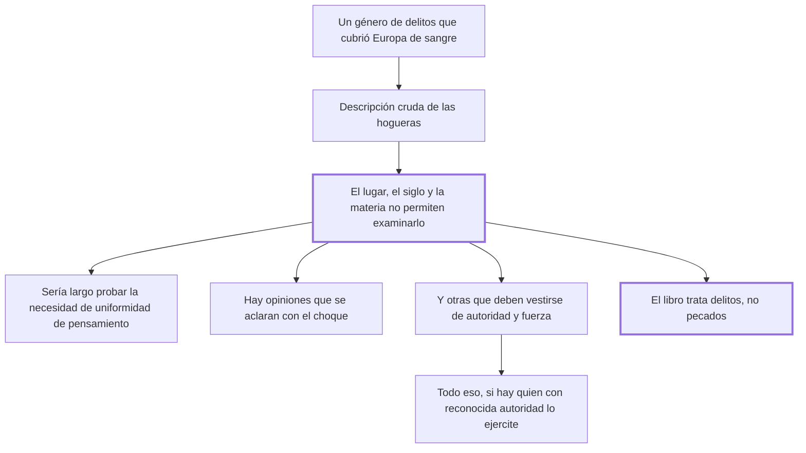

# 39. De un género particular de delitos

## 1. Idea principal

Beccaria declara que no va a tratar los delitos de herejía —los que cubrieron Europa de hogueras— porque el lugar, el siglo y la materia no se lo permiten, y deja fuera de su libro los pecados.

Contesta qué queda deliberadamente afuera del tratado. Es el capítulo más corto y el más incómodo: casi todo él consiste en decir por qué calla.

## 2. Lo esencial del capítulo

El capítulo empieza reconociendo la omisión: falta en el tratado un género de delitos "que ha cubierto la Europa de sangre humana" y que juntó las hogueras donde ardían cuerpos vivos, mientras la muchedumbre oía como espectáculo placentero los gemidos de los miserables entre el humo de miembros humanos (cap. 39). Esa descripción, de una crudeza deliberada, ocupa casi la mitad del capítulo y es lo único que Beccaria dice con voz propia. Lo que sigue son tres tesis enunciadas bajo la fórmula "muy largo sería probar", presentadas como demasiado extensas para tratarlas y no como conclusiones suyas: que sería necesaria una perfecta uniformidad de pensamientos en un Estado; que opiniones separadas por diferencias sutilísimas y muy apartadas de la capacidad humana pueden desconcertar el bien público si no se autoriza una con preferencia a las otras; y que hay dos clases de opiniones, las que se aclaran con el choque —fermentando y combatiendo, de modo que las verdaderas nadan y las falsas se sumergen en el olvido— y las que, "poco seguras por su constancia desnuda", deben vestirse de autoridad y de fuerza.

Concede después lo que menos suena a Beccaria: que el imperio de la fuerza sobre los entendimientos, aunque parezca odioso —sus únicas conquistas son el disimulo y por eso el envilecimiento— y contrario al espíritu de mansedumbre y fraternidad, es necesario e indispensable; pero lo condiciona a que haya "quien con reconocida autoridad lo ejercite", con lo que declina probarlo él y lo remite a quien tenga el título (cap. 39). El cierre es la delimitación que da sentido a todo el libro: habla solo de los delitos que provienen de la naturaleza humana y del pacto social, **no de los pecados**, cuyas penas —aun las temporales— deben arreglarse con otros principios que los de una filosofía limitada. Ese límite se lee junto con el cap. 7, donde ya había separado delito y pecado, y cumple además una función defensiva: le permite dejar la herejía fuera de su jurisdicción sin pronunciarse sobre ella, en un libro que ya le había valido acusaciones de irreligión.

## 3. Mapa

## 4. Vocabulario clave

- **Uniformidad de pensamientos** — la coincidencia de opiniones en un Estado, cuya necesidad Beccaria enuncia sin probarla.
- **Opinión que se aclara con el choque** — la que mejora al debatirse, porque las falsas se sumergen y las verdaderas flotan.
- **Imperio de la fuerza sobre los entendimientos** — la imposición de creencias, cuyas conquistas son el disimulo y el envilecimiento.

## 5. Distinciones que se confunden

- **Delito vs. pecado, en cuanto a jurisdicción** — el libro trata lo que nace del pacto social; el pecado se rige por otros principios.
  - Se confunden porque: en el siglo XVIII la herejía era perseguida por tribunales que dictaban penas temporales.
  - Criterio para decidir: ¿el hecho ofende un pacto entre los hombres? Solo entonces cae bajo la filosofía del libro.
  - Dónde se cae: se busca en el tratado una doctrina sobre la herejía, cuando su tesis explícita es que no le corresponde formularla.

- **Opinión que se debate vs. opinión que se impone** — la primera se depura sola; la segunda necesita autoridad.
  - Se confunden porque: las dos son creencias y las dos aspiran a ser verdaderas.
  - Criterio para decidir: ¿resiste por su propia constancia? Si sí, el choque la aclara; si no, hay que vestirla de fuerza.
  - Dónde se cae: se lee esa segunda categoría como un elogio de la censura, cuando la frase misma admite que sus conquistas son el disimulo y el envilecimiento.

## 6. Autoevaluación

1. ¿Qué se entiende por la separación entre delitos y pecados? Ubique esa distinción dentro del conjunto del tratado y explique sus implicaciones.
2. Beccaria concede que el imperio de la fuerza sobre los entendimientos es necesario e indispensable. ¿Hay que leerlo literalmente?

--- No mires esto hasta responder ---

1. Beccaria delimita el objeto de su libro diciendo que habla solo de los delitos que provienen de la naturaleza humana y del pacto social, y no de los pecados, cuyas penas —aun las temporales— deben arreglarse con otros principios que los de una filosofía limitada (cap. 39). Ubicada en el conjunto del tratado, esa distinción retoma la del cap. 7 y le fija al libro una jurisdicción: todo lo que dice vale para lo que ofende un pacto entre los hombres, y nada pretende regir sobre la conciencia. La implicación teórica es que le permite construir el derecho penal sobre bases enteramente laicas —daño, necesidad, utilidad— sin tener que discutir teología. La implicación práctica es defensiva: deja la herejía fuera de examen sin pronunciarse sobre ella, en un libro que ya le había valido acusaciones de irreligión.
2. Literalmente lo escribe, pero el propio párrafo lo desactiva: reconoce que sus únicas conquistas son el disimulo y el envilecimiento y que contraría el espíritu de mansedumbre, y condiciona todo a que haya "quien con reconocida autoridad lo ejercite", es decir declina probarlo. Es una concesión formal con el contenido vaciado. Aun así hay que reconocer que el capítulo evita el caso más grave que su propia doctrina permitiría criticar, y que el precio de esa evasión es visible en el texto.

## Flashcards

Qué género de delitos omite Beccaria en su tratado y con qué razón | La herejía, porque el lugar, el siglo y la materia no le permiten examinar su naturaleza
De qué habla el libro según el cierre del cap. 39 | Solo de los delitos que provienen de la naturaleza humana y del pacto social, no de los pecados
Cuáles son las conquistas del imperio de la fuerza sobre los entendimientos | El disimulo y por consiguiente el envilecimiento
