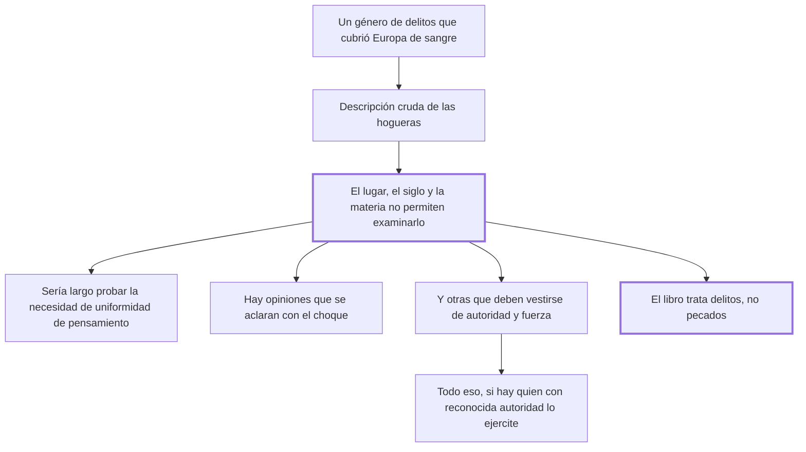

# 39. De un género particular de delitos

## 1. Idea principal

Beccaria declara que no va a tratar los delitos de herejía —los que cubrieron Europa de hogueras— porque el lugar, el siglo y la materia no se lo permiten, y deja fuera de su libro los pecados.

Contesta qué queda deliberadamente afuera del tratado. Es el capítulo más corto y el más incómodo: casi todo él consiste en decir por qué calla.

## 2. Lo esencial del capítulo

El capítulo empieza reconociendo la omisión. El lector habrá advertido que falta un género de delitos "que ha cubierto la Europa de sangre humana" y que juntó las hogueras donde ardían cuerpos vivos, mientras la muchedumbre oía como espectáculo placentero los gemidos de los miserables entre el humo de miembros humanos (cap. 39). La descripción es de una crudeza deliberada y ocupa casi la mitad del capítulo: es lo único que Beccaria dice con voz propia, y funciona como el juicio que después se niega a formular.

Lo que sigue son tres tesis que enuncia bajo la fórmula "muy largo sería probar", es decir presentándolas como demasiado extensas para tratarlas y no como conclusiones suyas. Primera: que sería necesaria una perfecta uniformidad de pensamientos en un Estado, "contra el ejemplo de muchas naciones". Segunda: que opiniones separadas por diferencias sutilísimas y muy apartadas de la capacidad humana pueden desconcertar el bien público si no se autoriza una con preferencia a las otras. Tercera, y la más interesante, distingue dos clases de opiniones: unas se aclaran con el choque, fermentando y combatiendo, de modo que las verdaderas nadan y las falsas se sumergen en el olvido; otras, "poco seguras por su constancia desnuda", deben vestirse de autoridad y de fuerza.

El párrafo siguiente concede lo que menos suena a Beccaria: que el imperio de la fuerza sobre los entendimientos, aunque parezca odioso —sus únicas conquistas son el disimulo y por eso el envilecimiento— y contrario al espíritu de mansedumbre y fraternidad, es sin embargo necesario e indispensable. Y añade la condición que conviene retener, porque es donde deposita toda la responsabilidad: todo eso debe creerse probado "si hay quien con reconocida autoridad lo ejercite". Es decir que no lo prueba él; lo remite a quien tenga el título para hacerlo.

El cierre es la delimitación que da sentido a todo el libro: habla solo de los delitos que provienen de la naturaleza humana y del pacto social, **no de los pecados**, cuyas penas —aun las temporales— deben arreglarse con otros principios que los de una filosofía limitada. Conviene leer ese límite junto con el cap. 7, donde ya había separado delito y pecado por razones de conocimiento. Acá la separación cumple además una función defensiva: le permite dejar la herejía fuera de su jurisdicción sin pronunciarse sobre ella, en un libro que ya le había valido acusaciones de irreligión.

## 3. Mapa

## 4. Qué releer del original

1. (cap. 39) El primer párrafo entero — es la descripción de las hogueras, y su función en el capítulo depende de leerla completa.
2. (cap. 39) La distinción entre las opiniones que se aclaran con el choque y las que deben vestirse de autoridad — es la tesis más sustantiva que enuncia.
3. (cap. 39) La frase final sobre los pecados — fija el límite del libro entero y conviene tenerla textual.

## 5. Vocabulario clave

- **Uniformidad de pensamientos** — la coincidencia de opiniones en un Estado, cuya necesidad Beccaria enuncia sin probarla.
- **Opinión que se aclara con el choque** — la que mejora al debatirse, porque las falsas se sumergen y las verdaderas flotan.
- **Imperio de la fuerza sobre los entendimientos** — la imposición de creencias, cuyas conquistas son el disimulo y el envilecimiento.

## 6. Distinciones que se confunden

- **Delito vs. pecado, en cuanto a jurisdicción** — el libro trata lo que nace del pacto social; el pecado se rige por otros principios.
  - Se confunden porque: en el siglo XVIII la herejía era perseguida por tribunales que dictaban penas temporales.
  - Criterio para decidir: ¿el hecho ofende un pacto entre los hombres? Solo entonces cae bajo la filosofía del libro.
  - Dónde se cae: se busca en el tratado una doctrina sobre la herejía, cuando su tesis explícita es que no le corresponde formularla.

- **Opinión que se debate vs. opinión que se impone** — la primera se depura sola; la segunda necesita autoridad.
  - Se confunden porque: las dos son creencias y las dos aspiran a ser verdaderas.
  - Criterio para decidir: ¿resiste por su propia constancia? Si sí, el choque la aclara; si no, hay que vestirla de fuerza.
  - Dónde se cae: se lee esa segunda categoría como un elogio de la censura, cuando la frase misma admite que sus conquistas son el disimulo y el envilecimiento.

## 7. Autoevaluación

1. ¿Por qué la descripción de las hogueras ocupa la mitad de un capítulo dedicado a no tratar el tema?
2. Beccaria concede que el imperio de la fuerza sobre los entendimientos es necesario e indispensable. ¿Hay que leerlo literalmente?
3. ¿Qué función cumple la separación entre delitos y pecados en el conjunto del libro?
4. ¿Es este capítulo una omisión o una toma de posición?

--- No mires esto hasta responder ---

1. Porque es su modo de decir sin decir. No formula ningún juicio sobre la legitimidad de perseguir la herejía, pero describe sus consecuencias con un detalle que el lector no puede leer con indiferencia. El argumento queda a cargo del lector, no del texto (cap. 39).
2. Literalmente sí lo escribe, pero el propio párrafo lo desactiva: reconoce que sus únicas conquistas son el disimulo y el envilecimiento, y que contraría el espíritu de mansedumbre. Además condiciona todo a que "haya quien con reconocida autoridad lo ejercite", es decir declina probarlo. Es una concesión formal con el contenido vaciado.
3. Le fija al libro una jurisdicción: todo lo que dice vale para lo que nace del pacto social, y nada de eso pretende regir sobre la conciencia. Eso le permite construir el derecho penal sobre bases enteramente laicas —daño, necesidad, utilidad— sin tener que discutir teología, y a la vez lo protege de la acusación de irreligión.
4. Las dos cosas, y la tensión es real. Como método es coherente con el cap. 7. Como conducta es prudencia: escribía en 1764, bajo censura, y ya había sido acusado de irreligión. Lo honesto es reconocer que el capítulo evita el caso más grave que su propia doctrina permitiría criticar, y que el precio de esa evasión es visible en el texto.

## Flashcards

Qué género de delitos omite Beccaria en su tratado | El que cubrió Europa de sangre y de hogueras, es decir la herejía
Con qué razón justifica esa omisión | Que el lugar, el siglo y la materia no le permiten examinar su naturaleza
Qué dos clases de opiniones distingue | Las que se aclaran con el choque y las que deben vestirse de autoridad y fuerza
Cuáles son las conquistas del imperio de la fuerza sobre los entendimientos | El disimulo y por consiguiente el envilecimiento
Con qué condición da por probadas esas tesis | Si hay quien con reconocida autoridad las ejercite
De qué habla el libro según el cierre del cap. 39 | Solo de los delitos que provienen de la naturaleza humana y del pacto social
Qué queda expresamente fuera del tratado | Los pecados, cuyas penas se rigen por otros principios
Con qué otro capítulo se conecta esta delimitación | Con el cap. 7, donde ya había separado delito y pecado
