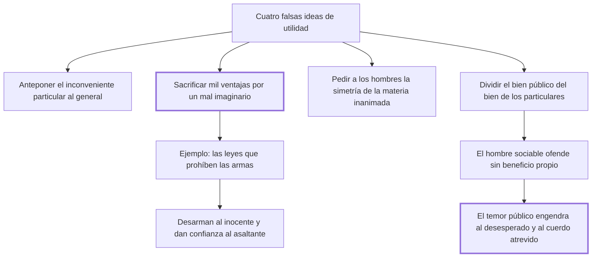

# 40. Falsas ideas de utilidad

## 1. Idea principal

Es falsa la utilidad que sacrifica mil ventajas reales por un inconveniente imaginario, como las leyes que prohíben las armas: solo desarman al que no iba a delinquir y mejoran la condición del asaltante.

Contesta cómo se equivoca un legislador bienintencionado. Es el capítulo donde Beccaria enumera las trampas del razonamiento por utilidad, que es el suyo.

## 2. Lo esencial del capítulo

El capítulo enumera cuatro formas de falsa utilidad (cap. 40). La primera antepone los inconvenientes particulares al general. La segunda "sacrifica mil ventajas reales por un inconveniente imaginario o de poca consecuencia": es la que quitaría a los hombres el fuego porque quema y el agua porque anega. La tercera pide a una muchedumbre de seres sensibles la simetría de la materia inanimada y descuida los motivos presentes, los únicos que obran con eficacia sobre el mayor número. La cuarta "sacrifica la cosa al nombre" y divide el bien público del bien de todos los particulares; de ahí la comparación del salvaje, que solo daña en cuanto le sirve para hacerse bien a sí mismo, frente al hombre sociable, a quien las malas leyes mueven a ofender sin beneficio propio.

De la segunda clase son **las leyes que prohíben llevar armas**, y el argumento tiene tres partes (cap. 40). Una de selección: no contienen más que a los no inclinados a delinquir, porque quien viola las leyes más sagradas no respetará las menores y puramente arbitrarias. Una de costo: hacerlas cumplir exige quitar la libertad personal y someter a los inocentes a vejaciones que deberían sufrir los reos. Y una de resultado: "no minoran los homicidios sino los aumentan", porque hay más confianza en asaltar a un desarmado que a un prevenido. No son preventivas sino **medrosas**, nacidas de la impresión tumultuaria de algunos hechos particulares y no de la meditación de un decreto universal.

El tramo final explica por qué el temor como instrumento de gobierno se vuelve contra quien lo usa (cap. 40): cuanto más público es y cuantos más hombres agita, más fácil es que aparezca el imprudente, el desesperado o "el cuerdo atrevido" que lo haga servir a su fin, porque el riesgo se reparte entre muchos y quien vive en la miseria valora menos su existencia. Y las ofensas originan otras porque el odio dura más que el amor: toma su fuerza de la repetición de los actos que al amor lo debilitan.

## 3. Mapa

## 4. Vocabulario clave

- **Falsa idea de utilidad** — la que sacrifica ventajas reales por males imaginarios o confunde el bien público con un nombre.
- **Ley medrosa** — la nacida de la impresión tumultuaria de hechos particulares, en vez de la meditación de un decreto universal.
- **Motivos presentes** — los únicos que obran con eficacia sobre el mayor número, frente a los distantes.
- **Cuerdo atrevido** — quien aprovecha el temor público extendido para volver a los hombres contra el poder que lo produjo.

## 5. Distinciones que se confunden

- **Ley preventiva vs. ley medrosa** — la primera nace de una meditación general; la segunda, del sobresalto por un caso.
  - Se confunden porque: las dos se dictan invocando la seguridad y las dos prohíben algo antes de que ocurra el daño.
  - Criterio para decidir: ¿se ponderaron inconvenientes y provechos de un decreto universal, o se reaccionó a un hecho particular?
  - Dónde se cae: se legisla al calor de un episodio y se llama prevención a lo que es alarma.

- **Bien público vs. suma de los bienes particulares** — separarlos es sacrificar la cosa al nombre.
  - Se confunden porque: se supone que el interés general puede exigir sacrificios que no benefician a nadie en concreto.
  - Criterio para decidir: ¿alguien vive mejor por esa medida? Si no, el "bien público" es solo una palabra.
  - Dónde se cae: se justifica un daño cierto a personas reales por una ventaja colectiva que nadie puede identificar.

## 6. Autoevaluación

1. ¿Qué se entiende por falsa idea de utilidad? Enumere sus formas y explique sus implicaciones para el legislador.
2. Una ciudad dicta, después de un crimen resonante, una ordenanza que prohíbe circular de noche. ¿Qué clase de ley es según el cap. 40 y qué habría que preguntarle?

--- No mires esto hasta responder ---

1. Falsa idea de utilidad es la que se invoca para legislar y sin embargo sacrifica ventajas reales por males imaginarios, o confunde el bien público con un nombre (cap. 40). Beccaria distingue cuatro formas: anteponer los inconvenientes particulares al general; "sacrificar mil ventajas reales por un inconveniente imaginario o de poca consecuencia", como quien quitaría el fuego porque quema; pedir a los hombres la simetría de la materia inanimada, descuidando los motivos presentes por los distantes; y "sacrificar la cosa al nombre", dividiendo el bien público del bien de todos los particulares. La implicación para el legislador es que la utilidad no se mide por la intención sino por los efectos sobre personas concretas: su ejemplo son las leyes que prohíben llevar armas, que solo obligan a quien no iba a delinquir y mejoran la condición del asaltador. Por eso las llama medrosas y no preventivas: nacen de la impresión tumultuaria de un hecho y no de la meditación de un decreto universal.
2. Es una ley medrosa: nace del sobresalto por un caso particular y no de la ponderación de inconvenientes y provechos de un decreto universal (cap. 40). Habría que preguntarle a quién obliga de hecho —previsiblemente a quien no pensaba delinquir—, cuánto cuesta en libertad de los inocentes, y si alguien vive mejor por la medida; si nadie puede identificarse, el bien público invocado es solo una palabra. Es discutible que el ejemplo de las armas se traslade sin más a cualquier prohibición: el argumento de Beccaria depende de que desarmar altere la relación de fuerzas entre asaltado y asaltante, y no toda restricción hace eso.

## Flashcards

Cuáles son las cuatro falsas ideas de utilidad | Anteponer lo particular al general, sacrificar mil ventajas por un mal imaginario, pedir a los hombres la simetría de lo inanimado y sacrificar la cosa al nombre
A quiénes contienen las leyes que prohíben llevar armas y con qué efecto | Solo a los no inclinados a delinquir; empeoran la condición de los asaltados y mejoran la de los asaltadores
Cómo distingo una ley preventiva de una ley medrosa | Por su origen: la preventiva medita un decreto universal, la medrosa reacciona a la impresión tumultuaria de hechos particulares
