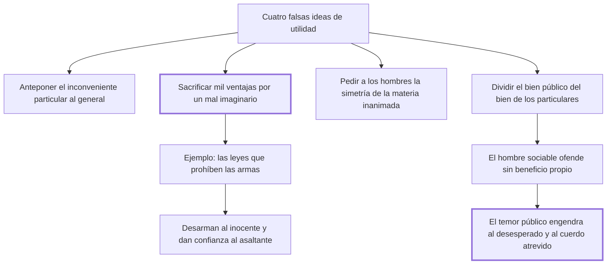

# 40. Falsas ideas de utilidad

## 1. Idea principal

Es falsa la utilidad que sacrifica mil ventajas reales por un inconveniente imaginario, como las leyes que prohíben las armas: solo desarman al que no iba a delinquir y mejoran la condición del asaltante.

Contesta cómo se equivoca un legislador bienintencionado. Es el capítulo donde Beccaria enumera las trampas del razonamiento por utilidad, que es el suyo.

## 2. Lo esencial del capítulo

El capítulo enumera cuatro formas de falsa utilidad. La primera antepone los inconvenientes particulares al general, manda a los dictámenes en vez de excitarlos y hace servir los sofismas de la lógica en lugar de la razón. La segunda "sacrifica mil ventajas reales por un inconveniente imaginario o de poca consecuencia": es la que quitaría a los hombres el fuego porque quema y el agua porque anega, la que solo destruyendo repara (cap. 40).

De esa segunda clase son, dice, **las leyes que prohíben llevar armas**, y el argumento tiene tres partes. Una de selección: no contienen más que a los no inclinados a delinquir, porque quien se atreve a violar las leyes más sagradas no va a respetar las menores y puramente arbitrarias. Una de costo: hacerlas cumplir exige quitar la libertad personal y someter a los inocentes a las vejaciones que deberían sufrir los reos. Y una de resultado: empeoran la condición de los asaltados y mejoran la de los asaltadores, "no minoran los homicidios sino los aumentan", porque hay más confianza en asaltar a un desarmado que a un prevenido. Beccaria las llama no leyes preventivas sino **medrosas** de los delitos, porque nacen de la impresión tumultuaria de algunos hechos particulares y no de la meditación de un decreto universal.

La tercera falsa utilidad es querer dar a una muchedumbre de seres sensibles la simetría de la materia inanimada, descuidando los motivos presentes —los únicos que obran con eficacia sobre el mayor número— para dar fuerza a los distantes. La cuarta "sacrifica la cosa al nombre" y divide el bien público del bien de todos los particulares. Ahí introduce la comparación más filosa del capítulo: el hombre salvaje solo daña a otro en cuanto le sirve para hacerse bien a sí mismo, pero el hombre sociable es a veces movido por las malas leyes a ofender sin beneficio propio. La sociedad puede producir una crueldad que el estado de naturaleza no conocía.

El tramo final explica por qué el temor como instrumento de gobierno se vuelve contra quien lo usa. Hay una regla de escala: cuanto más solitario y doméstico es el temor, menos peligroso resulta para quien lo emplea; cuanto más público y cuantos más hombres agita, más fácil es que aparezca el imprudente, el desesperado o "el cuerdo atrevido" que los haga servir a su fin, sobre todo porque el riesgo se reparte entre muchos y quien vive en la miseria valora menos su existencia. La conclusión cierra el capítulo: por eso las ofensas originan otras, ya que el odio es un movimiento más durable que el amor, porque toma su fuerza de la repetición de los actos que al amor lo debilitan.

## 3. Mapa

## 4. Qué releer del original

1. (cap. 40) El pasaje sobre las leyes que prohíben las armas — es el ejemplo más desarrollado y conviene ver los tres argumentos en su orden.
2. (cap. 40) La comparación entre el hombre salvaje y el sociable — es la frase más grave del capítulo y la resumí en una línea.
3. (cap. 40) El párrafo final sobre el temor público — explica por qué el despotismo produce su propia oposición, y su lógica se pierde en un resumen.

## 5. Vocabulario clave

- **Falsa idea de utilidad** — la que sacrifica ventajas reales por males imaginarios o confunde el bien público con un nombre.
- **Ley medrosa** — la nacida de la impresión tumultuaria de hechos particulares, en vez de la meditación de un decreto universal.
- **Motivos presentes** — los únicos que obran con eficacia sobre el mayor número, frente a los distantes.
- **Cuerdo atrevido** — quien aprovecha el temor público extendido para volver a los hombres contra el poder que lo produjo.

## 6. Distinciones que se confunden

- **Ley preventiva vs. ley medrosa** — la primera nace de una meditación general; la segunda, del sobresalto por un caso.
  - Se confunden porque: las dos se dictan invocando la seguridad y las dos prohíben algo antes de que ocurra el daño.
  - Criterio para decidir: ¿se ponderaron inconvenientes y provechos de un decreto universal, o se reaccionó a un hecho particular?
  - Dónde se cae: se legisla al calor de un episodio y se llama prevención a lo que es alarma.

- **Bien público vs. suma de los bienes particulares** — separarlos es sacrificar la cosa al nombre.
  - Se confunden porque: se supone que el interés general puede exigir sacrificios que no benefician a nadie en concreto.
  - Criterio para decidir: ¿alguien vive mejor por esa medida? Si no, el "bien público" es solo una palabra.
  - Dónde se cae: se justifica un daño cierto a personas reales por una ventaja colectiva que nadie puede identificar.

## 7. Autoevaluación

1. ¿Por qué sostiene Beccaria que prohibir las armas aumenta los homicidios en vez de reducirlos?
2. Llama a esas normas "leyes medrosas" y no preventivas. ¿Qué distingue a unas de otras?
3. Dice que el hombre sociable puede ofender sin hacerse bien a sí mismo, y el salvaje no. ¿Qué implica eso?
4. ¿Por qué el temor extendido es más peligroso para el déspota que el temor doméstico?

--- No mires esto hasta responder ---

1. Por un problema de selección: la prohibición solo obedecen los que no pensaban delinquir, mientras que quien viola las leyes más sagradas no respeta una menor y arbitraria. El resultado es que empeora la condición del asaltado y mejora la del asaltador, porque hay más confianza en atacar a un desarmado que a un prevenido (cap. 40).
2. Su origen. La ley preventiva nace de la meditación de inconvenientes y provechos de un decreto universal; la medrosa, de la impresión tumultuaria de algunos hechos particulares. La primera calcula, la segunda reacciona, y por eso suele sacrificar ventajas reales por un mal que impresionó.
3. Que la crueldad gratuita es un producto social, no natural. El salvaje daña por interés propio; al hombre sociable las malas leyes pueden moverlo a ofender sin beneficio alguno. Es una acusación al legislador: no basta con que la sociedad contenga el daño natural, porque puede además crear uno nuevo.
4. Porque el riesgo de rebelarse se reparte entre muchos y el valor que cada infeliz da a su vida disminuye con la miseria que sufre. Un temor solitario y doméstico deja a cada uno solo con su miedo; uno público y masivo crea la ocasión para que el imprudente, el desesperado o el cuerdo atrevido reúna a esos hombres. Y el odio dura más que el amor, porque se refuerza con la repetición que al amor lo gasta.

## Flashcards

Cuál es la falsa utilidad que sacrifica mil ventajas reales | La que las cambia por evitar un inconveniente imaginario o de poca consecuencia
Con qué imagen la describe Beccaria | Que quitaría a los hombres el fuego porque quema y el agua porque anega
A quiénes contienen las leyes que prohíben llevar armas | Solo a los no inclinados ni determinados a cometer delitos
Qué efecto tienen sobre asaltados y asaltadores | Empeoran la condición de los asaltados y mejoran la de los asaltadores
Cómo llama a esas leyes en vez de preventivas | Leyes medrosas de los delitos
De dónde nacen las leyes medrosas | De la impresión tumultuaria de algunos hechos particulares
Qué diferencia hay entre el daño del salvaje y el del hombre sociable | El salvaje daña solo para hacerse bien; al sociable las malas leyes lo mueven a ofender sin beneficio
Por qué es más peligroso el temor público que el doméstico | Porque el riesgo se reparte entre muchos y aparece el desesperado o el cuerdo atrevido
