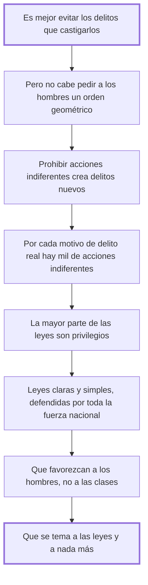

# 41. Cómo se evitan los delitos

## 1. Idea principal

Es mejor evitar los delitos que castigarlos, y para eso hay que hacer las leyes claras y simples, favorecer a los hombres antes que a las clases, y lograr que teman a las leyes y a nada más.

Contesta cuál es el fin principal de una buena legislación. Abre la serie final del libro, donde Beccaria deja la crítica y pasa a proponer.

## 2. Lo esencial del capítulo

**Es mejor evitar los delitos que castigarlos**, y ese es el fin principal de toda buena legislación, "que es el arte de conducir a los hombres al punto mayor de felicidad o al menor de infelicidad posible" (cap. 41). La primera advertencia es sobre los límites: no cabe reducir la turbulenta actividad de los hombres a un orden geométrico, y pretenderlo es "la quimera de los hombres limitados, siempre que son dueños del mando". De ahí el ataque al método corriente. Prohibir una muchedumbre de acciones indiferentes no evita delitos: **crea otros nuevos**, porque por cada motivo que impele a un verdadero delito hay mil que impelen a esas acciones, así que ampliar la esfera de lo prohibido aumenta la probabilidad de infracción. Si hubiera que prohibir todo lo que puede inducir a delito, habría que privar al hombre del uso de sus sentidos. Y el diagnóstico es de los más duros del libro: la mayor parte de las leyes no son más que privilegios, "un tributo que pagan todos a la comodidad de algunos".

La respuesta son tres imperativos. Que las leyes sean **claras y simples**, y que toda la fuerza de la nación se emplee en defenderlas y ninguna parte en destruirlas. Que favorezcan **menos a las clases de los hombres que a los hombres mismos**. Y que los hombres las teman y no teman más que a ellas, porque el temor de las leyes es saludable pero el de hombre a hombre "es fatal y fecundo de delitos" (cap. 41). El cierre sostiene ese último punto con una comparación entre esclavos y libres que conviene leer como argumento sobre el régimen y no como desprecio: quien vive acostumbrado a que nada resulte cierto se contenta con el día presente y da por problemático hasta el éxito de sus delitos, mientras el libre medita sobre las ciencias y los intereses de la nación. Sigue un repaso —mejor verlo en el original— de lo que la incertidumbre de las leyes produce según caiga en una nación indolente, en una activa o en una valerosa (cap. 41).

## 3. Mapa

## 4. Vocabulario clave

- **Prevención** — el fin principal de la legislación: evitar los delitos antes que castigarlos.
- **Acción indiferente** — la que no daña y que las malas leyes convierten en delito, multiplicando los infractores.
- **Temor de las leyes** — el saludable, frente al temor de hombre a hombre, que Beccaria llama fecundo de delitos.
- **Privilegio** — el tributo que todos pagan a la comodidad de algunos; según el capítulo, lo que son casi todas las leyes.

## 5. Distinciones que se confunden

- **Temor de las leyes vs. temor de hombre a hombre** — el primero previene; el segundo genera delitos.
  - Se confunden porque: los dos producen obediencia y desde afuera se ven igual.
  - Criterio para decidir: ¿lo que se teme está escrito y es igual para todos, o depende de la voluntad de alguien? Solo lo primero es ley.
  - Dónde se cae: se celebra que la gente obedezca sin preguntar de qué tiene miedo, cuando el miedo al poderoso es la causa de lo que se quiere evitar.

- **Prohibir más vs. prevenir más** — ampliar la esfera de lo prohibido aumenta la probabilidad de infracción.
  - Se confunden porque: parece que cuanto más se prohíba menos margen queda para el daño.
  - Criterio para decidir: ¿esa acción daña, o solo puede inducir a algo que daña? Prohibir lo segundo llevaría a privar del uso de los sentidos.
  - Dónde se cae: se responde a un delito prohibiendo su antesala, y se multiplican los reos sin tocar el delito.

## 6. Autoevaluación

1. ¿Qué se entiende por prevención de los delitos en Beccaria? Explique los tres imperativos con que la propone y sus implicaciones.
2. Advierte que no se puede reducir la actividad humana a un orden geométrico. ¿Contradice eso su propia escala de delitos y penas?

--- No mires esto hasta responder ---

1. Prevenir es el fin principal de toda buena legislación, entendida como "el arte de conducir a los hombres al punto mayor de felicidad o al menor de infelicidad posible": es mejor evitar los delitos que castigarlos (cap. 41). Su primera implicación es negativa: prohibir acciones indiferentes no previene nada, porque por cada motivo que impele a un delito real hay mil que impelen a esas acciones, de modo que ampliar lo prohibido multiplica los infractores sin tocar el daño. Los tres imperativos positivos son que las leyes sean claras y simples y que toda la fuerza de la nación se emplee en defenderlas; que favorezcan menos a las clases de los hombres que a los hombres mismos, porque de otro modo son privilegios, "un tributo que pagan todos a la comodidad de algunos"; y que se tema a las leyes y a nada más, ya que el temor de hombre a hombre es fatal y fecundo de delitos. La implicación de conjunto es que la prevención se hace legislando mejor, no prohibiendo más: la ley previene por su claridad, su igualdad y su certeza, no por su extensión ni por su dureza.
2. No, y la diferencia es la del cap. 6. Ahí ya había dicho que la geometría no es aplicable y que basta con señalar los puntos principales sin turbar el orden. Lo que rechaza es la pretensión de regularlo todo; su escala es una guía de proporción, no un catálogo exhaustivo de conductas.

## Flashcards

Cuál es el fin principal de toda buena legislación | Evitar los delitos antes que castigarlos
Cuáles son los tres imperativos para evitar los delitos | Leyes claras y simples, que favorezcan a los hombres y no a las clases, y que solo se tema a ellas
Qué relación hay entre motivos y probabilidad de delito | La probabilidad es proporcional al número de motivos, así que ampliar lo prohibido la aumenta
