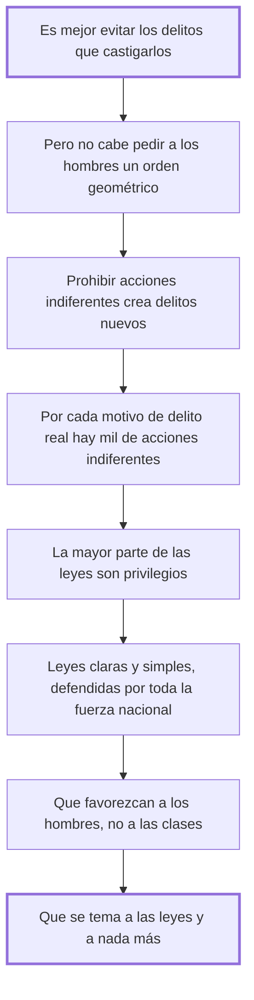

# 41. Cómo se evitan los delitos

## 1. Idea principal

Es mejor evitar los delitos que castigarlos, y para eso hay que hacer las leyes claras y simples, favorecer a los hombres antes que a las clases, y lograr que teman a las leyes y a nada más.

Contesta cuál es el fin principal de una buena legislación. Abre la serie final del libro, donde Beccaria deja la crítica y pasa a proponer.

## 2. Lo esencial del capítulo

La frase de apertura es la más citada del libro después de la del cap. 28: **es mejor evitar los delitos que castigarlos**, y ese es el fin principal de toda buena legislación, "que es el arte de conducir a los hombres al punto mayor de felicidad o al menor de infelicidad posible" (cap. 41). La primera advertencia es sobre los límites: no es posible reducir la turbulenta actividad de los hombres a un orden geométrico, igual que las leyes de la naturaleza no impiden que los planetas se turben en sus movimientos; pretenderlo es "la quimera de los hombres limitados, siempre que son dueños del mando".

De ahí el ataque al método corriente. Prohibir una muchedumbre de acciones indiferentes no evita delitos: **crea otros nuevos** y equivale a definir a voluntad la virtud y el vicio que se predican eternos. Si hubiera que prohibir todo lo que puede inducir a delito, habría que privar al hombre del uso de sus sentidos. Y hay un cálculo detrás: por cada motivo que impele a un verdadero delito hay mil que impelen a esas acciones indiferentes, así que ampliar la esfera de lo prohibido aumenta la probabilidad de que se cometan. El diagnóstico que cierra el párrafo es de los más duros del libro: la mayor parte de las leyes no son más que privilegios, "un tributo que pagan todos a la comodidad de algunos".

La segunda mitad es la respuesta, en forma de tres imperativos. Que las leyes sean **claras y simples**, y que toda la fuerza de la nación se emplee en defenderlas y ninguna parte en destruirlas. Que favorezcan **menos a las clases de los hombres que a los hombres mismos**. Y que los hombres las teman y no teman más que a ellas, porque el temor de las leyes es saludable pero el de hombre a hombre "es fatal y fecundo de delitos".

El cierre sostiene ese último punto con una comparación entre esclavos y libres, que conviene leer como argumento y no como desprecio. Los esclavos son más sensuales y crueles: contentos del día presente, buscan en el estrépito una distracción del apocamiento que los rodea, y como están acostumbrados a que nada resulte cierto, también el éxito de sus delitos les parece problemático. Los libres, en cambio, meditan sobre las ciencias y los intereses de la nación, ven objetos grandes y los imitan. Después describe qué hace la incertidumbre de las leyes según dónde caiga: en una nación indolente mantiene su estupidez; en una activa desperdicia su actividad en astucias que hacen "de la traición y el disimulo la base de la prudencia"; en una valerosa termina sacudiéndose, tras muchos vaivenes entre libertad y esclavitud.

## 3. Mapa

## 4. Vocabulario clave

- **Prevención** — el fin principal de la legislación: evitar los delitos antes que castigarlos.
- **Acción indiferente** — la que no daña y que las malas leyes convierten en delito, multiplicando los infractores.
- **Temor de las leyes** — el saludable, frente al temor de hombre a hombre, que Beccaria llama fecundo de delitos.
- **Privilegio** — el tributo que todos pagan a la comodidad de algunos; según el capítulo, lo que son casi todas las leyes.

## 5. Distinciones que se confunden

- **Temor de las leyes vs. temor de hombre a hombre** — el primero previene; el segundo genera delitos.
  - Se confunden porque: los dos producen obediencia y desde afuera se ven igual.
  - Criterio para decidir: ¿lo que se teme está escrito y es igual para todos, o depende de la voluntad de alguien? Solo lo primero es ley.
  - Dónde se cae: se celebra que la gente obedezca sin preguntar de qué tiene miedo, cuando el miedo al poderoso es la causa de lo que se quiere evitar.

- **Prohibir más vs. prevenir más** — ampliar la esfera de lo prohibido aumenta la probabilidad de infracción.
  - Se confunden porque: parece que cuanto más se prohíba menos margen queda para el daño.
  - Criterio para decidir: ¿esa acción daña, o solo puede inducir a algo que daña? Prohibir lo segundo llevaría a privar del uso de los sentidos.
  - Dónde se cae: se responde a un delito prohibiendo su antesala, y se multiplican los reos sin tocar el delito.

## 6. Autoevaluación

1. ¿Por qué prohibir acciones indiferentes aumenta la cantidad de delitos en vez de reducirla?
2. Beccaria dice que la mayor parte de las leyes son privilegios. ¿Cómo se conecta eso con el segundo imperativo?
3. Sostiene que los esclavos son más crueles que los libres. ¿Es una afirmación sobre su carácter?
4. Advierte que no se puede reducir la actividad humana a un orden geométrico. ¿Contradice eso su propia escala de delitos y penas?

--- No mires esto hasta responder ---

1. Por aritmética de los motivos: por cada motivo que impele a un verdadero delito hay mil que impelen a las acciones indiferentes, y si la probabilidad del delito es proporcional al número de motivos, ampliar la esfera de lo prohibido acrecienta esa probabilidad. Se crean infractores donde no había daño (cap. 41).
2. Directamente. Si las leyes favorecen a las clases y no a los hombres, lo que producen es un tributo que todos pagan a la comodidad de algunos, y ese desnivel es lo que hace que la gente tema a los hombres poderosos y no a la ley. Pedir que favorezcan a los hombres es pedir que dejen de ser privilegios.
3. Sobre su situación, no sobre su naturaleza, y él lo explica: quien vive en la incertidumbre se contenta con el día presente, busca distracción del apocamiento y da por incierto el resultado de todo, incluidos sus delitos. La causa es el régimen bajo el que viven, no una cualidad suya; por eso el remedio que propone es legal.
4. No, y la diferencia es la del cap. 6. Ahí ya había dicho que la geometría no es aplicable y que basta con señalar los puntos principales sin turbar el orden. Lo que rechaza es la pretensión de regularlo todo; su escala es una guía de proporción, no un catálogo exhaustivo de conductas.

## Flashcards

Cuál es el fin principal de toda buena legislación | Evitar los delitos antes que castigarlos
Cómo define Beccaria a la buena legislación | El arte de conducir a los hombres al mayor punto de felicidad o al menor de infelicidad
Qué se consigue prohibiendo una muchedumbre de acciones indiferentes | No evitar delitos, sino crear otros nuevos
Qué relación hay entre motivos y probabilidad de delito | La probabilidad es proporcional al número de motivos, así que ampliar lo prohibido la aumenta
Qué son la mayor parte de las leyes según el cap. 41 | Privilegios: un tributo que pagan todos a la comodidad de algunos
Cuáles son los tres imperativos para evitar los delitos | Leyes claras y simples, que favorezcan a los hombres y no a las clases, y que solo se tema a ellas
Qué diferencia hay entre el temor de las leyes y el de hombre a hombre | El primero es saludable; el segundo es fatal y fecundo de delitos
Qué efecto tiene la incertidumbre de las leyes en una nación activa | Desperdicia su actividad en astucias que hacen del disimulo la base de la prudencia
