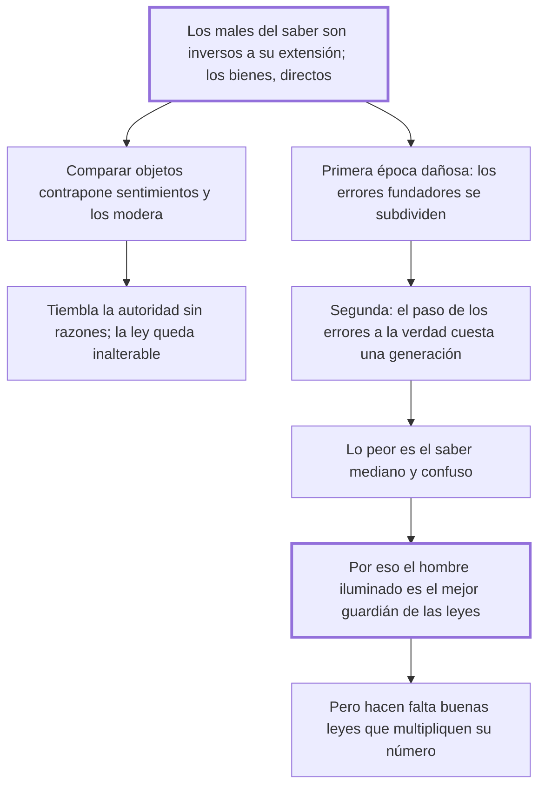

# 42. De las ciencias

## 1. Idea principal

Las luces evitan delitos: los males del conocimiento son inversos a su extensión y los bienes directos, así que lo peligroso no es saber sino el saber mediano y confuso.

Contesta si difundir la ilustración es bueno para el orden público. Es la respuesta de Beccaria a quienes acusaban a la filosofía de fomentar el desorden.

## 2. Lo esencial del capítulo

La fórmula de apertura es una proporción: los males que nacen de los conocimientos son en razón inversa de su extensión, y los bienes en la directa (cap. 42). El mecanismo es que los progresos de las ciencias facilitan comparar objetos y multiplican los puntos de vista, con lo que muchos sentimientos se contraponen y se modifican entre sí; el impostor atrevido, adorado por un pueblo ignorante, es despreciado por uno iluminado. De ahí la tesis política: donde las luces están esparcidas calla la ignorancia calumniosa y **tiembla la autoridad desarmada de razones**, mientras la fuerza de las leyes permanece inalterable. No hay hombre iluminado que no ame los pactos públicos, porque compara la poca libertad inútil que sacrificó con la suma de todas las que sacrificaron los demás y que sin leyes podrían conspirar contra él. La ilustración debilita a la autoridad sin razones y fortalece a la ley, que son cosas distintas.

Reconoce después dos épocas en que el conocimiento sí fue dañoso —la de los errores fundadores, que al reunir en un objeto único las pasiones divididas hicieron "un gran bien político" antes de subdividirse al infinito, y la del paso de los errores a la verdad, cuyo choque puede sacrificar una generación entera a la felicidad de las siguientes; conviene ver ambas en el original (cap. 42)—. Pero cuando el fuego se apaga y la verdad se sienta en el trono de los monarcas, nadie puede sostener que el resplandor sea más dañoso que las tinieblas. La consecuencia es que lo peligroso no es saber sino el **saber mediano y confuso**, que suma a los males de la ignorancia los del error de quien ve menos lejos que los confines de la verdad; por eso **el hombre iluminado es el don más precioso** que un soberano puede hacer a la nación, nombrándolo guardador de las leyes, porque para él la nación es "una familia de hombres hermanos". Esa felicidad es momentánea si las buenas leyes no aumentan su número lo bastante para reducir la probabilidad de una mala elección (cap. 42).

## 3. Mapa

## 4. Vocabulario clave

- **Luces** — la difusión del conocimiento en una nación; para Beccaria, el mejor medio de prevención.
- **Saber mediano y confuso** — el peor estado: suma a los males de la ignorancia los del error de quien ve poco lejos.
- **Autoridad desarmada de razones** — la que solo se sostiene por la fuerza y que la ilustración hace temblar.
- **Hombre iluminado** — quien ve la verdad sin temerla; el depositario ideal de las leyes.

## 5. Distinciones que se confunden

- **Autoridad sin razones vs. fuerza de las leyes** — la ilustración debilita la primera y deja intacta la segunda.
  - Se confunden porque: las dos mandan y las dos se resisten al examen público.
  - Criterio para decidir: ¿puede darse una razón del mandato que el súbdito acepte al compararla con su interés? Si sí, es ley; si no, es solo autoridad.
  - Dónde se cae: se acusa a la ilustración de fomentar la desobediencia, cuando lo que erosiona es lo que no puede justificarse.

- **Ignorancia ciega vs. saber mediano** — el segundo es más fatal que la primera.
  - Se confunden porque: se supone que cualquier grado de conocimiento mejora la situación.
  - Criterio para decidir: ¿la vista alcanza los confines de la verdad? Si no llega y cree llegar, agrega el error a la ignorancia.
  - Dónde se cae: se defiende una instrucción a medias como paso seguro hacia la ilustración, sin ver que es el tramo peligroso.

## 6. Autoevaluación

1. ¿Qué se entiende por «luces» en el cap. 42? Explique la proporción que enuncia Beccaria entre conocimiento y delito, y sus implicaciones políticas.
2. Reconoce que el paso de los errores a la verdad sacrifica una generación entera. ¿Cómo lo justifica?

--- No mires esto hasta responder ---

1. Las luces son la difusión del conocimiento en una nación, y Beccaria la propone como medio de prevención bajo una proporción: los males que nacen de los conocimientos son en razón inversa de su extensión, y los bienes en la directa (cap. 42). El mecanismo es comparativo: las ciencias facilitan comparar objetos y multiplican los puntos de vista, con lo que los sentimientos se contraponen y se moderan entre sí, y el impostor adorado por un pueblo ignorante es despreciado por uno iluminado. Su implicación política es la que se suele malentender: donde las luces se esparcen tiembla la autoridad desarmada de razones, pero la fuerza de las leyes permanece inalterable, porque no hay hombre iluminado que no ame los pactos públicos cuando compara la poca libertad inútil que cedió con todas las que cedieron los demás. Se sigue de ahí que lo peligroso no es saber sino el saber mediano y confuso, que añade al mal de la ignorancia el error de quien cree ver más lejos de lo que ve, y que el hombre iluminado es el mejor guardián de las leyes.
2. Como un tránsito necesario, no como algo deseable: el choque entre los errores útiles a pocos y las verdades útiles a muchos despierta pasiones y causa males inmensos, y su argumento es que el estado final —la verdad sentada junto al trono— vale ese costo. Es la parte más débil del capítulo: justifica el precio por el resultado, que es la forma de razonar que él mismo rechaza cuando la usan los defensores de la crueldad útil.

## Flashcards

Cuál es la proporción entre conocimiento, males y bienes | Los males son en razón inversa de la extensión del saber, y los bienes en la directa
Qué tiembla cuando las luces se esparcen en una nación | La autoridad desarmada de razones, mientras la fuerza de las leyes queda inalterable
Por qué ama el hombre iluminado los pactos públicos | Porque compara la poca libertad inútil que cedió con todas las que cedieron los demás
Por qué es peor el saber mediano que la ignorancia ciega | Porque añade a los males de la ignorancia el error de quien ve menos lejos de lo que cree
