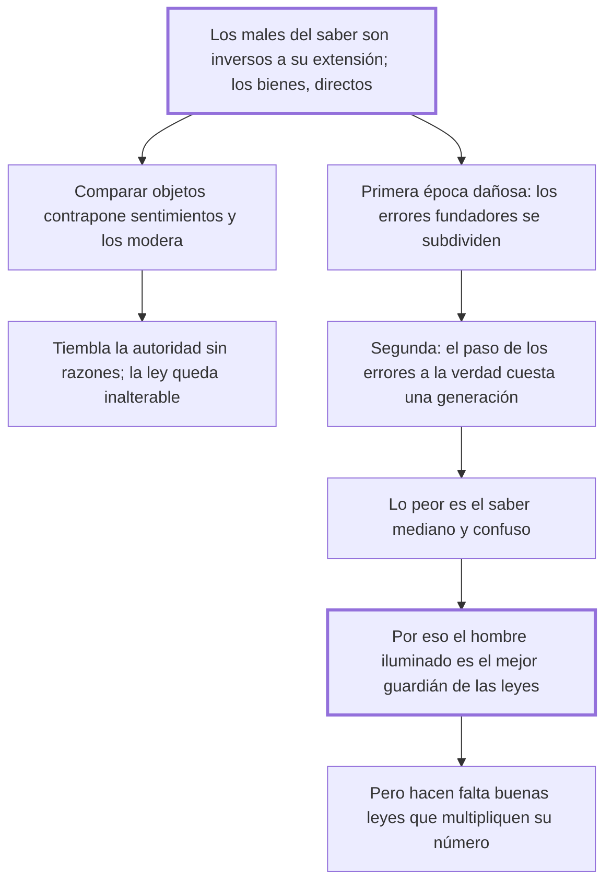

# 42. De las ciencias

## 1. Idea principal

Las luces evitan delitos: los males del conocimiento son inversos a su extensión y los bienes directos, así que lo peligroso no es saber sino el saber mediano y confuso.

Contesta si difundir la ilustración es bueno para el orden público. Es la respuesta de Beccaria a quienes acusaban a la filosofía de fomentar el desorden.

## 2. Lo esencial del capítulo

La fórmula de apertura es una proporción: los males que nacen de los conocimientos son en razón inversa de su extensión, y los bienes en la directa (cap. 42). El ejemplo lo aclara: un impostor atrevido —"que siempre es un hombre no vulgar"— recibe las adoraciones de un pueblo ignorante y el desprecio de uno iluminado. El mecanismo es que los progresos de las ciencias facilitan comparar objetos y multiplican los puntos de vista, con lo que muchos sentimientos se contraponen y se modifican entre sí.

De ahí la tesis política: donde las luces están esparcidas, calla la ignorancia calumniosa y **tiembla la autoridad desarmada de razones**, mientras la fuerza de las leyes permanece inalterable. La razón es que no hay hombre iluminado que no ame los pactos públicos, porque compara la poca libertad inútil que sacrificó con la suma de todas las que sacrificaron los demás y que sin leyes podrían conspirar contra él. La ilustración debilita a la autoridad sin razones y fortalece a la ley, que son cosas distintas.

Después reconstruye dos épocas en que el conocimiento sí fue dañoso. La **primera** es la de los errores fundadores: cuando las primeras leyes eran pactos momentáneos hicieron falta impresiones más durables, y los errores que poblaron la tierra de falsas divinidades hicieron por eso "un gran bien político", al reunir en un objeto único las pasiones divididas. Pero el error se subdivide al infinito, y esas ciencias hicieron de los hombres una muchedumbre fanática de ciegos que se atropellaban en un laberinto.

La **segunda** es el paso de los errores a la verdad. El choque entre los errores útiles a pocos poderosos y las verdades útiles a muchos desvalidos causa males inmensos: muchas veces una generación entera queda sacrificada a la felicidad de las siguientes. Pero cuando el fuego se apaga y la verdad se sienta en el trono de los monarcas, nadie puede sostener que el resplandor sea más dañoso que las tinieblas.

El cierre saca la consecuencia. Si la ciega ignorancia es menos fatal que el saber mediano y confuso —que suma a los males de la primera los del error de quien ve menos lejos que los confines de la verdad—, entonces **el hombre iluminado es el don más precioso** que un soberano puede hacer a la nación, nombrándolo guardador de las leyes. Enseñado a ver la verdad y a no temerla, para él la nación es "una familia de hombres hermanos". Un conjunto de tales hombres forma la felicidad de una nación, pero momentánea si las buenas leyes no aumentan su número lo bastante para reducir la probabilidad de una mala elección.

## 3. Mapa

## 4. Qué releer del original

1. (cap. 42) La proporción inicial entre males, bienes y extensión del conocimiento — es la tesis del capítulo en dos líneas.
2. (cap. 42) El pasaje sobre por qué el hombre iluminado ama los pactos públicos — explica cómo la ilustración produce obediencia y no desorden.
3. (cap. 42) El retrato final del hombre iluminado — es el ideal de magistrado del libro entero y lo resumí bastante.

## 5. Vocabulario clave

- **Luces** — la difusión del conocimiento en una nación; para Beccaria, el mejor medio de prevención.
- **Saber mediano y confuso** — el peor estado: suma a los males de la ignorancia los del error de quien ve poco lejos.
- **Autoridad desarmada de razones** — la que solo se sostiene por la fuerza y que la ilustración hace temblar.
- **Hombre iluminado** — quien ve la verdad sin temerla; el depositario ideal de las leyes.

## 6. Distinciones que se confunden

- **Autoridad sin razones vs. fuerza de las leyes** — la ilustración debilita la primera y deja intacta la segunda.
  - Se confunden porque: las dos mandan y las dos se resisten al examen público.
  - Criterio para decidir: ¿puede darse una razón del mandato que el súbdito acepte al compararla con su interés? Si sí, es ley; si no, es solo autoridad.
  - Dónde se cae: se acusa a la ilustración de fomentar la desobediencia, cuando lo que erosiona es lo que no puede justificarse.

- **Ignorancia ciega vs. saber mediano** — el segundo es más fatal que la primera.
  - Se confunden porque: se supone que cualquier grado de conocimiento mejora la situación.
  - Criterio para decidir: ¿la vista alcanza los confines de la verdad? Si no llega y cree llegar, agrega el error a la ignorancia.
  - Dónde se cae: se defiende una instrucción a medias como paso seguro hacia la ilustración, sin ver que es el tramo peligroso.

## 7. Autoevaluación

1. ¿Por qué el hombre iluminado ama las leyes en vez de resistirlas?
2. Beccaria dice que los primeros errores religiosos hicieron un gran bien político. ¿Qué está afirmando y qué no?
3. ¿Por qué el saber mediano es peor que la ignorancia ciega?
4. Reconoce que el paso de los errores a la verdad sacrifica una generación entera. ¿Cómo lo justifica?

--- No mires esto hasta responder ---

1. Porque compara: pone la poca libertad inútil que él sacrificó frente a la suma de todas las libertades que sacrificaron los demás y que, sin leyes, podrían conspirar contra él. Ese cálculo solo puede hacerlo quien tiene la vista lo bastante amplia; el ignorante ve la restricción y no ve el beneficio (cap. 42).
2. Afirma que cumplieron una función —reunir las pasiones divididas en un objeto único y fijar sociedades que volvían a la desunión—, y aclara que habla de un bien "político", no de su verdad. Además excluye expresamente al pueblo elegido de Dios. Es una explicación funcional del origen de las creencias, no un juicio sobre su contenido.
3. Porque suma a los males de la ignorancia los del error inevitable en quien tiene la vista limitada a espacios más cortos que los confines de la verdad. El ignorante no sabe; el que sabe a medias cree saber, y actúa con la confianza que su alcance no justifica.
4. Como un tránsito necesario, no como algo deseable: el choque entre los errores útiles a pocos y las verdades útiles a muchos despierta pasiones y causa males inmensos. Su argumento es que el estado final —la verdad sentada junto al trono— vale ese costo, y que el proceso es inevitable una vez comenzado. Es la parte más débil del capítulo: justifica el precio por el resultado, que es la forma de razonar que él mismo rechaza cuando la usan los defensores de la crueldad útil.

## Flashcards

Cuál es la proporción entre conocimiento, males y bienes | Los males son en razón inversa de la extensión del saber, y los bienes en la directa
Qué le pasa a un impostor atrevido en un pueblo iluminado | Recibe desprecio, mientras que en uno ignorante recibe adoraciones
Qué tiembla cuando las luces se esparcen en una nación | La autoridad desarmada de razones, mientras la fuerza de las leyes queda inalterable
Por qué ama el hombre iluminado los pactos públicos | Porque compara la poca libertad inútil que cedió con todas las que cedieron los demás
Qué bien político atribuye a los primeros errores religiosos | Reunir en un objeto único las pasiones divididas y fijar las primeras sociedades
Cuál es la segunda época en que las luces son dañosas | El paso de los errores a la verdad, que puede sacrificar una generación entera
Por qué es peor el saber mediano que la ignorancia ciega | Porque añade a los males de la ignorancia el error de quien ve menos lejos de lo que cree
Qué es el hombre iluminado para una nación | El don más precioso que el soberano puede hacerle, como guardador de las leyes
