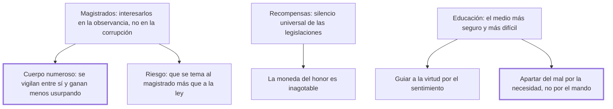

# 43. Magistrados + 44. Recompensas + 45. Educación

## 1. Idea principal

Los tres últimos medios de prevención: un cuerpo de magistrados numeroso y vigilado entre sí, premios a la virtud —que ninguna legislación contempla— y una educación que aparte del mal por la necesidad y no por el mando.

Contestan qué más puede hacer el Estado además de legislar bien. Son tres capítulos brevísimos que completan la serie abierta en el cap. 41.

## 2. Lo esencial del capítulo

El cap. 43 busca que el cuerpo ejecutor de las leyes esté **más interesado en su observancia que en su corrupción**, y la solución que propone es numérica: cuanto mayor sea el número de quienes lo componen, menos peligrosa es la usurpación, por dos razones distintas (cap. 43). Una, que la venalidad es más difícil entre miembros que se observan entre sí. Otra, que cada uno está menos interesado en acrecentar la autoridad del cuerpo cuanto menor es la porción que le tocaría, sobre todo comparada con el riesgo del atentado. Y advierte el error opuesto: si el soberano, con el aparato, la pompa, la austeridad de los edictos y el rechazo de las quejas —justas e injustas— acostumbra a los súbditos a temer más a los magistrados que a las leyes, los magistrados se aprovecharán de ese temor más de lo que conviene a la seguridad pública y privada. Es la aplicación institucional del tercer imperativo del cap. 41.

El cap. 44 señala un vacío que Beccaria dice observar en las leyes de todas las naciones: **el silencio universal sobre recompensar la virtud**. El argumento es una analogía con las academias: si los premios ofrecidos a quienes descubren verdades provechosas multiplicaron las noticias y los buenos libros, no se ve por qué los premios distribuidos por el soberano no multiplicarían las acciones virtuosas. Y agrega la observación que hace practicable la idea: la moneda del honor "es siempre inagotable y fructífera en las manos del sabio distribuidor", es decir que el Estado dispone de un recurso que no se gasta.

El cap. 45 llama a la educación **el más seguro pero más difícil** de los medios. Reconoce que excede los límites que se fijó y explica por qué ha sido siempre un campo estéril: tiene vínculos demasiado estrechos con la naturaleza del gobierno, así que solo lo cultivaron aquí y allá unos pocos sabios. Remite después a "un grande hombre, que ilumina la misma humanidad que lo persigue" —Rousseau, sin nombrarlo— y resume sus máximas en cuatro. Que la educación consista menos en una muchedumbre estéril de objetos que en su elección y concreción. Que se sustituyan las copias por los originales, en los fenómenos morales tanto como en los físicos. Que se guíe a la virtud "por el camino fácil del sentimiento". Y que se aparte del mal por el camino infalible de la necesidad y del inconveniente, y no por el incierto del mando y de la fuerza, con el cual solo se obtiene una obediencia disimulada y momentánea. Notar que ese último punto es el mismo principio del libro entero: enseñar las consecuencias reales de los actos, no imponerlas.

## 3. Mapa

## 4. Vocabulario clave

- **Cuerpo ejecutor de las leyes** — el conjunto de magistrados; cuanto más numeroso, menos expuesto a la venalidad.
- **Moneda del honor** — el recurso simbólico con que el soberano puede premiar la virtud sin agotarlo.
- **Educación por la necesidad** — la que aparta del mal mostrando sus consecuencias, frente a la que manda.

## 5. Distinciones que se confunden

- **Temer al magistrado vs. temer a la ley** — el aparato y la pompa producen lo primero y debilitan lo segundo.
  - Se confunden porque: el magistrado aplica la ley, así que su autoridad parece la de ella.
  - Criterio para decidir: ¿lo que se teme cambia según quién juzgue? Entonces el temor es al hombre, y él lo aprovechará.
  - Dónde se cae: se refuerza la solemnidad del cargo creyendo que se refuerza la ley, y el efecto es el contrario.

- **Obediencia por necesidad vs. por mando** — la primera es duradera; la segunda, disimulada y momentánea.
  - Se confunden porque: las dos producen la conducta buscada mientras hay vigilancia.
  - Criterio para decidir: ¿el joven entendió el inconveniente del acto, o solo la orden? Solo lo primero se sostiene sin el que manda.
  - Dónde se cae: se educa con castigos y se cree obtenida la virtud, cuando lo obtenido es el disimulo.

## 6. Autoevaluación

1. ¿Por qué un cuerpo de magistrados numeroso es menos peligroso que uno pequeño?
2. Beccaria dice que ninguna legislación premia la virtud. ¿Por qué le parece un vacío grave?
3. ¿Qué quiere decir "sustituir las copias por los originales" en la educación?
4. Los tres capítulos son muy breves. ¿Es un defecto del libro?

--- No mires esto hasta responder ---

1. Por dos razones que operan a la vez: la venalidad es más difícil entre miembros que se observan mutuamente, y cada uno tiene menos incentivo a usurpar autoridad porque la porción que le tocaría es pequeña frente al riesgo del atentado. El número funciona como control interno y como desincentivo (cap. 43).
2. Porque el libro entero se apoya en que los hombres actúan por motivos, y el Estado solo estaba usando la mitad del recurso: la pena. Si los premios académicos multiplicaron los buenos libros, el mismo mecanismo debería multiplicar las acciones virtuosas. Y el costo es nulo, porque la moneda del honor no se agota.
3. Enseñar con los fenómenos mismos y no con relatos sobre ellos, tanto en lo físico como en lo moral. Es coherente con su psicología: las impresiones que forman conductas son las que hieren los sentidos, así que una virtud aprendida de segunda mano no imprime nada.
4. Es una desproporción real: la prevención se declara el fin principal de la legislación en el cap. 41 y se despacha en tres capítulos que suman poco más de dos mil caracteres, mientras la tortura o la pena de muerte ocupan páginas. Beccaria lo justifica diciendo que la educación excede los límites que se fijó, y en el caso de las recompensas remite a un terreno sin legislación previa que comentar. Aun así, el desbalance es visible.

## Flashcards

Cuál es el medio de prevención del cap. 43 | Interesar al cuerpo ejecutor de las leyes más en su observancia que en su corrupción
Por qué es menos peligroso un cuerpo de magistrados numeroso | Porque se observan entre sí y a cada uno le tocaría una porción menor al usurpar
Qué ocurre si los súbditos temen más al magistrado que a la ley | Que los magistrados se aprovechan de ese temor más de lo que conviene a la seguridad
Qué vacío observa Beccaria en las leyes de todas las naciones | El silencio universal sobre recompensar la virtud
Con qué analogía defiende los premios a la virtud | Con los premios de las academias, que multiplicaron las verdades y los buenos libros
Cómo llama al honor como recurso del soberano | Una moneda siempre inagotable y fructífera en manos del sabio distribuidor
Cuál es el medio más seguro pero más difícil de evitar delitos | Perfeccionar la educación
Por qué camino debe apartarse del mal según el cap. 45 | Por el infalible de la necesidad y el inconveniente, no por el incierto del mando y la fuerza
