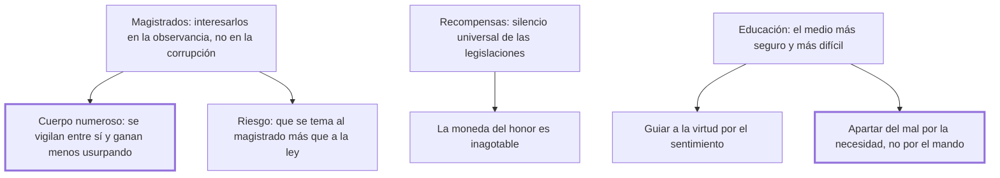

# 43. Magistrados + 44. Recompensas + 45. Educación

## 1. Idea principal

Los tres últimos medios de prevención: un cuerpo de magistrados numeroso y vigilado entre sí, premios a la virtud —que ninguna legislación contempla— y una educación que aparte del mal por la necesidad y no por el mando.

Contestan qué más puede hacer el Estado además de legislar bien. Son tres capítulos brevísimos que completan la serie abierta en el cap. 41.

## 2. Lo esencial del capítulo

El cap. 43 busca que el cuerpo ejecutor de las leyes esté **más interesado en su observancia que en su corrupción**, y la solución que propone es numérica: cuanto mayor sea el número de quienes lo componen, menos peligrosa es la usurpación, porque la venalidad es más difícil entre miembros que se observan entre sí y porque a cada uno le tocaría una porción menor, pequeña frente al riesgo del atentado (cap. 43). Y advierte el error opuesto: si el soberano, con el aparato, la pompa y la austeridad de los edictos, acostumbra a los súbditos a temer más a los magistrados que a las leyes, los magistrados se aprovecharán de ese temor más de lo que conviene a la seguridad pública y privada. Es la aplicación institucional del tercer imperativo del cap. 41.

El cap. 44 señala un vacío que Beccaria dice observar en las leyes de todas las naciones: **el silencio universal sobre recompensar la virtud**. El argumento es una analogía con las academias, que afirma sin demostrar: si los premios ofrecidos a quienes descubren verdades provechosas multiplicaron las noticias y los buenos libros, no se ve por qué los premios distribuidos por el soberano no multiplicarían las acciones virtuosas (cap. 44). Y agrega lo que hace practicable la idea: la moneda del honor "es siempre inagotable y fructífera en las manos del sabio distribuidor", es decir que el Estado dispone de un recurso que no se gasta.

El cap. 45 llama a la educación **el más seguro pero más difícil** de los medios, reconoce que excede los límites que se fijó y explica su esterilidad histórica por sus vínculos demasiado estrechos con la naturaleza del gobierno. Remite a "un grande hombre, que ilumina la misma humanidad que lo persigue" —Rousseau, sin nombrarlo— y resume sus máximas en cuatro, que conviene leer enteras en el original (cap. 45); la última es el principio del libro entero: apartar del mal por el camino infalible de la necesidad y del inconveniente, y no por el incierto del mando y de la fuerza, con el cual solo se obtiene una obediencia disimulada y momentánea.

## 3. Mapa

## 4. Vocabulario clave

- **Cuerpo ejecutor de las leyes** — el conjunto de magistrados; cuanto más numeroso, menos expuesto a la venalidad.
- **Moneda del honor** — el recurso simbólico con que el soberano puede premiar la virtud sin agotarlo.
- **Educación por la necesidad** — la que aparta del mal mostrando sus consecuencias, frente a la que manda.

## 5. Distinciones que se confunden

- **Temer al magistrado vs. temer a la ley** — el aparato y la pompa producen lo primero y debilitan lo segundo.
  - Se confunden porque: el magistrado aplica la ley, así que su autoridad parece la de ella.
  - Criterio para decidir: ¿lo que se teme cambia según quién juzgue? Entonces el temor es al hombre, y él lo aprovechará.
  - Dónde se cae: se refuerza la solemnidad del cargo creyendo que se refuerza la ley, y el efecto es el contrario.

- **Obediencia por necesidad vs. por mando** — la primera es duradera; la segunda, disimulada y momentánea.
  - Se confunden porque: las dos producen la conducta buscada mientras hay vigilancia.
  - Criterio para decidir: ¿el joven entendió el inconveniente del acto, o solo la orden? Solo lo primero se sostiene sin el que manda.
  - Dónde se cae: se educa con castigos y se cree obtenida la virtud, cuando lo obtenido es el disimulo.

## 6. Autoevaluación

1. Ubique los tres medios de prevención de los caps. 43 a 45 dentro del programa abierto en el cap. 41 y explique el fundamento de cada uno.
2. Los tres capítulos son muy breves. ¿Es un defecto del libro?

--- No mires esto hasta responder ---

1. El cap. 41 había declarado que evitar los delitos es el fin principal de la legislación y había fijado tres imperativos sobre las leyes; los caps. 43 a 45 agregan los medios que no son la ley misma. El primero es institucional: un cuerpo ejecutor numeroso, porque la venalidad es más difícil entre miembros que se observan entre sí y porque a cada uno le tocaría una porción menor al usurpar, con el cuidado de que el aparato y la pompa no hagan temer al magistrado más que a la ley (cap. 43). El segundo es el premio a la virtud, vacío que Beccaria dice observar en las leyes de todas las naciones, y que funda por analogía con los premios de las academias y en que la moneda del honor es inagotable en manos del sabio distribuidor (cap. 44). El tercero es la educación, "el más seguro pero más difícil", cuyo principio es apartar del mal por la necesidad y el inconveniente y no por el mando y la fuerza, que solo obtienen obediencia disimulada (cap. 45). Los tres comparten el supuesto del libro: los hombres actúan por motivos, y prevenir es ordenar los motivos, no aumentar las penas.
2. Es una desproporción real: la prevención se declara el fin principal de la legislación en el cap. 41 y se despacha en tres capítulos brevísimos, mientras la tortura o la pena de muerte ocupan páginas. Beccaria lo justifica diciendo que la educación excede los límites que se fijó, y en el caso de las recompensas remite a un terreno sin legislación previa que comentar. Aun así, el desbalance es visible y deja el programa preventivo mucho menos elaborado que el punitivo.

## Flashcards

Cuáles son los tres medios de prevención de los caps. 43 a 45 | Un cuerpo de magistrados numeroso, las recompensas a la virtud y la educación
Por qué es menos peligroso un cuerpo de magistrados numeroso | Porque se observan entre sí y a cada uno le tocaría una porción menor al usurpar
Qué vacío observa Beccaria en las leyes de todas las naciones | El silencio universal sobre recompensar la virtud
Por qué camino debe apartarse del mal según el cap. 45 | Por el infalible de la necesidad y el inconveniente, no por el incierto del mando y la fuerza
