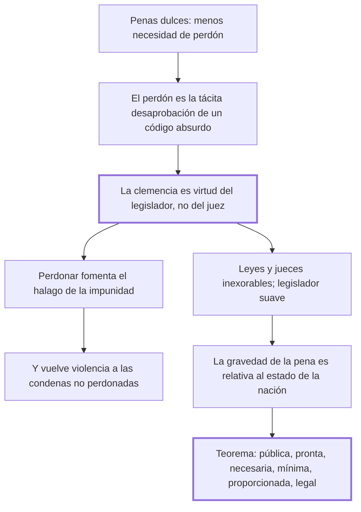

# 46. Del perdón + 47. Conclusión

## 1. Idea principal

La clemencia es virtud del legislador y no del juez: debe estar en el código y no en las sentencias. Y el teorema final: toda pena debe ser pública, pronta, necesaria, la mínima posible, proporcionada y dictada por las leyes.

Cierran el libro. El cap. 47 mide diez líneas y contiene la definición de pena legítima que la tradición conservó como resumen del tratado.

## 2. Lo esencial del capítulo

La tesis del cap. 46 parte de una relación inversa: a medida que las penas son más dulces, la clemencia y el perdón son menos necesarios, hasta el punto de que sería dichosa la nación donde resultaran funestos. El perdón fue alguna vez el suplemento de todas las obligaciones del trono, pero debería quedar excluido de una legislación perfecta. Y Beccaria explica de dónde viene su prestigio: los perdones son necesarios en proporción a lo absurdo de las leyes y a la atrocidad de las sentencias. Por eso los llama **la tácita desaprobación** que los soberanos benéficos dan a un código sostenido por la preocupación de los siglos.

De ahí la distinción central: la clemencia es virtud del legislador, no del ejecutor de las leyes, y debe resplandecer en el código y no en los juicios particulares. El argumento contra el perdón judicial es de expectativas: hacer ver que los delitos pueden perdonarse y que la pena no es consecuencia necesaria "es fomentar el halago de la impunidad", y convierte a las condenas no perdonadas en violencias de la fuerza más que en providencias de la justicia. El doble filo importa: el perdón no solo debilita la prevención, sino que deslegitima las penas que sí se aplicaron. Y cuando el príncipe perdona a un particular, con ese acto privado forma "un decreto público de impunidad".

La fórmula que resume el capítulo es simétrica: sean inexorables las leyes y sus ejecutores en los casos particulares, pero sea **suave, indulgente y humano el legislador**. Y el consejo final es de arquitectura institucional: que levante su edificio sobre las bases del propio amor y haga que el interés general resulte de los intereses particulares, sin elevar "el simulacro de la salud pública sobre el terror y sobre la desconfianza".

El cap. 47 agrega una última reflexión y el teorema. La reflexión es que **la gravedad de las penas debe ser relativa al estado de la nación**: hacen falta impresiones más fuertes sobre los ánimos endurecidos de un pueblo recién salido de la barbarie, porque al feroz león que se revuelve al golpe de un arma lo abate el rayo; pero a medida que los ánimos se suavizan crece la sensibilidad, y debe disminuir la fuerza de la pena para mantener constante la relación entre el objeto y la sensación. El teorema, que él llama "poco conforme al uso, legislador ordinario de las naciones", enumera seis requisitos: para que una pena no sea violencia de uno o de muchos contra un ciudadano, debe ser **pública, pronta, necesaria, la más pequeña de las posibles en las circunstancias actuales, proporcionada a los delitos y dictada por las leyes**.

## 3. Mapa

## 4. Vocabulario clave

- **Clemencia** — la benignidad que debe estar en el código y no en la sentencia; virtud del legislador.
- **Perdón** — la gracia concedida en el caso particular; para Beccaria, un decreto público de impunidad.
- **Teorema general** — la definición final: pena pública, pronta, necesaria, mínima, proporcionada y legal.
- **Relatividad de la pena** — su gravedad debe ajustarse a la sensibilidad del pueblo en cada época.

## 5. Distinciones que se confunden

- **Clemencia del legislador vs. perdón del juez o del príncipe** — la primera se escribe en el código; el segundo se concede caso por caso.
  - Se confunden porque: las dos alivian al condenado y las dos se sienten como humanidad.
  - Criterio para decidir: ¿el beneficio vale para todos los casos iguales, o para este? Solo lo primero es clemencia legislativa.
  - Dónde se cae: se elogia al gobernante que indulta, cuando su indulto es la confesión de que el código es absurdo.

- **Pena relativa al estado de la nación vs. pena arbitraria** — la primera se ajusta a la sensibilidad general; la segunda, al criterio de quien juzga.
  - Se confunden porque: las dos admiten que la misma conducta reciba penas distintas en contextos distintos.
  - Criterio para decidir: ¿quién hace el ajuste y con qué generalidad? Es el legislador, para toda la nación y por época, no el juez para un caso.
  - Dónde se cae: se invoca "las circunstancias" para agravar una pena concreta, que es el arbitrio del cap. 4.

## 6. Autoevaluación

1. ¿Por qué el perdón deslegitima también a las penas que sí se aplicaron?
2. Beccaria pide jueces inexorables y legisladores suaves. ¿No es una forma de dureza?
3. Admite que un pueblo recién salido de la barbarie necesita penas más fuertes. ¿Contradice eso el resto del libro?
4. Repasá el teorema final: ¿de qué capítulo sale cada uno de los seis requisitos?

--- No mires esto hasta responder ---

1. Porque si el delito puede perdonarse, la pena deja de ser una consecuencia necesaria del hecho y pasa a depender de una voluntad. Entonces, dice Beccaria, las condenas no perdonadas parecen violencias de la fuerza más que providencias de la justicia: quien fue castigado lo fue porque nadie decidió eximirlo (cap. 46).
2. No, y es el mismo par del cap. 27: la severidad inexorable del juez solo es virtud útil con una legislación suave. La benignidad tiene que estar antes, en la definición general de la pena, donde beneficia a todos por igual; puesta en el momento de aplicar, se vuelve privilegio y destruye la infalibilidad de la que depende la prevención.
3. No lo contradice, pero sí lo tensiona. La regla que enuncia es de proporción constante entre el objeto y la sensación: lo que importa es el efecto sobre el ánimo, y un pueblo endurecido siente menos. Aun así, el criterio abre una puerta —la de justificar más rigor invocando el atraso de un pueblo— que el libro no cierra con ninguna garantía.
4. Pública, del cap. 14 sobre juicios y pruebas públicas. Pronta, del cap. 19. Necesaria, de los caps. 2 y 25. La más pequeña posible, del cap. 27. Proporcionada, del cap. 6. Dictada por las leyes, del cap. 3 y del cap. 4. El teorema no agrega nada nuevo: es el índice del libro escrito como definición.

## Flashcards

Qué relación hay entre la dulzura de las penas y el perdón | Cuanto más dulces son las penas, menos necesarios son la clemencia y el perdón
Qué es el perdón respecto del código, según Beccaria | La tácita desaprobación que el soberano da a un código absurdo
De quién es virtud la clemencia | Del legislador, no del ejecutor de las leyes
Dónde debe resplandecer la clemencia | En el código, no en los juicios particulares
Qué efecto tiene sobre las condenas no perdonadas la existencia del perdón | Las hace parecer violencias de la fuerza más que providencias de la justicia
Cuál es la fórmula final del cap. 46 | Inexorables las leyes y sus ejecutores; suave, indulgente y humano el legislador
Por qué debe ser relativa al estado de la nación la gravedad de las penas | Porque al crecer la sensibilidad debe disminuir la fuerza de la pena para mantener el mismo efecto
Cuáles son los seis requisitos del teorema final | Pública, pronta, necesaria, la más pequeña posible, proporcionada a los delitos y dictada por las leyes
