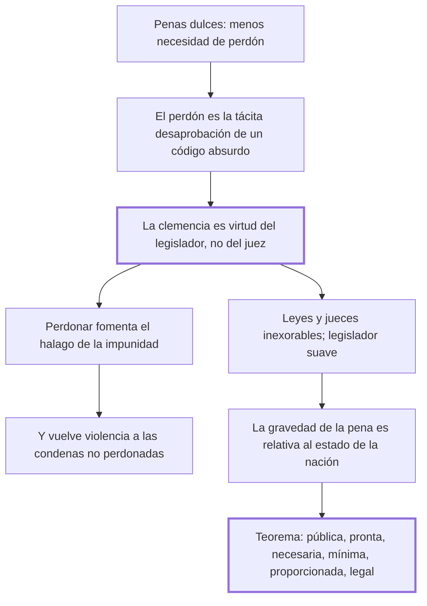

# 46. Del perdón + 47. Conclusión

## 1. Idea principal

La clemencia es virtud del legislador y no del juez: debe estar en el código y no en las sentencias. Y el teorema final: toda pena debe ser pública, pronta, necesaria, la mínima posible, proporcionada y dictada por las leyes.

Cierran el libro. El cap. 47 mide diez líneas y contiene la definición de pena legítima que la tradición conservó como resumen del tratado.

## 2. Lo esencial del capítulo

La tesis del cap. 46 parte de una relación inversa: a medida que las penas son más dulces, la clemencia y el perdón son menos necesarios, hasta el punto de que sería dichosa la nación donde resultaran funestos. El perdón, alguna vez suplemento de todas las obligaciones del trono, debería quedar excluido de una legislación perfecta, porque los perdones son necesarios en proporción a lo absurdo de las leyes y a la atrocidad de las sentencias: son **la tácita desaprobación** que los soberanos benéficos dan a un código sostenido por la preocupación de los siglos. De ahí la distinción central: la clemencia es virtud del legislador, no del ejecutor de las leyes, y debe resplandecer en el código y no en los juicios particulares (cap. 46).

El argumento contra el perdón judicial es de expectativas: hacer ver que los delitos pueden perdonarse y que la pena no es consecuencia necesaria "es fomentar el halago de la impunidad", y convierte a las condenas no perdonadas en violencias de la fuerza más que en providencias de la justicia; cuando el príncipe perdona a un particular, con ese acto privado forma "un decreto público de impunidad" (cap. 46). El perdón debilita la prevención y además deslegitima las penas aplicadas. La fórmula que resume el capítulo es simétrica —inexorables las leyes y sus ejecutores en los casos particulares, pero **suave, indulgente y humano el legislador**—, y el consejo final es levantar el edificio sobre las bases del propio amor, haciendo que el interés general resulte de los particulares, sin elevar "el simulacro de la salud pública sobre el terror y sobre la desconfianza".

El cap. 47 agrega que **la gravedad de las penas es relativa al estado de la nación**: los ánimos endurecidos de un pueblo recién salido de la barbarie piden impresiones más fuertes, pero al suavizarse crece la sensibilidad y debe disminuir la pena para mantener constante la relación entre el objeto y la sensación (cap. 47). Cierra con el teorema general, que él mismo llama "poco conforme al uso, legislador ordinario de las naciones": para que una pena no sea violencia de uno o de muchos contra un ciudadano particular, debe ser **pública, pronta, necesaria, la más pequeña de las posibles en las circunstancias actuales, proporcionada a los delitos y dictada por las leyes**.

## 3. Mapa

## 4. Vocabulario clave

- **Clemencia** — la benignidad que debe estar en el código y no en la sentencia; virtud del legislador.
- **Perdón** — la gracia concedida en el caso particular; para Beccaria, un decreto público de impunidad.
- **Teorema general** — la definición final: pena pública, pronta, necesaria, mínima, proporcionada y legal.
- **Relatividad de la pena** — su gravedad debe ajustarse a la sensibilidad del pueblo en cada época.

## 5. Distinciones que se confunden

- **Clemencia del legislador vs. perdón del juez o del príncipe** — la primera se escribe en el código; el segundo se concede caso por caso.
  - Se confunden porque: las dos alivian al condenado y las dos se sienten como humanidad.
  - Criterio para decidir: ¿el beneficio vale para todos los casos iguales, o para este? Solo lo primero es clemencia legislativa.
  - Dónde se cae: se elogia al gobernante que indulta, cuando su indulto es la confesión de que el código es absurdo.

- **Pena relativa al estado de la nación vs. pena arbitraria** — la primera se ajusta a la sensibilidad general; la segunda, al criterio de quien juzga.
  - Se confunden porque: las dos admiten que la misma conducta reciba penas distintas en contextos distintos.
  - Criterio para decidir: ¿quién hace el ajuste y con qué generalidad? Es el legislador, para toda la nación y por época, no el juez para un caso.
  - Dónde se cae: se invoca "las circunstancias" para agravar una pena concreta, que es el arbitrio del cap. 4.

## 6. Autoevaluación

1. ¿Qué se entiende por pena legítima en Beccaria? Enuncie el teorema con que cierra el libro y explique de dónde sale cada uno de sus requisitos.
2. Admite que un pueblo recién salido de la barbarie necesita penas más fuertes. ¿Contradice eso el resto del libro?

--- No mires esto hasta responder ---

1. Pena legítima es la que no constituye violencia de uno o de muchos contra un ciudadano particular, y el teorema general del cap. 47 la define por seis requisitos que deben darse juntos: debe ser pública, pronta, necesaria, la más pequeña de las posibles en las circunstancias actuales, proporcionada a los delitos y dictada por las leyes. Cada uno resume un tramo del libro: pública, por los juicios y pruebas públicas del cap. 14; pronta, por el cap. 19; necesaria, por los caps. 2 y 25; la mínima posible, por el cap. 27, que hace de la dulzura una condición de eficacia y no una concesión; proporcionada, por la escala del cap. 6; y dictada por las leyes, por los caps. 3 y 4, que le niegan al juez la facultad de interpretarlas. La implicación es que los requisitos no se compensan entre sí: una pena proporcionada pero arbitraria, o legal pero excesiva, ya es violencia. El teorema no agrega doctrina nueva, es el índice del tratado escrito como definición, y por eso la tradición lo conservó como su resumen.
2. No lo contradice, pero sí lo tensiona. La regla que enuncia es de proporción constante entre el objeto y la sensación: lo que importa es el efecto sobre el ánimo, y un pueblo endurecido siente menos. Aun así, el criterio abre una puerta —la de justificar más rigor invocando el atraso de un pueblo— que el libro no cierra con ninguna garantía.

## Flashcards

Cuáles son los seis requisitos del teorema final | Pública, pronta, necesaria, la más pequeña posible, proporcionada a los delitos y dictada por las leyes
De quién es virtud la clemencia y dónde debe resplandecer | Del legislador y no del ejecutor de las leyes: en el código, no en los juicios particulares
Qué es el perdón respecto del código, según Beccaria | La tácita desaprobación que el soberano da a un código absurdo
Por qué debe ser relativa al estado de la nación la gravedad de las penas | Porque al crecer la sensibilidad debe disminuir la fuerza de la pena para mantener el mismo efecto
