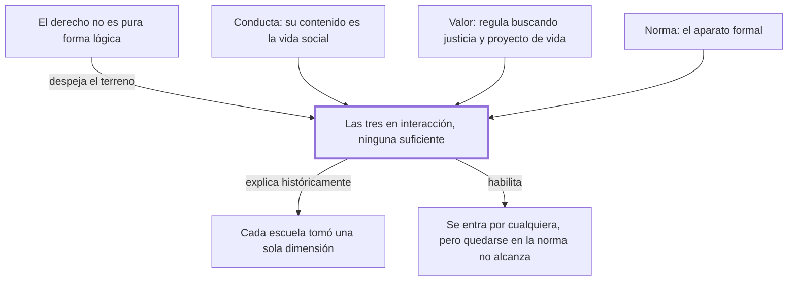

# § 53. La complejidad de la experiencia jurídica

## 1. Idea principal

El derecho no es solo las leyes escritas: es la interacción de tres elementos inseparables —conducta, norma y valor—, y ninguno por sí solo alcanza para entenderlo.

Contesta qué es lo que estudia un jurista, una pregunta que parece obvia y no lo es. De acá sale la vara con la que el autor va a criticar después a las escuelas que se quedaron con una sola parte.

## 2. Lo esencial del capítulo

El derecho no es una ciencia lógico-matemática donde la persona sea apenas un casillero al que se le anotan derechos y deberes (p. 119). Hace falta una teoría del ordenamiento formal, pero con eso no se agota el asunto: el contenido del derecho es la vida humana en sociedad. De ahí una consecuencia que cambia qué tiene que saber un abogado: el derecho no puede estudiarse encerrado en sí mismo, y el jurista necesita a cada paso el auxilio de otras disciplinas que se ocupan del ser humano en sociedad (p. 120). Un médico puede sabérse el manual de dosis de memoria, pero si no pregunta cómo vive el paciente, receta a ciegas.

Falta un tercer elemento: el derecho no ordena la convivencia de cualquier manera, la ordena buscando algo valioso. Los tres fines que nombra son justicia, seguridad y solidaridad, y la razón de ser es que cada persona pueda cumplir con su "proyecto de vida", el plan que traza libremente para sí (p. 120). Acá aparece la expresión "ontológicamente libre" —libre por su propia naturaleza, no porque una ley lo permita—, afirmada sin desarrollo.

Con eso reunido llega la formulación central: el derecho se integra, en interacción dinámica y unitaria, por conductas humanas intersubjetivas, normas y valores jurídicos (p. 120). La parte fuerte es doble: ninguna de las tres por sí sola es derecho, y ninguna puede dejarse de lado si se lo quiere entender completo. La nota al pie sitúa la teoría: se llama tridimensionalismo y surgió a la vez en Brasil, con Miguel Reale en 1953, y en Perú, con la tesis del propio autor de 1950. Se enuncia y se apoya en esa tradición, pero no se demuestra paso a paso.

De ahí sale una lectura conciliadora de la historia: las corrientes que eligieron una sola dimensión produjeron avances reales, no errores, y lo que falta es la complementariedad entre ellos. Acá se enumeran varias escuelas y una lista larga de autores; leelas en las pp. 121-122 y en las dos notas, no las repito. Sigue el punto más fácil de malentender: que el derecho sea complejo no impide estudiar cada dimensión por separado, porque el problema es "de carácter epistemológico" (p. 122), o sea sobre cómo se conoce cada una. El cierre es práctico: se puede entrar por cualquiera de las tres y el jurista suele entrar por la norma, pero quedarse ahí es hacer lógica jurídica, y por esa ruta no se llega a "vivenciar la justicia" (p. 123). No queda explicado por qué la norma sería la puerta normal si las tres valen igual.

## 3. Mapa

## 4. Vocabulario clave

- **Experiencia jurídica** — el derecho tal como ocurre en la vida real; el autor la llama también "lo jurídico" (p. 120).
- **Sujeto de derecho** — aquel a quien el ordenamiento puede atribuirle derechos y deberes.
- **Conducta intersubjetiva** — conducta de unas personas frente a otras, no la de alguien aislado.
- **Tridimensionalismo** — la teoría de que el derecho son siempre conducta, norma y valor a la vez.
- **Proyecto de vida** — el plan que cada uno traza libremente para su vida y que el derecho debe hacer posible.

## 5. Distinciones que se confunden

- **El derecho vs. la ley** — la ley es una de las tres dimensiones; el derecho es las tres juntas.
  - Se confunden porque: en la facultad se estudia sobre todo el texto de las leyes.
  - Criterio para decidir: ¿lo que nombro se puede leer en un texto normativo y nada más? Si sí, es la ley.
  - Dónde se cae: se contesta "el derecho es el conjunto de normas vigentes", que para este autor es incompleto.

- **Estudiar una dimensión aparte vs. el derecho estar dividido** — lo primero es método; lo segundo sería una afirmación sobre la realidad, y se rechaza.
  - Se confunden porque: si una disciplina puede ocuparse solo de la norma, parece que la norma fuera independiente.
  - Criterio para decidir: ¿la separación está en cómo lo conozco o en cómo existe? Acá es epistemológica.
  - Dónde se cae: se responde que el derecho tiene partes autónomas, cuando lo autónomo es su vía de conocimiento.

## 6. Autoevaluación

1. Un juez resuelve un desalojo citando solo el artículo aplicable, sin mirar la situación de las personas ni el fin que la norma protege. ¿Qué está haciendo y qué le falta?
2. Alguien dice: "estudio primero todas las normas y después, si me da el tiempo, la parte social y de valores". ¿Qué error tiene ese plan y qué parte no es un error?
3. El autor sostiene que las tres dimensiones se exigen recíprocamente. ¿Lo demuestra o lo asume?
4. Dice que se puede entrar por cualquiera de las tres, y también que "normalmente" se entra por la norma. ¿Es una contradicción?

--- No mires esto hasta responder ---

1. Se queda en la dimensión normativa: hace análisis formal. Le falta trascender la norma hacia la conducta que regula y el valor que protege; por esa ruta no se llega a "vivenciar la justicia" (p. 123).
2. El error es tratarlas como módulos independientes y postergables, cuando se exigen entre sí. Lo que no es error es empezar por la norma: el autor admite que esa es la entrada habitual (p. 123).
3. La asume. La enuncia, la apoya en la tradición tridimensionalista (nota 1, p. 120) y la respalda mostrando que las escuelas parciales no alcanzan, pero no demuestra por qué son exactamente tres. Discutible: esa insuficiencia puede leerse como argumento indirecto.
4. No necesariamente: distingue lo posible en principio de lo frecuente en la práctica. Pero no explica por qué la norma sería la puerta normal si las tres valen igual, así que la tensión queda abierta (p. 123).

## Flashcards

Las tres dimensiones del derecho según Fernández Sessarego | Conducta humana intersubjetiva, norma jurídica y valor jurídico
Qué significa conducta intersubjetiva | Conducta de unas personas frente a otras, no la de alguien aislado
Qué es el proyecto de vida en este autor | El plan que cada persona traza libremente para su vida y que el derecho debe hacer posible
Qué es el tridimensionalismo jurídico | La teoría de que el derecho son siempre tres dimensiones a la vez, no una
Dónde y cuándo surgió el tridimensionalismo | A la vez en Brasil con Miguel Reale en 1953 y en Perú con la tesis del autor de 1950
Qué tres fines persigue el derecho al regular, según el capítulo | Justicia, seguridad y solidaridad
De qué tipo es el problema de estudiar las dimensiones por separado | Epistemológico: es sobre cómo se conoce, no sobre cómo el derecho existe
Cómo distingo el derecho de la ley | La ley es una sola dimensión; el derecho son las tres actuando juntas
