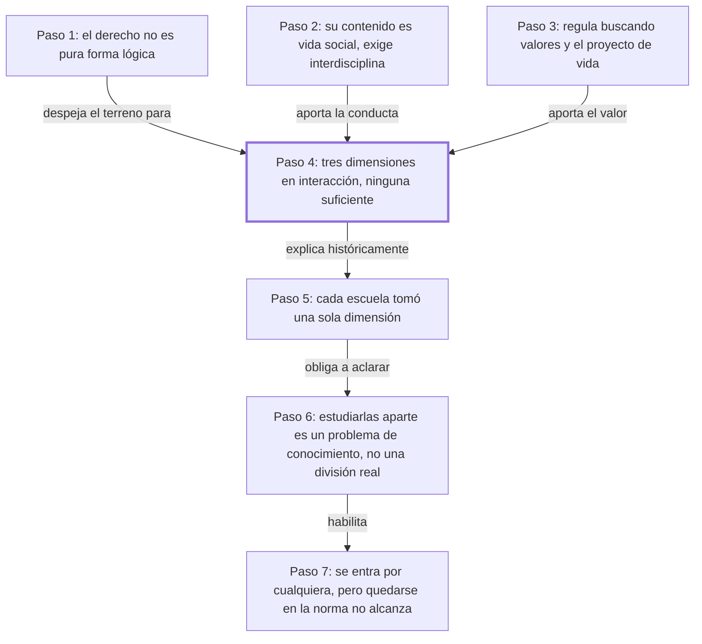

# § 53. La complejidad de la experiencia jurídica

## 1. Idea principal

El derecho no es solo el conjunto de las leyes escritas: es la interacción permanente de tres elementos inseparables —la conducta de las personas, la norma y los valores—, y ninguno de los tres, por sí solo, alcanza para entender qué es el derecho.

Este capítulo viene a contestar una pregunta que parece obvia y no lo es: ¿qué es exactamente lo que estudia un jurista? A un principiante le conviene entenderla antes de seguir porque de acá sale la vara con la que el autor va a criticar, en los capítulos siguientes, a las escuelas que se quedaron con una sola de las tres partes. Además, el autor sostiene que estudiar cada elemento por separado es legítimo y hasta necesario, pero que hacerlo no autoriza a creer que el derecho *sea* solamente ese elemento.

## 2. Explicación paso a paso

### Paso 1 — Descarta que el derecho sea pura forma lógica

El capítulo abre con "El derecho, tal como se presenta en la experiencia" (p. 119-120, antes de la primera marca de folio). El movimiento es un descarte: antes de decir qué es el derecho, el autor dice qué no es. No es una ciencia lógico-matemática donde la persona sea apenas un casillero al que se le anotan derechos y deberes. La palabra que usa para ese casillero es "sujeto de derecho", que en la jerga jurídica significa: todo aquel a quien el ordenamiento le puede atribuir derechos y obligaciones. Su objeción es que reducir a la persona a ese casillero deja afuera al ser humano concreto que vive en sociedad. Reconoce que hace falta una teoría del ordenamiento formal —es decir, del sistema de reglas ordenado y coherente—, pero niega que con eso se agote el asunto. Importa porque si el derecho fuera pura forma, todo el resto del capítulo sobraría: bastaría con estudiar la estructura de las normas y listo.

### Paso 2 — Ancla el derecho en la vida social y lo obliga a ser interdisciplinario

Sigue en "Es imposible concebir el derecho aislado del contexto social" (p. 120). Acá el movimiento es fijar una consecuencia del descarte anterior: si el contenido del derecho es la vida humana en sociedad, entonces el derecho no puede estudiarse encerrado en sí mismo. De ahí saca una exigencia práctica para quien ejerce: el trabajo del jurista necesita a cada paso el auxilio de otras disciplinas que se ocupan del ser humano en sociedad. Una analogía cotidiana: un médico puede saberse de memoria el manual de dosis, pero si no pregunta qué come y cómo vive el paciente, receta a ciegas. Importa porque esta es la primera consecuencia concreta que se desprende del planteo: no es una discusión abstracta, cambia qué tiene que saber un abogado.

### Paso 3 — Introduce los valores y el "proyecto de vida"

En el párrafo que empieza "El derecho regula valiosamente la vida social" (p. 120) aparece el tercer elemento. El movimiento es agregar una dimensión que los dos pasos anteriores todavía no tenían: el derecho no ordena la convivencia de cualquier manera, la ordena buscando algo valioso. Nombra tres fines —justicia, seguridad y solidaridad— y les da una razón de ser: que cada persona pueda cumplir con su "proyecto de vida", esto es, el plan que cada uno traza libremente para sí. Acá el autor usa la expresión "ontológicamente libre", que quiere decir libre por su propia naturaleza, no libre porque una ley se lo permita; el capítulo lo afirma sin desarrollarlo. Importa porque el "proyecto de vida" reaparece más adelante en el libro como una categoría propia del autor, y este es el lugar donde queda plantada.

### Paso 4 — Enuncia la tesis: tres dimensiones en interacción, ninguna suficiente

El párrafo "El derecho resulta, así, una complejidad" (p. 120) es la bisagra del capítulo. El movimiento es la síntesis: junta los tres elementos que fue introduciendo y afirma que el derecho se integra por conductas humanas intersubjetivas —o sea, conductas de unas personas frente a otras—, normas y valores, en interacción dinámica y unitaria. Y agrega la parte fuerte, que es doble: ninguna de las tres dimensiones *por sí sola* es derecho, pero ninguna puede dejarse de lado si se quiere entenderlo completo. La nota al pie de esta página sitúa la teoría: se llama tridimensionalismo y surgió a la vez en Brasil, con Miguel Reale (1953), y en Perú, con la tesis del propio autor de 1950, publicada recién en 1987. Conviene notar que el autor enuncia esta tesis y la apoya en esa tradición, pero no la demuestra paso a paso: es su punto de partida.

### Paso 5 — Explica por qué cada escuela se quedó con una sola dimensión

Desde "La historia de la iusfilosofía nos muestra" (p. 121) hasta la p. 122, el movimiento es histórico y conciliador a la vez. Sostiene que a lo largo de los siglos las distintas corrientes eligieron una de las tres dimensiones como objeto de estudio, y que eso produjo avances reales, no errores: la lógica jurídica perfeccionó el estudio de la estructura del pensamiento jurídico, la sociología jurídica acercó la realidad de la convivencia, la axiología jurídica —el estudio de los valores— también progresó. Acá el autor enumera varias escuelas y una lista larga de autores, tanto en lógica como en axiología; leelas en las pp. 121-122 y en las dos notas al pie, no las repito, porque son justamente el material que conviene tener a la vista en el original. Importa porque define su postura: los aportes parciales son válidos y suman, lo que falta es la complementariedad entre ellos.

### Paso 6 — Distingue el problema de conocimiento de la unidad del derecho

El párrafo "El que la experiencia jurídica sea compleja" (p. 122) hace el movimiento más fino y más fácil de malentender de todo el capítulo. Concede algo: que el derecho sea complejo y solo captable en su totalidad no impide estudiar cada dimensión por separado, de modo estático y autónomo. Y aclara de qué tipo es esa dificultad: es "de carácter epistemológico", es decir, un problema sobre cómo se conoce algo, porque cada dimensión se conoce por una vía distinta. La analogía: en un curso de cocina podés estudiar aparte los ingredientes, la técnica y el emplatado, y eso no vuelve al plato tres platos. Importa porque acá el autor se blinda contra la objeción obvia —"pero si se pueden estudiar por separado, entonces son cosas separadas"— y a continuación reparte el trabajo entre disciplinas: lógica, sociología del derecho, axiología, ontología y epistemología jurídica.

### Paso 7 — Concluye: se entra por cualquier puerta, pero no se puede quedar en la primera

Los dos últimos tramos, "Es posible, a nuestro entender, ingresar al conocimiento" (p. 123) y "Lo que le interesa al hombre de derecho" (p. 123), cierran el argumento. El movimiento es sacar la consecuencia práctica: como las tres dimensiones se exigen entre sí, se puede empezar a conocer el derecho por cualquiera de ellas, y de hecho el jurista normalmente empieza por la norma. Pero si se queda ahí, dice, solo está haciendo lógica jurídica o lingüística, y renuncia a conocer el derecho tal como se presenta. La formulación que cierra es dura: por esa ruta no se llega a "vivenciar la justicia", tarea a la que está llamado todo juez. El autor no explica del todo por qué la norma sería la puerta "normal" si las tres valen igual como entrada. Importa porque este es el criterio con el que, en los capítulos que siguen, va a evaluar a cada escuela.

## 3. Mapa

## 4. Vocabulario clave

- **Experiencia jurídica** — el fenómeno del derecho tal como ocurre en la vida real, con sus tres dimensiones juntas; el autor la llama también "lo jurídico" (p. 120).
- **Sujeto de derecho** — aquel a quien el ordenamiento puede atribuirle derechos y deberes; el autor advierte que no es "una simple abstracción" (p. 119-120).
- **Dimensión sociológico-existencial** — el derecho visto como conducta real de personas que conviven e interactúan.
- **Dimensión formal-normativa** — el derecho visto como conjunto de reglas, escritas o de costumbre.
- **Dimensión axiológico-valorativa** — el derecho visto como portador de valores; axiología es el estudio de los valores.
- **Conducta intersubjetiva** — conducta de unas personas frente a otras, no la de alguien aislado; es el contenido que la norma regula.
- **Tridimensionalismo** — la teoría de que el derecho son siempre esas tres dimensiones a la vez; surgió en paralelo en Brasil y Perú (nota 1, p. 120).
- **Iusfilosofía** — filosofía del derecho: la disciplina que se pregunta qué es el derecho, en vez de aplicarlo.
- **Lógica jurídica** — la disciplina que estudia la estructura del pensamiento jurídico, es decir, cómo se razona con normas (p. 122).
- **Proyecto de vida** — el plan que cada persona traza libremente para su propia vida y que el derecho debería hacer posible (p. 120).

## 5. Distinciones que se confunden

- **El derecho vs. la ley** — la ley es una de las tres dimensiones; el derecho es las tres actuando juntas.
  - Se confunden porque: en la vida diaria y en la facultad se estudia sobre todo el texto de las leyes, así que se vuelve el sinónimo natural de "derecho".
  - Criterio para decidir: ¿lo que estoy nombrando se puede leer en un texto normativo? Si la respuesta es sí y nada más, estoy hablando de la ley, no del derecho.
  - Dónde se cae: se contesta "el derecho es el conjunto de normas vigentes en un Estado", que para este autor es una respuesta incompleta, no una respuesta breve.

- **Estudiar una dimensión por separado vs. el derecho estar dividido** — lo primero es una decisión de método; lo segundo sería una afirmación sobre la realidad, y el autor la rechaza.
  - Se confunden porque: si una disciplina entera puede ocuparse solo de la norma, parece seguirse que la norma es una cosa independiente.
  - Criterio para decidir: ¿la separación está en cómo lo conozco o en cómo el fenómeno existe? El autor dice que el problema es "de carácter epistemológico" (p. 122), o sea, del conocer.
  - Dónde se cae: se responde que el autor admite que el derecho tiene partes autónomas, cuando lo que admite es que se pueden conocer por vías distintas.

- **Hacer lógica jurídica vs. aprehender lo jurídico** — la primera analiza la estructura de las normas; la segunda exige atravesar la norma hasta la conducta y el valor.
  - Se confunden porque: las dos se hacen leyendo el mismo artículo de un código, y desde afuera la actividad parece idéntica.
  - Criterio para decidir: ¿me pregunté qué conducta regula esta norma y qué valor protege? Si no, me quedé en la lógica jurídica.
  - Dónde se cae: se justifica una decisión solo con la coherencia formal del texto y se cree que eso ya es aplicar derecho; el autor dice que esa ruta no lleva a "vivenciar la justicia" (p. 123).

- **Interdisciplinariedad vs. el derecho no ser autónomo** — el autor pide auxilio de otras disciplinas, pero no dice que el derecho carezca de objeto propio.
  - Se confunden porque: "no se puede captar el derecho sino en el ámbito de la totalidad de las ciencias sociales" (p. 120) suena a disolverlo en la sociología.
  - Criterio para decidir: ¿el autor está hablando del objeto de estudio o de las herramientas para estudiarlo? Acá habla de las herramientas.
  - Dónde se cae: se le atribuye la tesis de que el derecho es una rama de la sociología, que no es lo que sostiene.

- **Valor jurídico vs. opinión moral personal** — el valor del que habla el autor está "objetivado en la norma" (p. 124), incorporado a una regla; la opinión moral no.
  - Se confunden porque: los dos se expresan con las mismas palabras (justicia, dignidad) y suenan igual de subjetivos.
  - Criterio para decidir: ¿puedo señalar la norma o la institución donde ese valor quedó plasmado? Si no puedo, es una convicción mía, no la dimensión axiológica.
  - Dónde se cae: se responde que para este autor el derecho depende de lo que cada juez considere justo, que es justamente lo contrario de "objetivado en la norma".

## 6. Qué releer del original

1. (p. 120) "El derecho resulta, así, una complejidad" — es la bisagra del capítulo y la formulación exacta importa: ahí están las tres dimensiones y las dos afirmaciones sobre ellas.
2. (pp. 121-122, con las notas 1 y 2) "La historia de la iusfilosofía nos muestra" — es la enumeración de escuelas y autores que el paso 5 deliberadamente no reprodujo; conviene anotar cada nombre porque reaparecen en los capítulos siguientes.
3. (p. 122) "El que la experiencia jurídica sea compleja" — es el pasaje que más fácil se malentiende: distingue el problema de conocimiento de una división real del derecho.
4. (p. 123) "Lo que le interesa al hombre de derecho" — es la bisagra práctica: marca la diferencia entre quedarse en la norma y llegar a lo jurídico, que es el criterio de todo lo que sigue.
5. (p. 122) "bases preconsa tituidas" — la conversión automática partió esta palabra y el párrafo cierra con un asterisco suelto; leelo en el original para ver qué dice realmente.

## 7. Autoevaluación

1. ¿Qué tres elementos afirma el autor que integran la experiencia jurídica?
2. ¿Qué rechaza el autor en el primer párrafo del capítulo, antes de afirmar su propia tesis?
3. Según el autor, ¿qué se sigue del hecho de que el contenido del derecho sea la vida humana social?
4. Explicá con tus palabras por qué el autor dice que el derecho "no se agota" en ninguna de sus tres dimensiones.
5. Reformulá el paso 6: ¿por qué poder estudiar la norma por separado no prueba que el derecho sea solo norma?
6. ¿Por qué es necesario el paso 3 (los valores y el proyecto de vida)? ¿Qué le faltaría al argumento si el autor lo salteara?
7. Un juez resuelve un desalojo citando solo el artículo aplicable, sin preguntarse por la situación de las personas ni por el fin que la norma protege. Aplicando el criterio del autor, ¿qué está haciendo ese juez y qué le falta?
8. Una compañera dice: "voy a estudiar primero todas las normas y después, si me da el tiempo, veo la parte social y de valores". Usando la distinción del bloque 5, ¿qué error contiene ese plan y qué error NO contiene?
9. El autor sostiene que las tres dimensiones se exigen recíprocamente. ¿Demuestra esa afirmación en este capítulo o la asume? Justificá con lo que hay en el texto.
10. El autor dice que se puede entrar al derecho por cualquiera de las tres dimensiones, pero también que "normalmente" se entra por la norma. ¿Es una contradicción? Evaluá.

--- No mires esto hasta responder ---

1. Conductas humanas intersubjetivas, normas jurídicas y valores jurídicos, en interacción dinámica y unitaria (p. 120).
2. Rechaza que el derecho sea una pura ciencia lógico-matemática y que el sujeto de derecho sea un simple centro formal al que se le imputan situaciones jurídicas, sin correlato en la vida social (p. 119-120).
3. Que el derecho no puede concebirse aislado ni como disciplina absolutamente autónoma, y que el trabajo del jurista exige permanentemente el auxilio de otras disciplinas sobre el ser humano en sociedad (p. 120).
4. Porque las tres dimensiones tienen que estar presentes al mismo tiempo para que exista la experiencia jurídica: ninguna por sí sola es derecho, y a la vez ninguna puede dejarse de lado sin perder la totalidad (p. 120).
5. Porque la separación está en la vía de conocimiento y no en el fenómeno: el autor dice que el problema es "de carácter epistemológico", ya que cada dimensión se conoce por un camino distinto, mientras en la realidad siguen interactuando (p. 122).
6. Sin los valores el derecho quedaría como pura descripción de conductas y reglas, sin nada que explique para qué se regula. El paso 3 aporta la finalidad —justicia, seguridad, solidaridad— y con ella la tercera dimensión que la tesis del paso 4 necesita (p. 120).
7. Está haciendo, en los términos del autor, solo análisis formal: se queda en la dimensión normativa. Le falta trascender la norma hacia la conducta que regula y el valor que protege; por esa ruta, dice el texto, no se llega a "vivenciar la justicia" (p. 123).
8. El error es tratar las dimensiones como módulos independientes y postergables, cuando el autor sostiene que se exigen entre sí y que toda norma remite a conductas y valores. Lo que NO es un error es empezar por la norma: el propio autor admite que esa es la entrada habitual del jurista (p. 123).
9. La asume más que la demuestra. La enuncia en el paso 4, la apoya en la tradición tridimensionalista (Reale y su tesis de 1950, nota 1, p. 120) y la respalda mostrando que las escuelas unidimensionales no alcanzan; pero no hay en este capítulo una demostración de por qué son exactamente tres ni de por qué la exigencia entre ellas es necesaria. Respuesta discutible: puede sostenerse que la insuficiencia de las escuelas parciales funciona como argumento indirecto.
10. No es necesariamente una contradicción: distingue lo posible en principio —entrar por cualquiera, porque cada una hace patentes las otras— de lo frecuente en la práctica del jurista. Aun así, el texto no explica por qué la norma sería la puerta normal si las tres valen igual, así que la tensión queda abierta (p. 123).

## Flashcards

Las tres dimensiones de la experiencia jurídica según Fernández Sessarego | Conducta humana intersubjetiva, norma jurídica y valor jurídico
Cómo llama el autor a la dimensión de la conducta social | Dimensión sociológico-existencial
Cómo llama el autor a la dimensión de la norma | Dimensión formal-normativa
Cómo llama el autor a la dimensión de los valores | Dimensión axiológico-valorativa
Qué significa conducta intersubjetiva | Conducta de unas personas frente a otras, no la de alguien aislado
Qué es la iusfilosofía | La filosofía del derecho: se pregunta qué es el derecho en vez de aplicarlo
Qué estudia la lógica jurídica según el texto | La estructura del pensamiento jurídico, o sea cómo se razona con normas
Qué es el proyecto de vida en este autor | El plan que cada persona traza libremente para su vida y que el derecho debe hacer posible
Qué es un sujeto de derecho | Aquel a quien el ordenamiento puede atribuirle derechos y deberes
Qué es el tridimensionalismo jurídico | La teoría de que el derecho son siempre tres dimensiones a la vez, no una
Dónde y cuándo surgió el tridimensionalismo | A la vez en Brasil con Miguel Reale en 1953 y en Perú con la tesis del autor de 1950
Cómo distingo el derecho de la ley | La ley es una sola dimensión; el derecho son las tres actuando juntas
Cómo distingo estudiar una dimensión aparte de que el derecho esté dividido | Lo primero es un problema de conocimiento; en la realidad las tres siguen interactuando
Cómo distingo hacer lógica jurídica de aprehender lo jurídico | La lógica se queda en la estructura de la norma; lo jurídico exige llegar a la conducta y al valor
Cómo distingo un valor jurídico de una opinión moral propia | El valor jurídico está objetivado en la norma; la opinión moral no
Por qué el derecho exige interdisciplinariedad | Porque su contenido es la vida humana social y no puede captarse aislado de las ciencias sociales
Qué tres fines persigue el derecho al regular, según el texto | Justicia, seguridad y solidaridad
Están equivocadas las escuelas que tomaron una sola dimensión | No: aportan conocimiento parcial válido, pero ninguna alcanza la visión integral
Cuál es la vía de acceso habitual del jurista al derecho | La normatividad, es decir la norma
Un abogado analiza solo la coherencia formal de un artículo. Qué le falta según el autor | Trascender la norma hacia la conducta que regula y el valor que protege
