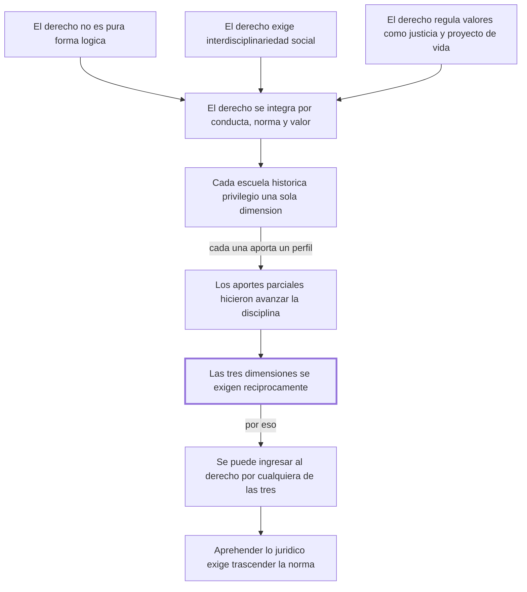

# Sección 1 — § 53. La complejidad de la experiencia jurídica

## 1. Ubicación

Esta sección abre el capítulo "Diferentes concepciones de lo jurídico", en su primer apartado, "A) Visiones unidimensionales del derecho". No sabemos qué capítulo la precede en el libro completo, porque el fragmento procesado empieza exactamente aquí; no aparece en esta sección. Según el índice de las secciones siguientes, lo que la sigue es una serie de críticas a escuelas que redujeron el derecho a una sola de sus dimensiones (§ 54 en adelante: visión fragmentaria, iusnaturalismo, formalismo, sociologismo). Esta sección plantea la tesis positiva —el tridimensionalismo— que esas críticas van a usar como vara de medir.

## 2. Tesis central en una frase

El derecho es una realidad compleja e indivisible que solo se comprende cabalmente como la interacción dinámica y recíproca de tres dimensiones —conducta humana intersubjetiva, norma y valor—, ninguna de las cuales, por separado, constituye "lo jurídico".

## 3. Mapa argumental

- Premisa 1: el derecho, tal como se vive, no es una pura ciencia lógico-formal ni el sujeto una simple abstracción (apertura de la sección, antes de la p. 120; sin folio detectado por el OCR).
- Premisa 2: el derecho no puede aislarse del contexto social, porque su contenido es la vida humana en sociedad; exige interdisciplinariedad (p. 120).
- Premisa 3: el derecho regula valiosamente la vida social buscando justicia, seguridad y solidaridad, para que cada persona pueda realizar su "proyecto de vida" (p. 120).
  - De 1, 2 y 3 se sigue que el derecho se integra, en interacción dinámica y unitaria, por tres elementos: conducta humana intersubjetiva, norma y valor (p. 120).
- Paso intermedio: cada corriente histórica de la iusfilosofía privilegió una sola de esas dimensiones como objeto de estudio —la lógica jurídica la estructura formal, la sociología jurídica la conducta social, la axiología jurídica los valores— (p. 121).
  - Estos aportes no son errores: cada uno perfeccionó el conocimiento de un perfil distinto del derecho y en conjunto hicieron avanzar la disciplina (p. 122).
  - Pero conocer cada dimensión por una vía distinta es un problema epistemológico, no una fragmentación real de "lo jurídico": las tres siguen exigiéndose recíprocamente en la práctica (p. 122).
- Consecuencia: se puede ingresar al conocimiento del derecho por cualquiera de las tres puertas —normatividad, conducta o valor—, porque cada una remite inevitablemente a las otras dos (p. 123).
- Conclusión: el jurista que se detiene solo en la estructura formal de la norma hace lógica jurídica, pero no aprehende "lo jurídico"; comprenderlo exige trascender la norma para llegar a la conducta y al valor que ella regula (p. 123).

## 4. Mapas visuales

### 4.1 Estructura del argumento

### 4.2 Relaciones entre conceptos

## 5. Conceptos clave

- **Experiencia jurídica ("lo jurídico")**
  - Definición del autor: se integra "por conductas humanas intersubjetivas, normas y valores jurídicos" (p. 120).
  - Definición reformulada: el fenómeno jurídico completo, que no es solo la ley escrita sino la ley en acción junto con las conductas que regula y los valores que persigue.
  - Ejemplo propio: un semáforo en rojo no es "derecho" por sí solo; lo es junto con el hecho de que los autos se detienen y con el valor de seguridad vial que se busca proteger.
  - Confusión frecuente: se suele confundir "el derecho" con "las leyes" o "los códigos"; el texto insiste en que eso es solo una de las tres dimensiones.

- **Dimensión sociológico-existencial**
  - Definición del autor: uno de los "varios y heterogéneos perfiles del derecho, como son el sociológico-existencial, el formal-normativo y el axiológico-valorativo" (p. 122).
  - Definición reformulada: el derecho visto como conducta humana real, la gente actuando e interactuando en sociedad.
  - Ejemplo propio: dos vecinos que negocian el uso de un muro medianero, más allá de lo que diga el código civil sobre eso.
  - Confusión frecuente: no es lo mismo que "sociología" en general; aquí se refiere específicamente a la conducta intersubjetiva que la norma jurídica regula.

- **Dimensión formal-normativa**
  - Definición del autor: el ser humano "es el creador de la norma jurídica -ya sea escrita o consuetudinaria-, su operador e intérprete" (p. 120).
  - Definición reformulada: el derecho como conjunto de reglas —escritas o de costumbre— que ordenan la conducta.
  - Ejemplo propio: el artículo de un código que fija a qué edad se puede firmar un contrato.
  - Confusión frecuente: reducir "el derecho" a solo esto es, según el texto, quedarse en "pura formalidad" (p. 123).

- **Dimensión axiológico-valorativa**
  - Definición del autor: el derecho "regula valiosamente la vida social, a fin de lograr [...] una organización comunitaria en términos de justicia, seguridad y solidaridad" (p. 120).
  - Definición reformulada: el derecho como portador de valores —lo que se busca proteger o promover al legislar o juzgar—, no solo reglas neutras.
  - Ejemplo propio: la razón de que exista un límite de velocidad no es el número en sí, sino el valor de la vida y la seguridad que ese número protege.
  - Confusión frecuente: no es "moral" en general; es el valor tal como queda "objetivado en la norma" (p. 124), es decir, incorporado a una regla concreta.

- **Tridimensionalismo jurídico**
  - Definición del autor: la nota 1 remite a la "concepción tridimensional del derecho" que "surge [...] en América Latina simultáneamente en el Brasil y en el Perú" (p. 120).
  - Definición reformulada: la teoría —de origen latinoamericano, con Miguel Reale en Brasil (1953) y el propio autor en Perú (tesis de 1950)— que sostiene que el derecho son siempre las tres dimensiones juntas, nunca una sola.
  - Ejemplo propio: sería como decir que un partido de fútbol no es solo el reglamento, ni solo lo que hacen los jugadores, ni solo el objetivo de entretener o competir con justicia; es las tres cosas actuando juntas.
  - Confusión frecuente: no es una teoría inventada tarde por el autor para justificar su clasificación; la nota muestra que su propia versión data de 1950, casi en simultáneo con la de Reale.

- **Proyecto de vida**
  - Definición del autor: el derecho busca que la persona, "siendo ontológicamente libre", pueda "vivir y realizarse [...] cumpliendo con su personal 'proyecto de vida'" (p. 120).
  - Definición reformulada: el plan de vida libremente trazado por cada persona, que el derecho debería hacer posible en vez de estorbar.
  - Ejemplo propio: alguien que decide dejar una carrera estable para dedicarse al arte; el derecho, en esta visión, debería proteger esa libertad de elegir, no solo regular el contrato de trabajo que deja atrás.
  - Confusión frecuente: no es un concepto puramente subjetivo o psicológico en el texto; aparece ligado a la libertad ontológica de la persona, un término que esta sección no desarrolla más (ver sección 9).

- **Interdisciplinariedad del derecho**
  - Definición del autor: "no es posible captar el derecho sino en el ámbito de la totalidad de las ciencias sociales, desde que su contenido es vida humana social" (p. 120).
  - Definición reformulada: el derecho no se puede estudiar aislado; necesita constantemente de otras disciplinas (sociología, psicología, economía, etc.) para entender la conducta y los valores que regula.
  - Ejemplo propio: entender por qué una ley de tránsito no se cumple requiere psicología social, no solo leer el texto de la norma.
  - Confusión frecuente: no equivale a decir que el derecho "no es autónomo" como disciplina; el texto no niega que tenga su propio objeto, solo que ese objeto no se agota en sí mismo.

## 6. Ideas difíciles, en tres representaciones

**a) Problema epistemológico vs. fragmentación real**

- Explicación técnica: el texto dice que las distintas dimensiones se pueden conocer por "vías" diferentes —eso "es de carácter epistemológico"— sin que eso implique que el derecho esté realmente dividido: en la realidad, las tres actúan siempre en "unitaria interacción" (p. 122).
- Analogía cotidiana: en un curso de cocina se puede estudiar por separado los ingredientes, la técnica de cocción y la presentación; eso no significa que el plato real sea solo una de esas tres cosas.
- Contraejemplo o caso límite: alguien podría pensar que, como se puede estudiar la norma "sola" en un curso de dogmática jurídica, el derecho realmente se reduce a eso. El texto rechaza justamente esa conclusión.

**b) La normatividad como puerta de entrada vs. el normativismo**

- Explicación técnica: "normalmente" el jurista accede al derecho por la norma, pero detenerse ahí "significará que sólo pretende hacer lógica jurídica" (p. 123), no aprehender "lo jurídico" completo.
- Analogía cotidiana: usar la puerta principal de una casa para entrar no significa que la casa sea solo la puerta.
- Contraejemplo o caso límite: un jurista que memoriza artículos de un código sin preguntarse qué conducta regulan ni qué valor protegen estaría, según el texto, haciendo solo "lógica jurídica", no derecho en sentido pleno.

**c) El tridimensionalismo como corriente situada, no una idea suelta**

- Explicación técnica: la nota 1 sitúa el origen de la "concepción tridimensional del derecho" en Reale (Brasil, 1953) y en la propia tesis del autor (Perú, 1950, publicada recién en 1987 como *El derecho como libertad*) (p. 120).
- Analogía cotidiana: es como una teoría científica descubierta de forma independiente en dos lugares casi al mismo tiempo; el desarrollo posterior de ambos autores se entrecruza.
- Contraejemplo o caso límite: alguien podría pensar que el tridimensionalismo es una construcción tardía y ad hoc del autor; la nota muestra que su versión data de 1950, casi en simultáneo con la de Reale, no después.

## 7. Preguntas socráticas para pensar mientras leo

1. Si cada escuela histórica (lógica, sociológica, axiológica) captó aspectos parciales reales del derecho, ¿por qué el autor las considera insuficientes en vez de simplemente complementarias desde el principio?
2. ¿Qué cambiaría en la práctica de un juez que solo mira la estructura formal de la norma, frente a uno que además considera la conducta social y los valores en juego?
3. El autor dice que se puede ingresar al derecho por cualquiera de las tres dimensiones. ¿Hay alguna razón para que, "normalmente", el jurista empiece por la norma y no por la conducta o el valor?
4. Si el derecho "no se agota" en ninguna dimensión, ¿cómo se decide, en un caso concreto, cuál dimensión pesa más cuando dos entran en tensión —por ejemplo, una norma válida que produce un resultado percibido como injusto?
5. ¿Qué diferencia hay, según el texto, entre "hacer lógica jurídica" y "aprehender lo jurídico"? ¿Es una diferencia de grado o de tipo de conocimiento?
6. El "proyecto de vida" aparece como fin valioso que el derecho debe permitir realizar. ¿Qué pasaría si el proyecto de vida de una persona entra en conflicto con el de otra? ¿La sección da alguna pista para resolver eso?
7. ¿Por qué el autor insiste en que las tres dimensiones no son solo "compatibles" sino que se "exigen recíprocamente"? ¿Qué se perdería si dijera solo que son compatibles?

## 8. Conexiones

- Con secciones anteriores del mismo libro: no aparece en esta sección información sobre lo que la precede; es la primera sección procesada.
- Con secciones siguientes (según el índice): esta sección plantea la tesis positiva que las siguientes (§ 54 en adelante) usan para criticar el iusnaturalismo, el positivismo, el formalismo y el sociologismo como visiones "unidimensionales". También anticipa el desarrollo posterior del "tridimensionalismo" que reaparece explícitamente en los títulos de § 62 y § 63 más adelante en el libro.
- Con otras disciplinas o autores: el propio texto cita a Miguel Reale (tridimensionalismo, Brasil) y, en la nota 2, a lógicos jurídicos (von Wright, Kalinowski, Ross, Bobbio, entre otros latinoamericanos como Bulygin y Alchourrón) y menciona a los axiólogos Windelband, Rickert, Hartmann y Scheler (p. 121). No aparece en esta sección una conexión explícita con la fenomenología existencialista (Heidegger, Sartre), aunque el término "sociológico-existencial" lo sugiere; eso no se desarrolla aquí.
- Con problemas prácticos o actuales: el debate entre interpretar la ley "a la letra" (formalismo) y considerar su impacto social y valorativo (por ejemplo, en discusiones sobre interpretación constitucional) reproduce, en clave contemporánea, la misma tensión que esta sección plantea entre las tres dimensiones.

## 9. Puntos oscuros o discutibles

- El texto no explica por qué son exactamente tres dimensiones y no más o menos; no aparece en esta sección una justificación explícita de ese número.
- No se describe el mecanismo concreto de la "recíproca exigencia": se afirma reiteradamente que las tres dimensiones se exigen entre sí, pero no se explica, en esta sección, cómo opera esa exigencia en un caso práctico.
- Es ambiguo si las tres dimensiones tienen el mismo peso o si alguna es más "originaria": el texto dice que se puede entrar por cualquiera, pero también que "normalmente" se entra por la norma, lo que sugiere una asimetría práctica que no queda resuelta explícitamente.
- La crítica a las escuelas fragmentarias (iusnaturalismo, positivismo, sociologismo, realismo) se afirma de forma general; en esta sección no se argumenta en detalle contra cada una — eso queda, según el índice, para las secciones § 55 a § 58.
- No aparece en esta sección ninguna réplica citada de un iusnaturalista, positivista o sociologista defendiendo su propia postura frente a esta crítica; solo tenemos la versión del autor.
- El concepto de "libertad ontológica" ligado al "proyecto de vida" se menciona sin desarrollarse (p. 120); no aparece en esta sección una explicación de qué significa exactamente.

## 10. Test de comprensión (para hacer SIN mirar el resto)

1. ¿Cuáles son las tres dimensiones que, según el autor, integran la experiencia jurídica?
2. ¿En qué año y en qué obra publicó Miguel Reale por primera vez su versión de la concepción tridimensional del derecho?
3. ¿De qué se ocupa, según el texto, la lógica jurídica?
4. Con tus palabras: ¿por qué dice el autor que el derecho "no se agota" en ninguna de sus tres dimensiones?
5. Explica la diferencia entre conocer cada dimensión del derecho por una vía distinta (problema epistemológico) y que el derecho esté realmente fragmentado.
6. ¿Por qué el autor considera insuficientes a las escuelas iusnaturalista, positivista, sociologista o realista, a pesar de reconocer sus aportes?
7. Imaginá un juez que resuelve un caso citando solo el artículo de un código, sin considerar la conducta social ni los valores en juego. ¿Qué diría el autor sobre esa forma de decidir?
8. Un estudiante afirma: "puedo entender el derecho estudiando solo las normas; después ya veré la sociología y los valores". ¿Qué respondería el texto a esa estrategia?
9. El autor sostiene que se puede ingresar al derecho por cualquiera de las tres dimensiones, pero también que "normalmente" se entra por la norma. ¿Es esto una contradicción o son compatibles? Justificá.
10. Evaluá: ¿la tesis de que las tres dimensiones actúan siempre juntas es algo que el autor demuestra paso a paso en esta sección, o es más bien un punto de partida que asume, apoyado en la autoridad del tridimensionalismo (Reale y su propia tesis)?

--- No mires esto hasta responder ---

**Respuestas de referencia**

1. Conducta humana intersubjetiva (dimensión sociológico-existencial), norma jurídica (dimensión formal-normativa) y valor jurídico (dimensión axiológico-valorativa) (p. 122).
2. En 1953, en Brasil, en su obra *Filosofia do direito* (nota 1, p. 120).
3. Del estudio de la estructura del pensamiento jurídico (p. 122).
4. Porque las tres dimensiones son necesarias simultáneamente para que exista la experiencia jurídica completa; ninguna por sí sola constituye "lo jurídico" (p. 120 y 124).
5. Que se puedan usar métodos distintos para conocer cada dimensión es un problema epistemológico; en la realidad, las tres dimensiones actúan siempre juntas, en interacción unitaria (p. 122).
6. Porque cada una captó solo un perfil parcial del derecho —el formal, el social o el valorativo— y ninguna, por sí sola, permite una "cabal aprehensión" de la experiencia jurídica en su totalidad (p. 122).
7. Diría que ese juez está haciendo solo "lógica jurídica", sin llegar a aprehender "lo jurídico" en sentido pleno, porque no consideró la conducta social ni el valor que la norma regula (p. 123).
8. Que esa estrategia confunde una vía de entrada posible (la norma) con la totalidad del objeto: toda norma remite inevitablemente a conductas y valores, así que separarlos por completo no calza con cómo el autor describe la experiencia jurídica (p. 123).
9. No es necesariamente una contradicción: el autor distingue entre lo que es posible en principio (entrar por cualquiera de las tres, porque se exigen recíprocamente) y lo que ocurre con más frecuencia en la práctica del jurista (empezar por la norma). Aun así, el texto no explica del todo por qué la norma sería la puerta "normal" si las tres son igualmente válidas como entrada — es un punto que queda abierto (ver sección 9).
10. Es sobre todo un punto de partida: en esta sección el autor no demuestra paso a paso por qué deben ser exactamente tres dimensiones ni por qué se exigen entre sí con necesidad lógica; se apoya en la autoridad de la tradición tridimensionalista (Reale y su propia tesis de 1950) y en la descripción de cómo fracasan las escuelas unidimensionales, más que en una demostración formal.

## 11. Prueba Feynman

**Explicá esta sección con tus propias palabras, como si se la contaras a alguien de 15 años:**

*(space en blanco para completar)*

Checklist de auto-revisión:

- [ ] ¿Usé mis palabras o me copié frases del texto?
- [ ] ¿Hay términos técnicos que no supe definir?
- [ ] ¿Puse al menos un ejemplo propio?
- [ ] ¿Marqué las partes en las que dudo o me quedan preguntas?

## 12. Qué releer del texto original

1. (p. 120) El párrafo que enumera "por conductas humanas intersubjetivas, normas y valores jurídicos": es la formulación más compacta de la tesis central.
2. (p. 120, nota 1) La nota sobre el origen del tridimensionalismo en Reale y en la propia tesis del autor de 1950: da el contexto histórico que el cuerpo del texto da por sabido.
3. (p. 122) El párrafo que empieza "El que la experiencia jurídica sea compleja...": distingue el problema epistemológico de la unidad real del fenómeno; es la idea más fácil de confundir de toda la sección.
4. (p. 123) El párrafo "Lo que le interesa al hombre de derecho...": marca la diferencia entre normativismo puro y aprehender "lo jurídico", el criterio que el autor usará para criticar a las escuelas en las secciones siguientes.
5. (p. 121) El listado de corrientes y autores (lógica, sociología, axiología jurídica): vale la pena anotar cada nombre porque probablemente reaparezcan en las secciones § 55 a § 58, dedicadas a cada escuela.

## Flashcards

¿Qué son, según Fernández Sessarego, las tres dimensiones que integran la experiencia jurídica? | Conducta humana intersubjetiva, norma jurídica y valor jurídico
¿Cómo llama el autor a la dimensión de la conducta humana en sociedad? | Dimensión sociológico-existencial
¿Cómo llama el autor a la dimensión de la norma? | Dimensión formal-normativa
¿Cómo llama el autor a la dimensión de los valores? | Dimensión axiológico-valorativa
¿Quién formuló por primera vez la concepción tridimensional del derecho en Brasil, y en qué año? | Miguel Reale, en 1953, en "Filosofia do direito"
¿En qué trabajo y año presentó Fernández Sessarego su propia versión del tridimensionalismo en Perú? | En su tesis de bachiller de 1950, publicada recién en 1987 como "El derecho como libertad"
Según el texto, ¿de qué se ocupa la lógica jurídica? | Del estudio de la estructura del pensamiento jurídico
Según el texto, ¿de qué se ocupa la sociología del derecho? | De comprobar el comportamiento humano social
Según el texto, ¿de qué se ocupa la axiología jurídica? | De especular sobre los valores jurídicos
¿Qué disciplina, según el texto, indaga sobre el conocimiento del derecho? | La epistemología jurídica
¿Por qué el autor dice que el derecho "no se agota" en ninguna de sus tres dimensiones? | Porque las tres son necesarias simultáneamente; ninguna por sí sola constituye "lo jurídico"
¿Qué diferencia hay entre conocer cada dimensión del derecho por separado y que el derecho esté fragmentado en la realidad? | La primera es un problema epistemológico; en la realidad las tres dimensiones actúan siempre en interacción unitaria
Según el autor, ¿qué le pasa al jurista que se detiene solo en la estructura formal de la norma? | Que solo hace lógica jurídica, sin llegar a aprehender "lo jurídico" en su totalidad
¿Por qué el derecho, según esta sección, exige interdisciplinariedad? | Porque su contenido es la vida humana social y no puede captarse aislado de las demás ciencias sociales
¿Qué fines busca el derecho al regular valiosamente la vida social, según el texto? | Justicia, seguridad y solidaridad, para permitir a cada persona realizar su "proyecto de vida"
¿Es correcto decir que las escuelas unidimensionales están completamente equivocadas según el autor? | No: aportan conocimiento parcial y válido, pero ninguna alcanza por sí sola una visión integral de la experiencia jurídica
¿Por qué se puede, en principio, ingresar al conocimiento del derecho por cualquiera de sus tres dimensiones? | Porque existe entre ellas una exigencia recíproca: acceder a una hace patentes, de modo inexorable, a las otras dos
¿Cuál es, según el texto, la vía de acceso más habitual del jurista a la experiencia jurídica? | La normatividad, es decir, la norma
Un abogado estudia solo los artículos de un código sin preguntarse qué conducta regulan ni qué valor protegen. ¿Cómo calificaría el autor esa práctica? | Como quedarse en la pura dimensión formal, sin aprehender "lo jurídico" ni "vivenciar la justicia"
¿Qué corrientes históricas de pensamiento jurídico menciona el autor como ejemplos de visión unidimensional? | Iusnaturalismo, positivismo, formalismo, sociologismo y realismo
