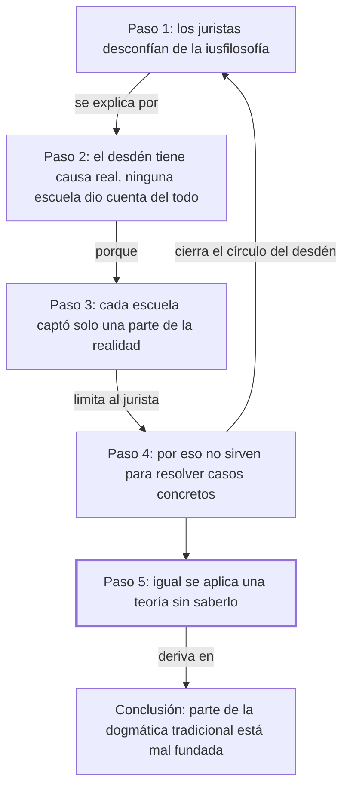

# § 54. Visión fragmentaria de la experiencia jurídica

## 1. Idea principal

Muchos juristas desconfían de la filosofía del derecho, y con motivo: cada escuela explicó bien una sola parte del fenómeno jurídico, y ninguna dio una respuesta completa que sirviera para resolver los problemas concretos del oficio.

Este capítulo contesta una pregunta incómoda: ¿por qué tantos abogados en ejercicio consideran que la teoría del derecho no les sirve para nada? A un principiante le conviene entenderla porque explica de dónde viene el prejuicio que probablemente va a escuchar en la facultad. Además, el autor sostiene algo más filoso: quien cree que trabaja sin teoría en realidad está aplicando una sin saberlo, y por eso comete errores.

## 2. Explicación paso a paso

### Paso 1 — Constata el desdén de los juristas hacia la filosofía del derecho

El capítulo abre con "No es extraño encontrar, entre algunos juristas" (p. 124). El movimiento es descriptivo: antes de explicar nada, el autor registra un hecho del ambiente. Describe una escala de actitudes que va de la desconfianza a la indiferencia y llega al desdén, dirigida a la iusfilosofía —la filosofía del derecho, la disciplina que se pregunta qué es el derecho en vez de aplicarlo—. Y precisa contra qué se dirige ese desdén: contra su utilidad para resolver los problemas de la dogmática jurídica, que es el estudio ordenado del derecho vigente, el trabajo de interpretar y sistematizar las normas que están en los códigos. Importa porque el autor no va a refutar ese desdén: va a explicarlo, que es un movimiento distinto y más interesante.

### Paso 2 — Concede que el desdén tiene una causa real

Sigue en la misma página: "Dicha actitud es explicable en la medida en que" (p. 124). Acá el movimiento es una concesión, y es la clave del capítulo. El autor le da la razón a los juristas desdeñosos, pero solo en cuanto al diagnóstico: las escuelas que se sucedieron en la historia no daban cuenta de la realidad completa de lo jurídico. Y balancea de inmediato: reconoce su contribución indudable al desarrollo de la ciencia jurídica y sus aciertos indiscutibles en el tratamiento de alguna de las dimensiones del derecho. La analogía: son como especialistas médicos excelentes que solo miran su órgano; ninguno mintió, pero ninguno vio al paciente. Importa porque de acá sale la estructura del argumento: el problema no es que las escuelas se equivocaran, es que cada una alcanzó una parte.

### Paso 3 — Nombra las escuelas y explica por qué la parcialidad es un problema práctico

El párrafo "Las visiones fragmentarias que ofrecen las distintas escuelas" (p. 124) hace el movimiento central. El autor enumera las corrientes entre paréntesis; están en el original y no las repito, porque conviene leerlas como lista y anotarlas: cada una reaparece con capítulo propio más adelante. Lo que sí importa es la razón que da: por más elaboradas y coherentes que sean, esas visiones "no captan el fenómeno jurídico tal como discurre en la realidad de la vida" (p. 124). Notar el criterio que usa para descalificarlas: no es la falta de rigor interno —admite que son coherentes—, es la falta de correspondencia con la realidad. La consecuencia que saca es que el científico del derecho no puede obtener una respuesta unitaria y global. Importa porque acá queda claro que el reproche es de alcance, no de calidad.

### Paso 4 — Traduce el problema teórico en una limitación del trabajo diario

En "La ausencia de una visión totalizadora del derecho limita la tarea del jurista" (p. 124) el movimiento es bajar de la teoría a la práctica, y es lo que vuelve al capítulo algo más que una queja académica. Dice que las respuestas unilaterales, "por logradas y convincentes que sean", no le permiten al jurista resolver certeramente las múltiples cuestiones que enfrenta en la cotidianeidad de su quehacer. La analogía: es como tener un mapa perfecto de las calles pero sin los sentidos de circulación; el mapa no está mal, pero con él te perdés igual. Y de ahí cierra el círculo con el paso 1: por eso los hombres de derecho, "desconcertados o decepcionados" (p. 125), se volvieron indiferentes a la iusfilosofía o directamente la ignoraron. Importa porque acá el desdén queda explicado como una reacción razonable, no como ignorancia.

### Paso 5 — Da el vuelco: nadie trabaja sin teoría

El último párrafo, "No obstante, y aunque sin pretenderlo" (p. 125), es la bisagra y el punto más fuerte del capítulo. El movimiento es un giro contra el jurista práctico: aunque haya decidido ignorar la iusfilosofía, en su tarea de elaboración científica está practicando alguna de esas visiones fragmentarias, "conscientemente o no". Es decir que la opción de no tener teoría no existe: solo existe la de tenerla sin saber cuál. Y de ahí saca la consecuencia que le interesa: por eso algunas construcciones de la dogmática jurídica tradicional "resulten incorrectas, al sustentarse en supuestos incompletos, insuficientes" (p. 125). Conviene notar que esto lo afirma sin dar ni un ejemplo de construcción incorrecta; es una acusación fuerte que en este capítulo queda sin demostrar. Importa porque convierte el capítulo en una razón para estudiar teoría, y no en una descripción de por qué otros no la estudian.

## 3. Mapa

## 4. Vocabulario clave

- **Iusfilosofía** — filosofía del derecho: se pregunta qué es el derecho, en vez de aplicarlo.
- **Dogmática jurídica** — el estudio ordenado del derecho que está vigente: interpretar y sistematizar las normas de los códigos.
- **Visión fragmentaria** — una explicación del derecho que capta solo una de sus dimensiones y la presenta como el todo.
- **Visión totalizadora** — la que abarca las tres dimensiones juntas; el autor sostiene que su ausencia "limita la tarea del jurista" (p. 124).
- **Iusnaturalismo** — corriente para la cual hay un derecho anterior y superior a las leyes que dictan los Estados (el autor lo nombra sin definirlo en esta sección).
- **Positivismo jurídico** — corriente que identifica el derecho con las normas efectivamente puestas por la autoridad (el autor no lo define en esta sección).
- **Formalismo jurídico** — corriente que estudia el derecho como estructura de normas, sin mirar la conducta ni los valores (el autor no lo define en esta sección).
- **Sociologismo jurídico** — corriente que reduce el derecho a los hechos sociales que ocurren (el autor no lo define en esta sección).
- **Realismo jurídico** — corriente que identifica el derecho con lo que los tribunales de hecho deciden (el autor no lo define en esta sección).
- **Experiencia jurídica** — el fenómeno del derecho tal como ocurre en la vida real, con sus tres dimensiones en interacción.

## 5. Distinciones que se confunden

- **Ser coherente vs. ser verdadero** — una escuela puede razonar sin contradicciones y aun así no describir la realidad.
  - Se confunden porque: en la facultad se evalúa sobre todo la coherencia interna de una teoría, así que se vuelve el criterio por defecto para juzgarla.
  - Criterio para decidir: ¿la objeción del autor apunta a que la teoría se contradice, o a que deja afuera algo que existe? Acá es lo segundo: dice que son coherentes y aun así insuficientes.
  - Dónde se cae: se responde que el autor critica a las escuelas por ser poco rigurosas, cuando expresamente les concede rigor y aciertos indiscutibles.

- **Ignorar la teoría vs. no tener teoría** — se puede decidir no estudiarla, pero no se puede trabajar sin ninguna.
  - Se confunden porque: quien no habla de teoría parece no usarla, y suele presentarse como alguien puramente práctico.
  - Criterio para decidir: ¿sus decisiones suponen alguna idea sobre qué es el derecho? Si sí, hay una teoría operando, elegida o heredada.
  - Dónde se cae: se contesta que para el autor el jurista práctico trabaja sin filosofía, cuando dice exactamente lo contrario: la practica "conscientemente o no" (p. 125).

- **Aporte parcial vs. error** — para el autor las escuelas aportaron conocimiento válido; lo que falló fue el alcance.
  - Se confunden porque: si una explicación es insuficiente, es tentador archivarla como equivocada.
  - Criterio para decidir: ¿lo que la escuela afirma es falso, o es cierto pero incompleto? El autor sostiene lo segundo.
  - Dónde se cae: se escribe que el autor rechaza al positivismo o al iusnaturalismo, cuando lo que rechaza es tomar a cualquiera de ellos como explicación total.

- **Desdén del jurista vs. inutilidad de la iusfilosofía** — que la disciplina haya decepcionado no prueba que no sirva.
  - Se confunden porque: el capítulo dedica casi todo su espacio a explicar el desdén, y eso se lee como si lo compartiera.
  - Criterio para decidir: ¿el autor concluye que hay que abandonar la iusfilosofía o que hay que completarla? Su cierre apunta a lo segundo.
  - Dónde se cae: se resume el capítulo como una crítica a la filosofía del derecho, cuando es una explicación de por qué fracasó hasta ahora y un argumento para hacerla mejor.

## 6. Qué releer del original

1. (p. 124) "Las diversas escuelas y corrientes de pensamiento" — es la enumeración de las cinco corrientes que el paso 3 deliberadamente no reprodujo; conviene anotar cada nombre porque cada una tiene capítulo propio más adelante.
2. (p. 125) "No obstante, y aunque sin pretenderlo" — es la bisagra del capítulo y la formulación exacta importa: ahí está la tesis de que nadie trabaja sin teoría.
3. (p. 124) "por más elaboradas y coherentes que sean" — es el pasaje que más fácil se malentiende: distingue el rigor interno de la correspondencia con la realidad.
4. (p. 125) "al sustentarse en supuestos incompletos, insuficientes" — es la acusación más fuerte del capítulo y el autor no la respalda con ningún ejemplo; vale leerla en el original para ver hasta dónde llega.

## 7. Autoevaluación

1. ¿Qué actitudes de los juristas hacia la iusfilosofía describe el autor?
2. ¿Qué les concede el autor a las escuelas que critica?
3. Según el autor, ¿qué le pasa al jurista que solo dispone de respuestas unilaterales?
4. Explicá con tus palabras por qué el autor dice que una escuela puede ser coherente y aun así insuficiente.
5. Reformulá el paso 5: ¿qué quiere decir que los juristas practicaban una visión fragmentaria "sin pretenderlo"?
6. ¿Por qué es necesario el paso 4? ¿Qué le faltaría al capítulo si el autor no bajara el problema al trabajo diario?
7. Un abogado dice: "yo no me meto en teorías, resuelvo casos con el código en la mano". Usando el paso 5, ¿qué le respondería el autor?
8. Una compañera afirma que en este capítulo el autor refuta al positivismo. Usando las distinciones del bloque 5, ¿qué parte de esa lectura es correcta y qué parte no?
9. El autor afirma que parte de la dogmática tradicional es incorrecta por partir de supuestos incompletos. ¿Lo demuestra en este capítulo? Evaluá.
10. El capítulo explica el desdén de los juristas hacia la iusfilosofía sin desmentirlo. ¿Eso debilita la posición del autor o la fortalece? Justificá.

--- No mires esto hasta responder ---

1. Desconfianza, indiferencia y hasta desdén, dirigidos a los logros y la aplicabilidad de la iusfilosofía para resolver los problemas de la dogmática jurídica (p. 124).
2. Una contribución indudable al desarrollo de la ciencia jurídica y aciertos indiscutibles en el tratamiento de alguna de las varias dimensiones del derecho (p. 124).
3. Que no puede resolver certeramente las múltiples cuestiones que enfrenta en su quehacer cotidiano, y termina desconcertado o decepcionado (pp. 124-125).
4. Porque la coherencia mide la relación de la teoría consigo misma y la suficiencia mide su relación con la realidad. El autor dice que estas escuelas son coherentes y elaboradas, pero que no captan el fenómeno jurídico tal como discurre en la vida (p. 124).
5. Que aun habiendo decidido ignorar la iusfilosofía, al elaborar sus construcciones aplicaban una de esas visiones parciales, sin advertirlo y sin proponérselo (p. 125).
6. Sin el paso 4 el capítulo sería una discusión entre teóricos. Ese paso es el que muestra que la insuficiencia teórica tiene un costo concreto —casos que el jurista no puede resolver certeramente— y el que cierra el círculo con el desdén del paso 1.
7. Que su decisión no lo deja afuera de la teoría: al aplicar el código está suponiendo alguna respuesta sobre qué es el derecho, probablemente formalista, y por eso puede llegar a construcciones incorrectas sin darse cuenta de dónde viene el error (p. 125).
8. Es correcto que el autor considera al positivismo una visión parcial e insuficiente. No es correcto que lo refute: en este capítulo lo nombra dentro de una enumeración y le concede aportes válidos; lo que rechaza es tomarlo como explicación total del derecho.
9. No lo demuestra. Lo afirma en una sola frase, sin dar ni un ejemplo de construcción dogmática incorrecta ni mostrar el supuesto incompleto del que partiría. Respuesta discutible: puede sostenerse que el capítulo prepara el terreno y que los ejemplos vienen después, pero con este texto solo, la afirmación queda sin respaldo.
10. La fortalece, porque le permite ponerse del lado del jurista práctico en el diagnóstico y discrepar solo en la conclusión: no es que la iusfilosofía sea inútil, es que hasta ahora fue parcial. Refutar el desdén de entrada lo habría puesto a defender lo que él también considera insuficiente.

## Flashcards

Qué es la iusfilosofía | La filosofía del derecho: se pregunta qué es el derecho en vez de aplicarlo
Qué es la dogmática jurídica | El estudio ordenado del derecho vigente: interpretar y sistematizar las normas de los códigos
Qué es una visión fragmentaria del derecho | Una explicación que capta solo una dimensión y la presenta como el todo
Qué actitudes de los juristas hacia la iusfilosofía describe el autor | Desconfianza, indiferencia y desdén
Qué cinco corrientes nombra el autor como visiones fragmentarias | Iusnaturalismo, positivismo, formalismo, sociologismo y realismo
Qué les concede el autor a las escuelas que critica | Contribución indudable a la ciencia jurídica y aciertos en alguna dimensión del derecho
Cuál es el reproche del autor a esas escuelas | Que no captan el fenómeno jurídico tal como discurre en la realidad de la vida
Qué le pasa al jurista que solo tiene respuestas unilaterales | No puede resolver certeramente las cuestiones de su quehacer cotidiano
Por qué los juristas se volvieron indiferentes a la iusfilosofía | Porque quedaron desconcertados o decepcionados por la insuficiencia de sus respuestas
Cuál es el giro del último párrafo del capítulo | Que los juristas aplicaban una visión fragmentaria igual, consciente o inconscientemente
Qué consecuencia saca el autor de ese giro | Que parte de la dogmática tradicional es incorrecta por partir de supuestos incompletos
Cómo distingo ser coherente de ser verdadero | La coherencia es interna a la teoría; la verdad es su correspondencia con la realidad
Cómo distingo ignorar la teoría de no tener teoría | Se puede no estudiarla, pero toda decisión supone alguna idea de qué es el derecho
Cómo distingo un aporte parcial de un error | El aporte parcial es cierto pero incompleto; el error es falso. El autor imputa lo primero
Rechaza el autor al positivismo en este capítulo | No: lo considera parcial y le concede aportes; rechaza tomarlo como explicación total
Demuestra el autor que la dogmática tradicional es incorrecta | No: lo afirma en una frase, sin dar ningún ejemplo
Un abogado dice que resuelve casos sin teoría. Qué responde el autor | Que aplica una igual, sin saberlo, y que por eso puede errar sin ver de dónde viene el error
Por qué el autor explica el desdén en vez de refutarlo | Porque comparte el diagnóstico: hasta ahora la iusfilosofía fue parcial
Qué es una visión totalizadora del derecho | La que abarca las tres dimensiones juntas en vez de una sola
Qué critica el autor: el rigor de las escuelas o su alcance | El alcance: son rigurosas y coherentes, pero parciales
