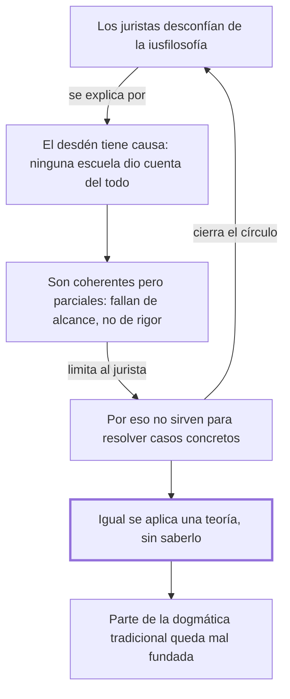

# § 54. Visión fragmentaria de la experiencia jurídica

## 1. Idea principal

Muchos juristas desconfían de la filosofía del derecho, y con motivo: cada escuela explicó bien una sola parte, y ninguna sirvió para resolver los problemas del oficio.

Este capítulo contesta por qué tantos abogados en ejercicio creen que la teoría no les sirve para nada. Explica de dónde viene un prejuicio que se escucha en la facultad, y termina dándolo vuelta.

## 2. Lo esencial del capítulo

Entre los juristas hay desconfianza, indiferencia y hasta desdén hacia la iusfilosofía —la filosofía del derecho— en cuanto a su utilidad para resolver los problemas de la dogmática jurídica, que es el estudio ordenado del derecho vigente, el trabajo de interpretar y sistematizar los códigos (p. 124). Ese desdén es explicable, y acá está la concesión que ordena todo el capítulo: las escuelas que se sucedieron en la historia no daban cuenta de la realidad completa de lo jurídico. Pero se les reconoce en el mismo párrafo una contribución indudable a la ciencia jurídica y aciertos indiscutibles en el tratamiento de alguna de las dimensiones del derecho. Son como especialistas médicos excelentes que solo miran su órgano: ninguno mintió, ninguno vio al paciente.

El reproche, entonces, no es de rigor sino de alcance. Las visiones fragmentarias, "por más elaboradas y coherentes que sean, no captan el fenómeno jurídico tal como discurre en la realidad de la vida" (p. 124). Notar el criterio: no se las descalifica por contradecirse —se admite que son coherentes— sino por no corresponder con la realidad. Acá se enumeran cinco corrientes entre paréntesis; leelas en la p. 124, porque cada una tiene su capítulo propio más adelante y conviene anotarlas. La consecuencia es que el científico del derecho no puede obtener una respuesta unitaria y global.

De la teoría se baja a la práctica, que es lo que vuelve al capítulo algo más que una discusión académica. Las respuestas unilaterales, "por logradas y convincentes que sean", no le permiten al jurista resolver certeramente las cuestiones de su quehacer cotidiano (p. 124). Es como tener un mapa perfecto de las calles pero sin los sentidos de circulación: el mapa no está mal, y con él te perdés igual. Y así se cierra el círculo: por eso los hombres de derecho, "desconcertados o decepcionados" (p. 125), se volvieron indiferentes a la iusfilosofía o directamente la ignoraron.

El último párrafo da el vuelco. Aunque hayan decidido ignorar la iusfilosofía, los juristas practicaban en su tarea científica alguna de esas visiones parciales, "conscientemente o no" (p. 125). La opción de no tener teoría no existe: solo existe la de tenerla sin saber cuál. Y de ahí sale la acusación más fuerte del capítulo, que se afirma sin dar un solo ejemplo: por eso algunas construcciones de la dogmática tradicional "resulten incorrectas, al sustentarse en supuestos incompletos, insuficientes" (p. 125).

## 3. Mapa

## 4. Vocabulario clave

- **Iusfilosofía** — filosofía del derecho: se pregunta qué es el derecho, en vez de aplicarlo.
- **Dogmática jurídica** — el estudio ordenado del derecho vigente: interpretar y sistematizar los códigos.
- **Visión fragmentaria** — explicación que capta una sola dimensión del derecho y la presenta como el todo.
- **Visión totalizadora** — la que abarca las tres dimensiones juntas; su ausencia "limita la tarea del jurista" (p. 124).

## 5. Distinciones que se confunden

- **Ser coherente vs. ser verdadero** — una teoría puede razonar sin contradicciones y aun así no describir la realidad.
  - Se confunden porque: en la facultad se evalúa sobre todo la coherencia interna, así que se vuelve el criterio por defecto.
  - Criterio para decidir: ¿la objeción es que la teoría se contradice, o que deja afuera algo que existe? Acá es lo segundo.
  - Dónde se cae: se dice que el autor critica a las escuelas por poco rigurosas, cuando les concede rigor y aciertos.

- **Ignorar la teoría vs. no tener teoría** — se puede decidir no estudiarla, pero no se puede trabajar sin ninguna.
  - Se confunden porque: quien no habla de teoría parece no usarla, y suele presentarse como puramente práctico.
  - Criterio para decidir: ¿sus decisiones suponen alguna idea sobre qué es el derecho? Si sí, hay una teoría operando.
  - Dónde se cae: se contesta que para el autor el jurista práctico trabaja sin filosofía, cuando dice lo contrario.

## 6. Autoevaluación

1. Un abogado dice: "yo no me meto en teorías, resuelvo casos con el código en la mano". ¿Qué le respondería el autor?
2. Alguien afirma que en este capítulo el autor refuta al positivismo. ¿Qué parte de esa lectura es correcta y qué parte no?
3. El autor afirma que parte de la dogmática tradicional es incorrecta por partir de supuestos incompletos. ¿Lo demuestra acá?
4. El capítulo explica el desdén de los juristas sin desmentirlo. ¿Eso debilita su posición o la fortalece?

--- No mires esto hasta responder ---

1. Que su decisión no lo deja afuera de la teoría: al aplicar el código supone alguna respuesta sobre qué es el derecho, probablemente formalista, y por eso puede llegar a construcciones incorrectas sin ver de dónde viene el error (p. 125).
2. Es correcto que considera al positivismo una visión parcial e insuficiente. No es correcto que lo refute: lo nombra dentro de una enumeración y le concede aportes válidos; lo que rechaza es tomarlo como explicación total.
3. No. Lo afirma en una sola frase, sin dar un ejemplo de construcción incorrecta ni mostrar el supuesto del que partiría. Discutible: puede sostenerse que los ejemplos vienen en los capítulos siguientes.
4. La fortalece: le permite coincidir con el jurista práctico en el diagnóstico y discrepar solo en la conclusión. Refutar el desdén de entrada lo habría puesto a defender lo que él también considera insuficiente.

## Flashcards

Qué es la dogmática jurídica | El estudio ordenado del derecho vigente: interpretar y sistematizar los códigos
Qué es una visión fragmentaria del derecho | Una explicación que capta una sola dimensión y la presenta como el todo
Qué cinco corrientes nombra el autor como visiones fragmentarias | Iusnaturalismo, positivismo, formalismo, sociologismo y realismo
Qué les concede el autor a las escuelas que critica | Contribución indudable a la ciencia jurídica y aciertos en alguna dimensión
Cuál es su reproche a esas escuelas | Que no captan el fenómeno jurídico tal como discurre en la realidad de la vida
Cuál es el giro del último párrafo del capítulo | Que los juristas aplicaban una visión fragmentaria igual, consciente o inconscientemente
Cómo distingo ser coherente de ser verdadero | La coherencia es interna a la teoría; la verdad es su correspondencia con la realidad
Cómo distingo ignorar la teoría de no tener teoría | Se puede no estudiarla, pero toda decisión supone alguna idea de qué es el derecho
