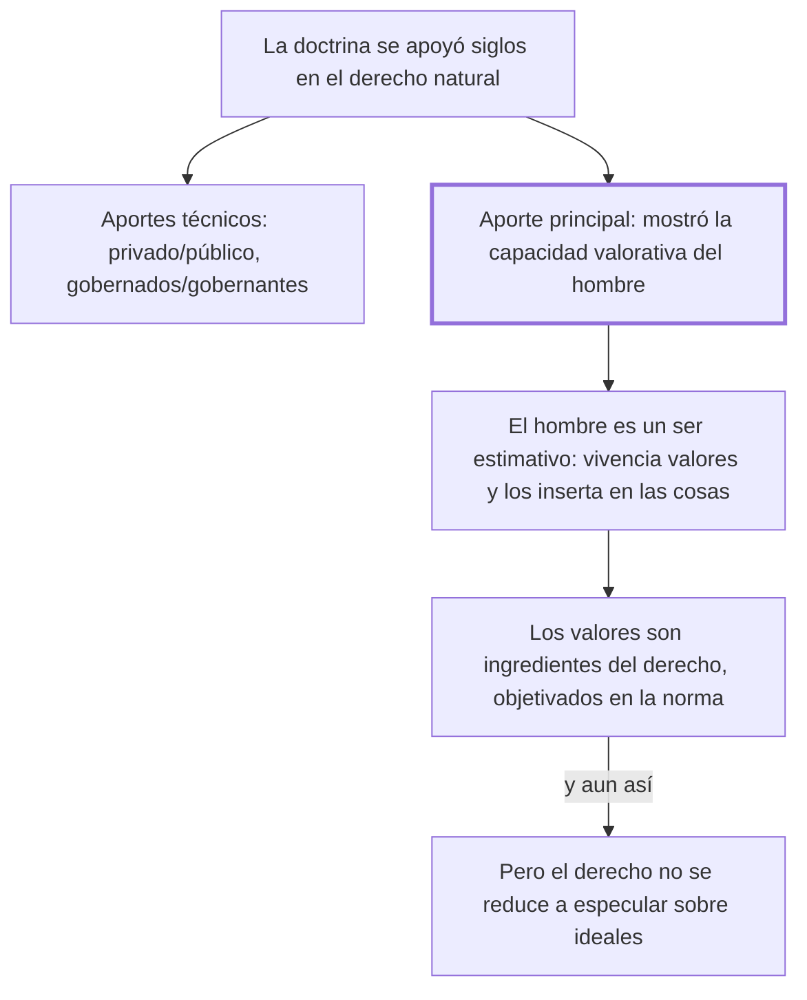

# § 55. Presencia iusnaturalista en la historia del derecho

## 1. Idea principal

El iusnaturalismo acertó al mostrar que el ser humano valora y que esos valores son parte del derecho, pero se equivocó al reducir el derecho a una especulación sobre ideales.

Contesta qué le debemos a la escuela que dominó la formación de juristas en los siglos XVII y XVIII. Es el primero de los tres capítulos que examinan una visión parcial por vez, y sigue el mismo molde: primero el crédito, después el límite.

## 2. Lo esencial del capítulo

La doctrina jurídica se apoyó por siglos en el derecho natural y, más recientemente, en el formalismo, cuyos postulados siguen gravitando con fuerza (pp. 125-126). El iusnaturalismo tuvo influencia decisiva en los siglos XVII y XVIII, se enseñó en las universidades europeas y "preparó el camino de la codificación civil" (p. 126). Se le reconocen tres aportes: dos técnicos —haber formulado la distinción entre derecho privado y público, y haber extendido la regulación jurídica a las relaciones entre gobernados y gobernantes— y uno que el autor llama "su principal aporte", su acertada visión axiológica: haber mostrado la capacidad valorativa del ser humano al proclamar que los ideales jurídicos están dados en su naturaleza y que el derecho positivo debe recogerlos (pp. 126, 128).

Sobre esa base viene el desarrollo más denso, que es una defensa de los valores antes de limitarlos. Los ideales éticos, religiosos y morales son "insustituibles puntos de referencia" en la tarea del jurista: los únicos con los que comprende las conductas e interpreta las normas (p. 127). Son ingredientes de la estructura del derecho, vivenciados en la vida de relación y objetivados en las normas; y —dejando aparte si son subjetivos u objetivos— se dan "en" y "para" la vida humana, porque el hombre es el único que los sensibiliza, y eso le da la dignidad de persona. De ahí la fórmula: **el hombre es un ser estimativo**. Sin esa capacidad, la libertad no podría trazar ni realizar un proyecto de vida. Agrega que además los inserta en las cosas, con dos ejemplos que no reproduzco —el hierro que se vuelve arado y el mármol que se vuelve escultura (p. 128)—.

El límite llega solo al final y en una sola frase: no se comparte "su pretensión de reducir el derecho a una mera especulación sobre los ideales jurídicos, sobre los valores en tanto exigencias éticas" (p. 126). Notar el desequilibrio: el crédito ocupa casi todo el capítulo y la objeción una línea, así que la insuficiencia del iusnaturalismo queda enunciada más que argumentada.

## 3. Mapa

## 4. Vocabulario clave

- **Derecho natural o iusnaturalismo** — la corriente que sostiene que hay principios jurídicos dados en la naturaleza humana, anteriores al derecho que dicta el Estado.
- **Dimensión axiológica** — la cara del derecho que tiene que ver con los valores; axiología es el estudio de los valores.
- **Ser estimativo** — la fórmula del autor para decir que el hombre es el único que sensibiliza y vivencia valores, y que eso le da su dignidad.
- **Derecho positivo** — el derecho efectivamente puesto por la autoridad, en contraste con el natural.
- **Derecho privado y público** — la distinción entre lo que regula relaciones entre particulares y lo que regula las relaciones con el poder; el autor la cuenta como aporte iusnaturalista.

## 5. Distinciones que se confunden

- **Que los valores importen vs. que el derecho sea solo valores** — el autor sostiene lo primero con energía y rechaza lo segundo en una línea.
  - Se confunden porque: casi todo el capítulo defiende el papel de los valores, así que se lee como una adhesión al iusnaturalismo.
  - Criterio para decidir: ¿la afirmación dice que el valor es un ingrediente del derecho, o que es el derecho? Lo segundo es lo que rechaza.
  - Dónde se cae: se responde que para este autor el derecho es un conjunto de exigencias éticas, cuando eso es la reducción que critica.

- **Vivenciar un valor vs. insertarlo en un objeto** — lo primero pasa en la vida de relación; lo segundo es la acción creadora que vuelve valiosa una cosa.
  - Se confunden porque: el autor los presenta seguidos y los dos son actividad del mismo sujeto.
  - Criterio para decidir: ¿el valor está siendo experimentado, o quedó puesto en algo exterior? El arado y la escultura son lo segundo.
  - Dónde se cae: se explica el ejemplo del hierro como si mostrara que los valores son subjetivos, cuando muestra cómo se objetivan.

## 6. Autoevaluación

1. ¿Qué se entiende por iusnaturalismo? Explique qué aportó a la ciencia jurídica y cuáles son las implicaciones de una concepción solo iusnaturalista del derecho.
2. Un juez sostiene que para resolver un caso difícil le basta con determinar qué es lo justo, sin atender a la conducta ni a la norma. ¿Qué le objetaría el autor?

--- No mires esto hasta responder ---

1. El iusnaturalismo sostiene que hay principios jurídicos dados en la naturaleza humana, anteriores al derecho que dicta el Estado, y que el derecho positivo debe recogerlos. Tuvo influencia decisiva en los siglos XVII y XVIII y preparó el camino de la codificación civil (p. 126). Sus aportes son dos técnicos —la distinción entre derecho privado y público, y extender la regulación a las relaciones entre gobernados y gobernantes— y uno principal: su visión axiológica, haber mostrado que el hombre es un ser estimativo, el único que vivencia valores. La implicación de quedarse solo ahí es la reducción del derecho "a una mera especulación sobre los ideales jurídicos": deja fuera la conducta y la norma, y con ellas la posibilidad de resolver casos.
2. Que se queda en una sola dimensión. El valor es ingrediente del derecho, no su totalidad: se vivencia en la conducta y se objetiva en la norma, así que resolver sin las otras dos es la misma parcialidad que el autor le imputa al iusnaturalismo (p. 126).

## Flashcards

Cuál es el principal aporte del iusnaturalismo según el autor | Su acertada visión axiológica: mostró la capacidad valorativa del ser humano
Qué dos aportes técnicos le reconoce al iusnaturalismo | La distinción derecho privado/público y extender la regulación a gobernados y gobernantes
Qué le rechaza el autor al iusnaturalismo | Reducir el derecho a una mera especulación sobre los ideales jurídicos
Qué significa que el hombre sea un ser estimativo | Que es el único que sensibiliza y vivencia valores, y eso le da la dignidad de persona
