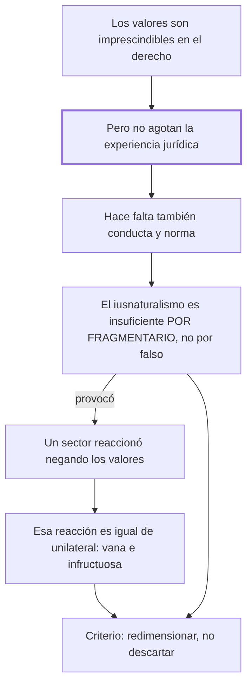

# § 56. Alcances de la dimensión axiológica del derecho

## 1. Idea principal

El iusnaturalismo es insuficiente por fragmentario, no por falso: los valores son una dimensión real del derecho, pero no lo agotan, y negarlos como reacción es igual de unilateral.

Contesta hasta dónde llega la dimensión de los valores. Es el capítulo que fija el criterio con el que el autor va a tratar a las otras dos escuelas: redimensionar, no descartar.

## 2. Lo esencial del capítulo

Sin negar el papel imprescindible de los valores, no se puede aceptar que "lo jurídico" se identifique de manera plena y total con la dimensión axiológica (pp. 128-129), porque la experiencia jurídica la desborda: requiere además la vida humana que vivencia los valores y las normas que prescriben esa vivencia como obligatoria. La fórmula que cierra el argumento es simétrica: no existe lo jurídico sin los valores, pero tampoco hay experiencia jurídica sin conductas humanas intersubjetivas ni sin normas. De ahí la calificación que da título a toda esta parte del libro: el iusnaturalismo resulta "una respuesta insuficiente, por fragmentaria" (p. 129). El acento está en el "por": no se lo acusa de decir algo falso sino de responder solo una parte, y esa comprobación crítica le fue dando "su exacta dimensión" —una exigencia ineludible dentro de la comprensión del derecho, no su fundamento único—.

El último tramo es el más interesante, porque el autor le pega también al bando contrario. Un sector de la doctrina, al enfrentar al derecho natural, "mostró una actitud del todo descomedida": negó sin fundamento el aporte iusnaturalista y llegó al extremo de poner entre paréntesis la presencia valorativa en la experiencia jurídica (p. 130). Eso se califica de "vano e infructuoso esfuerzo", con la misma razón usada contra el iusnaturalismo pero al revés: los valores se insertan en la estructura del derecho en unidad "inescindible y dinámica" con la vida que los vivencia y las normas que los objetivan. No cabe prescindir de ellos; lo único que cabe es redimensionar la pretensión unilateral. Conviene notar que no identifica a ninguno de esos juristas ni cita un texto suyo: la reacción antiaxiológica se describe pero no se documenta.

## 3. Mapa

## 4. Vocabulario clave

- **Reduccionismo** — la operación de explicar algo complejo por uno solo de sus componentes; acá, tomar los valores por todo el derecho.
- **Inescindible** — que no se puede separar; el autor lo usa para la unidad de las tres dimensiones.
- **Redimensionar** — devolverle a una escuela su medida justa: conservar su aporte y quitarle la pretensión de ser la explicación total.

## 5. Distinciones que se confunden

- **Insuficiente vs. falso** — el iusnaturalismo dice algo verdadero pero parcial; no se lo acusa de error.
  - Se confunden porque: en una discusión, rechazar una tesis suele significar negarla.
  - Criterio para decidir: ¿lo que la escuela afirma es incorrecto, o es correcto y le falta? El autor imputa lo segundo, con el "por fragmentaria".
  - Dónde se cae: se escribe que el autor refuta al iusnaturalismo, cuando lo que refuta es su pretensión de exclusividad.

- **Negar la exclusividad de los valores vs. negar los valores** — lo primero es la posición del autor; lo segundo es la del sector que critica al final.
  - Se confunden porque: las dos suenan a "el derecho no es cuestión de valores".
  - Criterio para decidir: ¿la afirmación deja a los valores como una dimensión del derecho, o los saca? Si los saca, es la postura descomedida.
  - Dónde se cae: se agrupa al autor con los antiaxiológicos, cuando dedica el cierre del capítulo a llamarlos vanos e infructuosos.

## 6. Autoevaluación

1. Explique por qué el autor califica al iusnaturalismo de respuesta "insuficiente, por fragmentaria", y cuáles son las implicaciones de esa fórmula.
2. Un jurista propone construir la ciencia del derecho sin ninguna referencia a valores, para ganar rigor. ¿Qué error comete y en qué se parece al del iusnaturalismo?

--- No mires esto hasta responder ---

1. Insuficiente por fragmentaria quiere decir que lo que afirma es verdadero pero parcial: no se lo acusa de error sino de responder una sola parte (p. 129). Los valores son imprescindibles, pero la experiencia jurídica los desborda, porque requiere además la vida humana que los vivencia y las normas que prescriben esa vivencia como obligatoria. La implicación es doble y hay que dar las dos: no se puede prescindir de la vertiente axiológica al aprehender lo jurídico, y no se puede reducir el derecho a una especulación valorativa. De ahí el criterio que el autor va a usar con todas las escuelas: redimensionar, no descartar.
2. Pone entre paréntesis una dimensión que integra la estructura del derecho, en unidad inescindible con las otras dos. Es el mismo error de unilateralidad con el signo invertido: el iusnaturalismo tomaba una parte por el todo, y este la suprime. El autor llama a esa actitud descomedida y al esfuerzo, vano e infructuoso (p. 130).

## Flashcards

Por qué es insuficiente el iusnaturalismo según el autor | Por fragmentario: dice algo verdadero pero parcial, no falso
Qué le falta a la dimensión axiológica para dar cuenta del derecho | La vida humana que vivencia los valores y las normas que los objetivan
Qué significa redimensionar una escuela | Conservarle el aporte y quitarle la pretensión de ser la explicación total
