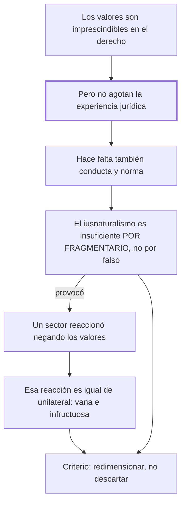

# § 56. Alcances de la dimensión axiológica del derecho

## 1. Idea principal

El iusnaturalismo es insuficiente por fragmentario, no por falso: los valores son una dimensión real del derecho, pero no lo agotan, y negarlos como reacción es igual de unilateral.

Contesta hasta dónde llega la dimensión de los valores. Es el capítulo que fija el criterio con el que el autor va a tratar a las otras dos escuelas: redimensionar, no descartar.

## 2. Lo esencial del capítulo

Sin negar el papel imprescindible de los valores, no se puede aceptar que "lo jurídico" se identifique de manera plena y total con la dimensión axiológica (pp. 128-129). La razón es que la experiencia jurídica desborda esa dimensión: requiere además la vida humana que vivencia los valores y las normas que prescriben esa vivencia como obligatoria. Y la fórmula que cierra el argumento es simétrica: no existe lo jurídico sin los valores, pero tampoco hay experiencia jurídica sin conductas humanas intersubjetivas ni sin normas.

De ahí sale la calificación que da título a toda esta parte del libro: el iusnaturalismo resulta "una respuesta insuficiente, por fragmentaria" (p. 129). El acento está en el "por": no se lo acusa de decir algo falso sino de responder solo una parte. Los valores no agotan la experiencia jurídica, y esa comprobación crítica hizo que la escuela fuera adquiriendo, paulatinamente, "su exacta dimensión" —la de una exigencia ineludible dentro de la comprensión del derecho, no la de su fundamento único—. Ese redimensionamiento obliga a dos cosas a la vez: no prescindir de la vertiente axiológica al aprehender lo jurídico, y no pretender reducir el derecho a una especulación valorativa. La limitación para dar una respuesta total contribuyó decisivamente a que el iusnaturalismo perdiera vigencia.

El último tramo es el más interesante, porque el autor le pega también al bando contrario. Un sector de la doctrina, al enfrentar al derecho natural, "mostró una actitud del todo descomedida": hubo juristas que negaron sin fundamento el aporte del iusnaturalismo y llegaron al extremo de poner entre paréntesis la presencia valorativa en la experiencia jurídica (p. 130). Esa postura se califica de "vano e infructuoso esfuerzo", y la razón es la misma que se usó contra el iusnaturalismo, aplicada al revés: los valores se insertan en la estructura del derecho como una de sus dimensiones, en unidad "inescindible y dinámica" con la vida humana que los vivencia y las normas que los objetivan. Así que no cabe prescindir de ellos; lo único que cabe es redimensionar la pretensión unilateral del mensaje iusnaturalista.

Conviene notar que el autor no identifica a ninguno de esos juristas descomedidos ni cita un texto suyo: la reacción antiaxiológica se describe pero no se documenta.

## 3. Mapa

## 4. Qué releer del original

1. (p. 129) "No existe 'lo jurídico' sin los valores, pero tampoco" — es la bisagra: la fórmula simétrica que sostiene todo el capítulo, y la formulación exacta importa.
2. (p. 129) "una respuesta insuficiente, por fragmentaria" — es la calificación que da nombre al apartado entero; conviene tenerla textual.
3. (p. 130) "un vano e infructuoso esfuerzo" — es el pasaje que más fácil se pasa por alto: ahí el autor critica a los críticos del iusnaturalismo con el mismo argumento.

## 5. Vocabulario clave

- **Reduccionismo** — la operación de explicar algo complejo por uno solo de sus componentes; acá, tomar los valores por todo el derecho.
- **Inescindible** — que no se puede separar; el autor lo usa para la unidad de las tres dimensiones.
- **Redimensionar** — devolverle a una escuela su medida justa: conservar su aporte y quitarle la pretensión de ser la explicación total.

## 6. Distinciones que se confunden

- **Insuficiente vs. falso** — el iusnaturalismo dice algo verdadero pero parcial; no se lo acusa de error.
  - Se confunden porque: en una discusión, rechazar una tesis suele significar negarla.
  - Criterio para decidir: ¿lo que la escuela afirma es incorrecto, o es correcto y le falta? El autor imputa lo segundo, con el "por fragmentaria".
  - Dónde se cae: se escribe que el autor refuta al iusnaturalismo, cuando lo que refuta es su pretensión de exclusividad.

- **Negar la exclusividad de los valores vs. negar los valores** — lo primero es la posición del autor; lo segundo es la del sector que critica al final.
  - Se confunden porque: las dos suenan a "el derecho no es cuestión de valores".
  - Criterio para decidir: ¿la afirmación deja a los valores como una dimensión del derecho, o los saca? Si los saca, es la postura descomedida.
  - Dónde se cae: se agrupa al autor con los antiaxiológicos, cuando dedica el cierre del capítulo a llamarlos vanos e infructuosos.

## 7. Autoevaluación

1. Un compañero resume el apartado así: "para el autor el iusnaturalismo estaba equivocado". ¿Qué palabra cambiarías y por qué?
2. Un jurista propone construir la ciencia del derecho sin ninguna referencia a valores, para ganar rigor. Según este capítulo, ¿qué error comete y en qué se parece al del iusnaturalismo?
3. El autor califica de "descomedida" la reacción antiaxiológica pero no identifica a ningún jurista ni cita un texto. ¿Cuánto pesa esa omisión?
4. ¿Por qué le conviene al autor tratar al iusnaturalismo como insuficiente y no como falso? ¿Qué ganaría o perdería con la otra estrategia?

--- No mires esto hasta responder ---

1. Cambiaría "equivocado" por "insuficiente". El autor dice expresamente "insuficiente, por fragmentaria": le reconoce verdad parcial y le niega la pretensión de ser respuesta total (p. 129).
2. Pone entre paréntesis una dimensión que integra la estructura del derecho. Es el mismo error de unilateralidad, con el signo invertido: el iusnaturalismo tomaba una parte por el todo, y este la suprime (p. 130).
3. Pesa: convierte en afirmación no verificable un tramo entero del capítulo. Se sabe que existió una reacción, pero no quiénes ni con qué argumentos, así que el lector no puede evaluar si era tan descomedida. Discutible: puede que los nombres estén en otros capítulos de la obra.
4. Le conviene porque su propia tesis necesita conservar los tres aportes para integrarlos: si declarara falso al iusnaturalismo, tendría que explicar de dónde viene la dimensión axiológica de su teoría. Con "insuficiente" se queda con el aporte y descarta solo la pretensión.

## Flashcards

Por qué es insuficiente el iusnaturalismo según el autor | Por fragmentario: dice algo verdadero pero parcial, no falso
Qué le falta a la dimensión axiológica para dar cuenta del derecho | La vida humana que vivencia los valores y las normas que los objetivan
Qué significa redimensionar una escuela | Conservarle el aporte y quitarle la pretensión de ser la explicación total
Cómo califica el autor a los juristas que negaron la presencia valorativa | De actitud descomedida, y su esfuerzo de vano e infructuoso
En qué se parecen el iusnaturalismo y sus críticos antiaxiológicos | Los dos son unilaterales: uno toma la parte por el todo, el otro la suprime
Cómo distingo insuficiente de falso | Insuficiente es cierto pero incompleto; falso es incorrecto. El autor imputa lo primero
Qué relación tienen las tres dimensiones entre sí, según este capítulo | Una unidad inescindible y dinámica: valores vivenciados en la vida y objetivados en la norma
Identifica el autor a los juristas que critica al final del capítulo | No: describe la reacción antiaxiológica sin nombrar a nadie ni citar un texto
