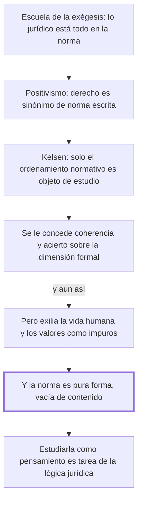

# § 57. El formalismo jurídico

## 1. Idea principal

El formalismo explicó bien la dimensión normativa del derecho, pero la norma no puede ser su objeto de estudio porque es pura forma vacía de contenido.

Contesta por qué la escuela que hoy sigue dominando la enseñanza tampoco alcanza. Es el segundo de los tres capítulos sobre una visión parcial, y el que más concede antes de objetar.

## 2. Lo esencial del capítulo

Mientras el derecho natural perdía influencia se expandió de manera vertiginosa una visión puramente formalista, y el normativismo se afirma en el siglo XIX como la solución que los juristas esperaban (p. 130). El recorrido tiene tres escalones: primero la escuela de la exégesis, para la cual lo jurídico estaba "totalmente contenido en su expresión normativa" y cuyo método se volvió el instrumento de la enseñanza —por décadas el derecho civil se asimiló sin más al Código Napoleón de 1804—; de ella deriva el positivismo, para el cual derecho es sinónimo de norma escrita (p. 131); y el positivismo alcanza su punto más alto con Kelsen. Sobre la teoría pura el autor es generoso: dice que deslumbró por su coherencia, que su fuerza de convicción fue avasalladora y que los juristas se rindieron entusiastas. Después describe qué hace: el objeto de la ciencia jurídica se contrae al ordenamiento normativo, la vida humana queda relegada a contenido factual de las normas, y los valores resultan elementos "de naturaleza metajurídica".

Ahí está el límite, con la misma estructura que en los capítulos anteriores: admitir la explicación de la dimensión formal no obliga a compartir la conclusión de reducir el derecho a esa sola dimensión. La vida humana y los valores no pueden marginarse, y la frase que lo cierra es la más filosa del capítulo: no cabe "extrañarlos o exiliarlos del derecho calificándolos de 'impuros'" (pp. 131-132). Trae después a Perlingieri, para quien el formalismo, sea exegético o científico, es "una interpretación unilateral de la juridicidad". Pero el argumento final es distinto de los anteriores y merece atención, porque no es de alcance sino de naturaleza: la norma no puede constituirse en objeto de estudio del derecho "en tanto es pura forma, vacía de contenido" (p. 132). No es solo que le falte algo; es que por sí sola no tiene qué estudiar. De ahí un reparto: estudiar la norma como pensamiento es materia de la lógica jurídica, no de la ciencia del derecho.

## 3. Mapa

## 4. Vocabulario clave

- **Formalismo jurídico** — la corriente que identifica el derecho con su forma normativa y deja afuera conducta y valores.
- **Escuela de la exégesis** — la que sostenía que todo el derecho está en el texto de la ley, y que asimiló el derecho civil al Código Napoleón.
- **Positivismo jurídico** — para el autor, la corriente derivada de la exégesis para la cual derecho es sinónimo de norma escrita.
- **Teoría pura del derecho** — la construcción de Kelsen: el objeto de la ciencia jurídica se contrae al ordenamiento normativo.
- **Metajurídico** — lo que queda fuera del derecho; es el lugar al que Kelsen manda los valores.
- **Lógica jurídica** — la disciplina que estudia la norma como pensamiento; el autor le deja ese trabajo.

## 5. Distinciones que se confunden

- **Que la teoría pura acierte vs. que alcance** — el autor le concede rigor sobre la dimensión formal y le niega la conclusión de que el derecho sea solo eso.
  - Se confunden porque: casi todo el capítulo elogia a Kelsen, así que el lector espera una adhesión.
  - Criterio para decidir: ¿la afirmación es sobre la dimensión formal, o sobre el derecho entero? Lo primero se acepta, lo segundo no.
  - Dónde se cae: se responde que el autor rechaza la teoría pura, cuando lo que rechaza es su "aserto conclusivo".

- **La norma es una dimensión vs. la norma es el objeto de estudio** — el autor sostiene lo primero y niega lo segundo con un argumento propio.
  - Se confunden porque: si la norma es parte del derecho, parece poder ser también lo que se estudia.
  - Criterio para decidir: ¿la norma tiene contenido por sí sola? Para el autor no: es pura forma, y su contenido viene de la conducta y el valor.
  - Dónde se cae: se contesta que el autor excluye a la norma del derecho, cuando la incluye como una de las tres dimensiones.

## 6. Autoevaluación

1. ¿Qué entender por el formalismo jurídico? ¿Cuáles son las implicaciones de una concepción solo formalista del derecho?
2. Un profesor enseña derecho civil explicando artículo por artículo el código, sin salir del texto. ¿A qué escuela pertenece ese método y qué le objetaría el autor?

--- No mires esto hasta responder ---

1. El formalismo es la corriente que identifica el derecho con su forma normativa: viene de la escuela de la exégesis, para la cual lo jurídico está "totalmente contenido en su expresión normativa", deriva en el positivismo —derecho como sinónimo de norma escrita— y culmina en la teoría pura de Kelsen (pp. 130-131). Sus implicaciones son tres y conviene darlas en orden: el objeto de la ciencia jurídica se contrae al ordenamiento normativo; la vida humana queda relegada a mero contenido factual de las normas; y los valores pasan a ser elementos metajurídicos, exiliados del derecho por "impuros". El autor le concede coherencia y acierto sobre la dimensión formal, pero rechaza esa conclusión, y agrega un argumento propio: la norma no puede ser el objeto de estudio del derecho porque es pura forma, vacía de contenido (p. 132).
2. A la escuela de la exégesis, para la cual lo jurídico está totalmente contenido en su expresión normativa. La objeción es que trabaja con pura forma: sin la conducta que la norma regula ni el valor que protege, no tiene contenido que enseñar. Ese análisis formal es legítimo, pero es lógica jurídica y no ciencia del derecho.

## Flashcards

Qué sostenía la escuela de la exégesis | Que lo jurídico estaba totalmente contenido en su expresión normativa
Cuáles son los tres escalones del formalismo | Escuela de la exégesis, positivismo y teoría pura de Kelsen
Qué lugar les da Kelsen a los valores y a la vida humana | Los valores son metajurídicos y la vida humana, contenido factual de las normas
Por qué la norma no puede ser el objeto de estudio del derecho | Porque es pura forma, vacía de contenido
