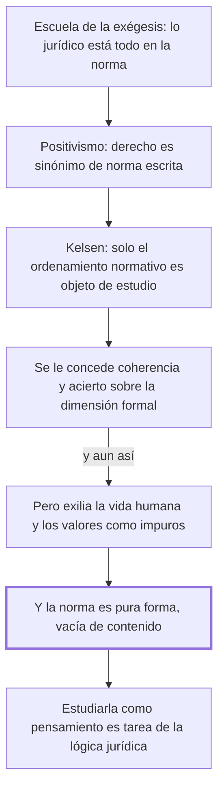

# § 57. El formalismo jurídico

## 1. Idea principal

El formalismo explicó bien la dimensión normativa del derecho, pero la norma no puede ser su objeto de estudio porque es pura forma vacía de contenido.

Contesta por qué la escuela que hoy sigue dominando la enseñanza tampoco alcanza. Es el segundo de los tres capítulos sobre una visión parcial, y el que más concede antes de objetar.

## 2. Lo esencial del capítulo

Mientras el derecho natural perdía influencia, se expandió de manera vertiginosa una visión puramente formalista, y el normativismo se afirma en el siglo XIX como la solución que los juristas esperaban (p. 130). El recorrido tiene tres escalones. Primero la escuela de la exégesis, para la cual lo jurídico estaba "totalmente contenido en su expresión normativa" y cuyo método se volvió el instrumento de la enseñanza y la interpretación; por décadas el derecho civil se asimiló sin más al Código Napoleón de 1804. De la exégesis deriva el positivismo, para el cual derecho es sinónimo de norma escrita (p. 131). Y el positivismo alcanza su punto más alto con Kelsen.

Sobre la teoría pura del derecho el autor es generoso, y conviene notar cuánto: dice que deslumbró por su coherencia y sus aciertos en el tratamiento de la dimensión formal-normativa, que su fuerza de convicción fue avasalladora, que la doctrina se impregnó de sus postulados y que los juristas se rindieron entusiastas. Reconoce que su validez es ampliamente admitida y que se alaba su rigor. Después describe qué hace exactamente esa teoría: para Kelsen el objeto de estudio de la ciencia jurídica se contrae solo al ordenamiento normativo, la vida humana queda relegada a ser el contenido factual de las normas, y los valores resultan elementos "de naturaleza metajurídica", o sea de fuera del derecho.

Y ahí está el límite, con la misma estructura que en los capítulos anteriores: admitir la explicación de la dimensión formal no obliga a compartir su conclusión, la de reducir el derecho a esa sola dimensión. La vida humana y los valores no pueden marginarse de la experiencia jurídica, y la frase que lo cierra es la más filosa del capítulo: no cabe "extrañarlos o exiliarlos del derecho calificándolos de 'impuros'" (pp. 131-132). Trae después a Perlingieri, para quien el formalismo, sea exegético o científico, es "una interpretación unilateral de la juridicidad".

El argumento final es distinto de los anteriores y merece atención, porque no es de alcance sino de naturaleza: la norma no puede constituirse en el objeto de estudio del derecho "en tanto es pura forma, vacía de contenido" (p. 132). No es solo que le falte algo: es que por sí sola no tiene qué estudiar. Y de ahí un reparto: el estudio de la norma como pensamiento es materia de la lógica jurídica, no de la ciencia del derecho.

## 3. Mapa

## 4. Qué releer del original

1. (p. 132) "en tanto es pura forma, vacía de contenido" — es la bisagra y el argumento más fuerte del capítulo: no es de alcance sino de naturaleza.
2. (pp. 131-132) "extrañarlos o exiliarlos del derecho calificándolos de 'impuros'" — la formulación exacta importa, porque juega con el nombre de la teoría pura.
3. (p. 131) "Los valores resultan ser, dentro del planteamiento kelseniano, elementos de naturaleza metajurídica" — es el pasaje que más fácil se malentiende: describe a Kelsen, no la posición del autor.

## 5. Vocabulario clave

- **Formalismo jurídico** — la corriente que identifica el derecho con su forma normativa y deja afuera conducta y valores.
- **Escuela de la exégesis** — la que sostenía que todo el derecho está en el texto de la ley, y que asimiló el derecho civil al Código Napoleón.
- **Positivismo jurídico** — para el autor, la corriente derivada de la exégesis para la cual derecho es sinónimo de norma escrita.
- **Teoría pura del derecho** — la construcción de Kelsen: el objeto de la ciencia jurídica se contrae al ordenamiento normativo.
- **Metajurídico** — lo que queda fuera del derecho; es el lugar al que Kelsen manda los valores.
- **Lógica jurídica** — la disciplina que estudia la norma como pensamiento; el autor le deja ese trabajo.

## 6. Distinciones que se confunden

- **Que la teoría pura acierte vs. que alcance** — el autor le concede rigor sobre la dimensión formal y le niega la conclusión de que el derecho sea solo eso.
  - Se confunden porque: casi todo el capítulo elogia a Kelsen, así que el lector espera una adhesión.
  - Criterio para decidir: ¿la afirmación es sobre la dimensión formal, o sobre el derecho entero? Lo primero se acepta, lo segundo no.
  - Dónde se cae: se responde que el autor rechaza la teoría pura, cuando lo que rechaza es su "aserto conclusivo".

- **La norma es una dimensión vs. la norma es el objeto de estudio** — el autor sostiene lo primero y niega lo segundo con un argumento propio.
  - Se confunden porque: si la norma es parte del derecho, parece poder ser también lo que se estudia.
  - Criterio para decidir: ¿la norma tiene contenido por sí sola? Para el autor no: es pura forma, y su contenido viene de la conducta y el valor.
  - Dónde se cae: se contesta que el autor excluye a la norma del derecho, cuando la incluye como una de las tres dimensiones.

## 7. Autoevaluación

1. Un profesor enseña derecho civil explicando artículo por artículo el código, sin salir del texto. ¿A qué escuela pertenece ese método y qué le objetaría el autor?
2. Alguien afirma que en este capítulo el autor refuta a Kelsen. ¿Qué parte de esa lectura respalda el texto y qué parte contradice?
3. El argumento de que la norma es "pura forma, vacía de contenido" es distinto de los que usó contra el iusnaturalismo. ¿En qué se diferencia y por qué es más fuerte?
4. El autor manda el estudio de la norma como pensamiento a la lógica jurídica. ¿Eso resuelve algo o solo mueve el problema de lugar?

--- No mires esto hasta responder ---

1. A la escuela de la exégesis, para la cual lo jurídico está totalmente contenido en su expresión normativa. La objeción es que trabaja con pura forma: sin la conducta que la norma regula ni el valor que protege, no tiene contenido que enseñar (pp. 130-132).
2. Respalda que rechaza su conclusión: reducir el derecho a la dimensión normativa. Contradice llamarlo refutación: le concede coherencia, rigor y acierto sobre la dimensión formal, y dice que su validez es ampliamente reconocida.
3. Contra el iusnaturalismo el argumento era de alcance —los valores no agotan la experiencia—. Acá es de naturaleza: la norma no puede ser el objeto de estudio porque por sí sola no tiene qué estudiar. Es más fuerte porque no depende de comparar dimensiones.
4. Resuelve algo: le da un lugar legítimo al análisis formal en vez de descartarlo, y así el autor puede quedarse con el aporte de Kelsen sin aceptar su conclusión. Discutible: no explica cómo se relacionan después la lógica jurídica y la ciencia del derecho.

## Flashcards

Qué sostenía la escuela de la exégesis | Que lo jurídico estaba totalmente contenido en su expresión normativa
A qué código se asimiló el derecho civil por décadas | Al Código Napoleón de 1804
Qué es el positivismo jurídico según este capítulo | La corriente derivada de la exégesis para la cual derecho es sinónimo de norma escrita
Qué es el objeto de estudio del derecho para Kelsen | Solo el ordenamiento normativo, con prescindencia de la vida humana
Qué lugar les da Kelsen a los valores | El de elementos metajurídicos, o sea de fuera del derecho
Qué le concede el autor a la teoría pura del derecho | Coherencia, rigor y acierto en el tratamiento de la dimensión formal-normativa
Por qué la norma no puede ser el objeto de estudio del derecho | Porque es pura forma, vacía de contenido
A qué disciplina le deja el autor el estudio de la norma como pensamiento | A la lógica jurídica
