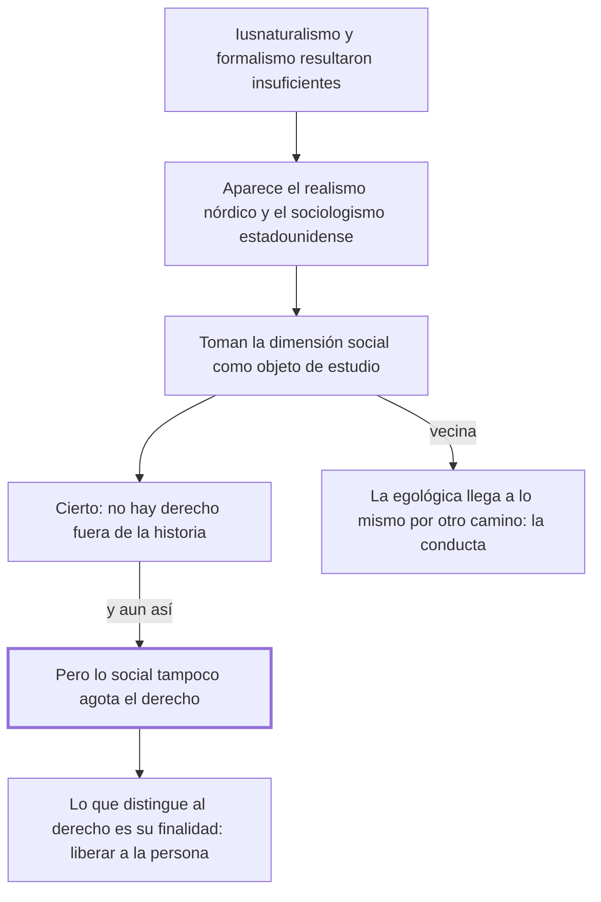

# § 58. El sociologismo o realismo jurídico

## 1. Idea principal

No se puede entender el derecho fuera de la historia y del acontecer social, pero lo social tampoco lo agota: el derecho es una ciencia social con una finalidad propia, liberar a la persona.

Cierra el recorrido por las tres visiones parciales. Y es el capítulo donde por primera vez se dice qué distingue al derecho de las otras ciencias sociales, que es la pregunta que el sociologismo deja abierta.

## 2. Lo esencial del capítulo

La insuficiencia del derecho natural y del formalismo, sumada a la presencia evidente y primaria de la vida humana social en lo jurídico, explica la aparición de una escuela llamada realista en los países del norte de Europa y sociológica en Estados Unidos (p. 132), que considera que la dimensión social es el objeto de estudio de la ciencia jurídica. La concesión es la más rotunda de los tres capítulos: es una "indiscutible comprobación" que no se puede comprender el derecho fuera de la historia y del acontecer social. Pero eso no justifica la reducción: lo social, "no obstante el preponderante rol que asume en la experiencia jurídica, no agota la explicación de lo que sea el derecho". Acá el reproche vuelve a ser de alcance, como con el iusnaturalismo, y no de naturaleza como con la norma. Aparece además una posición vecina que conviene no confundir: la teoría egológica, "próxima al sociologismo pero a partir de una fundamentación filosófica", reduce el derecho a la conducta humana intersubjetiva, y para Carlos Cossio los valores y las normas se integran en ella (p. 133).

El tramo final es el más valioso y el que no estaba en los dos capítulos anteriores. La vida humana social la estudian varias ciencias, cada una con su objetivo, y el derecho es una de ellas pero no se confunde con ninguna, porque su objeto persigue una finalidad diferente: "asegurar la libertad de cada ser humano para liberarlo", de modo que pueda realizarse y cumplir con su personal proyecto de vida, en un contexto donde la vida social se organice en términos de justicia, seguridad, solidaridad e igualdad. Ese criterio de distinción es funcional y no de objeto: el derecho y la sociología pueden mirar el mismo hecho, y lo que los separa es para qué lo miran.

## 3. Mapa

## 4. Vocabulario clave

- **Sociologismo jurídico** — la corriente, de origen estadounidense, que toma la dimensión social como objeto de estudio del derecho.
- **Realismo jurídico** — el nombre que la misma posición recibe en los países del norte de Europa.
- **Dimensión social** — la cara del derecho que consiste en la vida humana de relación, y que estas escuelas toman por el todo.

## 5. Distinciones que se confunden

- **El derecho es una ciencia social vs. el derecho se reduce a lo social** — el autor afirma lo primero y niega lo segundo.
  - Se confunden porque: si el derecho es una ciencia social y estudia la vida social, parece seguirse que su objeto es lo social.
  - Criterio para decidir: ¿qué finalidad persigue al mirar ese hecho? Si es liberar a la persona, es derecho; el hecho por sí solo no lo define.
  - Dónde se cae: se contesta que para el autor el derecho es una rama de la sociología, cuando dice que no se confunde con ninguna otra ciencia social.

- **Sociologismo vs. teoría egológica** — llegan al mismo resultado, una sola dimensión, pero por caminos distintos.
  - Se confunden porque: el autor las presenta juntas y las dos privilegian la vida frente a la norma.
  - Criterio para decidir: ¿el fundamento es la observación de lo social, o una filosofía sobre la conducta? La egológica es lo segundo.
  - Dónde se cae: se las trata como sinónimos; acá el autor solo ubica a la egológica y remite a un parágrafo posterior para explicarla.

## 6. Autoevaluación

1. Ubique al derecho entre las ciencias sociales: explique qué comparte con ellas y qué lo distingue.
2. Un sociólogo y un juez estudian la misma huelga. Según el criterio del capítulo, ¿qué distingue lo que hace cada uno?

--- No mires esto hasta responder ---

1. El derecho es una de las ciencias sociales, porque su materia es la vida humana de relación y es "indiscutible comprobación" que no puede comprenderse fuera de la historia y del acontecer social (p. 132). Lo comparte con la sociología, la economía y las demás, que estudian esa misma vida social cada una con su objetivo. Lo que lo distingue no es el hecho que mira sino la finalidad con que lo mira: asegurar la libertad de cada ser humano para liberarlo, de modo que pueda cumplir su personal proyecto de vida, en una convivencia organizada en términos de justicia, seguridad, solidaridad e igualdad (p. 133). Por eso no se confunde con ninguna de ellas ni se reduce a lo social, que es lo que pretende el sociologismo.
2. No los distingue el hecho, que es el mismo, sino la finalidad con que lo miran. El derecho lo mira para asegurar la libertad de cada uno y organizar la convivencia en términos de justicia y solidaridad; la sociología persigue otro objetivo de conocimiento. Es un criterio funcional y no de objeto, y por eso discutible: el capítulo no explica por qué la política o la ética no podrían reclamar la misma finalidad.

## Flashcards

Cómo se llama la escuela de la dimensión social en el norte de Europa y en Estados Unidos | Realista en el norte de Europa, sociológica en Estados Unidos
Qué le concede el autor al sociologismo | Que es indiscutible que no se puede comprender el derecho fuera de la historia y lo social
Cuál es la finalidad propia del derecho según este capítulo | Asegurar la libertad de cada ser humano para que pueda cumplir su proyecto de vida
Qué distingue al derecho de las otras ciencias sociales | No el hecho que estudia, sino la finalidad con que lo estudia
