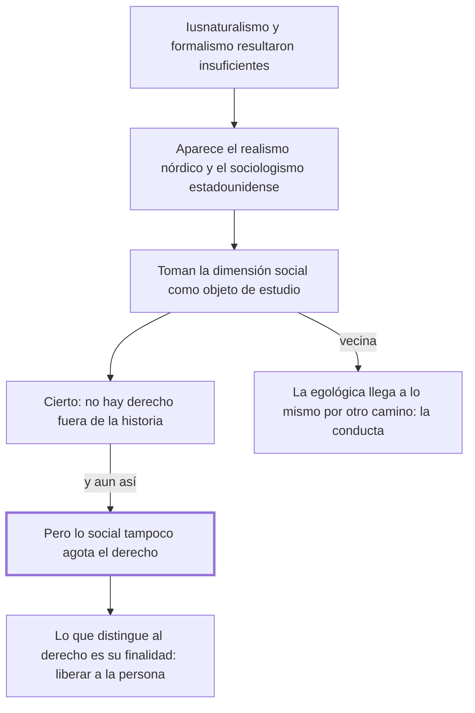

# § 58. El sociologismo o realismo jurídico

## 1. Idea principal

No se puede entender el derecho fuera de la historia y del acontecer social, pero lo social tampoco lo agota: el derecho es una ciencia social con una finalidad propia, liberar a la persona.

Cierra el recorrido por las tres visiones parciales. Y es el capítulo donde por primera vez se dice qué distingue al derecho de las otras ciencias sociales, que es la pregunta que el sociologismo deja abierta.

## 2. Lo esencial del capítulo

La insuficiencia de las respuestas del derecho natural y del formalismo, sumada a la presencia evidente y primaria de la vida humana social en lo jurídico, explica la aparición de una escuela llamada realista en los países del norte de Europa y sociológica en Estados Unidos (p. 132). Con distintos matices, esa corriente considera que la dimensión social es el objeto de estudio de la ciencia jurídica.

La concesión es la más rotunda de los tres capítulos: es una "indiscutible comprobación" que no se puede comprender el derecho fuera de la historia y del acontecer social. Pero eso no justifica reducir lo jurídico a esa sola dimensión: lo social, "no obstante el preponderante rol que asume en la experiencia jurídica, no agota la explicación de lo que sea el derecho". Notar que acá el reproche vuelve a ser de alcance, como con el iusnaturalismo, y no de naturaleza como con la norma.

Aparece después una posición vecina que conviene no confundir con el sociologismo: la teoría egológica, "próxima al sociologismo pero a partir de una fundamentación filosófica", reduce el derecho a la conducta humana intersubjetiva, y para Carlos Cossio tanto los valores como las normas se integran en la conducta (p. 133). El autor remite a un parágrafo posterior para desarrollarla, así que acá solo queda ubicada: comparte con el sociologismo el resultado —una sola dimensión— pero llega por otro camino.

El tramo final es el más valioso y el que no estaba en los dos capítulos anteriores. La vida humana social la estudian varias ciencias, cada una con su objetivo. El derecho es una de las ciencias sociales pero no se confunde con ninguna, porque su objeto persigue una finalidad diferente: "asegurar la libertad de cada ser humano para liberarlo", de modo que pueda realizarse y cumplir con su personal proyecto de vida, en un contexto donde la vida social se organice en términos de justicia, seguridad, solidaridad, igualdad y los demás valores que el hombre vivencia. Ese criterio de distinción es funcional y no de objeto: el derecho y la sociología pueden mirar el mismo hecho, y lo que los separa es para qué lo miran.

## 3. Mapa

## 4. Qué releer del original

1. (p. 133) "asegurar la libertad de cada ser humano para liberarlo" — es la bisagra: la única definición de la finalidad propia del derecho en todo el apartado, y la formulación exacta importa.
2. (p. 132) "no agota la explicación de lo que sea el derecho" — cierra el molde que el autor repitió con las tres escuelas; conviene verlo textual para reconocer el patrón.
3. (p. 133) "próxima al sociologismo pero a partir de una fundamentación filosófica" — es el pasaje que más fácil se malentiende: ubica a la egológica sin confundirla con el sociologismo.

## 5. Vocabulario clave

- **Sociologismo jurídico** — la corriente, de origen estadounidense, que toma la dimensión social como objeto de estudio del derecho.
- **Realismo jurídico** — el nombre que la misma posición recibe en los países del norte de Europa.
- **Dimensión social** — la cara del derecho que consiste en la vida humana de relación, y que estas escuelas toman por el todo.

## 6. Distinciones que se confunden

- **El derecho es una ciencia social vs. el derecho se reduce a lo social** — el autor afirma lo primero y niega lo segundo.
  - Se confunden porque: si el derecho es una ciencia social y estudia la vida social, parece seguirse que su objeto es lo social.
  - Criterio para decidir: ¿qué finalidad persigue al mirar ese hecho? Si es liberar a la persona, es derecho; el hecho por sí solo no lo define.
  - Dónde se cae: se contesta que para el autor el derecho es una rama de la sociología, cuando dice que no se confunde con ninguna otra ciencia social.

- **Sociologismo vs. teoría egológica** — llegan al mismo resultado, una sola dimensión, pero por caminos distintos.
  - Se confunden porque: el autor las presenta juntas y las dos privilegian la vida frente a la norma.
  - Criterio para decidir: ¿el fundamento es la observación de lo social, o una filosofía sobre la conducta? La egológica es lo segundo.
  - Dónde se cae: se las trata como sinónimos; acá el autor solo ubica a la egológica y remite a un parágrafo posterior para explicarla.

## 7. Autoevaluación

1. Un sociólogo y un juez estudian la misma huelga. Según el criterio del capítulo, ¿qué distingue lo que hace cada uno?
2. Alguien afirma que el autor rechaza el sociologismo porque niega que la vida social importe en el derecho. ¿Qué tiene de incorrecto?
3. Contra el formalismo el autor usó un argumento de naturaleza —la norma es forma vacía— y contra el sociologismo vuelve al de alcance. ¿Por qué no le sirve el mismo argumento?
4. La finalidad que da como propia del derecho es "liberar" a la persona para que cumpla su proyecto de vida. ¿Alcanza eso para distinguirlo de la política o de la ética?

--- No mires esto hasta responder ---

1. No los distingue el hecho, que es el mismo, sino la finalidad con que lo miran. El derecho lo mira para asegurar la libertad de cada uno y organizar la convivencia en términos de justicia, seguridad y solidaridad; la sociología persigue otro objetivo de conocimiento (p. 133).
2. Es al revés: el autor llama "indiscutible comprobación" que no se puede entender el derecho fuera de la historia y del acontecer social. Lo que rechaza es que esa dimensión, siendo preponderante, agote la explicación.
3. Porque lo social no es forma vacía: tiene contenido propio y es la materia misma del derecho. El defecto del sociologismo no es que trabaje con nada, sino que toma una parte por el todo. Contra la norma el argumento podía ser más fuerte justamente porque la norma sola no tiene contenido.
4. Es un criterio funcional y por eso discutible: la política y la ética también podrían reclamar esa finalidad. El capítulo no lo desarrolla; apenas afirma que el objeto del derecho "es peculiar". Discutible: la diferencia estaría en que el derecho la persigue con normas exigibles, pero eso el texto no lo dice acá.

## Flashcards

Cómo se llama la escuela de la dimensión social en el norte de Europa y en Estados Unidos | Realista en el norte de Europa, sociológica en Estados Unidos
Qué toma el sociologismo como objeto de estudio del derecho | La dimensión social
Qué le concede el autor al sociologismo | Que es indiscutible que no se puede comprender el derecho fuera de la historia y lo social
Por qué rechaza reducir el derecho a lo social | Porque lo social, aun siendo preponderante, no agota la explicación del derecho
A qué reduce el derecho la teoría egológica | A la conducta humana intersubjetiva, con valores y normas integrados en ella
En qué se diferencia la egológica del sociologismo | Llega a una sola dimensión pero desde una fundamentación filosófica, no de observación social
Cuál es la finalidad propia del derecho según este capítulo | Asegurar la libertad de cada ser humano para que pueda cumplir su proyecto de vida
Qué distingue al derecho de las otras ciencias sociales | No el hecho que estudia, sino la finalidad con que lo estudia
