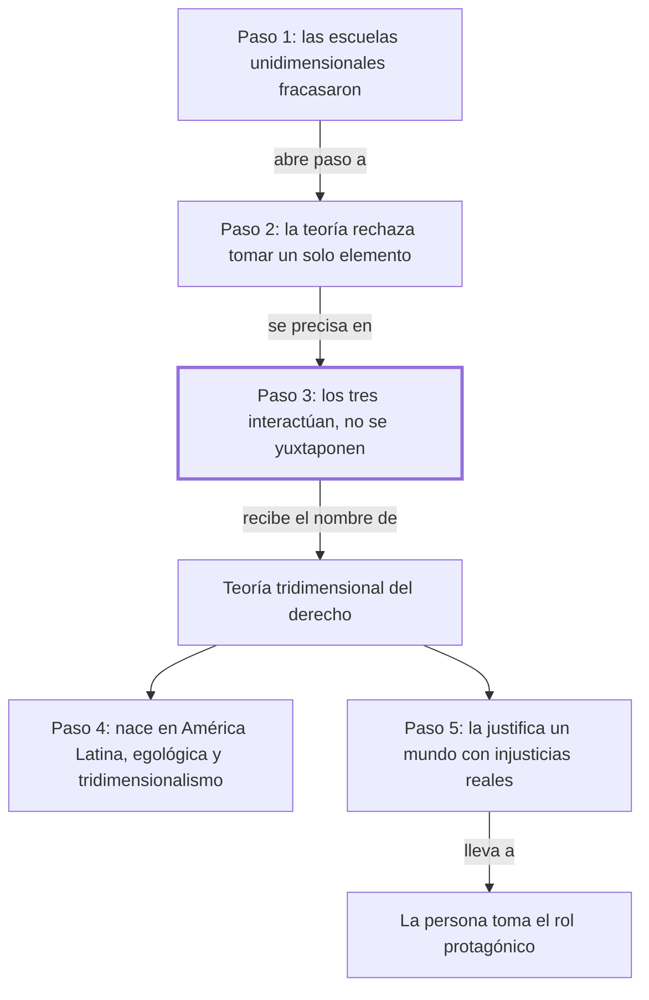

# § 59. Una nueva teoría sobre el objeto de estudio de la disciplina jurídica + § 60. Presencia universal del pensamiento iusfilosófico latinoamericano

## 1. Idea principal

Frente a las escuelas que tomaban un solo elemento como objeto del derecho, aparece la teoría tridimensional: el derecho es la interacción de conducta, valor y norma, tres elementos que no están simplemente uno al lado del otro sino actuando entre sí.

Estos dos capítulos contestan qué es lo que estudia realmente la ciencia jurídica, y de dónde salió la respuesta. A un principiante le conviene entenderlos porque acá se nombra por primera vez la teoría que da título a toda esta parte del libro. Además, el autor sostiene que esa respuesta nació en América Latina y no es una importación, y que sirve para enfrentar un mundo con injusticias y desigualdades concretas.

## 2. Explicación paso a paso

### Paso 1 — Presenta la teoría como respuesta a un fracaso anterior

El § 59 abre con "Ante la insuficiente y fragmentaria concepción dada por las tres escuelas" (p. 133). El movimiento es de encuadre: la nueva teoría no se presenta como una ocurrencia sino como la salida a un problema ya diagnosticado en los capítulos anteriores. El autor remite a un parágrafo previo del libro para el desarrollo completo. Y enuncia en una línea en qué consiste: encontrar el objeto de estudio del derecho en la interacción dinámica de conducta humana intersubjetiva —la conducta de unas personas frente a otras—, valores y normas jurídicas. Importa porque fija la relación entre esta parte del libro y la anterior: lo que viene es la propuesta, no otra crítica.

### Paso 2 — Define la teoría por lo que rechaza

Sigue en "Se trata de una teoría que desecha toda visión unidimensional" (p. 134). El movimiento es delimitar por contraste. Llama unidimensional a la visión que centra el estudio en uno cualquiera de los tres elementos, y aclara que da lo mismo cuál: conducta, valor o norma. Después viene la formulación que hay que leer con cuidado, porque son dos afirmaciones y no una: ninguno de los tres elementos, por sí solo, constituye el objeto de estudio del derecho; y a la vez no se puede prescindir de ninguno cuando se habla de derecho. La analogía: ninguna de las tres patas es el banco, y sacar cualquiera lo tira. Importa porque esa doble afirmación es la que distingue al tridimensionalismo de un simple eclecticismo que sumara las tres escuelas.

### Paso 3 — Distingue interacción de yuxtaposición

El párrafo "Los tres elementos antes referidos están siempre presentes" (p. 134) es la bisagra de los dos capítulos, y el autor se detiene a marcarlo con una aclaración explícita: la vinculación entre los tres elementos no es "una simple yuxtaposición -el estar un elemento al lado del otro-", sino una interacción. El autor mismo intercala la definición entre guiones, señal de que sabe que es el punto que se malentiende. La analogía cotidiana: los ingredientes de una torta apoyados en la mesa son una yuxtaposición; la torta horneada es una interacción, y ya no se pueden separar. Y recién al final del párrafo le pone el nombre: teoría tridimensional del derecho. Importa porque sin esta distinción la teoría se leería como "hay que estudiar las tres cosas", que es exactamente lo que no dice.

### Paso 4 — Reivindica el origen latinoamericano de la teoría

El § 60 arranca con "El mundo iusfilosófico latinoamericano, de pujante potencialidad creadora" (p. 134). Acá el movimiento cambia de registro: pasa de exponer una teoría a ubicarla geográfica e intelectualmente. Sostiene que el pensamiento iusfilosófico latinoamericano contribuye a la evolución del pensamiento jurídico contemporáneo, y se cubre de la objeción obvia con un "no existe exageración en lo expresado". Nombra dos formulaciones —la escuela egológica del derecho y el tridimensionalismo jurídico— y dice que las dos se aproximan a una filosofía de la existencia, esto es, una filosofía que parte de la vida concreta de las personas en vez de partir de conceptos abstractos. Conviene notar que acá el autor está siendo parte interesada: es uno de los autores de la teoría que elogia. Importa porque explica por qué el libro trata al tridimensionalismo como algo más que una escuela entre otras.

### Paso 5 — Justifica la teoría por el estado del mundo, no solo por su coherencia

El cierre, "El jurista contemporáneo, al sustentar su tarea científica" (p. 135), hace el movimiento más político del capítulo. El argumento deja de ser epistemológico y pasa a ser práctico: el jurista se enfrenta a un mundo "convulso y angustiado, ahíto de injusticias y desigualdades sustanciales" (p. 135), y es esa realidad la que lo obliga a despojar a la dogmática jurídica de las visiones unilaterales. Y cierra dando el motivo de fondo de todo el libro: en la totalidad del derecho "la persona adquiere un rol protagónico". Conviene marcar que esto es una razón para preferir la teoría, no una prueba de que sea correcta: que una concepción sirva mejor frente a la injusticia no demuestra que describa bien el derecho. Importa porque conecta el título del libro —*Derecho y persona*— con la teoría que acaba de exponer.

## 3. Mapa

## 4. Vocabulario clave

- **Objeto de estudio del derecho** — aquello que la ciencia jurídica investiga; el problema que estos dos capítulos vienen a resolver.
- **Visión unidimensional** — la que centra el estudio en uno solo de los tres elementos, sea la conducta, el valor o la norma (p. 134).
- **Conducta humana intersubjetiva** — la conducta de unas personas frente a otras, no la de alguien aislado.
- **Yuxtaposición** — el autor la define al pasar: "el estar un elemento al lado del otro" (p. 134), y es justo lo que la teoría niega.
- **Interacción** — la relación real entre los tres elementos, que se exigen y se afectan entre sí, y da una visión unitaria del derecho.
- **Teoría tridimensional del derecho** — el nombre de esta concepción: el derecho como interacción de conducta, valor y norma (p. 134).
- **Escuela egológica del derecho** — la otra formulación latinoamericana que el autor menciona; en esta sección solo la nombra y remite a Cossio en nota.
- **Filosofía de la existencia** — la que parte de la vida concreta de las personas en vez de partir de conceptos abstractos; el autor dice que las dos escuelas se aproximan a ella.
- **Dogmática jurídica** — el estudio ordenado del derecho vigente, que según el cierre hay que despojar de visiones unilaterales.
- **Visión unitaria** — el resultado que la teoría busca: ver el derecho como un todo y no como partes sueltas.

## 5. Distinciones que se confunden

- **Interacción vs. yuxtaposición** — yuxtaponer es poner los tres elementos uno al lado del otro; interactuar es que se afecten entre sí y formen una unidad.
  - Se confunden porque: las dos posiciones nombran los mismos tres elementos, así que suenan igual al resumirlas.
  - Criterio para decidir: ¿los elementos se pueden estudiar por separado sin perder nada, o cambian según los otros? Si son separables sin pérdida, es yuxtaposición.
  - Dónde se cae: se define el tridimensionalismo como "estudiar las tres dimensiones", que es precisamente lo que el autor niega en la p. 134.

- **Tridimensionalismo vs. eclecticismo** — el primero sostiene que el derecho *es* la interacción; el segundo se limitaría a tomar lo mejor de cada escuela.
  - Se confunden porque: los dos se presentan como superación de las posiciones parciales y los dos suenan conciliadores.
  - Criterio para decidir: ¿se afirma que ninguno de los elementos por sí solo es el objeto de estudio? El eclecticismo no necesita afirmar eso; el tridimensionalismo sí lo hace.
  - Dónde se cae: se contesta que el autor combina iusnaturalismo, positivismo y sociologismo, cuando lo que propone es un objeto de estudio distinto del de las tres.

- **Que una teoría sea útil vs. que sea correcta** — el paso 5 argumenta que la teoría sirve frente a la injusticia, no que sea verdadera.
  - Se confunden porque: el autor pone las dos cosas en el mismo tramo y con el mismo tono afirmativo.
  - Criterio para decidir: ¿la razón que da describe cómo es el derecho, o para qué conviene esta mirada? Si es lo segundo, es un argumento de utilidad.
  - Dónde se cae: se responde que el autor demuestra el tridimensionalismo mostrando las injusticias del mundo, que no es una demostración sino una motivación.

- **Escuela egológica vs. tridimensionalismo** — son dos formulaciones distintas, aunque el autor las presente juntas y vecinas.
  - Se confunden porque: en estos dos capítulos aparecen en la misma oración, las dos como aportes latinoamericanos aproximados a una filosofía de la existencia.
  - Criterio para decidir: ¿la afirmación es sobre los tres elementos en interacción, o sobre la conducta como objeto central? La egológica pone el foco en la conducta.
  - Dónde se cae: se las trata como sinónimos; en esta sección el autor no explica la egológica, solo la nombra y remite a Cossio, así que no hay base para igualarlas.

## 6. Qué releer del original

1. (p. 134) "Los tres elementos antes referidos están siempre presentes" — es la bisagra de los dos capítulos y la formulación exacta importa: ahí está la distinción entre interacción y yuxtaposición, con la definición que el autor intercala entre guiones.
2. (p. 134) "si bien ninguno de dichos tres elementos, por si sólo" — es el pasaje que más fácil se malentiende, porque son dos afirmaciones opuestas en la misma oración y hay que retener las dos.
3. (p. 133, nota 8) "Cfr. Cossio, La teoría egológica del derecho" — es la referencia que el paso 4 no desarrolló: es la única pista que el capítulo da sobre la escuela egológica.
4. (p. 135) "un mundo convulso y angustiado, ahíto de injusticias" — es la bisagra entre la teoría y el propósito del libro, y conviene leerla notando que es una razón para preferir la teoría, no una prueba de ella.
5. (p. 133) "como se ha puesto de manifiesto en el § 25" — el autor remite a un parágrafo anterior que no está en esta sección; si algo del planteo queda corto, el desarrollo está ahí.

## 7. Autoevaluación

1. ¿En qué consiste, según el autor, la nueva corriente que presenta el § 59?
2. ¿Qué rechaza expresamente esa teoría?
3. ¿Qué dos afirmaciones hace el autor sobre los tres elementos en la p. 134?
4. Explicá con tus palabras la diferencia entre interacción y yuxtaposición.
5. Reformulá el paso 4: ¿qué sostiene el autor sobre el pensamiento iusfilosófico latinoamericano?
6. ¿Por qué es necesario el paso 3? ¿Qué se entendería mal si el autor no distinguiera interacción de yuxtaposición?
7. Un profesor define el tridimensionalismo diciendo: "es la teoría que estudia el derecho desde tres puntos de vista: el social, el normativo y el valorativo". Usando el criterio del bloque 5, ¿qué tiene de incorrecta esa definición?
8. Alguien sostiene que el autor demuestra la verdad del tridimensionalismo señalando las injusticias del mundo contemporáneo. ¿Es una demostración? Justificá con la distinción correspondiente.
9. El autor afirma que no hay exageración en decir que el pensamiento latinoamericano contribuye a la iusfilosofía contemporánea. ¿Qué evidencia da en esta sección para sostenerlo?
10. Evaluá: el autor es uno de los creadores de la teoría que expone y elogia. ¿Eso invalida su argumento, lo debilita, o es irrelevante?

--- No mires esto hasta responder ---

1. En encontrar el objeto de estudio del derecho en la dinámica interacción de conducta humana intersubjetiva, valores y normas jurídicas (p. 133).
2. Toda visión unidimensional, es decir, la que centra el estudio en uno cualquiera de los tres elementos, sea la conducta, el valor o la norma (p. 134).
3. Que ninguno de los tres, por sí solo, constituye el objeto de estudio del derecho; y que aun así no se puede prescindir de ninguno cuando se alude a la noción de derecho (p. 134).
4. Yuxtaponer es tener los elementos uno al lado del otro, separables y sin afectarse. Interactuar es que se exijan y se modifiquen entre sí, de modo que el resultado es una unidad y no una suma (p. 134).
5. Que es de pujante potencialidad creadora y aporta un pensamiento renovado y acorde con su realidad a la evolución del pensamiento jurídico contemporáneo, con dos formulaciones: la escuela egológica y el tridimensionalismo (p. 134).
6. Sin esa distinción, el tridimensionalismo se confundiría con la suma de las tres escuelas parciales, y perdería lo que lo hace una teoría distinta: que el objeto de estudio es la interacción misma, no los tres elementos por separado.
7. Que describe una yuxtaposición: tres puntos de vista sobre un mismo objeto, separables entre sí. Para el autor el objeto de estudio es la interacción de los tres, no el derecho mirado tres veces.
8. No es una demostración. El estado del mundo es una razón para preferir una concepción que ponga a la persona en el centro, pero no prueba que el derecho consista efectivamente en esa interacción. Es un argumento de utilidad o de urgencia, no de verdad.
9. Muy poca en esta sección: menciona la existencia de dos formulaciones —la egológica y el tridimensionalismo—, dice que son frescas y originales, y remite en nota a Cossio. No compara con otras tradiciones ni cita recepción externa. Es una afirmación apoyada más en la existencia de las escuelas que en evidencia de su influencia.
10. No lo invalida: una teoría se juzga por sus razones, no por quién la firma. Pero sí obliga a leer los elogios del § 60 como parte interesada y a buscar la evidencia por separado. Respuesta discutible: puede sostenerse que en una obra de autor es esperable y que el propio texto lo deja ver al remitir a su tesis.

## Flashcards

En qué consiste la teoría que presenta el § 59 | En que el objeto de estudio del derecho es la interacción de conducta, valores y normas
Cómo se llama esa concepción | Teoría tridimensional del derecho
Qué es una visión unidimensional del derecho | La que centra el estudio en uno solo de los tres elementos
Cuáles son los tres elementos del derecho según esta teoría | Conducta humana intersubjetiva, valores y normas jurídicas
Qué es la conducta humana intersubjetiva | La conducta de unas personas frente a otras, no la de alguien aislado
Cómo define el autor la yuxtaposición | El estar un elemento al lado del otro
Cómo distingo interacción de yuxtaposición | En la yuxtaposición los elementos son separables sin pérdida; en la interacción se afectan y forman una unidad
Cuáles son las dos afirmaciones del autor sobre los tres elementos | Que ninguno por sí solo es el objeto de estudio, y que no se puede prescindir de ninguno
Cómo distingo tridimensionalismo de eclecticismo | El tridimensionalismo niega que un solo elemento sea el objeto; no combina escuelas, propone otro objeto
Qué dos formulaciones latinoamericanas nombra el autor | La escuela egológica del derecho y el tridimensionalismo jurídico
A qué autor remite el autor para la escuela egológica | A Cossio, en nota al pie
Qué es una filosofía de la existencia | La que parte de la vida concreta de las personas en vez de partir de conceptos abstractos
Con qué realidad dice el autor que se enfrenta el jurista contemporáneo | Un mundo convulso y angustiado, lleno de injusticias y desigualdades sustanciales
Qué le pide el autor a la dogmática jurídica en el cierre | Despojarla de las visiones unilaterales que impiden ver el derecho como unidad
Qué rol le asigna el autor a la persona en la totalidad del derecho | Un rol protagónico
Demuestra el autor la teoría señalando las injusticias del mundo | No: eso es una razón para preferirla, no una prueba de que sea correcta
Un profesor define el tridimensionalismo como estudiar el derecho desde tres puntos de vista. Qué falla | Describe una yuxtaposición; el objeto de estudio es la interacción, no tres miradas separables
Cómo distingo la escuela egológica del tridimensionalismo | La egológica pone el foco en la conducta; el tridimensionalismo, en los tres elementos interactuando
Qué evidencia da el autor de la influencia latinoamericana en esta sección | Casi ninguna: nombra las dos escuelas y remite a Cossio, sin mostrar recepción externa
Por qué presenta la teoría como respuesta y no como ocurrencia | Porque viene después de mostrar que las escuelas unidimensionales fracasaron
