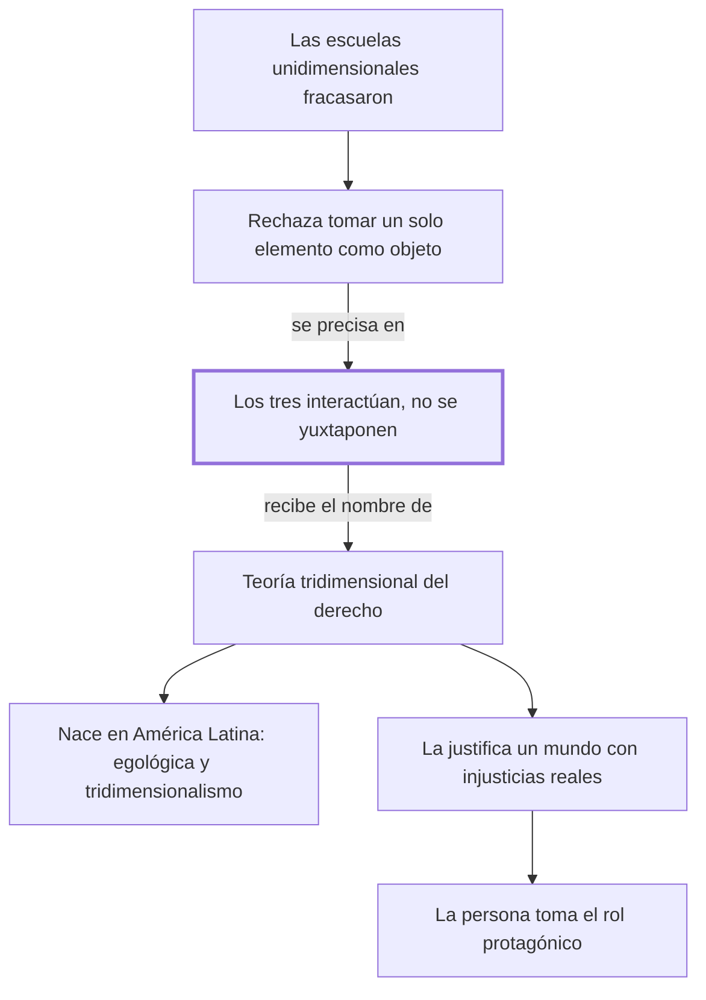

# § 59. Una nueva teoría sobre el objeto de estudio de la disciplina jurídica + § 60. Presencia universal del pensamiento iusfilosófico latinoamericano

## 1. Idea principal

Frente a las escuelas que tomaban un solo elemento, aparece la teoría tridimensional: conducta, valor y norma no están uno al lado del otro, sino actuando entre sí.

Estos dos capítulos contestan qué estudia la ciencia jurídica y de dónde salió la respuesta. Acá se nombra por primera vez la teoría que da título a toda esta parte del libro.

## 2. Lo esencial del capítulo

La nueva corriente no se presenta como una ocurrencia sino como la salida a un problema ya diagnosticado: frente a la concepción insuficiente y fragmentaria de las tres escuelas anteriores, el objeto de estudio del derecho se encuentra en la interacción dinámica de conducta humana intersubjetiva, valores y normas jurídicas (p. 133). Se define primero por lo que rechaza —toda visión unidimensional, y da lo mismo cuál sea el elemento elegido (p. 134)—, y sigue con una formulación que hay que leer con cuidado porque son dos afirmaciones y no una: ninguno de los tres elementos por sí solo constituye el objeto de estudio, y a la vez no se puede prescindir de ninguno cuando se habla de derecho. Ninguna de las tres patas es el banco, y sacar cualquiera lo tira. Esa doble afirmación es la que separa al tridimensionalismo de un eclecticismo que simplemente sumara las tres escuelas.

El punto más fino, que el autor marca con una aclaración intercalada entre guiones, es que la vinculación entre los tres elementos no es "una simple yuxtaposición -el estar un elemento al lado del otro-", sino una interacción (p. 134). Los ingredientes de una torta apoyados en la mesa son una yuxtaposición; la torta horneada es una interacción, y ya no se pueden separar. Sin esa distinción, la teoría se leería como "hay que estudiar las tres cosas", que es justamente lo que no dice. Recién al final aparece el nombre: teoría tridimensional del derecho.

El segundo parágrafo cambia de registro y ubica la teoría. El pensamiento iusfilosófico latinoamericano, "de pujante potencialidad creadora", contribuye a la evolución del pensamiento jurídico contemporáneo, y se cubre de la objeción obvia con un "no existe exageración en lo expresado" (p. 134); nombra dos formulaciones, la escuela egológica y el tridimensionalismo, y dice que ambas se aproximan a una filosofía de la existencia. Conviene notar que el autor es parte interesada —es uno de los creadores de la teoría que elogia— y que la evidencia es escasa. El cierre es el más político: el jurista se enfrenta a un mundo "convulso y angustiado, ahíto de injusticias y desigualdades sustanciales" (p. 135), y es esa realidad la que obliga a despojar a la dogmática de las visiones unilaterales, porque en la totalidad del derecho "la persona adquiere un rol protagónico". Eso es una razón para preferir la teoría, no una prueba de que sea correcta.

## 3. Mapa

## 4. Vocabulario clave

- **Visión unidimensional** — la que centra el estudio en uno solo de los tres elementos del derecho (p. 134).
- **Yuxtaposición** — el autor la define al pasar: "el estar un elemento al lado del otro" (p. 134); es lo que la teoría niega.
- **Escuela egológica del derecho** — la otra formulación latinoamericana que el autor menciona; acá solo la nombra y remite a Cossio.
- **Filosofía de la existencia** — la que parte de la vida concreta de las personas en vez de partir de conceptos abstractos.

## 5. Distinciones que se confunden

- **Interacción vs. yuxtaposición** — yuxtaponer es poner los tres elementos uno al lado del otro; interactuar es que se afecten y formen una unidad.
  - Se confunden porque: las dos posiciones nombran los mismos tres elementos, así que suenan igual al resumirlas.
  - Criterio para decidir: ¿los elementos se pueden estudiar por separado sin perder nada, o cambian según los otros? Si son separables, es yuxtaposición.
  - Dónde se cae: se define el tridimensionalismo como "estudiar las tres dimensiones", que es lo que el autor niega en la p. 134.

- **Que una teoría sea útil vs. que sea correcta** — el cierre argumenta que la teoría sirve frente a la injusticia, no que sea verdadera.
  - Se confunden porque: el autor pone las dos cosas en el mismo tramo y con el mismo tono afirmativo.
  - Criterio para decidir: ¿la razón describe cómo es el derecho, o para qué conviene esta mirada? Si es lo segundo, es utilidad.
  - Dónde se cae: se responde que demuestra el tridimensionalismo mostrando las injusticias del mundo, que es una motivación y no una prueba.

## 6. Autoevaluación

1. ¿Qué se entiende por una concepción tridimensional del derecho? Explique qué comprende y en qué se diferencia de sumar las tres escuelas anteriores.
2. Un profesor la define como "la teoría que estudia el derecho desde tres puntos de vista: el social, el normativo y el valorativo". ¿Qué tiene de incorrecto?

--- No mires esto hasta responder ---

1. Es la teoría según la cual el objeto de estudio del derecho está en la interacción dinámica de conducta humana intersubjetiva, valores y normas jurídicas (p. 133). Comprende dos afirmaciones que hay que dar juntas: ninguno de los tres elementos por sí solo constituye ese objeto, y no se puede prescindir de ninguno al hablar de derecho (p. 134). Se diferencia de un eclecticismo porque no suma las tres escuelas: lo decisivo es que la vinculación no es "una simple yuxtaposición -el estar un elemento al lado del otro-" sino una interacción, en la que los elementos se afectan y forman una unidad inseparable. Por eso rechaza toda visión unidimensional, cualquiera sea el elemento elegido.
2. Describe una yuxtaposición: tres puntos de vista separables sobre un mismo objeto. Para el autor el objeto de estudio es la interacción de los tres, no el derecho mirado tres veces (p. 134). Es el error más común al resumir la teoría, porque las dos versiones nombran los mismos tres elementos.

## Flashcards

En qué consiste la teoría tridimensional del derecho | En que el objeto de estudio es la interacción de conducta, valores y normas
Cuáles son las dos afirmaciones del autor sobre los tres elementos | Que ninguno por sí solo es el objeto, y que no se puede prescindir de ninguno
Cómo distingo interacción de yuxtaposición | En la yuxtaposición los elementos son separables; en la interacción se afectan y forman unidad
