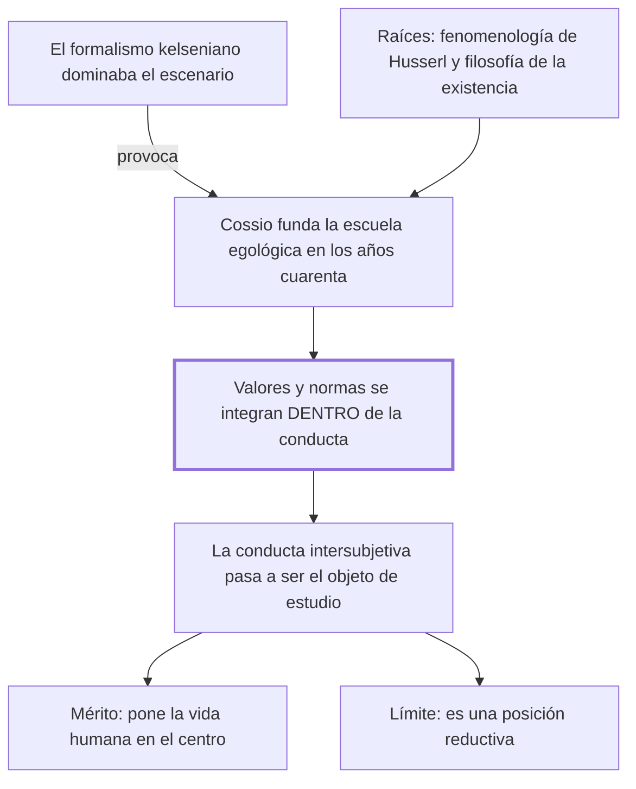

# § 61. El aporte de la escuela egológica del derecho

## 1. Idea principal

Cossio puso la vida humana en el centro del derecho contra el formalismo dominante, pero al integrar valores y normas dentro de la conducta terminó reduciendo el derecho a una sola dimensión.

Contesta qué le debe el autor a la escuela argentina de la que se declara deudor. Es el capítulo donde reconoce su influencia más directa, y también donde marca en qué se aparta.

## 2. Lo esencial del capítulo

La escuela egológica fructifica en Argentina desde los años cuarenta, en contraposición al pensamiento formalista de corte kelseniano, en el esfuerzo por revalorizar el rol protagónico de la persona (p. 135). El autor insiste en el contexto: la teoría de Kelsen dominaba el escenario, así que ninguna concepción nueva encontraba "un terreno ni fértil ni preparado". Es fruto del pensamiento de Carlos Cossio, y su raíz es doble —la fenomenología de Husserl y la filosofía de la existencia—, más la teoría de la comprensión que toma de Dilthey. La tesis hay que retenerla con precisión porque es fácil deformarla: Cossio **no niega** que valores y normas actúen en la experiencia, sostiene que los dos se integran, en unidad inescindible, **dentro de la conducta humana**, y de ahí que la conducta intersubjetiva se erija en objeto de estudio propio de la ciencia jurídica (p. 136). Su propósito declarado es superar a la vez al derecho natural y al formalismo.

El crédito y el límite van en la misma oración: la teoría tiene "el indiscutible mérito de resaltar el rol central que ocupa la vida humana social dentro de la experiencia jurídica, aunque esta actitud la lleve a propugnar una posición reductiva que no se condice con la realidad" (p. 137). Agrega una precisión que importa para no confundir escuelas: su sustento filosófico impide asimilar la egología al sociologismo, porque lo que la caracteriza es una visión ontológica del derecho, entendido como experiencia fenoménica de libertad. El cierre es inusual en el libro, porque explica un fracaso de recepción por razones de carácter y no de contenido: la actitud polémica de Cossio y su "excesivo afán proselitista" contribuyeron a que algunos autores reaccionaran en contra, y eso llevó a minimizar injustificadamente su aporte. El autor admite que la teoría encierra errores, "especialmente en cuanto al aspecto lógico", sin desarrollar cuáles, y declara su propia posición: está entre quienes la apreciaron y asumieron muchas de sus ideas creativas.

## 3. Mapa

## 4. Vocabulario clave

- **Egologismo** — el nombre corto de la escuela egológica: la teoría de Cossio que hace de la conducta el objeto del derecho.
- **Fenomenología** — el método filosófico de Husserl, que parte de cómo las cosas se presentan a la experiencia; una de las dos raíces de la egológica.
- **Visión ontológica del derecho** — la que se pregunta qué es el derecho en su ser, y no cómo se lo conoce ni cómo se lo aplica.
- **Expresión fenoménica de la libertad** — la fórmula con que la egológica entiende la conducta: la libertad haciéndose visible en actos.

## 5. Distinciones que se confunden

- **Negar los valores y las normas vs. integrarlos en la conducta** — Cossio hace lo segundo, y confundirlo con lo primero deforma toda su tesis.
  - Se confunden porque: el resultado es el mismo, una sola dimensión, así que suena a que los suprime.
  - Criterio para decidir: ¿la tesis dice que no existen, o que existen dentro de otra cosa? Cossio dice que se integran en unidad inescindible en la conducta.
  - Dónde se cae: se responde que la egológica niega el valor de la norma, cuando le reconoce presencia actuante y la ubica en la conducta.

- **Escuela egológica vs. sociologismo** — comparten aspectos pero la egológica tiene sustento filosófico y una visión ontológica.
  - Se confunden porque: las dos privilegian la vida frente a la norma y llegan a una sola dimensión.
  - Criterio para decidir: ¿el fundamento es la observación de lo social o una filosofía sobre el ser del derecho? La egológica es lo segundo.
  - Dónde se cae: se las agrupa como "las escuelas sociológicas", cuando el autor dice que su sustento impide confundirlas.

## 6. Autoevaluación

1. ¿Qué se entiende por escuela egológica del derecho? Explique su tesis central y por qué el autor la considera reductiva.
2. Un compañero dice que la egológica "elimina la norma del derecho". ¿Qué le corregirías?

--- No mires esto hasta responder ---

1. Es la corriente fundada por Carlos Cossio en Argentina desde los años cuarenta, enraizada en la fenomenología de Husserl y en la filosofía de la existencia, en contraposición al formalismo kelseniano y para revalorizar el rol protagónico de la persona (p. 135). Su tesis central es que valores y normas se integran, en unidad inescindible, dentro de la conducta humana, y que por eso la conducta intersubjetiva es el objeto de estudio propio de la ciencia jurídica (p. 136). El autor le reconoce el mérito indiscutible de poner la vida humana social en el centro de la experiencia jurídica. La considera reductiva porque, al meter las otras dos dimensiones dentro de una, termina en una sola: es la misma unilateralidad que el iusnaturalismo y el formalismo, con otro elemento en el centro.
2. Que no la elimina: Cossio reconoce la presencia actuante de valores y normas y sostiene que se integran en unidad inescindible dentro de la conducta. Lo que hace es cambiarles el lugar, no negarlos (p. 136). Confundir las dos cosas deforma la tesis, porque el resultado —una sola dimensión— es el mismo pero el camino no.

## Flashcards

Quién creó la escuela egológica del derecho y dónde | Carlos Cossio, en Argentina, a partir de los años cuarenta del siglo XX
Qué hace Cossio con los valores y las normas | No los niega: los integra en unidad inescindible dentro de la conducta
Cuál es el objeto de estudio del derecho para Cossio | La conducta humana intersubjetiva
