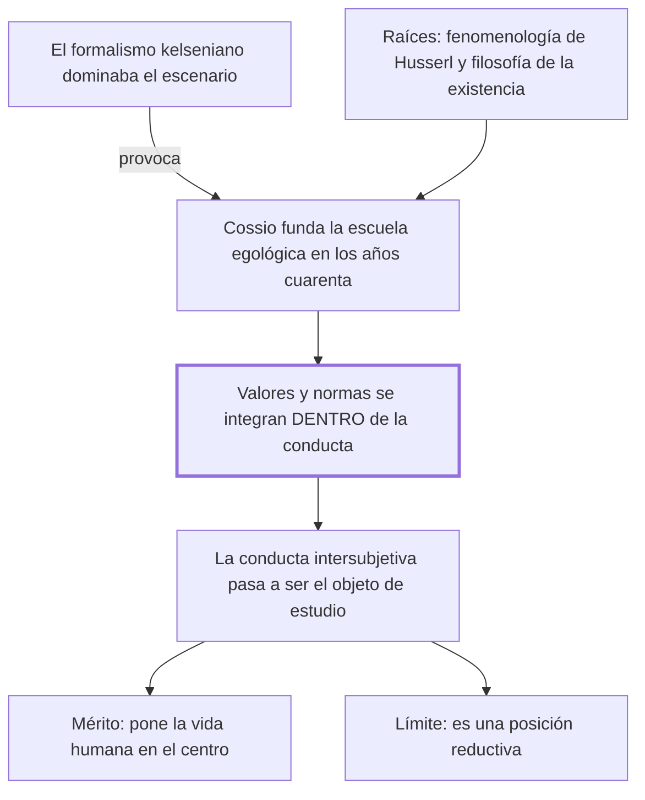

# § 61. El aporte de la escuela egológica del derecho

## 1. Idea principal

Cossio puso la vida humana en el centro del derecho contra el formalismo dominante, pero al integrar valores y normas dentro de la conducta terminó reduciendo el derecho a una sola dimensión.

Contesta qué le debe el autor a la escuela argentina de la que se declara deudor. Es el capítulo donde reconoce su influencia más directa, y también donde marca en qué se aparta.

## 2. Lo esencial del capítulo

La escuela egológica fructifica en Argentina desde los años cuarenta, en contraposición al pensamiento formalista de corte kelseniano, en el esfuerzo por revalorizar el rol protagónico de la persona (p. 135). El autor insiste en el contexto: la teoría de Kelsen dominaba el escenario, así que ninguna concepción nueva encontraba "un terreno ni fértil ni preparado" para ser recibida con objetividad. Es fruto del pensamiento de Carlos Cossio, y su raíz es doble: la fenomenología de Husserl y la filosofía de la existencia, más la teoría de la comprensión que toma de Dilthey y una preocupación epistemológica de origen kantiano.

La tesis es la que hay que retener con precisión, porque es fácil deformarla. Cossio **no niega** que valores y normas actúen en la experiencia: sostiene que los dos se integran, en unidad inescindible, **dentro de la conducta humana**. Y de ahí que la conducta intersubjetiva se erija en el objeto de estudio propio de la ciencia jurídica (p. 136). Su propósito declarado es superar a la vez al derecho natural y al formalismo, que ponían como objeto a los valores y a las normas respectivamente. El resultado, dice el autor, es que la tesis cossiana reduce el derecho a la conducta, que se muestra como "expresión fenoménica de la libertad".

El crédito y el límite van en la misma oración: la teoría tiene "el indiscutible mérito de resaltar el rol central que ocupa la vida humana social dentro de la experiencia jurídica, aunque esta actitud la lleve a propugnar una posición reductiva que no se condice con la realidad" (p. 137). Y agrega una precisión que importa para no confundir escuelas: su sustento filosófico impide confundir a la egología con el sociologismo, pese a que comparten algunos aspectos. Lo que la caracteriza es una visión ontológica del derecho —sobre qué es el derecho— entendido como experiencia fenoménica de libertad.

El cierre es inusual en el libro porque explica un fracaso de recepción por razones de carácter y no de contenido: la actitud polémica de Cossio y su "excesivo afán proselitista" probablemente contribuyeron a que algunos autores reaccionaran en contra, sumado a la resistencia natural a lo que se aparta de la tradición, y eso llevó a minimizar injustificadamente su aporte. El autor admite que la teoría encierra errores, "especialmente en cuanto al aspecto lógico", sin desarrollar cuáles, y termina declarando su propia posición: está entre quienes la apreciaron y asumieron muchas de sus ideas creativas.

## 3. Mapa

## 4. Qué releer del original

1. (p. 136) "ambos elementos se integran, en unidad inescindible, en la conducta humana" — es la bisagra: la formulación exacta importa, porque Cossio no niega valores ni normas, los mete adentro de la conducta.
2. (p. 137) "aunque esta actitud la lleve a propugnar una posición reductiva" — es el crédito y el límite en la misma oración, y conviene verlos juntos.
3. (pp. 135-138, notas 9 a 13) — son las referencias a Husserl, Dilthey, Heidegger y a la bibliografía sobre Cossio, que solo mencioné; ahí está el detalle de las filiaciones filosóficas.

## 5. Vocabulario clave

- **Egologismo** — el nombre corto de la escuela egológica: la teoría de Cossio que hace de la conducta el objeto del derecho.
- **Fenomenología** — el método filosófico de Husserl, que parte de cómo las cosas se presentan a la experiencia; una de las dos raíces de la egológica.
- **Visión ontológica del derecho** — la que se pregunta qué es el derecho en su ser, y no cómo se lo conoce ni cómo se lo aplica.
- **Expresión fenoménica de la libertad** — la fórmula con que la egológica entiende la conducta: la libertad haciéndose visible en actos.

## 6. Distinciones que se confunden

- **Negar los valores y las normas vs. integrarlos en la conducta** — Cossio hace lo segundo, y confundirlo con lo primero deforma toda su tesis.
  - Se confunden porque: el resultado es el mismo, una sola dimensión, así que suena a que los suprime.
  - Criterio para decidir: ¿la tesis dice que no existen, o que existen dentro de otra cosa? Cossio dice que se integran en unidad inescindible en la conducta.
  - Dónde se cae: se responde que la egológica niega el valor de la norma, cuando le reconoce presencia actuante y la ubica en la conducta.

- **Escuela egológica vs. sociologismo** — comparten aspectos pero la egológica tiene sustento filosófico y una visión ontológica.
  - Se confunden porque: las dos privilegian la vida frente a la norma y llegan a una sola dimensión.
  - Criterio para decidir: ¿el fundamento es la observación de lo social o una filosofía sobre el ser del derecho? La egológica es lo segundo.
  - Dónde se cae: se las agrupa como "las escuelas sociológicas", cuando el autor dice que su sustento impide confundirlas.

## 7. Autoevaluación

1. Un compañero dice que la egológica "elimina la norma del derecho". ¿Qué le corregirías?
2. El autor explica la resistencia a Cossio por su carácter polémico y su afán proselitista. ¿Es una explicación satisfactoria de por qué una teoría no se acepta?
3. Admite que la teoría encierra errores "especialmente en cuanto al aspecto lógico" y no dice cuáles. ¿Qué efecto tiene esa reticencia?
4. El autor se declara deudor de Cossio y a la vez le objeta el reduccionismo. ¿Cómo se sostienen juntas esas dos cosas?

--- No mires esto hasta responder ---

1. Que no la elimina: Cossio reconoce la presencia actuante de valores y normas, y sostiene que se integran en unidad inescindible dentro de la conducta humana. Lo que hace es cambiarles el lugar, no negarlos (p. 136).
2. Es parcial. Explica la reacción de algunos autores, pero no toca el contenido de la teoría, y el propio texto agrega una segunda razón —la resistencia a lo que se aparta de la tradición— que tampoco es sobre el contenido. Como explicación de recepción sirve; como evaluación de la teoría, no.
3. Debilita la crítica: el lector no puede evaluarla ni buscarla. Y contrasta con el detalle que sí da para el crédito, así que el capítulo queda desbalanceado hacia el elogio. Discutible: el aspecto lógico puede estar tratado en otras obras del autor, a las que remite en nota.
4. Se sostienen porque su deuda es con el movimiento —poner la vida humana en el centro contra el formalismo— y su objeción es con el resultado, tomar una sola dimensión. Es exactamente el molde que aplicó a las tres escuelas anteriores: conservar el aporte, quitar la pretensión de exclusividad.

## Flashcards

Quién creó la escuela egológica del derecho y dónde | Carlos Cossio, en Argentina, a partir de los años cuarenta del siglo XX
En qué dos corrientes filosóficas se enraíza el egologismo | La fenomenología de Husserl y la filosofía de la existencia
De quién toma Cossio la teoría de la comprensión | De Dilthey
Cuál es el objeto de estudio del derecho para Cossio | La conducta humana intersubjetiva
Qué hace Cossio con los valores y las normas | No los niega: los integra en unidad inescindible dentro de la conducta
Cómo entiende la egológica a la conducta | Como expresión fenoménica de la libertad
Cuál es el mérito indiscutible de la egológica según el autor | Resaltar el rol central de la vida humana social en la experiencia jurídica
Por qué no se puede confundir la egológica con el sociologismo | Porque su sustento es filosófico y su visión del derecho es ontológica
