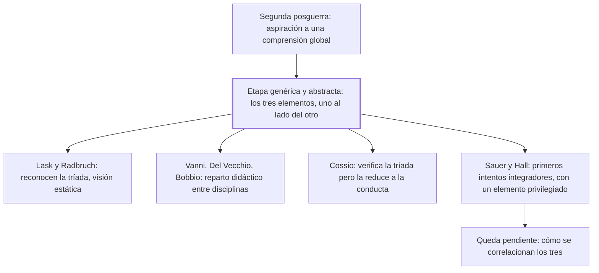

# § 62. Antecedentes del tridimensionalismo jurídico

## 1. Idea principal

Antes del tridimensionalismo dinámico hubo uno estático: varios autores vieron los tres elementos del derecho, pero los dejaron uno al lado del otro, sin integrarlos.

Contesta quién llegó antes y por qué no alcanzó. Sirve para entender que el aporte del autor no es haber contado tres elementos —eso ya estaba hecho— sino haber dicho cómo se relacionan.

## 2. Lo esencial del capítulo

El punto de partida es una periodización que el autor toma de Reale: desde la segunda posguerra hay una aspiración generalizada a comprender los problemas jurídicos de manera global y unitaria, abandonando las predilecciones reduccionistas (p. 138). Y esa comprensión tridimensional fue un fenómeno universal, que respondía a la necesidad de superar dos actitudes contrapuestas: el apego positivista a los hechos empíricos y la pura subordinación a los valores ideales. El autor aclara que en esto coincide con Reale "sin conocernos ni habernos leído".

La distinción que organiza todo el capítulo es entre dos etapas. En la primera, unos pocos iusfilósofos comprobaron que en la experiencia jurídica están los tres elementos, pero **sin encontrar entre ellos ningún tipo específico de relación esencial**: los tenían por elementos separables, "situados, sin mayor conexión, uno al lado de otro" (p. 139). Reale llama a eso tridimensionalismo genérico y abstracto. La segunda etapa es la del tridimensionalismo integrador y dinámico, específico y concreto, que profesan tanto Reale como el propio autor. Conviene notar que el texto llegó con un error de conversión en el nombre de esa segunda etapa —dice "genérico y concreto" donde por el contraste debería decir "específico y concreto"—, así que vale leerlo en el original.

El resto es un catálogo de esa etapa, y lo que importa no son los nombres sino el patrón: todos vieron tres cosas y ninguno las integró. Lask y Radbruch intentaron superar la antinomia entre un valor ahistórico, del que el iusnaturalismo pretendía deducir todo el sistema, y el significado contingente de los hechos que sostenían los positivistas; reconocen la realidad triádica pero con visión estática, con un método distinto para cada elemento. Se suman Fechner y Welzel en Alemania; en Italia, Vanni, Del Vecchio y Bobbio, cuya apreciación Reale califica de "meramente didáctica" porque reparte tareas entre disciplinas sin incidir en la estructura de lo jurídico. La lista completa está en las pp. 140-142 y en las notas, no la repito.

Dos casos se separan del molde. Cossio lleva implícita una visión tridimensional genérica pero **reduce los tres elementos a la unidad de la conducta**: parte de la verificación y termina en una sola dimensión. Y Sauer, en 1944, hace el primer intento serio de integrarlos —deja de verlos como separables y los toma por perspectivas ineliminables—, aunque Reale le objeta que sigue siendo "de mayor carácter estático y descriptivo" y que privilegia el elemento axiológico. Hall, en 1947, sostiene el integrativismo jurídico pero realza el momento sociológico. En los dos casos, dice Reale, queda pendiente cómo se correlacionan los tres.

## 3. Mapa

## 4. Qué releer del original

1. (p. 139) "situados, sin mayor conexión, uno al lado de otro" — es la bisagra del capítulo: define qué le faltaba a la etapa estática, y la formulación exacta importa.
2. (pp. 140-142, con las notas 17 a 20) — es el catálogo completo de autores por país que solo mencioné; ahí están las referencias para ir a cada uno.
3. (p. 139) El nombre de la segunda etapa llegó dañado por la conversión: dice "genérico y concreto" cuando por el contraste con la primera debería ser "específico y concreto". Conviene verificarlo en el original antes de citarlo.

## 5. Vocabulario clave

- **Tridimensionalismo genérico y abstracto** — la etapa que reconoce los tres elementos pero los deja separables, sin relación esencial entre ellos.
- **Integrativismo jurídico** — la posición de Hall (1947): toda investigación sobre el derecho debe ser tridimensional.
- **Antinomia** — oposición entre dos principios que parecen ambos válidos; acá, entre el valor ahistórico y el hecho contingente.
- **Perspectivas ineliminables** — la fórmula de Sauer: los tres elementos no son objetos separables sino puntos de vista que no se pueden quitar.

## 6. Distinciones que se confunden

- **Ver tres elementos vs. integrarlos** — la etapa genérica hizo lo primero; el aporte que el autor reclama es lo segundo.
  - Se confunden porque: las dos posiciones enumeran los mismos tres elementos, así que suenan igual al resumirlas.
  - Criterio para decidir: ¿se afirma algún tipo de relación esencial entre ellos, o solo que están los tres? Si es solo la enumeración, es la etapa genérica.
  - Dónde se cae: se dice que el tridimensionalismo del autor consiste en reconocer tres dimensiones, que es exactamente lo que ya habían hecho Lask y Radbruch.

- **Repartir el estudio entre disciplinas vs. describir la estructura del derecho** — lo que Reale llama "meramente didáctico" es lo primero.
  - Se confunden porque: los dos terminan con tres disciplinas mirando tres cosas.
  - Criterio para decidir: ¿la tesis es sobre cómo se organiza el trabajo académico, o sobre qué es el derecho? Bobbio hace lo primero.
  - Dónde se cae: se cuenta a Bobbio entre los tridimensionalistas en sentido fuerte, cuando su aporte no incide en la estructura de lo jurídico.

## 7. Autoevaluación

1. Un compañero afirma que el aporte del autor es haber descubierto que el derecho tiene tres dimensiones. Según este capítulo, ¿qué tiene de incorrecto?
2. Sauer dejó de ver los tres elementos como separables y aun así Reale lo objeta. ¿Qué le falta a su posición?
3. El autor dice coincidir con Reale "sin conocernos ni habernos leído" y usa la periodización de Reale para ordenar a sus predecesores. ¿Debilita eso su reclamo de originalidad?
4. ¿Por qué le conviene al autor dedicar un capítulo entero a los que llegaron antes, en vez de exponer directamente su tesis?

--- No mires esto hasta responder ---

1. Que enumerar los tres elementos ya lo habían hecho varios autores desde antes de la posguerra: Lask, Radbruch, Vanni, Del Vecchio, Bobbio. Lo que faltaba, y es lo que el autor reclama, es afirmar un tipo específico de relación esencial entre ellos (p. 139).
2. Según Reale, su tridimensionalismo es de mayor carácter estático y descriptivo, y privilegia el elemento axiológico subordinándole los otros dos. O sea que integra en apariencia pero mantiene una jerarquía, y no llega a correlacionarlos dialécticamente.
3. No necesariamente: la coincidencia independiente es un argumento a favor de que la solución era la que el problema pedía, no de falta de originalidad. Pero sí lo pone en posición dependiente para la parte histórica, porque el catálogo y las categorías son de Reale. Discutible: podría haber hecho su propia periodización.
4. Porque su tesis se define por contraste. Sin la etapa genérica delante, "los tres elementos en interacción" se confundiría con "los tres elementos", que es justo el malentendido que el libro combate. El capítulo construye el contraste que hace visible el aporte.

## Flashcards

Desde cuándo hay aspiración a una comprensión global del derecho según Reale | Desde la segunda posguerra
Qué dos actitudes venía a superar la comprensión tridimensional | El apego positivista a los hechos y la pura subordinación a los valores ideales
Cómo llama Reale a la primera etapa del tridimensionalismo | Genérico y abstracto
Qué le faltaba al tridimensionalismo genérico y abstracto | Encontrar un tipo específico de relación esencial entre los tres elementos
Qué autores alemanes reconocen la tríada con visión estática | Lask y Radbruch, y también Fechner y Welzel
Por qué Reale llama meramente didáctica la posición de Bobbio | Porque reparte tareas entre disciplinas sin incidir en la estructura de lo jurídico
Qué hace Cossio con la tríada que verifica | La reduce a la unidad de la conducta humana
Qué es el integrativismo jurídico y de quién es | De Hall, 1947: toda investigación sobre el derecho debe ser tridimensional
