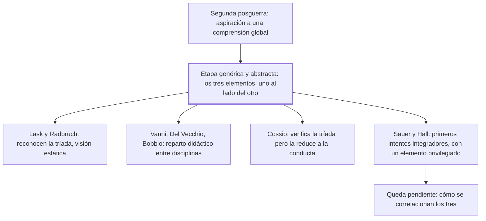

# § 62. Antecedentes del tridimensionalismo jurídico

## 1. Idea principal

Antes del tridimensionalismo dinámico hubo uno estático: varios autores vieron los tres elementos del derecho, pero los dejaron uno al lado del otro, sin integrarlos.

Contesta quién llegó antes y por qué no alcanzó. Sirve para entender que el aporte del autor no es haber contado tres elementos —eso ya estaba hecho— sino haber dicho cómo se relacionan.

## 2. Lo esencial del capítulo

El punto de partida es una periodización que el autor toma de Reale: desde la segunda posguerra hay una aspiración generalizada a comprender los problemas jurídicos de manera global y unitaria, abandonando las predilecciones reduccionistas (p. 138). Fue un fenómeno universal, que respondía a la necesidad de superar dos actitudes contrapuestas —el apego positivista a los hechos empíricos y la pura subordinación a los valores ideales—, y el autor aclara que coincidió con Reale "sin conocernos ni habernos leído". La distinción que organiza el capítulo es entre dos etapas: en la primera, unos pocos iusfilósofos comprobaron que en la experiencia jurídica están los tres elementos **sin encontrar entre ellos ningún tipo específico de relación esencial**, y los tenían por separables, "situados, sin mayor conexión, uno al lado de otro" (p. 139). Reale llama a eso tridimensionalismo genérico y abstracto; la segunda etapa es la del integrador y dinámico, que profesan él y el autor. Ojo con un error de conversión en el nombre de esa segunda etapa —dice "genérico y concreto" donde el contraste pide "específico"—, así que conviene verlo en el original.

El resto es un catálogo, y lo que importa no son los nombres sino el patrón: todos vieron tres cosas y ninguno las integró. Lask y Radbruch reconocen la realidad triádica pero con visión estática, con un método distinto para cada elemento; se suman Fechner y Welzel en Alemania, y en Italia Vanni, Del Vecchio y Bobbio, cuya apreciación Reale califica de "meramente didáctica" porque reparte tareas entre disciplinas sin incidir en la estructura de lo jurídico (la lista completa está en las pp. 140-142). Dos casos se separan del molde: Cossio lleva implícita una visión tridimensional genérica pero **reduce los tres elementos a la unidad de la conducta**; y Sauer, en 1944, hace el primer intento serio de integrarlos, tomándolos por perspectivas ineliminables, aunque Reale le objeta que sigue siendo "de mayor carácter estático y descriptivo" y que privilegia el elemento axiológico. Hall, en 1947, sostiene el integrativismo jurídico pero realza el momento sociológico. En los dos casos queda pendiente cómo se correlacionan los tres.

## 3. Mapa

## 4. Vocabulario clave

- **Tridimensionalismo genérico y abstracto** — la etapa que reconoce los tres elementos pero los deja separables, sin relación esencial entre ellos.
- **Integrativismo jurídico** — la posición de Hall (1947): toda investigación sobre el derecho debe ser tridimensional.
- **Antinomia** — oposición entre dos principios que parecen ambos válidos; acá, entre el valor ahistórico y el hecho contingente.
- **Perspectivas ineliminables** — la fórmula de Sauer: los tres elementos no son objetos separables sino puntos de vista que no se pueden quitar.

## 5. Distinciones que se confunden

- **Ver tres elementos vs. integrarlos** — la etapa genérica hizo lo primero; el aporte que el autor reclama es lo segundo.
  - Se confunden porque: las dos posiciones enumeran los mismos tres elementos, así que suenan igual al resumirlas.
  - Criterio para decidir: ¿se afirma algún tipo de relación esencial entre ellos, o solo que están los tres? Si es solo la enumeración, es la etapa genérica.
  - Dónde se cae: se dice que el tridimensionalismo del autor consiste en reconocer tres dimensiones, que es exactamente lo que ya habían hecho Lask y Radbruch.

- **Repartir el estudio entre disciplinas vs. describir la estructura del derecho** — lo que Reale llama "meramente didáctico" es lo primero.
  - Se confunden porque: los dos terminan con tres disciplinas mirando tres cosas.
  - Criterio para decidir: ¿la tesis es sobre cómo se organiza el trabajo académico, o sobre qué es el derecho? Bobbio hace lo primero.
  - Dónde se cae: se cuenta a Bobbio entre los tridimensionalistas en sentido fuerte, cuando su aporte no incide en la estructura de lo jurídico.

## 6. Autoevaluación

1. Explique qué se entiende por tridimensionalismo genérico y abstracto, y por qué el autor sostiene que no alcanza.
2. Un compañero afirma que el aporte del autor es haber descubierto que el derecho tiene tres dimensiones. ¿Qué tiene de incorrecto?

--- No mires esto hasta responder ---

1. Es la primera etapa del tridimensionalismo, en la que unos pocos iusfilósofos comprobaron que en la experiencia jurídica están los tres elementos pero sin encontrar entre ellos ningún tipo específico de relación esencial: los tenían por separables, "situados, sin mayor conexión, uno al lado de otro" (p. 139). Es la denominación de Reale, y bajo ella caen Lask y Radbruch, con un método distinto para cada elemento, y Vanni, Del Vecchio y Bobbio, cuyo reparto entre disciplinas Reale llama meramente didáctico. No alcanza porque describir tres elementos yuxtapuestos no dice nada sobre la estructura del derecho: falta la interacción, que es lo que aporta la segunda etapa, el tridimensionalismo integrador y dinámico.
2. Que enumerar los tres elementos ya lo habían hecho varios autores desde antes de la posguerra. Lo que faltaba, y es lo que el autor reclama como aporte, es afirmar un tipo específico de relación esencial entre ellos (p. 139). Sin ese contraste, "los tres elementos en interacción" se confunde con "los tres elementos".

## Flashcards

Cómo llama Reale a la primera etapa del tridimensionalismo | Genérico y abstracto
Qué le faltaba al tridimensionalismo genérico y abstracto | Encontrar un tipo específico de relación esencial entre los tres elementos
Por qué Reale llama meramente didáctica la posición de Bobbio | Porque reparte tareas entre disciplinas sin incidir en la estructura de lo jurídico
Qué es el integrativismo jurídico y de quién es | De Hall, 1947: toda investigación sobre el derecho debe ser tridimensional
