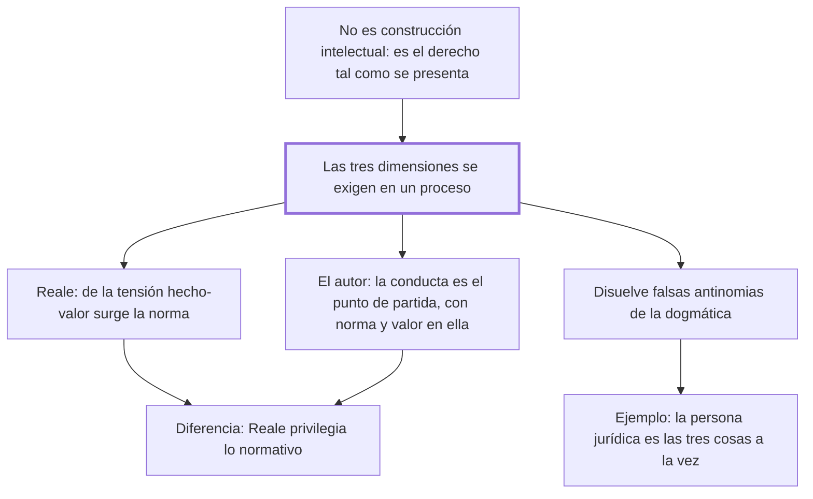

# § 63. El tridimensionalismo específico y concreto

## 1. Idea principal

En el tridimensionalismo dinámico las tres dimensiones no se yuxtaponen sino que se exigen entre sí en un proceso, y ninguna de las tres, por sí sola, es derecho.

Es el núcleo teórico del libro: la tesis propia del autor, formulada a la vez que Reale y sin conocerse. Todo lo anterior preparaba este capítulo y todo lo que sigue lo aplica.

## 2. Lo esencial del capítulo

El tridimensionalismo dinámico se perfila desde los años cincuenta en Brasil y en Perú, y su primera afirmación es que **no es una construcción intelectual** sino la mostración del derecho tal como se presenta: un quehacer humano inserto en el devenir histórico-cultural, un proceso donde interactúan en recíproca e ineludible exigencia la conducta intersubjetiva —lo que Reale llama "hecho"—, la norma y los valores (p. 143). A Reale le corresponde el mérito de haberlo desarrollado y difundido desde su obra de 1953, y de haber acuñado el término.

El autor expuso una posición coincidente en 1950. Acá el texto llegó dañado: la frase se corta en "en lo fundamen" y sigue directamente el contenido de una nota, así que **no se puede saber en qué coincidía exactamente** (p. 144). No es ruido, es pérdida de contenido; hay que ir al original.

Lo que sí se lee son las diferencias con Reale, y son tres. La primera es cómo se articulan las dimensiones: en Reale, según Sobrevilla, "de la articulación entre el hecho y el valor surge la norma"; en el autor, la conducta humana es el hecho del que hay que partir, y en ella se encuentran una significación —la norma— y un valor realizado por esa conducta. La segunda se sigue de la primera: al hacer surgir la norma de la tensión entre hecho y valor, Reale **privilegia la dimensión normativa** sobre las otras dos, aunque en otro pasaje afirme que el problema de la conducta es primordial. La tercera es de origen: Reale se apoya básicamente en la filosofía del derecho, y el autor parte de la filosofía de la existencia, con Sartre, Marcel, Jaspers, Heidegger y Zubiri.

La visión triádica sirve para dos cosas: supera las posiciones unilaterales y además "disuelve numerosas falsas antinomias" instaladas en la dogmática (p. 146). El ejemplo es la persona jurídica —que prefiere llamar "colectiva"—: una organización actuante de personas, una finalidad valiosa común y su calificación formal-normativa. Reducirla a uno de esos aspectos es una mutilación, y de ahí salió "una interminable y fatigosa polémica" de siglos.

La formulación más nítida es la que cita de su tesis de 1950: ni el pensamiento del derecho, ni la conducta, ni el valor son derecho; ninguno está fuera del derecho, pero "ninguno, de por sí, es derecho" (p. 149). El derecho es la integración forzosa de los tres. Y el cierre reclama alcance: es una visión macroscópica que abre una nueva etapa en la determinación del objeto de estudio, dejando atrás por insuficientes a las concepciones formalista, iusnaturalista y sociológica.

## 3. Mapa

## 4. Vocabulario clave

- **Tridimensionalismo específico y concreto** — la versión dinámica: las tres dimensiones se integran en un proceso, frente a la genérica que las dejaba separadas.
- **Integración dialéctica** — la fórmula de Reale: de la tensión entre hecho y valor surge la norma.
- **Falsa antinomia** — oposición aparente entre dos tesis que se disuelve al ver que cada una toma una dimensión distinta del mismo fenómeno.
- **Persona colectiva** — el nombre que el autor prefiere para la persona jurídica, y su ejemplo de institución tridimensional.
- **Visión macroscópica** — mirar el derecho como totalidad, como base para enfocar después cualquier área específica.

## 5. Distinciones que se confunden

- **Tridimensionalismo genérico vs. específico y concreto** — el primero enumera tres elementos separables; el segundo afirma que se exigen entre sí en un proceso.
  - Se confunden porque: los dos se llaman tridimensionalismo y nombran los mismos tres elementos.
  - Criterio para decidir: ¿los elementos podrían estudiarse aislados sin perder nada? Si sí, es genérico; el específico dice que ninguno es derecho por sí solo.
  - Dónde se cae: se presenta la tesis del autor como "el derecho tiene tres dimensiones", que es la versión que él rechaza.

- **La articulación de Reale vs. la del autor** — en Reale la norma surge de la tensión hecho-valor; en el autor se parte de la conducta, que ya lleva norma y valor.
  - Se confunden porque: los dos son tridimensionalistas dinámicos y coinciden en casi todo.
  - Criterio para decidir: ¿qué dimensión queda privilegiada? En Reale la normativa; en el autor, la conducta como punto de partida.
  - Dónde se cae: se los cita como si sostuvieran lo mismo, y se pierde la única discusión interna del libro.

## 6. Autoevaluación

1. Un manual explica la persona jurídica solo como un centro de imputación creado por la ley. Según este capítulo, ¿qué está haciendo y qué se pierde?
2. El autor dice que el tridimensionalismo "disuelve falsas antinomias" de la dogmática. Usando el ejemplo de la persona jurídica, ¿cómo funcionaría esa disolución?
3. El autor sostiene que su posición y la de Reale se formularon sin conocerse. ¿Qué agrega ese dato a la fuerza de la tesis, y qué no agrega?
4. Reale privilegia lo normativo y el autor parte de la conducta. ¿Es una diferencia de fondo o de énfasis?

--- No mires esto hasta responder ---

1. Está tomando una sola de las tres dimensiones, la formal-normativa. Se pierden la organización actuante de personas y la finalidad valiosa que persiguen, sin las cuales el fenómeno no es comprensible; el autor lo llama una mutilación (p. 147).
2. La polémica de siglos sobre si la persona jurídica es una ficción, una realidad o una creación normativa opone tesis que en verdad describen dimensiones distintas del mismo fenómeno. Vista como interacción de las tres, la oposición se disuelve porque cada posición captaba una parte.
3. Agrega que la solución respondía a un problema real y maduro, no a una moda: dos autores sin contacto llegaron a lo mismo. No agrega nada sobre si la tesis es correcta; la coincidencia es un indicio de oportunidad, no una prueba.
4. Es más que énfasis, porque cambia de dónde se parte y qué explica a qué: si la norma surge de la tensión hecho-valor, la conducta es materia; si se parte de la conducta, la norma es una significación que ya está en ella. Discutible: los dos afirman que ninguna dimensión falta, así que en el resultado se parecen mucho más que en el camino.

## Flashcards

Desde cuándo y dónde se perfila el tridimensionalismo dinámico | Desde los años cincuenta, en Brasil y en Perú
Quién acuñó el término tridimensionalismo | Miguel Reale, a partir de su obra de 1953
Cómo se articulan las tres dimensiones según Reale | De la articulación entre el hecho y el valor surge la norma
Cómo se articulan según Fernández Sessarego | Se parte de la conducta, en la que hay una significación (la norma) y un valor realizado
Qué dimensión privilegia Reale | La normativa, porque la norma surge de la tensión entre hecho y valor
De qué filosofía parte Fernández Sessarego | De la filosofía de la existencia: Sartre, Marcel, Jaspers, Heidegger y Zubiri
Cuál es la formulación de su tesis de 1950 | Ninguno de los tres está fuera del derecho, pero ninguno, de por sí, es derecho
Cuáles son las tres dimensiones de la persona jurídica | Organización de personas, finalidad valiosa y calificación formal-normativa
