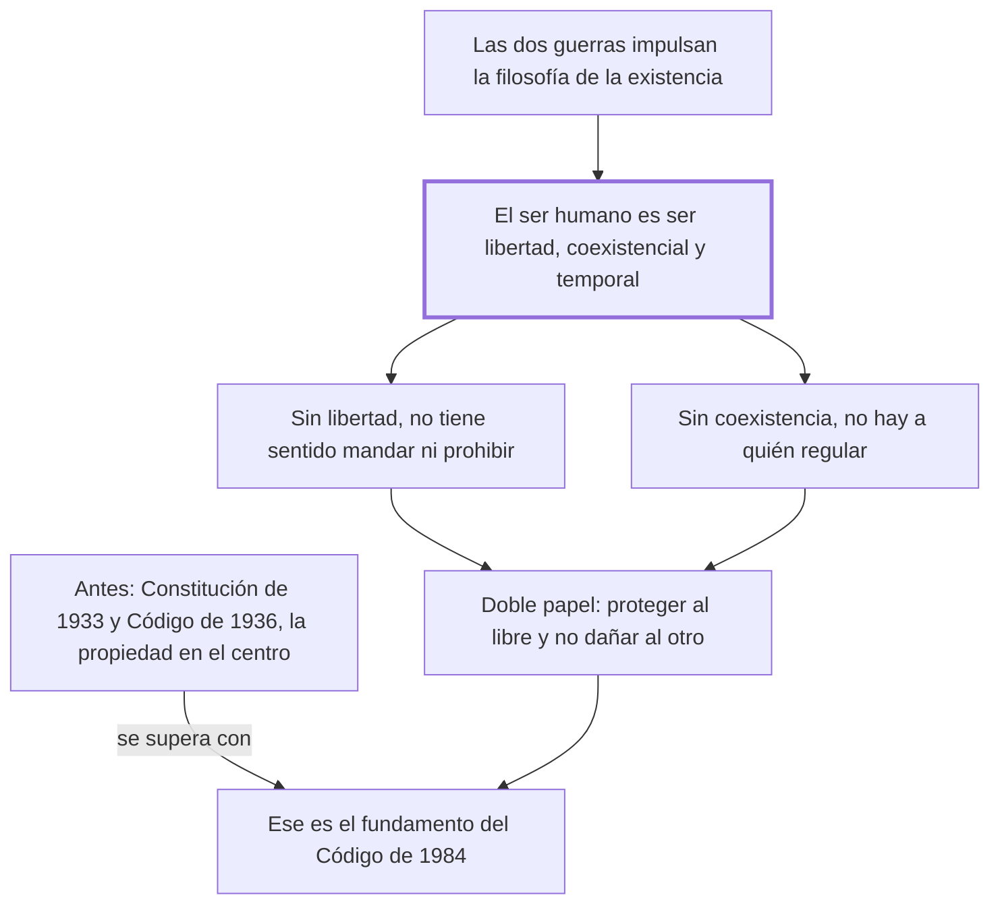

# § 64. Sustento jusfilosófico de los mensajes principistas y doctrinales aportados a la codificación civil comparada por el código civil peruano de 1984

## 1. Idea principal

El derecho carecería de sentido si la persona no fuera libre y social a la vez: esa idea del ser humano, traída por la filosofía de la existencia, es lo que funda al Código de 1984.

Contesta de dónde sale el personalismo de ese código, y es el capítulo más filosófico del libro. Explica por qué una concepción del ser humano cambia lo que un código protege.

## 2. Lo esencial del capítulo

El Código Civil de 1984 representa un cambio radical frente a lo que imperaba en el Perú: una visión formalista que venía desde los albores de la República y se concretaba en la Constitución de 1933 y el Código de 1936, donde el derecho giraba en torno a la norma y "la más importante institución a proteger era la inviolable propiedad y no la persona humana" (p. 152). El autor la califica de ochocentista y positivista, con individualismo exacerbado y patrimonialismo, y sostiene que por eso quedaban postergados valores como el deber genérico de no dañar, la solidaridad y el bien común.

El giro viene de afuera del derecho. La filosofía de la existencia es, entre otras cosas, "una angustiada respuesta a los horrores" de las dos guerras mundiales, y de ahí nace la preocupación por conocer mejor al ser humano para protegerlo. Los filósofos abandonan el interés por el ser de las cosas y se vuelcan a la persona (pp. 152-153). Lo que encuentran es una definición nueva: el ser humano ya no es un "animal racional" sino una unidad psicosomática sustentada en su libertad, cuya existencia solo es concebible dentro de la coexistencialidad y la temporalidad. Es un **ser libertad**, y esa libertad es lo que Scheler llama espíritu. El autor contrasta esto con la definición de Boecio del siglo VI —una sustancia indivisa de naturaleza racional—: acierta en la unidad, pero se queda corta porque no da cuenta de la libertad constitutiva.

De ahí sale el argumento central, y tiene forma condicional: el derecho carecería de sentido si su destinatario no fuera libre, porque solo a quien puede decidir se le propone cumplir o incumplir un deber. A un robot no se le puede plantear esa dicotomía. Pero la libertad sola no alcanza: tampoco tendría sentido si la persona no fuera coexistencial, porque el derecho no se hizo para un hombre aislado y solo las conductas intersubjetivas le interesan. De las dos juntas sale su doble papel: proteger a la persona como ser libre e impedir que al ejercer esa libertad dañemos "el proyecto existencial del otro". Ser libre impone el deber genérico de no dañar.

El tercer rasgo es la temporalidad: la vida coexistencial transcurre en un tiempo limitado, y en ese "tiempo existencial" la persona le da sentido a su vida mediante un proyecto según su vocación. Justo ahí la conversión rompió el texto —la palabra queda partida en "tan fu-" y sigue un resto de cabecera— así que ese pasaje conviene leerlo en el original (p. 158). El cierre es duro: quien ignora la consistencia de su propio ser podrá ser un experto operador del aparato normativo, pero nunca alcanzará el nivel del jurista.

## 3. Mapa

## 4. Vocabulario clave

- **Ser libertad** — la definición del ser humano que usa el autor: no un animal racional sino un ente constituido por su libertad.
- **Coexistencialidad** — que la existencia humana solo es concebible con otros; por eso el derecho regula conductas intersubjetivas.
- **Temporalidad** — que la vida transcurre en un tiempo limitado, dentro del cual la persona realiza su proyecto.
- **Tiempo existencial** — el tiempo vivido por la persona, en el que le da sentido a su vida, frente al tiempo medido del reloj.
- **Deber genérico de no dañar** — la obligación que se sigue de ser libre entre otros libres: no lesionar el proyecto de vida ajeno.

## 5. Distinciones que se confunden

- **Animal racional vs. ser libertad** — la definición clásica acierta en la unidad y omite la libertad, que es lo constitutivo.
  - Se confunden porque: las dos pretenden decir qué es el ser humano y las dos lo distinguen de los demás animales.
  - Criterio para decidir: ¿lo que define al hombre es pensar, o poder elegir? Para el autor la razón sin libertad no explica que se le pueda mandar algo.
  - Dónde se cae: se resume la posición del autor como "el hombre es un ser racional y social", que es la definición que viene a corregir.

- **Individualismo vs. personalismo** — el primero protege la esfera y el patrimonio del individuo aislado; el segundo, la realización de la persona con otros.
  - Se confunden porque: los dos hablan de proteger al sujeto frente al poder y a los demás.
  - Criterio para decidir: ¿el otro aparece como límite o como condición? En el personalismo la coexistencia es parte de lo que se protege.
  - Dónde se cae: se dice que el Código de 1984 es personalista porque refuerza los derechos individuales, cuando eso describe al de 1936.

## 6. Autoevaluación

1. Un legislador sostiene que basta con proteger bien la propiedad para que las personas puedan realizarse. Según este capítulo, ¿qué concepción del ser humano está suponiendo?
2. El autor argumenta que el derecho carecería de sentido si el hombre no fuera libre, y usa el ejemplo del robot. ¿Qué prueba exactamente ese argumento y qué no prueba?
3. Dedica varias páginas a filosofía antes de hablar del código, y se anticipa a que un "desprevenido lector" lo crea impertinente. ¿Está justificado ese rodeo?
4. Del ser libre deriva el deber genérico de no dañar. ¿Es una deducción o hace falta algo más para llegar de una a otro?

--- No mires esto hasta responder ---

1. Una individualista y patrimonialista: la del siglo XIX que el autor atribuye al Código de 1936, donde la institución central era la propiedad y no la persona (p. 152). Omite que la realización requiere coexistencia y que el derecho protege también al otro.
2. Prueba que la estructura de mandar y prohibir presupone un destinatario capaz de elegir: sin libertad, la dicotomía permitido/prohibido no tiene a quién dirigirse. No prueba que el hombre sea efectivamente libre; eso lo toma de la filosofía de la existencia.
3. Sí, porque su tesis es que la concepción del ser humano determina qué protege un código. Sin mostrar primero qué idea de persona trae la filosofía de la existencia, el personalismo del código quedaría como una preferencia y no como una consecuencia.
4. Hace falta algo más. De ser libre se sigue que puedo dañar, no que no deba. El paso lo da la coexistencialidad: si mi libertad convive con la de otros, ejercerla sin límite destruye la del otro. El texto lo enuncia junto pero el eslabón es la coexistencia. Discutible: puede leerse como parte del mismo concepto de libertad situada.

## Flashcards

Qué institución protegía sobre todo el Código Civil peruano de 1936 | La inviolable propiedad, no la persona humana
De qué es respuesta la filosofía de la existencia según el autor | De los horrores de las dos guerras mundiales del siglo XX
Cómo define al ser humano la filosofía de la existencia según este capítulo | Como una unidad psicosomática sustentada en su libertad, coexistencial y temporal
Qué significa que el hombre sea un ser libertad | Que su libertad no es un atributo más sino lo que lo constituye
Cómo llama Scheler a la libertad que distingue al hombre | Espíritu
Por qué carecería de sentido el derecho si el hombre no fuera libre | Porque solo a quien puede elegir se le propone cumplir o incumplir un deber
Qué le falta a la definición de Boecio del ser humano | La libertad: acierta en la unidad pero lo caracteriza solo como racional
Qué deber se sigue de ser libre entre otros libres | El deber genérico de no dañar el proyecto existencial del otro
