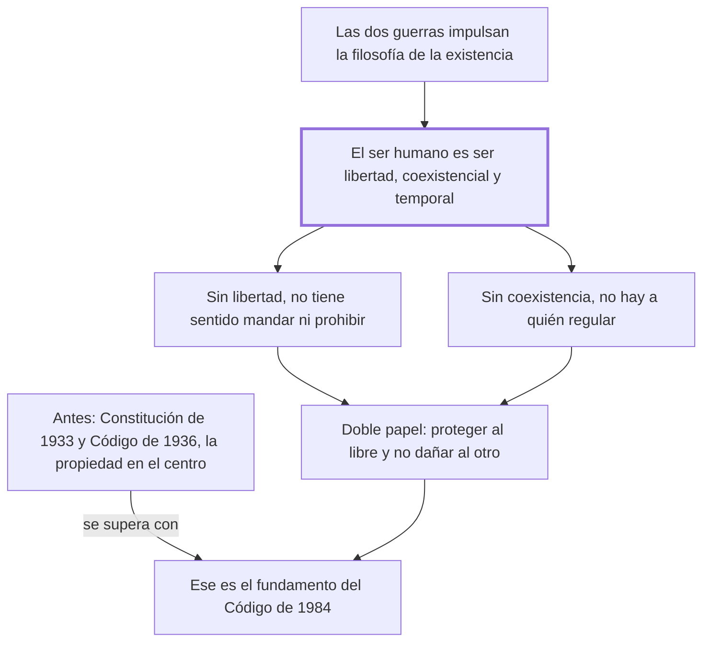

# § 64. Sustento jusfilosófico de los mensajes principistas y doctrinales aportados a la codificación civil comparada por el código civil peruano de 1984

## 1. Idea principal

El derecho carecería de sentido si la persona no fuera libre y social a la vez: esa idea del ser humano, traída por la filosofía de la existencia, es lo que funda al Código de 1984.

Contesta de dónde sale el personalismo de ese código, y es el capítulo más filosófico del libro. Explica por qué una concepción del ser humano cambia lo que un código protege.

## 2. Lo esencial del capítulo

El Código Civil de 1984 representa un cambio radical frente a lo que imperaba en el Perú: una visión formalista que venía desde los albores de la República y se concretaba en la Constitución de 1933 y el Código de 1936, donde el derecho giraba en torno a la norma y "la más importante institución a proteger era la inviolable propiedad y no la persona humana" (p. 152). El autor la califica de ochocentista y positivista, con individualismo exacerbado y patrimonialismo, y sostiene que por eso quedaban postergados el deber genérico de no dañar, la solidaridad y el bien común. El giro viene de afuera del derecho: la filosofía de la existencia es "una angustiada respuesta a los horrores" de las dos guerras mundiales, y de ahí nace el interés por conocer mejor al ser humano para protegerlo (pp. 152-153).

Lo que esa filosofía encuentra es una definición nueva: el ser humano ya no es un "animal racional" sino una unidad psicosomática sustentada en su libertad, cuya existencia solo es concebible dentro de la coexistencialidad y la temporalidad. Es un **ser libertad**, y esa libertad es lo que Scheler llama espíritu; frente a la definición de Boecio del siglo VI —una sustancia indivisa de naturaleza racional—, acierta en la unidad pero se queda corta porque no da cuenta de la libertad constitutiva. De ahí el argumento central, que tiene forma condicional: el derecho carecería de sentido si su destinatario no fuera libre, porque solo a quien puede decidir se le propone cumplir o incumplir un deber —a un robot no se le plantea esa dicotomía—; pero la libertad sola no alcanza, porque el derecho no se hizo para un hombre aislado y solo le interesan las conductas intersubjetivas.

De las dos juntas sale su doble papel: proteger a la persona como ser libre e impedir que al ejercer esa libertad dañemos "el proyecto existencial del otro". Ser libre impone el deber genérico de no dañar. El tercer rasgo es la temporalidad: la vida coexistencial transcurre en un tiempo limitado, y en ese "tiempo existencial" la persona le da sentido a su vida mediante un proyecto según su vocación —justo ahí la conversión rompió el texto, con la palabra partida en "tan fu-" y un resto de cabecera, así que ese pasaje conviene leerlo en el original (p. 158)—. El cierre es duro: quien ignora la consistencia de su propio ser podrá ser un experto operador del aparato normativo, pero nunca alcanzará el nivel del jurista.

## 3. Mapa

## 4. Vocabulario clave

- **Ser libertad** — la definición del ser humano que usa el autor: no un animal racional sino un ente constituido por su libertad.
- **Coexistencialidad** — que la existencia humana solo es concebible con otros; por eso el derecho regula conductas intersubjetivas.
- **Temporalidad** — que la vida transcurre en un tiempo limitado, dentro del cual la persona realiza su proyecto.
- **Tiempo existencial** — el tiempo vivido por la persona, en el que le da sentido a su vida, frente al tiempo medido del reloj.
- **Deber genérico de no dañar** — la obligación que se sigue de ser libre entre otros libres: no lesionar el proyecto de vida ajeno.

## 5. Distinciones que se confunden

- **Animal racional vs. ser libertad** — la definición clásica acierta en la unidad y omite la libertad, que es lo constitutivo.
  - Se confunden porque: las dos pretenden decir qué es el ser humano y las dos lo distinguen de los demás animales.
  - Criterio para decidir: ¿lo que define al hombre es pensar, o poder elegir? Para el autor la razón sin libertad no explica que se le pueda mandar algo.
  - Dónde se cae: se resume la posición del autor como "el hombre es un ser racional y social", que es la definición que viene a corregir.

- **Individualismo vs. personalismo** — el primero protege la esfera y el patrimonio del individuo aislado; el segundo, la realización de la persona con otros.
  - Se confunden porque: los dos hablan de proteger al sujeto frente al poder y a los demás.
  - Criterio para decidir: ¿el otro aparece como límite o como condición? En el personalismo la coexistencia es parte de lo que se protege.
  - Dónde se cae: se dice que el Código de 1984 es personalista porque refuerza los derechos individuales, cuando eso describe al de 1936.

## 6. Autoevaluación

1. Explique por qué el derecho carecería de sentido si la persona no fuera libre y coexistencial, y qué implicaciones tiene eso para lo que un código debe proteger.
2. Un legislador sostiene que basta con proteger bien la propiedad para que las personas puedan realizarse. ¿Qué concepción del ser humano está suponiendo?

--- No mires esto hasta responder ---

1. Porque la estructura misma del derecho —mandar, prohibir, permitir— presupone un destinatario capaz de decidir: solo a quien puede elegir se le propone cumplir o incumplir un deber, y a un robot no se le plantea esa dicotomía. Pero la libertad sola no alcanza: el derecho no se hizo para un hombre aislado y solo le interesan las conductas intersubjetivas, así que hace falta también la coexistencialidad. De las dos juntas sale su doble papel: proteger a la persona como ser libre e impedir que al ejercer esa libertad dañe "el proyecto existencial del otro" (pp. 152-153). La implicación para un código es que la institución central deja de ser la propiedad y pasa a ser la persona, con el deber genérico de no dañar, la solidaridad y el bien común.
2. Una individualista y patrimonialista: la del siglo XIX que el autor atribuye al Código de 1936 y a la Constitución de 1933, donde la institución central era la inviolable propiedad y no la persona humana (p. 152). Omite que la realización requiere coexistencia, y que por eso el derecho protege también el proyecto de vida del otro.

## Flashcards

Cómo define al ser humano la filosofía de la existencia según este capítulo | Como una unidad psicosomática sustentada en su libertad, coexistencial y temporal
Qué significa que el hombre sea un ser libertad | Que su libertad no es un atributo más sino lo que lo constituye
Por qué carecería de sentido el derecho si el hombre no fuera libre | Porque solo a quien puede elegir se le propone cumplir o incumplir un deber
Qué institución protegía sobre todo el Código Civil peruano de 1936 | La inviolable propiedad, no la persona humana
